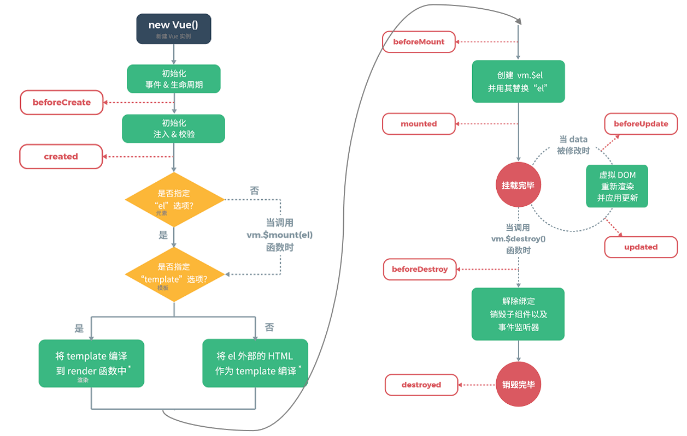

# Vue

[Vue.js - 渐进式 JavaScript 框架 | Vue.js (vuejs.org)](https://cn.vuejs.org/)

**渐进式**

- Vue可以自底向上逐层的应用

**简介**

- 前端框架，免除原始JavaScript的DOM操作
- 基于MVVM思想，实现数据的双向绑定，将编程的重点放在数据上

# 基础使用

1. **新建 HTML 页面，引入 Vue.js文件**

```html
<script src="js/vue.js"></script>
```

```html
<script src="https://unpkg.com/vue@3/dist/vue.global.js"></script>
```

2. **在JS代码区域，创建Vue核心对象，进行数据绑定**

```js
new Vue({
    el: "#app", //设置当前vue的作用范围
    data() { //数值域传递
        return {
            username: ""
        }
    }
});
```

   - 创建 Vue 对象时，需要传递一个 js 对象，而该对象中需要如下属性：

   * `el` ： 用来指定哪儿些标签受 Vue 管理。 该属性取值 `#app` 中的 `app` 需要是受管理的标签的id属性值
   * `data` ：用来定义数据模型
   * `methods` ：用来定义函数。这个我们在后面就会用到

3. **编写视图**

```html
<div id="app">
    <input name="username" v-model="username" >
    {{username}}
</div>
```

   - `{{}}` 是 Vue 中定义的 `插值表达式` ，在里面写数据模型，到时候会将该模型的数据值展示在这个位置。

**应用**

```html
<!DOCTYPE html>
<html lang="en">
<head>
    <meta charset="UTF-8">
    <title>Title</title>
</head>
<body>
<div id="app">
    <input v-model="username">
<!--     插值表达式-->
    {{username}}
</div>

<script src="js/vue.js"></script>
<script>
    //1.创建Vue核心对象
    new Vue({
        el: "#app", 
        // data:function (){
        data() {
            return {
                username: ""
            }
        }
    })
</script>
</body>
</html>
```

# 常用指令

- **指令：** HTML 标签上带有 v- 前缀的特殊属性，不同指令具有不同含义。例如：v-if，v-for…

**常用的指令**

| **指令**  | **作用**                                                     |
| --------- | ------------------------------------------------------------ |
| v-bind    | 为HTML标签绑定属性值，可以省略，如设置 v-bind:href 或 :href , css样式等 |
| v-model   | 在表单元素上创建双向数据绑定                                 |
| v-on      | 为HTML标签绑定事件；v-on:事件="函数()" 或 @事件="函数()"     |
| v-if      | 条件性的渲染某元素，判定为true时渲染,否则不渲染              |
| v-else    |                                                              |
| v-else-if |                                                              |
| v-show    | 根据条件展示某元素，区别在于切换的是display属性的值          |
| v-for     | 列表渲染，遍历容器的元素或者对象的属性                       |

```html
<!DOCTYPE html>
<html lang="en">
<head>
    <meta charset="UTF-8">
    <title>Title</title>
</head>
<body>
<div id="app">
    <!--    v-bind 可以省略-->
    <a v-bind:href="url">点击</a>
    <a :href="url">点击</a>

    <input v-model="url">

    <!--    v-ons-->
    <input type="button" value="按键" v-on:click="show()">
    <!--  或者  <input type="button" value="按键" @click="show()">-->

    <input v-model="count">

    <!--    v-if-->
    <div v-if="count==1">div1</div>
    <div v-else-if="count==2">div2</div>
    <div v-else>div3</div>

    <hr>
    <!--    v-show-->
    <div v-show="count==3">div v-show</div>
    <br>

    <hr>
    <!--    v-for-->
    <!--    <div v-for="addr in addrs">{{addr}}</div>-->
    <div v-for="(addr,i) in addrs">{{i + 1}} -- {{addr}}</div>


</div>


<script src="js/vue.js"></script>
<script>
    //1.创建Vue核心对象
    new Vue({
        el: "#app", //设置当前vue的作用范围
        // data:function (){
        data() {
            return {
                username: "",
                url: "https://www.baidu.com",
                count: 3,
                addrs: ["北京", "上海", "西安"]
            }
        },
        methods: {
            show() {
                alert("点击");
            }
        }
    })

</script>
</body>
</html>
```

# 生命周期

- 生命周期的八个阶段：每触发一个生命周期事件，会自动执行一个生命周期方法

| 状态          | 阶段周期     |
| ------------- | ------------ |
| beforeCreate  | 创建前       |
| created       | 创建后       |
| beforeMount   | 载入前       |
| **mounted**   | **挂载完成** |
| beforeUpdate  | 更新前       |
| updated       | 更新后       |
| beforeDestory | 销毁前       |
| destoryed     | 销毁后       |

  

```html
<!DOCTYPE html>
<html lang="en">
<head>
    <meta charset="UTF-8">
    <title>Title</title>
</head>
<body>
<div id="app">

</div>


<script src="js/vue.js"></script>
<script>
    //1.创建Vue核心对象
    new Vue({
        el: "#app", //设置当前vue的作用范围
        mounted(){
            alert("加载完成")
        }
    })

</script>
</body>
</html>
```

# element-ui 网站快速成型工具

- 基于Vue的网站组件库，用于快速构建网页
- 组件：组成网页的部件：超链接、图片等

[Element - 网站快速成型工具](https://element.eleme.cn/#/zh-CN)

## 安装Element组件

- 复制到本地

```html
<script src="js/vue.js"></script>
<script src="element-ui/lib/index.js"></script>
<link rel="stylesheet" href="element-ui/lib/theme-chalk/index.css">
<script>
    new Vue({
        el:"#app"
    })
</script>
```

- 直接使用网络的

```html
<!-- 引入样式 -->
<link rel="stylesheet" href="https://unpkg.com/element-ui/lib/theme-chalk/index.css">
<!-- 引入组件库 -->
<script src="https://unpkg.com/element-ui/lib/index.js"></script>
```

## 布局

## 组件


