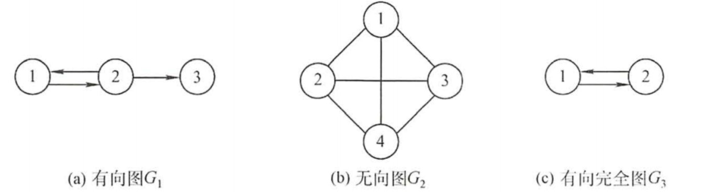
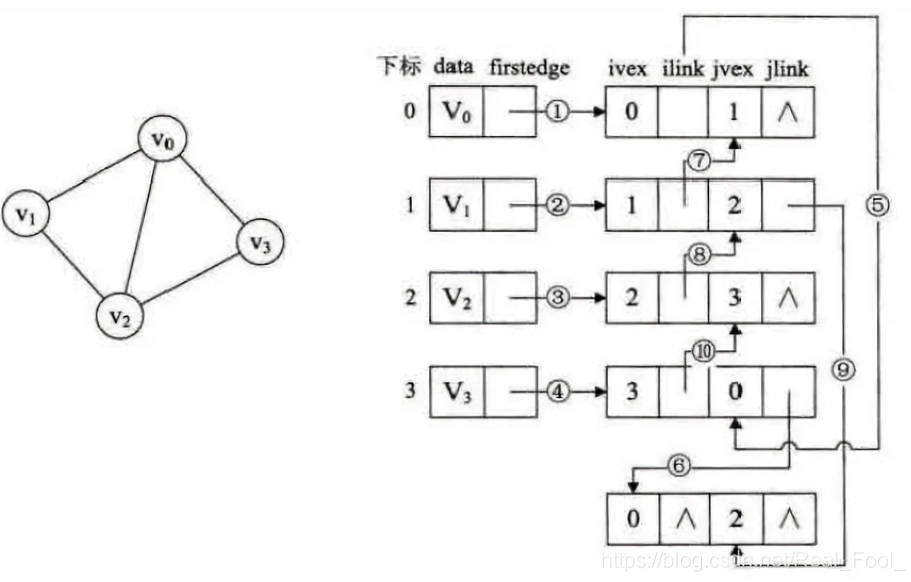
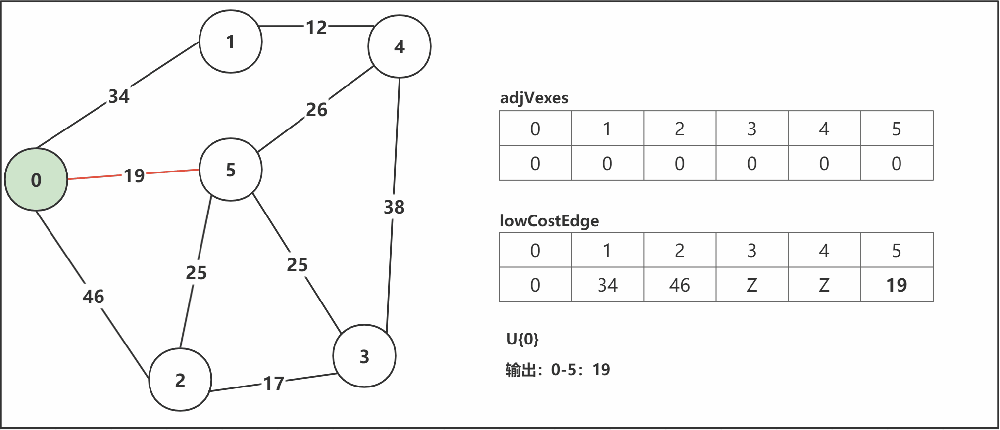

# 图的基本性质

- 图(Graph)是由 顶点的有穷非空集合V ( G ) 和顶点之间 边的集合E ( G ) 组成：G = ( V , E ) 。

> G表示图，V是图G中顶点的集合，E是图G中边的集合。

| 结构   | 说明                 |
| ------ | -------------------- |
| 顶点 V |                      |
| 边 E   | 边可以有方向（关系） |
| 路径   | 一组顶点和边的组合   |

| 图的类型 | 说明                                                         |
| -------- | ------------------------------------------------------------ |
| 有向图   | 边是有方向的，E中的元素是有序的<br /> |
| 无向图   | 边是没有方向的，E中的元素是无序的                            |

| 图类型 | 说明                                                         |
| ------ | ------------------------------------------------------------ |
| 简单图 | 不存在重复边<br />不存在顶点到自身的边                       |
| 多重图 | 图中某两个结点之间的边数多于一条<br />允许顶点通过同一条边和自己关联（即存在自环和平行）<br /> |

| 完全图<br />（简单完全图） | 说明                                                         |
| -------------------------- | ------------------------------------------------------------ |
| 无向完全图                 | 任意两个顶点之间都存在边。<br />n个顶点，$\frac{n(n-1)}{2}$条边。 |
| 有向完全图                 | 任意两个顶点之间都存在互为相反的两条弧。<br />n个顶点，$n(n-1)$条边。<br /> |

- 子图：设G(V,E)、G'(V',E')，V'是V的子集，E'是E的子集，则G'是G的子图。并非V和E的任何子集都能构成G的子图，有可能不是图，即E的子集中的某些边关联的顶点可能不在这个V的子集中。
- 若有满足V(G')=V(G)，则称该子图为G的生成子图。

| 术语           | 说明                                                         |
| -------------- | ------------------------------------------------------------ |
| 邻接<br />依附 | 对于任意两个顶点$v_i、v_j$，若存在边$(v_i，v_j)$<br />无向图，顶点$v_i、v_j$互为邻接点（adjacent）。<br />有向图，顶点$v_i$邻接到顶点$v_j$（顶点$v_j$是顶点$v_i$的邻接点），且弧$<v_i，v_j>$依附于顶点$v_i、v_j$。 |
| 度             | 无向图，顶点v的度：依附于该顶点的边的条数（$TD(v)_{无向图} = 2E$）。 |
| 入度<br />出度 | 有向图，入度(弧头)：以顶点v为终点的有向边的数目：$ID(v)$。 出度(弧尾)：以顶点v为起点的有向边的数目：$OD(v)$。<br /> |
| 权<br />网     | 权重：在一个图中，每条边都可以标上具有某种含义的数值。<br />网：带权图。 |
| 路径           | 顶点Vp到顶点Vq之间的一条路径：（$ V_p,V_{i1},...,V_{im},V_{q} $）。<br />路径长度：路径上边的数目。<br />简单路径：在路径序列中，顶点不重复出现的路径。 |
| 回路（环）     | 第一个顶点和最后一个顶点相同的路径。<br />若一个图有n个顶点，并且有大于n-1条边，则此图一定有环。<br />简单回路：除第一个顶点和最后一个顶点外，其余顶点不重复出现的回路。 |
| 距离           | 从顶点u出发到顶点v的最短路径的长度。<br />若从u到v根本不存在路径，则记该距离为无穷。 |

> 有向树：一个顶点的入度为0，其余顶点的入度均为1的有向图。

- 稀疏图的判断条件：$|E| < |V|\log_2^{|V|}$。

## 连通

| 连通                     |                                                              |
| ------------------------ | ------------------------------------------------------------ |
| 连通图<br />（无向图）   | 连通：无向图中，若从顶点v到顶点w有路径存在。 <br />连通图：若图G中任意两个顶点都是连通的，则称图G为连通图，否则称为非连通图。若一个图有n个顶点，并且边数小于n − 1，则此图必是非连通图。<br />连通分量：极大连通子图是无向图的连通分量，要求该连通子图包含其所有的边。<br />极小连通子图：既要保持图连通又要使得边数最少的子图。<br /> |
| 强连通图<br />（有向图） | 强连通：有向图中，若从顶点v到顶点w、从顶点w到顶点v都有路径存在。<br />强连通图：图中任意两个顶点都是强连通的。<br />强连通分量：有向图的极大强连通子图。 |

| 连通子图                       | 说明                                                         |
| ------------------------------ | ------------------------------------------------------------ |
| 极大连通子图<br />（连通分量） | 1. 连通图只有一个极大连通子图，就是它本身。<br/>2. 非连通图有多个极大连通子图。<br/>   - 非连通图的极大连通子图叫做连通分量，每个分量都是一个连通图。<br/>3. 如果此时加入任何一个不在 图的点集 中的点都会导致它不再连通。 |
| 极小连通子图<br />（生成树）   | 1. 连通图的生成树是包含图中全部顶点的一个极小连通子图，而同一个连通图可以有不同的生成树。（极小连通子图只存在于连通图中）（只要能连通图的所有顶点而又不产生回路的任何子图都是它的生成树）<br/>2. 若图中顶点数为n，则它的生成树含有n-1条边，若砍去它的一条边，则会变成非连通图，若加上一条边则会形成一个回路。<br />3. 生成森林：在非连通图中，连通分量的生成树构成了非连通图的生成森林。 |

# 图的数据结构

## 邻接表

- 边表：对图G中的每个顶点V建立一个单链表，第i个单链表中的结点表示依附于顶点$V_i$的边。
  - 出边表：对于有向图：是以$V_i$为尾的弧。

| 结点       | 域                                                           |
| ---------- | ------------------------------------------------------------ |
| 顶点表结点 | data：顶点域 <br />firstarc：指向第一条邻接边的指针域        |
| 边表结点   | adjvex：邻接点域<br />nextarc：指向下一条邻接边的指针域 <br />weight：权值信息的数据域 |

 

 

1. 所需的存储空间：（稀疏图：采用邻接表以节省存储空间）
   - 无向图：$O(|V|+2|E|)$。
   - 有向图：$O(∣V∣+∣E∣)$。
2. 找出顶点的所有邻边：
   - 邻接表：只需要读取该结点的邻接表。
   - 邻接矩阵：需要扫描一行，花费的时间为$O(n)$。

> 若要确定给定的两个顶点间是否存在边：
>
> - 邻接矩阵中可以立刻查到。
> - 邻接表中则需要在相应结点对应的边表中查找另一结点，效率较低。

3. 有向图的邻接表：求一个给定顶点的出度只需计算其邻接表中的结点个数，但求其顶点的入度则需要遍历全部的邻接表。
   - 逆邻接表：加速求解给定顶点的入度。
4. 图的邻接表表示并不唯一，因为在每个顶点对应的单链表中，各边结点的链接次序可以是任意的，它取决于建立邻接表的算法及边的输入次序。

```java
/**
 * 1. 定义一个Node[] 数组，用来存放这几条链表
 * 2. 每个链表的头存放在该数组中，并且链表中的每一个结点均是表示和头结点存在边（而不是路径）
**/
public class AdjacencyList {

    class VexNode {
        public char data; //数值
        public EdgeNode firstEdge = null; //边
    }

    class EdgeNode {
        public EdgeNode preEdge = null; //前一个边
        public EdgeNode nextEdge = null; //后一个边
        public VexNode vex = null; //终点

    }

    private VexNode[] list = new VexNode[5];

    public void init(int nodeNumber) {}
}
```

### 十字链表

- 将邻接表（以入边连接）和逆邻接表（以出边连接）结合。

**结构为：**

- 顶点表结点结构为：数据域data、入边表头指针firstIn、出边表头指针firstOut
- 边表结点结构为：弧起点在顶点表的下标tailVex、弧终点在顶点表的下标headVex、入边表指针域headLink（指向终点相同的下一条边）、出边表指针域tailLink（指向启点相同的下一条边）、权值域weight（可选）

 

```java
public class CrossLinkedList {
    //顶点表结点
    class VexNode {
        int data;
        EdgeNode firstIn;
        EdgeNode firstOut;
    }

    //边表结点
    class EdgeNode {
        VexNode tailVex;
        VexNode headVex;
        EdgeNode headLink;
        EdgeNode tailLink;
        int weight = -1; //权值
    }

    VexNode[] list = null; //存放顶点的数组

    public void creat(int number) {}
}
```

### 邻接多重表

 

 

```java
public class DoubelLinkedList {
    class VexNode {
        int data;
        EdgeNode firstOut;
    }

    class EdgeNode {
        VexNode headVex;
        VexNode tailVex;
        EdgeNode headLink;
        EdgeNode tailLink;
    }

    VexNode[] list = null;

    public void create(int number) {}
}
```

## 邻接矩阵

- 邻接矩阵(Adjacency Matrix) ：一个一维数组存储图中顶点信息，一个二维数组(邻接矩阵)存储图中的边或弧的信息。

 

```java
class GraphMatrix {
    static final int MAXNUM = 20; //最大顶点数
    static final int MAXVALUE = 65535; //权值总和最大值
    char[] vertex = new char[MAXNUM];//保存顶点数据
    int graphType; //图的类型：0无向图，1有向图
    int vertexNum; //顶点数量
    int edgeNum; //边数量
    int[][] edgeWeight = new int[MAXNUM][MAXNUM];//保存顶点的边信息
    int[] isTrav = new int[MAXNUM];//遍历标识
}
```

### 边集数组

| 边集数组（一维数组） | 说明                                                         |
| -------------------- | ------------------------------------------------------------ |
| 顶点数组             | 存储顶点的信息                                               |
| 边数组               | 存储边的信息<br />每个数据元素由一条边的起点下标(begin)、 终点下标(end)和权(weight)组成 |


 

### 关联矩阵

# 图的遍历方式

| 图的表示 | 说明                                                         |
| -------- | ------------------------------------------------------------ |
| 邻接矩阵 | 图的邻接矩阵表示是唯一的<br />基于邻接矩阵的遍历所得到的DFS序列和BFS序列是唯一的。 |
| 邻接表   | 若边的输入次序不同，生成的邻接表也不同<br />基于邻接表的遍历所得到的DFS序列和BFS序列是不唯一的。 |

## DFS 深度优先遍历

| DFS实现  |                                                              |
| -------- | ------------------------------------------------------------ |
| 邻接矩阵 | $T(n) = O(n^2)$：二维数组，要查找每个顶点的邻接点需要访问矩阵中的所有元素。<br />$S(n) = O(V)$ |
| 邻接表   | $T(n) = O(n+e)$：找邻接点所需的时间取决于顶点和边的数量。<br />$S(n) = O(V)$ |

- 深度优先搜索会产生一棵深度优先生成树：对连通图调用DFS才能产生深度优先生成树，否则产生的将是深度优先生成森林。

```
1. 首先访问图中某一起始顶点v，然后由v出发，访问与v邻接且未被访问的任一顶点w，再访问与w邻接且未被访问的任一顶点…重复上述过程。
2. 当不能再继续向下访问时，依次退回到最近被访问的顶点，若它还有邻接顶点未被访问过，则从该点开始继续上述搜索过程，直至图中所有顶点均被访问过为止。
```

```java
class GraphMatrix {
    static final int MAXNUM = 20; //最大顶点数
    static final int MAXVALUE = 65535; //权值总和最大值
    char[] vertex = new char[MAXNUM];//保存顶点
    int[][] edgeWeight = new int[MAXNUM][MAXNUM];//保存边信息
    int graphType; //图的类型：0无向图，1有向图
    int vertexNum; //顶点数量
    int edgeNum; //边数量
    int[] isTrav = new int[MAXNUM];//遍历标识
}

/**
    * 深度遍历
    *
    * @param graphMatrix
    * @param n           从第n个结点开始
    */
public static void deepTraOne(GraphMatrix graphMatrix, int n) {
    //清除之前遍历的标识
    for (int i = 0; i < graphMatrix.vertexNum; i++) {
        graphMatrix.isTrav[i] = 0;
    }

    graphMatrix.isTrav[n] = 1; //标记该顶点已处理
    System.out.printf("->%c", graphMatrix.vertex[n]);

    //处理结点
    for (int i = 0; i < graphMatrix.vertexNum; i++) {
        if (graphMatrix.edgeWeight[n][i] != GraphMatrix.MAXVALUE && graphMatrix.isTrav[n] == 0) {
            deepTraOne(graphMatrix, i);
        }
    }
}

/**
    * 深度优先遍历
    *
    * @param graphMatrix
    */
public static void deepTraGraph(GraphMatrix graphMatrix) {
    //清除之前遍历的标识
    for (int i = 0; i < graphMatrix.vertexNum; i++) {
        graphMatrix.isTrav[i] = 0;
    }

    System.out.print("深度优先遍历结点：");
    for (int i = 0; i < graphMatrix.vertexNum; i++) {
        if (graphMatrix.isTrav[i] == 0) {
            deepTraOne(graphMatrix, i); //调用深度遍历
        }
    }
    System.out.println();
}
```

## BFS 广度优先遍历

| BFS实现  | 分层查找，辅助队列记忆正在访问的顶点的下一个顶点             |
| -------- | ------------------------------------------------------------ |
| 邻接表   | $T(n) = O(n+e)$、$S(n) = O(n)$<br />每个顶点均需搜索一次、或入队一次， 在搜索任一顶点的邻接点时，每条边至少访问一次。 |
| 邻接矩阵 | $T(n) = O(n^2)$<br />查找每个顶点的邻接点所需的时间为$O(n)$。 |

```java
class Graph {
    int vexNumber = 10; //默认10个顶点
    int[] vex = new int[vexNumber]; //顶点
    int[][] edge = new int[vexNumber][vexNumber];//边 z表示无权值（初始值）
    int z = Integer.MAX_VALUE; //无权值的表示
    boolean[] isTraced = new boolean[vexNumber]; //标识遍历过的
}
//对于邻接表
public static void bfs(Graphic graph){
    Queue<int> queue = new Queue<>();
    //初始化
    for(int i = 0; i < graph.isTraced.lenth; i++){  
        graph.isTraced[i] = fasle;
    }
    for(int i =0; i < graph.vexNumber; i++){
        if(!graph.isTraced[i]){
            graph.isTraced[i] = true;//标识为处理
            queque.add(graph.vex[i]);
        }
    }
}
```

# 图的查询模式

| 查询模式 | 说明                                                         |
| -------- | ------------------------------------------------------------ |
| 离散查询 | 面向元数据的查询。                                           |
| 关联查询 | 从某个顶点（或多个顶点）出发，通过对边、点以及各自的属性来过滤，返回相关联的数据集。 |

> 元数据：具有唯一ID定位的最小颗粒。在图中通常认为顶点和边是元数据。

## 最小生成树

- 最小生成树：极小的连通子图，生成的树形不唯一（e>n-1），但权值之和一定是最小值。
- 假设G(V, E)是一个带权连通无向图，U是顶点集V的一个非空子集。若$(u,v)$是一条具有最小权值的边，其中$u \in U，v \in V-U$，则必存在一棵包含边$(u, v)$的最小生成树。

### Kruskal算法

| 算法 | Kruskal                                                      |
| ---- | ------------------------------------------------------------ |
| 思想 | Kruskal算法调度的单位是边（边集数组）：所有边能小则小。<br />并查集（不相交集合）判断两点是否在同一集合。 |
| T(n) | 对n个顶点，e条边的图：$T(n)=O(e\log_2^e)$，适用于求稀疏网的最小生成树。 |
| 图解 | 将连通网中所有的边按照权值大小做升序排序，从权值最小的边开始选择，只要此边不和已选择的边一起构成环路，就可以选择它组成最小生成树。<br /> |

```java
/**
     * 打印输出最小生成树
     *
     * @param vertexes 顶点数组
     * @param edges    边集数组
     */
public static void kruskal(int[] vertexes, EdgeArrayNode[] edges) {
    int from, to;
    int[] parent = new int[vertexes.length];
    for (int i = 0; i < vertexes.length; i++) {
        parent[i] = -1;
    }

    for (int i = 0, j = 0; j < edges.length && i < edges.length; i++) {
        EdgeArrayNode node = edges[i];
        from = findRoot(parent, node.getFrom());
        to = findRoot(parent, node.getTo());
        if (from != to) {
            System.out.printf("第%d条边：%d-%d：%d\n",
                              j, vertexes[node.getFrom()], vertexes[node.getTo()], node.getWeight());
            parent[to] = from;
            j++;
        }
    }
}

/**
     * 获取该顶点对应子树的根结点
     *
     * @param parent      顶点的父结点数组
     * @param vertexIndex 顶点下标
     * @return 根结点
     */
private static int findRoot(int[] parent, int vertexIndex) {
    int root = vertexIndex;
    while (parent[root] > -1) {
        root = parent[root];
    }
    return root;

}
```

### Prim算法

| 算法   | Prim                                                         |
| ------ | ------------------------------------------------------------ |
| 思想   | 从已知扩散寻找最小。                                         |
| T(n)   | $T(n)=O(n^2)$                                                |
| 生成树 | $G=(V,E)$，最小生成树：$T=\{U,TE\}$，初始状态：$U=\{v\}(v \in V)、TE=\{\}$。<br /> |
| 图解   |             |

| 结构               | 说明                 |
| ------------------ | -------------------- |
| int[] adjVexes     | 当前最短边邻接点数组 |
| int[] lowCostEdges | 当前最短边数组       |

```java
/**
     * 输出打印最小生成树
     *
     * @param startVexIndex 作为起始点的顶点位置
     * @param adjMatrix     邻接矩阵
     * @param vexes         顶点数组
     **/
public static void prim(int startVexIndex, int[][] adjMatrix, int[] vexes) {
    int VEX_NUMBER = vexes.length;
    int[] adjVexes = new int[VEX_NUMBER];
    int[] lowCostEdges = new int[VEX_NUMBER];

    //初始化
    for (int i = 0; i < VEX_NUMBER; i++) {
        lowCostEdges[i] = adjMatrix[startVexIndex][i];
        adjVexes[i] = startVexIndex;
    }

    for (int i = 1; i < VEX_NUMBER; i++) {
        int minIndex = getMin(lowCostEdges); //获取最短边邻接点
        //输出打印最小生成树的边
        System.out.printf("第%d条边：%d--%d：%d\n",
                          i, adjVexes[minIndex], vexes[minIndex], lowCostEdges[minIndex]);
        lowCostEdges[minIndex] = 0; //minIndex加入U

        for (int j = 0; j < VEX_NUMBER; j++) {
            //如果有更小的边，则替换之。
            if (adjMatrix[j][minIndex] < lowCostEdges[j]) {
                lowCostEdges[j] = adjMatrix[j][minIndex];
                adjVexes[j] = minIndex;
            }
        }
    }
}

/**
     * 返回边数组中权值最小的边的邻接点的位置
     *
     * @param edges 边数组
     * @return index 边数组下标对应其在顶点数组中的顶点的位置
     **/
public static int getMin(int[] edges) {
    int min = Integer.MAX_VALUE;
    int index = -1;
    for (int i = 0; i < edges.length; i++) {
        if (edges[i] == 0) //在U内的跳过
            continue;
        if (min > edges[i]) {
            min = edges[i];
            index = i;
        }
    }
    return index;
}
```

## 最短路径

### Dijkstra算法

- Dijkstra算法：固定一个顶点作为源结点，然后找到该顶点到图中所有其它结点的最短路径，产生一个最短路径树。每次取出未访问结点中距离最小的，用该结点更新其他结点的距离。

> 绝大多数的Dijkstra 算法不能有效处理带有负权边的图。

> Dijkstra：求单源最短路径，每计算一个点需要对这个点从新更新距离。
>
> Prim：直接找已知点的邻边最小加入，不用更新距离。

### Floyd算法

| 算法 | Floyd                                                        |
| ---- | ------------------------------------------------------------ |
| 思想 | 以每个点为中转站，刷新所有入度和出度的距离。                 |
| 说明 | 遍历每一个顶点-->遍历点的每一个入度-->遍历点的出度。 <br />如果以该点为中转站的距离更短，就刷新距离。 |
| 图解 |  |

```
1. 以A为中转站，刷新所有出度和入度的距离：有BD两点既是A的入度也是A的出度
   - BA + AD > BD
   - DA + AB > DB
   - 因此不刷新距离，A点不作为BD两点的中转站
2. 以B为中转站，刷新所有入度和出度的距离：有ADC三点的出入度。
   - AB + BC < AC (AC为Z无穷大)：
   - 故刷新距离为：将AB+BC的值赋给AC：distance[0][2] = distance[0][1] + distance[1][2]
   - 刷新最短路径：AC的距离引入中转站B：path[0][2] = 1 (1代表B在graph的下标)
   - AB + BD > AD 
   - 故刷新距离为：将AB+BD的值赋给AD：distance[0][3] = distance[0][1] + distance[1][3]
   - 刷新最短路径：AD的距离引入中转站B：path[0][3] = 1
   - 以此类推。。。
```

```java
int[][] distance;//存放每个点到其他点的最短距离
int[][] path;//存储每个点到其他点的最短距离的路径（存放中转站）

public void floyd(int[][] graph) {
    final int Z = Integer.MAX_VALUE;
    //初始化
    distance = graph;
    path = new int[graph.length][graph.length];
    for (int i = 0; i < graph.length; i++) {
        for (int j = 0; j < graph.length; j++) {
            path[i][j] = j;
        }
    }
    //对每个点设置中转站测试
    for (int i = 0; i < graph.length; i++) {
        //出度
        for (int j = 0; j < graph.length; j++) {
            //入度
            for (int k = 0; k < graph[j].length; k++) {
                if (graph[j][i] != Z && graph[i][k] != Z) {
                    int newDistance = graph[j][k] + graph[i][k];
                    if (newDistance < graph[j][k]) {
                        //刷新距离
                        graph[j][k] = newDistance;
                        //刷新路径
                        path[j][k] = i;
                    }
                }
            }
        }
    }
}
```

## K邻查询 K-Hop

- K-Hop：从某个顶点出发，查找和该顶点最短路径距离为K跳的所有不重复的顶点集合。


# 有向无环图 DAG

- 一个有向无环图（DAG）可以有一个或多个拓扑排序序列。

## AOV网

- AOV网：顶点表示活动，弧表示活动之间的优先关系（依赖关系）的有向无环图。

### 拓扑排序 TopSort

- 拓扑排序用来判断AOV网中是否存在回路。

> **拓扑序列**：用来排序具有依赖关系的任务。
>
> -  满足偏序关系的顶点序列（具有依赖关系的一组任务）：若从顶点Vi到顶点Vj有一条路径，则在顶点序列中Vi必在Vj之前。（如工业流程中：在作业A之前必须要完成作业B，以此类推）

```
1. 从AOV网中选择一个没有前驱的顶点（入度为0的顶点）并且输出。
2. 从AOV网中删去该顶点，并且删除所有以该顶点为尾（出度）的弧。
3. 重复以上，直到全部顶点被输出（没有回路）、或AOV网不存在没有前驱的点（存在回路）。
```

| 存储结构（邻接表） | 说明                                                         |
| ------------------ | ------------------------------------------------------------ |
| Vex[] vexList      | 顶点表                                                       |
| vexNum             | 顶点数量                                                     |
| Vex                | value：数据域<br />firstEdge：边集链表<br />in ：入度域（计算顶点中的入度，如果为0则加入到拓扑排序操作中）。 |
| Edge               | nextVex：入度顶点<br />next：指针域，指向另一条边            |

```
1. 栈stack初始化，计数器count初始化
2. 扫描顶点表vexList，将入度为0的顶点压栈
3. 当栈非空时，循环
   1. curVex=栈顶元素出栈；输出栈顶curVex；count++
   2. 对顶点curVex的每条边edge的nextVex执行：
      1. 将nextVex中的入度减1
      2. 如果该nextVex中的入度为0则入栈
4. if(count < vexNum) 输出有回路的信息
```


## AOE网

- AOE网：表示工程的带权有向图中，用顶点表示事件、有向边表示活动、边上的权值表示完成该活动的开销（如完成活动所需的时间）。
  - 源点：入度为0的顶点，整个工程的开始点。
  - 终点（汇点）：出度为0的顶点，整个过程的结束点。


- 只有在进入某顶点的所有活动都结束，该顶点代表的事件才能发生。
- 只有在某顶点所代表的事件发生后，从该顶点出发的各活动才能开始。

> 一个具有5个活动（边）、4个事件（顶点）的AOE网：
>
> - 顶点v0~v4分别表示一个事件。
> - 弧`<v0,v1>,<v0,v2>,<v1,v2>,<v1,v3>,<v2,v3>`分别表示一个活动。
>
> 

### 关键路径

| 概念     | 说明                                                         |
| -------- | ------------------------------------------------------------ |
| 关键路径 | 从源点到汇点具有最大长度的路径（关键活动所在的路径）。       |
| 关键活动 | 在关键路径上的活动（边）（`el[i] = ee[i]的活动`）。<br />活动的时间余量：`el[i] - ee[i]`。 |
| 路径长度 | 路径上各个活动所持续的时间之和。                             |

| 发生时间 | 事件                                                         | 活动                         |
| -------- | ------------------------------------------------------------ | ---------------------------- |
| 最早     | `ve[0] = 0`<br />`ve[k] = max{ve[j] + len<vj,vk>}，(<vj,vk>∈p[k])` | `ee[i] = ve[k]`              |
| 最晚     | `vl[k] = vl[j] - len<vk,vj>`                                 | `el[i] = vl[j] - len<vk,vj>` |

> 只有事件vk发生，从vk出发的活动`<vk,vj>`才能开始。

```
//对于有n个顶点，e条弧的有向带权图。
1. 令ve[0]=0，按拓扑序列求其余各顶点的最早发生时间ve[i]
2. 如果得到的拓扑序列中顶点个数小于AOE网中的顶点数，则说明网中存在回路，不能求关键路径，算法终止；否则执行步骤3.
3. 令vl[n-1] = ve[n-1]，按逆拓扑有效求其余各顶点的最迟发生时间vl[i]
4. 求每条边的最早开始时间ee[i]和最迟开始时间el[i]
5. 若某条边ai满足条件ee[i]=el[i]，则a[i]为关键活动
```
