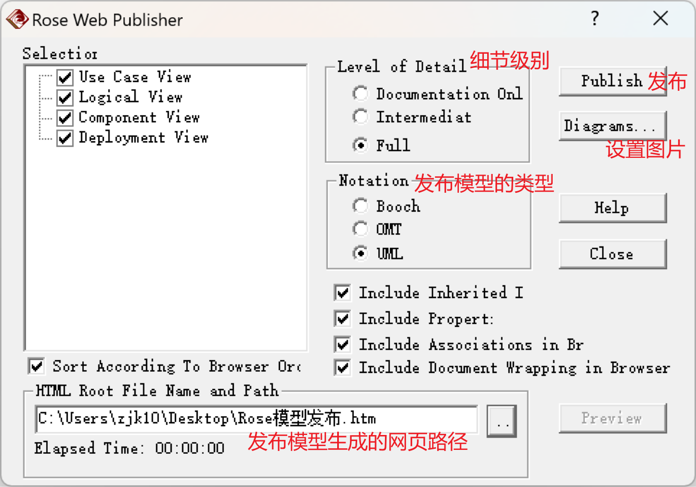
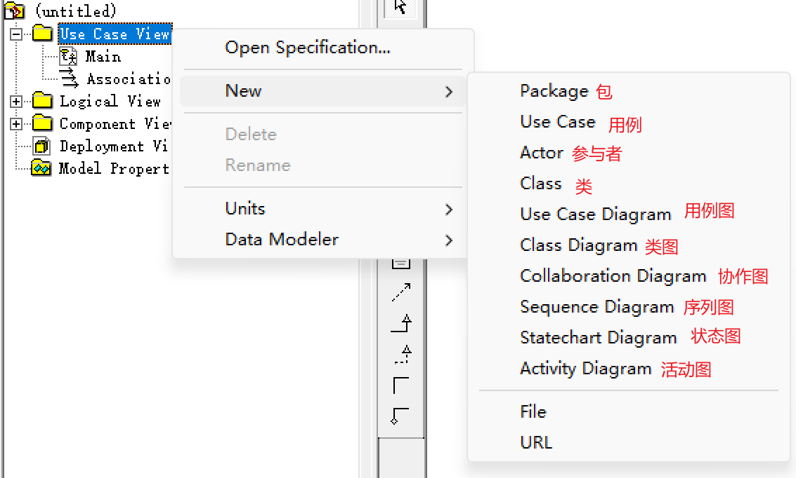

# 基本使用功能

## 导入/导出模型

 

## 发布模型

- Tools --> Web Publisher

 

## 控制单元

## 模型集成器

# 视图模型

 

## 用例视图 Use Case View

- 用例视图关注系统功能的高级抽象，而不关注系统的具体实现方法。
- 用例视图包括了系统中所有参与者、用例、用例图；必要时可以添加：顺序图、协作图、活动图、类图等。

 

## 逻辑视图 Logical View

- 逻辑视图关注系统如何实现用例中所描述的功能，主要是对系统功能性需求提供支持：在为用户提供服务方面，系统所应该提供的功能。
- 逻辑视图的模型元素：类、类工具、用例、接口、类图、用例图、协作图、顺序图、活动图、状态图等。

 

## 构件视图

## 部署视图
