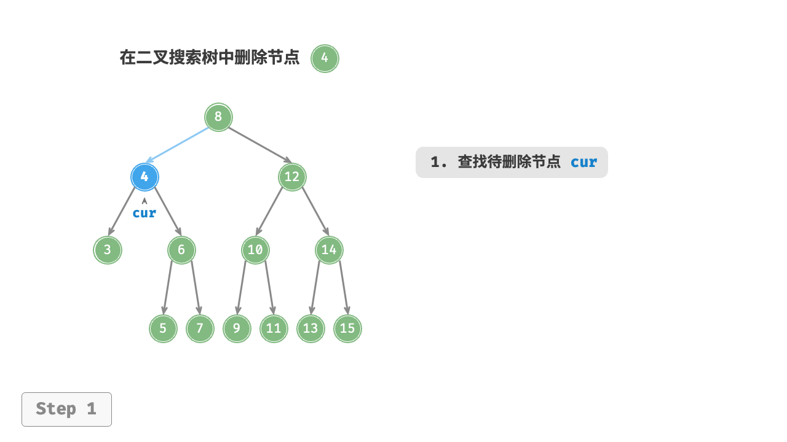
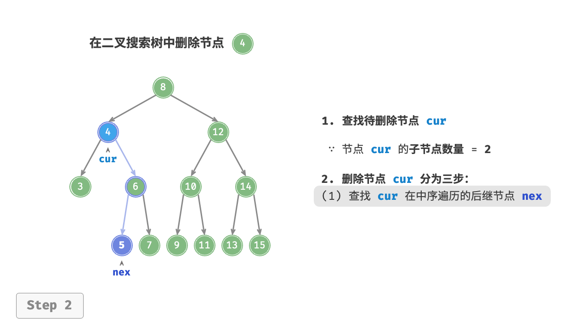
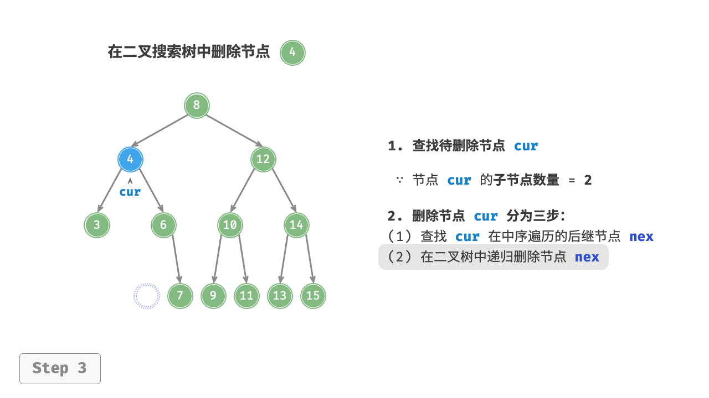
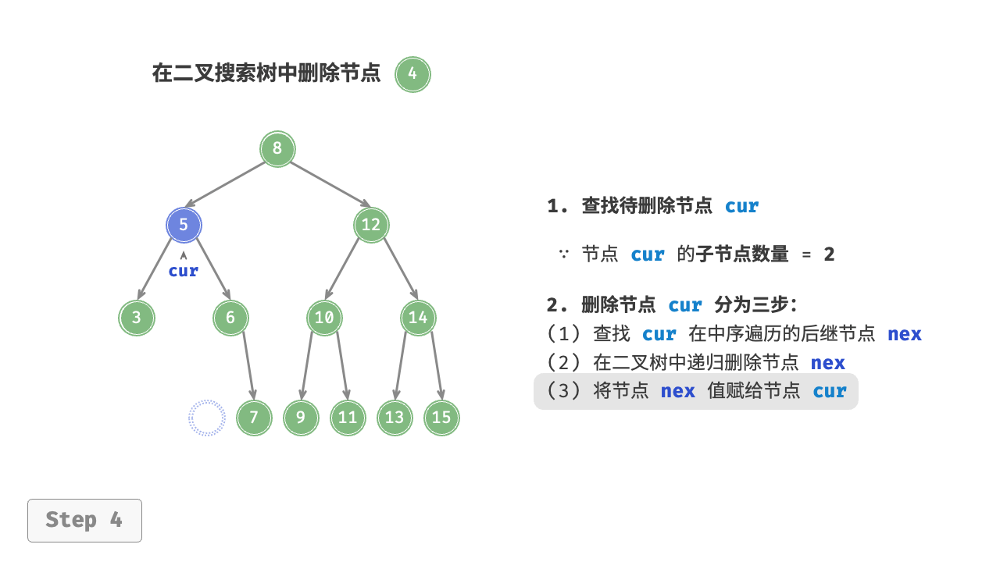

# 二叉排序/查找树 BST

## BST的定义

- BST（二叉排序树，Binary Sort Tree）（二叉查找树，Binary Search Tree）从任意节点开始，左子树节点值总比右子树值要小（左子树节点值 &lt; 根节点值 &lt; 右子树节点值），中序遍历（LDR）可以得到一组有序（从小到大）的数值。

1. 若左子树非空，则左子树上所有节点的值均小于根节点的值。
2. 若右子树非空，则右子树上所有节点的值均大于根节点的值。
3. 左右子树也分别是一棵二叉排序树。

## BST的查找

1. BST的查找从根节点出发。
2. 将需要查找的值与当前节点的值比较，若相等，则查找成功。
3. 若小于当前节点的值，则在当前节点的左子树继续第2步的操作。
4. 若大于当前节点的值，则在当前节点的右子树继续第2步的操作。

```c
BSTNode *BST_Search(Bitree T, ElemType key){
    while(T != NULL && key != T->data){
        if(key < T->data) T = T->lchild;
        else T = T->rchild;
    }
    return T;
}
```

```java
BSTNode bstSearch(BiTree biTree, Value key){
    BSTNode cur = biTree.root;
    while(cur != null && cur.key != key){
        if(cur.key > key) cur = cur.lChild;
        else cur = cur.rChild;
    }
    return cur;
}
```

## BST的插入与构建

1. BST是一种动态树表，其结构通常不是一次生成的，而是在查找的过程中生成的。相同的数据集以不同的顺序插入，可能会构建不同的BST。
2. 只有BST中不存在节点的值等于指定值时，才会对该值进行插入。即，BST不允许存在重复的值。

- BST的插入与构建思想：

1. 若原BST为空，则直接插入（也就是构建）；否则，从根节点出发对BST进行查找，直到查找失败。
2. 若要插入的节点的值小于查找失败处的节点的值，则该要插入的节点作为查找失败处的节点的左子树。
3. 若要插入的节点的值大于查找失败处的节点的值，则该要插入的节点作为查找失败处的节点的右子树。

```c
int BST_Insert(BiTree &T, keyType k){
    if(T == null){
        T = (BiTree)malloc(sizeof(BSTNode));
        T->data=k;
        T->lchild=T->rchild=NULL;
        return 1;
    }else if(k == T->data){
        return 0;
    }else if(k < T->data){
        retunr BST_Insert(T->lchild, k);
    }else{
        return BST_Insert(T->rchild, k);
    }
}
```

## BST的删除

1. 若被删除节点是叶子节点（度为0），则直接删除。
2. 若被删除节点的度为1，将被删除节点替换为其子节点即可。
3. 若被删除节点的度为2，查找从被删除节点在<b>LDR</b>中的<b>后继节点</b>（直接后继或直接前驱），使用该后继节点替代被删除节点，并删除该后继节点原先所在的位置。

 

 

 

 

## BST的性能

# 平衡二叉树 AVL

## AVL的性质

- <b>平衡二叉树（Balanced Binary Tree）（AVL）</b>规定在插入和删除节点时，必须（通过调整）使得任意节点的左、右子树的深度之差（<b>平衡因子BF</b>）的绝对值不超过1。
- AVL本质上是二叉排序树的一种，只是多了平衡的规则。也就是说，AVL必须要确保<b><a href="./二叉树.md#二叉树的遍历方式">中序遍历（LDR）</a></b>的结果满足从小到大的顺序，而且还要保证任意节点的<b>|BF|&le;1</b>。

## AVL的插入

- AVL的插入是基于BST的，在保证BST的特性的前提下，通过调整各节点的位置关系来确保任意节点的<span>|BF|</span>&le;1。

### 最小不平衡子树

- AVL的每次调整对象都是<b>最小不平衡子树</b>，也就是，将插入路径上离插入节点最近的<b><span>|BF|</span>&gt;1</b>的节点作为根节点的树。

### 平衡旋转

- 平衡旋转遵循<b>扁担原理</b>，将根节点（支撑点）从A改为B。

#### LL

```java
Node temp = root; //暂存A节点
root = root.left; //将B节点（A节点的左子树）设为根节点
temp.left = root.right; //将A节点的左子树设为B节点的右子树
root.right = temp; //将A节点设为B节点的右子树
```

| 平衡调整 | 说明                                                         |
| -------- | ------------------------------------------------------------ |
| LL型     | 新插入的结点在结点A的左子树的左子树上。<br /> |
| RR型     |  |
| LR型     | 两次旋转操作，先左旋转后右旋转。先将A结点的左孩子B的右子树的根结点C向左上旋转提升到B结点的位置（即进行一次RR平衡旋转(左单旋转)），然后再把该C结点向右上旋转提升到A结点的位置（即进行一次LL平衡旋转(右单旋转)）。<br /> |
| RL型     | 两次旋转操作，先右旋转后左旋转。先将A结点的右孩子B的左子树的根结点C向右上旋转提升到B结点的位置（即进行一次LL平衡旋转(右单旋转)），然后再把该C结点向左上旋转提升到A结点的位置（即进行一次RR平衡旋转(左单旋转)）。<br /> |


