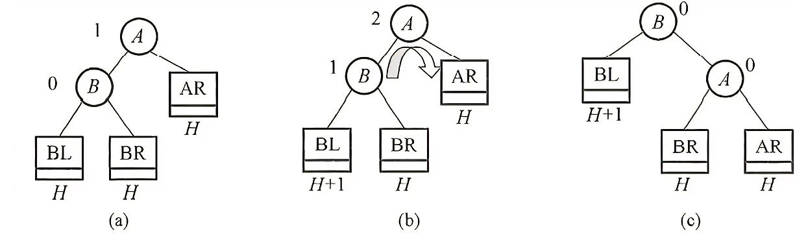
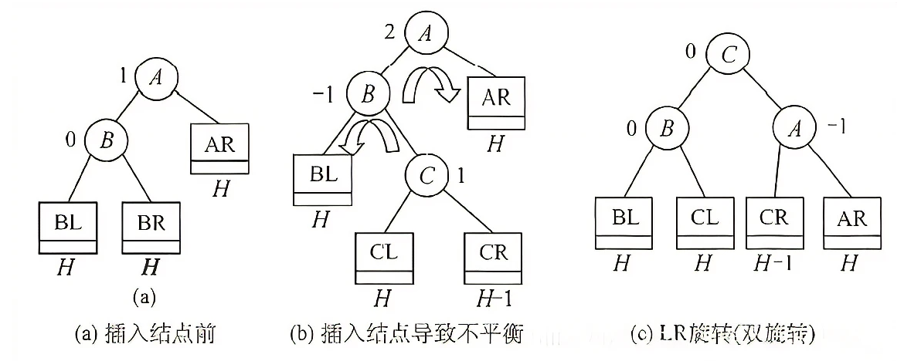

# 二叉排序/查找树 BST

## BST的定义

- BST（二叉排序树，Binary Sort Tree）（二叉查找树，Binary Search Tree）从任意节点开始，左子树节点值总比右子树值要小（左子树节点值 &lt; 根节点值 &lt; 右子树节点值），中序遍历（LDR）可以得到一组有序（从小到大）的数值。

1. 若左子树非空，则左子树上所有节点的值均小于根节点的值。
2. 若右子树非空，则右子树上所有节点的值均大于根节点的值。
3. 左右子树也分别是一棵二叉排序树。

## BST的查找

1. BST的查找从根节点出发。
2. 将需要查找的值与当前节点的值比较，若相等，则查找成功。
3. 若小于当前节点的值，则在当前节点的左子树继续第2步的操作。
4. 若大于当前节点的值，则在当前节点的右子树继续第2步的操作。

```c
BSTNode *BST_Search(Bitree T, ElemType key){
    while(T != NULL && key != T->data){
        if(key < T->data) T = T->lchild;
        else T = T->rchild;
    }
    return T;
}
```

```java
BSTNode bstSearch(BiTree biTree, Value key){
    BSTNode cur = biTree.root;
    while(cur != null && cur.key != key){
        if(cur.key > key) cur = cur.lChild;
        else cur = cur.rChild;
    }
    return cur;
}
```

## BST的插入与构建

1. BST是一种动态树表，其结构通常不是一次生成的，而是在查找的过程中生成的。相同的数据集以不同的顺序插入，可能会构建不同的BST。
2. 只有BST中不存在节点的值等于指定值时，才会对该值进行插入。即，BST不允许存在重复的值。

- BST的插入与构建思想：

1. 若原BST为空，则直接插入（也就是构建）；否则，从根节点出发对BST进行查找，直到查找失败。
2. 若要插入的节点的值小于查找失败处的节点的值，则该要插入的节点作为查找失败处的节点的左子树。
3. 若要插入的节点的值大于查找失败处的节点的值，则该要插入的节点作为查找失败处的节点的右子树。

```c
int BST_Insert(BiTree &T, keyType k){
    if(T == null){
        T = (BiTree)malloc(sizeof(BSTNode));
        T->data=k;
        T->lchild=T->rchild=NULL;
        return 1;
    }else if(k == T->data){
        return 0;
    }else if(k < T->data){
        retunr BST_Insert(T->lchild, k);
    }else{
        return BST_Insert(T->rchild, k);
    }
}
```

## BST的删除

1. 若被删除节点是叶子节点（度为0），则直接删除。
2. 若被删除节点的度为1，将被删除节点替换为其子节点即可。
3. 若被删除节点的度为2，查找从被删除节点在<b>LDR</b>中的<b>后继节点</b>（直接后继或直接前驱），使用该后继节点替代被删除节点，并删除该后继节点原先所在的位置。

 

```c
/* 删除节点 */
// 由于引入了 stdio.h ，此处无法使用 remove 关键词
void removeItem(BinarySearchTree *bst, int num) {
    // 若树为空，直接提前返回
    if (bst->root == NULL)
        return;
    TreeNode *cur = bst->root, *pre = NULL;
    // 循环查找，越过叶节点后跳出
    while (cur != NULL) {
        // 找到待删除节点，跳出循环
        if (cur->val == num)
            break;
        pre = cur;
        if (cur->val < num) {
            // 待删除节点在 root 的右子树中
            cur = cur->right;
        } else {
            // 待删除节点在 root 的左子树中
            cur = cur->left;
        }
    }
    // 若无待删除节点，则直接返回
    if (cur == NULL)
        return;
    // 判断待删除节点是否存在子节点
    if (cur->left == NULL || cur->right == NULL) {
        /* 子节点数量 = 0 or 1 */
        // 当子节点数量 = 0 / 1 时， child = nullptr / 该子节点
        TreeNode *child = cur->left != NULL ? cur->left : cur->right;
        // 删除节点 cur
        if (pre->left == cur) {
            pre->left = child;
        } else {
            pre->right = child;
        }
        // 释放内存
        free(cur);
    } else {
        /* 子节点数量 = 2 */
        // 获取中序遍历中 cur 的下一个节点
        TreeNode *tmp = cur->right;
        while (tmp->left != NULL) {
            tmp = tmp->left;
        }
        int tmpVal = tmp->val;
        // 递归删除节点 tmp
        removeItem(bst, tmp->val);
        // 用 tmp 覆盖 cur
        cur->val = tmpVal;
    }
}
```

```java
/* 删除节点 */
void remove(int num) {
    // 若树为空，直接提前返回
    if (root == null)
        return;
    TreeNode cur = root, pre = null;
    // 循环查找，越过叶节点后跳出
    while (cur != null) {
        // 找到待删除节点，跳出循环
        if (cur.val == num)
            break;
        pre = cur;
        // 待删除节点在 cur 的右子树中
        if (cur.val < num)
            cur = cur.right;
        // 待删除节点在 cur 的左子树中
        else
            cur = cur.left;
    }
    // 若无待删除节点，则直接返回
    if (cur == null)
        return;
    // 子节点数量 = 0 or 1
    if (cur.left == null || cur.right == null) {
        // 当子节点数量 = 0 / 1 时， child = null / 该子节点
        TreeNode child = cur.left != null ? cur.left : cur.right;
        // 删除节点 cur
        if (cur != root) {
            if (pre.left == cur)
                pre.left = child;
            else
                pre.right = child;
        } else {
            // 若删除节点为根节点，则重新指定根节点
            root = child;
        }
    }
    // 子节点数量 = 2
    else {
        // 获取中序遍历中 cur 的下一个节点
        TreeNode tmp = cur.right;
        while (tmp.left != null) {
            tmp = tmp.left;
        }
        // 递归删除节点 tmp
        remove(tmp.val);
        // 用 tmp 覆盖 cur
        cur.val = tmp.val;
    }
}
```

## BST的性能

 

- BST最坏情况下是形成一个斜树，这会导致插入和删除的代价为<code>O(n)</code>。

# 平衡二叉树 AVL

## AVL的性质

- <b>平衡二叉树（Balanced Binary Tree）（AVL）</b>规定在插入和删除节点时，必须（通过调整）使得任意节点的左、右子树的深度之差（<b>平衡因子BF</b>）的绝对值不超过1。
- AVL本质上是二叉排序树的一种，只是多了平衡的规则。也就是说，AVL必须要确保<b><a href="./二叉树.md#二叉树的遍历方式">中序遍历（LDR）</a></b>的结果满足从小到大的顺序，而且还要保证任意节点的<b>|BF|&le;1</b>。

## AVL的平衡旋转

- AVL的操作是基于BST的，在保证BST的特性的前提下，通过调整各节点的位置关系来确保任意节点的<span>|BF|</span>&le;1。

### 最小不平衡子树

- AVL的每次调整对象都是<b>最小不平衡子树</b>，也就是，将插入路径上离插入节点最近的<b><span>|BF|</span>&gt;1</b>的节点作为根节点的树。

### 平衡旋转

- 平衡旋转遵循<b>扁担原理</b>，将<b>最小不平衡子树的</b>根节点（支撑点）从节点A改为节点B。<b>旋转操作</b>既能保持“二叉搜索树”的性质，也能使树重新变为“平衡二叉树”。
- 关键在于对LL和RR的处理，也就是单次左旋和右旋操作的实现，最后组成对LR和RL的旋转操作：

```c
/* 执行旋转操作，使该子树重新恢复平衡 */
TreeNode *rotate(TreeNode *node) {
    // 获取节点 node 的平衡因子
    int bf = balanceFactor(node);
    // 左偏树
    if (bf > 1) {
        if (balanceFactor(node->left) >= 0) {
            // 右旋
            return rightRotate(node);
        } else {
            // 先左旋后右旋
            node->left = leftRotate(node->left);
            return rightRotate(node);
        }
    }
    // 右偏树
    if (bf < -1) {
        if (balanceFactor(node->right) <= 0) {
            // 左旋
            return leftRotate(node);
        } else {
            // 先右旋后左旋
            node->right = rightRotate(node->right);
            return leftRotate(node);
        }
    }
    // 平衡树，无须旋转，直接返回
    return node;
}
```

```java
/* 执行旋转操作，使该子树重新恢复平衡 */
TreeNode rotate(TreeNode node) {
    // 获取节点 node 的平衡因子
    int balanceFactor = balanceFactor(node);
    // 左偏树
    if (balanceFactor > 1) {
        if (balanceFactor(node.left) >= 0) {
            // 右旋
            return rightRotate(node);
        } else {
            // 先左旋后右旋
            node.left = leftRotate(node.left);
            return rightRotate(node);
        }
    }
    // 右偏树
    if (balanceFactor < -1) {
        if (balanceFactor(node.right) <= 0) {
            // 左旋
            return leftRotate(node);
        } else {
            // 先右旋后左旋
            node.right = rightRotate(node.right);
            return leftRotate(node);
        }
    }
    // 平衡树，无须旋转，直接返回
    return node;
}
```

#### LL 右旋

 

- LL：新插入的节点在节点A的左子树的左子树上，导致A节点的<span>|BF|</span>&gt;1。需要进行一次向右的旋转操作。

```c
/* 右旋操作 */
TreeNode *rightRotate(TreeNode *node) {
    TreeNode *child, *grandChild;
    child = node->left;
    grandChild = child->right;
    // 以 child 为原点，将 node 向右旋转
    child->right = node;
    node->left = grandChild;
    // 更新节点高度
    updateHeight(node);
    updateHeight(child);
    // 返回旋转后子树的根节点
    return child;
}
```

```java
/* LL失衡 */
TreeNode rightRotate(TreeNode node) {
    TreeNode child = node.left;
    TreeNode grandChild = child.right;
    // 以 child 为原点，将 node 向右旋转
    child.right = node;
    node.left = grandChild;
    // 更新节点高度
    updateHeight(node);
    updateHeight(child);
    // 返回旋转后子树的根节点
    return child;
}
```

#### RR 左旋

 

- RR：新插入的节点在节点A的右子树的右子树上，导致A节点的<span>|BF|</span>&gt;1。需要进行一次向左的旋转操作。

```c
/* 左旋操作 */
TreeNode *leftRotate(TreeNode *node) {
    TreeNode *child, *grandChild;
    child = node->right;
    grandChild = child->left;
    // 以 child 为原点，将 node 向左旋转
    child->left = node;
    node->right = grandChild;
    // 更新节点高度
    updateHeight(node);
    updateHeight(child);
    // 返回旋转后子树的根节点
    return child;
}
```

```java
/* 左旋操作 */
TreeNode leftRotate(TreeNode node) {
    TreeNode child = node.right;
    TreeNode grandChild = child.left;
    // 以 child 为原点，将 node 向左旋转
    child.left = node;
    node.right = grandChild;
    // 更新节点高度
    updateHeight(node);
    updateHeight(child);
    // 返回旋转后子树的根节点
    return child;
}
```

#### LR 右旋后左旋

 

- LR：两次旋转操作，先左旋转后右旋转。先将A结点的左孩子B的右子树的根结点C向左上旋转提升到B结点的位置（即进行一次RR平衡旋转(左单旋转)），然后再把该C结点向右上旋转提升到A结点的位置（即进行一次LL平衡旋转(右单旋转)）。

#### RL 左旋后右旋

 

- RL：两次旋转操作，先右旋转后左旋转。先将A结点的右孩子B的左子树的根结点C向右上旋转提升到B结点的位置（即进行一次LL平衡旋转(右单旋转)），然后再把该C结点向左上旋转提升到A结点的位置（即进行一次RR平衡旋转(左单旋转)）。

## AVL的查找

- AVL的查找和BST的查找基本相同，只是AVL的最坏情况不会像BST一样形成斜树（<code>O(n)</code>）。

## AVL的插入

- 向AVL插入新节点后，可能会导致插入的节点所在的路径出现一系列失衡的节点（<span>|BF|</span>&gt;1）。因此，需要从插入的节点位置出发，自底向上执行旋转操作。也就是<b>回溯</b>，依次找到离插入节点最近的失衡节点（<span>|BF|</span>&gt;1），并对以该失衡节点为根节点的最小不平衡子树进行平衡旋转。

```c
/* 插入节点 */
void insert(AVLTree *tree, int val) {
    tree->root = insertHelper(tree->root, val);
}

/* 递归插入节点（辅助函数） */
TreeNode *insertHelper(TreeNode *node, int val) {
    if (node == NULL) {
        return newTreeNode(val);
    }
    /* 1. 查找插入位置并插入节点 */
    if (val < node->val) {
        node->left = insertHelper(node->left, val);
    } else if (val > node->val) {
        node->right = insertHelper(node->right, val);
    } else {
        // 重复节点不插入，直接返回
        return node;
    }
    // 更新节点高度
    updateHeight(node);
    /* 2. 执行旋转操作，使该子树重新恢复平衡 */
    node = rotate(node);
    // 返回子树的根节点
    return node;
}
```

```java
/* 插入节点 */
void insert(int val) {
    root = insertHelper(root, val);
}

/* 递归插入节点（辅助方法） */
TreeNode insertHelper(TreeNode node, int val) {
    if (node == null)
        return new TreeNode(val);
    /* 1. 查找插入位置并插入节点 */
    if (val < node.val)
        node.left = insertHelper(node.left, val);
    else if (val > node.val)
        node.right = insertHelper(node.right, val);
    else
        return node; // 重复节点不插入，直接返回
    updateHeight(node); // 更新节点高度
    /* 2. 执行旋转操作，使该子树重新恢复平衡 */
    node = rotate(node);
    // 返回子树的根节点
    return node;
}
```

## AVL的删除

- 对AVL的删除同样需要向上回溯。只是对于插入操作而言，只要调整一个失衡节点即可；而删除操作则需要一直回溯到AVL的根节点为止，才能确保AVL的平衡。

```c
/* 删除节点 */
// 由于引入了 stdio.h ，此处无法使用 remove 关键词
void removeItem(AVLTree *tree, int val) {
    TreeNode *root = removeHelper(tree->root, val);
}

/* 递归删除节点（辅助函数） */
TreeNode *removeHelper(TreeNode *node, int val) {
    TreeNode *child, *grandChild;
    if (node == NULL) {
        return NULL;
    }
    /* 1. 查找节点并删除 */
    if (val < node->val) {
        node->left = removeHelper(node->left, val);
    } else if (val > node->val) {
        node->right = removeHelper(node->right, val);
    } else {
        if (node->left == NULL || node->right == NULL) {
            child = node->left;
            if (node->right != NULL) {
                child = node->right;
            }
            // 子节点数量 = 0 ，直接删除 node 并返回
            if (child == NULL) {
                return NULL;
            } else {
                // 子节点数量 = 1 ，直接删除 node
                node = child;
            }
        } else {
            // 子节点数量 = 2 ，则将中序遍历的下个节点删除，并用该节点替换当前节点
            TreeNode *temp = node->right;
            while (temp->left != NULL) {
                temp = temp->left;
            }
            int tempVal = temp->val;
            node->right = removeHelper(node->right, temp->val);
            node->val = tempVal;
        }
    }
    // 更新节点高度
    updateHeight(node);
    /* 2. 执行旋转操作，使该子树重新恢复平衡 */
    node = rotate(node);
    // 返回子树的根节点
    return node;
}
```

```java
/* 删除节点 */
void remove(int val) {
    root = removeHelper(root, val);
}

/* 递归删除节点（辅助方法） */
TreeNode removeHelper(TreeNode node, int val) {
    if (node == null)
        return null;
    /* 1. 查找节点并删除 */
    if (val < node.val)
        node.left = removeHelper(node.left, val);
    else if (val > node.val)
        node.right = removeHelper(node.right, val);
    else {
        if (node.left == null || node.right == null) {
            TreeNode child = node.left != null ? node.left : node.right;
            // 子节点数量 = 0 ，直接删除 node 并返回
            if (child == null)
                return null;
            // 子节点数量 = 1 ，直接删除 node
            else
                node = child;
        } else {
            // 子节点数量 = 2 ，则将中序遍历的下个节点删除，并用该节点替换当前节点
            TreeNode temp = node.right;
            while (temp.left != null) {
                temp = temp.left;
            }
            node.right = removeHelper(node.right, temp.val);
            node.val = temp.val;
        }
    }
    updateHeight(node); // 更新节点高度
    /* 2. 执行旋转操作，使该子树重新恢复平衡 */
    node = rotate(node);
    // 返回子树的根节点
    return node;
}
```

# 红黑树 RB-tree

- 红黑树（RB-tree）是对AVL树的平衡条件的放宽。

1. 每个节点或是红色的，或是黑色的。
2. 根节点是黑色的。
3. 叶节点（虚构的外部节点、NULL节点）都是黑色的。
4. 不存在两个相邻的红节点。（红节点之间不可能是父子关系）
5. 每个节点，从该节点到任意一个叶节点的简单路径上，所含黑节点的数量相同。