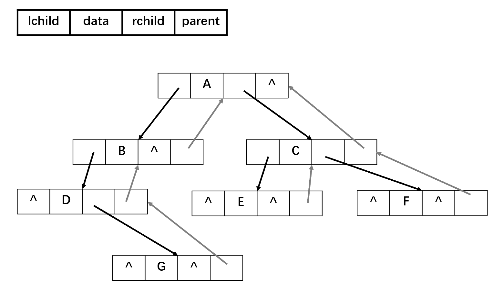
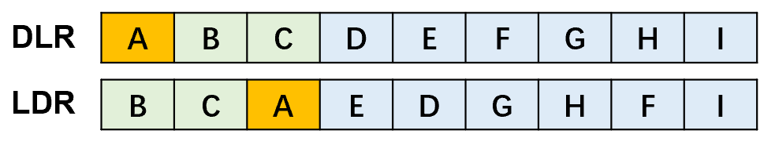
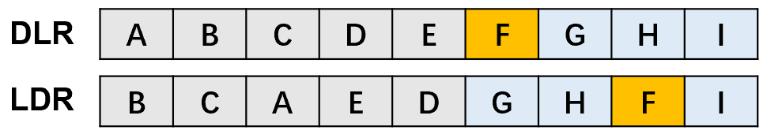
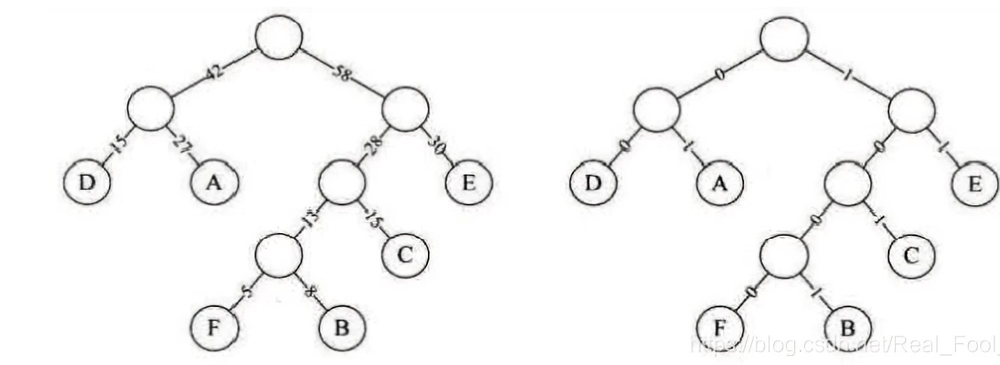

# 二叉树的基本性质

## 基本二叉树

- 二叉树是有序树，有左右子树之分，一个节点最多有两个子节点。

1. 非空二叉树上的叶子节点（度为0）数等于度为2的节点数加1：n<sub>0</sub> = n<sub>2</sub> + 1。

2. 非空二叉树上第k层上至多有2<sup>k-1</sup>（k &ge;1）个节点，二叉树第1层只有一个根节点。
3. 深度为k的二叉树至多（假设该树为满二叉树）有2<sup>k</sup>-1（k &ge;1）个节点。 

- 设n为树的总节点数，n<sub>0</sub>为度为0的节点数，n<sub>1</sub>为度为1的节点数，n<sub>2</sub>为度为2的节点数

 

- 分支的数量：

1. 从进入的角度，只有根节点没有入边，故分支数为 n - 1
2. 从出发的角度，度为2的节点发出2条分支，故2n<sub>2</sub>
3. 度为1的节点发出1条分支，故n<sub>1</sub>

## 斜树

 

## 满二叉树

 

- 所有分支节点都存在左子树和右子树，且所有的叶子节点都处于最底层。（只有度为0和2的节点）满二叉树的每层都含有最多的节点，若高度为h，则有2<sup>h</sup>-1个节点。
- 对满二叉树按层序编号，从根节点（编号1）自上而下，自左向右。对于编号为i的节点：若有双亲，则其双亲编号i/2；若有左孩子，则左孩子编号2i；若有右孩子，则右孩子编号2i+1。

## 完全二叉树

 

- 对一棵具有n个节点的二叉树按层序编号，编号为i的节点与（该二叉树同样深度的）满二叉树中编号为i的节点在二叉树中的位置完全相同。

1. 深度为k的完全二叉树在第k-1层是满二叉树（满二叉树 &sube; 完全二叉树）
2. 叶子节点只可能在层次最大的两层上出现，且最大层次中的叶子节点都集中在该层左侧连续的位置。
3. 若有度为1的节点，则只可能有一个，且该节点只有左孩子而无右孩子。 
4. 按层序编号后，如果编号为i的节点为叶子节点或其只有左孩子，则编号大于i的节点均为叶子节点。
5. 若n为奇数，则每个分支节点都有左孩子和右孩子；若n为偶数，则编号最大（n/2）的分支节点只有左孩子，没有右孩子。
6. 具有n（n&gt;0）个节点的完全二叉树的深度为$\lfloor \log_{2}^{n} \rfloor + 1$

> 设具有n个节点的完全二叉树的深度为k：
> 
>  

7. 对完全二叉树按层序编号，对节点i则有以下关系:
   1. i > 1：节点i的双亲的编号为$\lfloor \frac{i}{2} \rfloor$，否则该节点为根节点。
      - i为偶数：双亲的左孩子。
      - i为奇数：双亲的右孩子。
   2. 2i &le; n：节点i 的左孩子编号为2i,，否则无左孩子。
   3. 2i+1 &le; n：节点i的右孩子编号为2i+1，否则无右孩子。

 

 

# 二叉树的遍历

## 二叉树的遍历方式

 

```java
void DLRTree(BinarySortTreeNode node) {
    if (node != null) {
        treeNodeData(node);//输出
        DLRTree(node.left);
        DLRTree(node.right);
    }
}

void LDRTree(BinarySortTreeNode node) {
    if (node != null) {
        LDRTree(node.left);
        treeNodeData(node);//输出
        LDRTree(node.right);
    }
}

void LRDTree(BinarySortTreeNode node) {
    if (node != null) {
        LRDTree(node.left);
        LRDTree(node.right);
        treeNodeData(node);//输出
    }
}

public void levelTree(BinarySortTreeNode node) {
    //需要使用队列辅助
    BinarySortTreeNode curNode;
    BinarySortTreeNode[] nodeQuery = new BinarySortTreeNode[MAXLEN];
    int head = 0, tail = 0;

    //先判断树是否为空
    if (node != null) {
        tail = (tail + 1) % MAXLEN;
        nodeQuery[tail] = node;
    }
    while (head != tail) {
        head = (head + 1) % MAXLEN;
        curNode = nodeQuery[head];

        treeNodeData(curNode);//输出

        //如果当前节点存在子树
        if (curNode.left != null) {
            tail = (tail + 1) % MAXLEN;
            nodeQuery[tail] = curNode.left;
        }
        if (curNode.right != null) {
            tail = (tail + 1) % MAXLEN;
            nodeQuery[tail] = curNode.right;
        }
    }
}
```

## 二叉树的确定

- 先序排列（DLR）、后序排列（LRD）：确定各层级的根节点。
- 中序排列（LDR）：确定节点的左右子树之分。

<details>
    <summary>求先序序列( ABCDEFGHI)和中序序列( BCAEDGHFI）所确定的二叉树</summary>
1. 图a：<br/>
   1.1. 由先序遍历：确定第一层的根节点为A；<br/>
   1.2. 在1.1的基础上，由中序遍历确定BC为A的左子树一侧，而EDGHFI为A的右子树一侧。<br/>
    <br/>
2. 图b：<br/>
   2.1. 在图a的基础上，由先序遍历确定：<br/>
      - B是A的左子树、即C的双亲节点。<br/>
      - D是A的右子树、即EFGHI的双亲/祖先节点。<br/>
   2.2 在2.1的基础上，由中序遍历确定：<br/>
      - C是B的右子树。<br/>
      - E是D的左子树，GHFI在D的右子树一侧。<br/>
    <br/>
3. 图c：<br/>
   3.1. 在图b的基础上，由先序遍历确定：<br/>
      - F是D的右子树、即GHI的双亲/祖先节点。<br/>
   3.2. 在3.1的基础上，由中序遍历确定：<br/>
      - GH在F的左子树一侧。<br/>
      - I是F的右子树。<br/>
    <br/>
   3.3. 最后确定H是G的右子树。<br/>
 
</details>
# 森林

## 森林的性质

- 森林是m棵互不相交的树的集合。

## 树、二叉树、森林的转换

- 树转为二叉树：

1. 为树中的所有相邻的兄弟节点之间加线。
2. 保留根节点和第一个子节点的连线，去除根节点与其他子节点的连线。
3. 层次调整：树的前序遍历等于二叉树的前序遍历，树的后序遍历等于二叉树的中序遍历

- 森林转二叉树：森林中树的兄弟节点&rarr;二叉树中父节点的左孩子的右孩子节点或左孩子的孩子的孩子节点。

1. 将森林的每棵树转为二叉树。
2. 第一棵二叉树保持不变，从第二棵二叉树开始，移除将后一棵二叉树的根节点作为前一棵二叉树的根节点的右子树。
3. 层次调整：森林的前序遍历等于二叉树的前序遍历，森林的后序遍历等于二叉树的中序遍历

- 二叉树转树/森林：

1. 若该节点是其父节点的左节点，则将其右节点、右节点的子右节点……与其父节点相连。
2. 删除二叉树中所有的父节点与右节点的连线。
3. 层次调整。

# 最优二叉树（哈夫曼树）

## 哈夫曼树

- 二叉树的带权路径长度WPL：从根节点到各个叶子节点的路径长度与相应叶子节点权值的乘积之和

 

- 哈夫曼树（Hufffman-tree）：带权路径长度最小的二叉树。使权值越大的叶子节点越靠近根节点，且不存在度为1的节点。 

1. 由给定的n个权值的\{w<sub>1</sub>, w<sub>2</sub>, ..., w<sub>n</sub>\}，构成n棵只有根节点的二叉树集合F=\{T<sub>1</sub>, T<sub>2</sub>, .., T<sub>n</sub>\}，其中每棵二叉树T<sub>i</sub>中只有一个带权为w<sub>i</sub>的根节点，其左右子树均为空。
2. 在二叉树集合F中选取两棵根节点的值最小的树，作为左右子树以构造一棵新的二叉树，新二叉树的根节点的权值为这两棵二叉树的权值之和。
3. 在二叉树集合F中删除这两棵二叉树，并将新得到的二叉树加入到集合F中。
4. 重复2、3步，直至集合F中只剩下一棵二叉树，即为哈夫曼树。

```java
public class HuffmanTree {
    private HuffmanTreeNode root;
    List<HuffmanTreeNode> nodes;

    public HuffmanTree() {
        this.nodes = null;
    }

    public HuffmanTree(List<HuffmanTreeNode> nodes) {
        this.nodes = nodes;
    }

    public void createTree() {
        Queue<HuffmanTreeNode> queue = new PriorityQueue<>(new Comparator<HuffmanTreeNode>() {
            @Override
            public int compare(HuffmanTreeNode o1, HuffmanTreeNode o2) {
                return o1.value - o2.value;
            }
        });
        queue.addAll(nodes);

        while (!queue.isEmpty()) {
            HuffmanTreeNode n1 = queue.poll();
            HuffmanTreeNode n2 = queue.poll();
            HuffmanTreeNode parent = new HuffmanTreeNode(n1.value + n2.value, n1, n2);
            if (queue.isEmpty()) {
                root = parent;
                return;
            }
            queue.add(parent);
        }
    }

    public int getWeight() {
        Queue<HuffmanTreeNode> queue = new ArrayDeque<>();
        queue.add(root);
        int weight = 0;
        while (!queue.isEmpty()) {
            HuffmanTreeNode curNode = queue.poll();
            if (curNode.left != null) {
                curNode.left.deep = curNode.deep + 1;
                curNode.right.deep = curNode.deep + 1;
                queue.add(curNode.left);
                queue.add(curNode.right);
            } else {
                weight += curNode.deep * curNode.value;
            }
        }
        return weight;
    }
}

class HuffmanTreeNode {
    int value;
    HuffmanTreeNode left;
    HuffmanTreeNode right;
    int deep;

    public HuffmanTreeNode(int value) {
        this.value = value;
        this.deep = 0;
    }

    public HuffmanTreeNode(int value, HuffmanTreeNode left, HuffmanTreeNode right) {
        this.value = value;
        this.left = left;
        this.right = right;
    }
}
```

## 哈夫曼编码

- 哈夫曼编码（Hufffman Coding）：通过数据出现的频率来分配权重，并由该权重来构建哈夫曼树。0和1究竟是表示左子树还是右子树没有明确规定。左、右孩子节点的顺序是任意的，所以构造出的哈夫曼树并不唯一，但各哈夫曼树的带权路径长度WPL相同且为最优。此外，如有若干权值相同的节点，则构造出的哈夫曼树更可能不同，但WPL必然相同且是最优的。

<details>
    <summary>有一段文字内容为“ BADCADFEED”要网络传输给别人：</summary>
    1. 如果使用二进制数据表示：<br/>
 <br/>
- 这样按照固定长度编码编码后就是“001000011010000011101100100011“，按每3位来译码。<br/>
2. 使用哈夫曼树时：<br/>
- 假设六个字母的频率为A 27,B 8,C 15,D 15,E 30,F 5；按权值百分比来分配，并重新按照赫夫曼树来规划它们。<br/>
- 左图为构造赫夫曼树的过程的权值显示。右图为将权值左分支改为0，右分支改为1后的赫夫曼树<br/>
 <br/>
- 原编码二进制串: 000011000011101100100011 (共 30个字符)<br/>
- 新编码二进制串: 10100101010111100(共25个字符)<br/>
- 数据被压缩，节省了空间。<br/>
</details>

- 前缀编码：不等长编码必须满足任一个字符的编码都不是另一个字符的编码的前缀。哈夫曼编码的字符在哈夫曼树中的位置只能是叶子节点、叶子节点一定代表哈夫曼编码的字符，即：n<sub>0</sub>= 哈夫曼编码的字符数。

- 非法的哈夫曼编码，即不满足前缀编码的，如{ 0, 00, 01, 10, 11}，其中0代表的字符是00、01的字符编码的前缀，故不满足前缀编码。

 

```java
package tree;

import java.util.PriorityQueue;

public class HuffmanCode {

    public static void main(String[] args) {
        HuffmanCode huffmanCode = new HuffmanCode();
        PriorityQueue<Node> queue = new PriorityQueue<>();
        queue.add(new Node(15, 'D'));
        queue.add(new Node(27, 'A'));
        queue.add(new Node(5, 'F'));
        queue.add(new Node(8, 'B'));
        queue.add(new Node(15, 'C'));
        queue.add(new Node(30, 'E'));
        huffmanCode.init(queue);
        huffmanCode.DLR(huffmanCode.root);

    }

    Node root;

    /**
     * 依据传入PriorityQueue的Data的weight值来创建哈夫曼树
     *
     * @param queue 创建哈夫曼树的节点
     */
    public void init(PriorityQueue<Node> queue) {
        //只要queue非空就继续添加
        while (!queue.isEmpty()) {
            Node left = queue.poll();
            Node right = queue.poll();
            //父节点
            Node parent = new Node(left, right, left.weight + right.weight);
            //如果队列中没有节点
            if (queue.isEmpty()) {
                root = parent;
                return;
            }
            //将当前的父节点加入到Queue中重新排序
            queue.add(parent);
        }
    }

    public void DLR(Node node) {
        if (node != null) {
            System.out.print(node.characteristic);
            DLR(node.left);
            DLR(node.right);
        }
    }

    //将哈夫曼树变为二进制串
//    public String unCoding() {
        //1.获得编码的顺序
        //2.
//    }
}

class Node implements Comparable {
    Node left;
    Node right;
    int weight; //频率百分比 权值
    char characteristic;

    public Node() {
    }

    public Node(Node left, Node right, int weight) {
        this.left = left;
        this.right = right;
        this.weight = weight;
    }

    public Node(int weight, char characteristic) {
        this.weight = weight;
        this.characteristic = characteristic;
    }

    @Override
    public int compareTo(Object o) {
        if (!(o instanceof Node))
            throw new RuntimeException("不是同一个类型");

        Node node = (Node) o;
        return this.weight - node.weight;
    }
}
```

# 平衡二叉树

- 平衡二叉树上任一节点的左子树和右子树的深度之差不超过1。
- 平衡因子BF：将二叉树上节点的左子树深度减去右子树深度的值。只要二叉树上有一个节点的平衡因子的绝对值大于1，则该二叉树就是不平衡的

## 最小不平衡子树

- 在平衡二叉树的构造过程中以距离插入节点最近的且平衡因子绝对值大于1的节点为根的子树。

- 扁担原理：将根节点（支撑点）从A改为B。

```java
Node temp = root; //暂存A节点
root = root.left; //将B节点（A节点的左子树）设为根节点
temp.left = root.right; //将A节点的左子树设为B节点的右子树
root.right = temp; //将A节点设为B节点的右子树
```

| 平衡调整 | 说明                                                         |
| -------- | ------------------------------------------------------------ |
| LL型     | 新插入的结点在结点A的左子树的左子树上。<br /> |
| RR型     |  |
| LR型     | 两次旋转操作，先左旋转后右旋转。先将A结点的左孩子B的右子树的根结点C向左上旋转提升到B结点的位置（即进行一次RR平衡旋转(左单旋转)），然后再把该C结点向右上旋转提升到A结点的位置（即进行一次LL平衡旋转(右单旋转)）。<br /> |
| RL型     | 两次旋转操作，先右旋转后左旋转。先将A结点的右孩子B的左子树的根结点C向右上旋转提升到B结点的位置（即进行一次LL平衡旋转(右单旋转)），然后再把该C结点向左上旋转提升到A结点的位置（即进行一次RR平衡旋转(左单旋转)）。<br /> |

# 二叉排序/查找树 BST

## BST的定义

- BST（二叉排序树，Binary Sort Tree）（二叉查找树，Binary Search Tree）从任意节点开始，左子树节点值总比右子树值要小（左子树节点值 &lt; 根节点值 &lt; 右子树节点值），中序遍历（LDR）可以得到一组有序（从小到大）的数值。

1. 若左子树非空，则左子树上所有节点的值均小于根节点的值。
2. 若右子树非空，则右子树上所有节点的值均大于根节点的值。
3. 左右子树也分别是一棵二叉排序树。

## BST的查找

1. BST的查找从根节点出发。
2. 将需要查找的值与当前节点的值比较，若相等，则查找成功。
3. 若小于当前节点的值，则在当前节点的左子树继续第2步的操作。
4. 若大于当前节点的值，则在当前节点的右子树继续第2步的操作。

```c
BSTNode *BST_Search(Bitree T, ElemType key){
    while(T != NULL && key != T->data){
        if(key < T->data) T = T->lchild;
        else T = T->rchild;
    }
    return T;
}
```

```java
BSTNode bstSearch(BiTree biTree, Value key){
    BSTNode cur = biTree.root;
    while(cur != null && cur.key != key){
        if(cur.key > key) cur = cur.lChild;
        else cur = cur.rChild;
    }
    return cur;
}
```

## BST的插入

- BST是一种动态树表，其结构通常不是一次生成的，而是在查找的过程中生成的。只有BST中不存在节点的值等于指定值时，才会对该值进行插入。

1. 若原BST为空，则直接插入；否则，从根节点出发对BST进行查找，直到查找失败。
2. 若要插入的节点的值小于查找失败处的节点的值，则该要插入的节点作为查找失败处的节点的左子树。
3. 若要插入的节点的值大于查找失败处的节点的值，则该要插入的节点作为查找失败处的节点的右子树。

```c
int BST_Insert(BiTree &T, keyType k){
    if(T == null){
        T = (BiTree)malloc(sizeof(BSTNode));
        T->data=k;
        T->lchild=T->rchild=NULL;
        return 1;
    }else if(k == T->data){
        return 0;
    }else if(k < T->data){
        retunr BST_Insert(T->lchild, k);
    }else{
        return BST_Insert(T->rchild, k);
    }
}
```

# 线索二叉树


