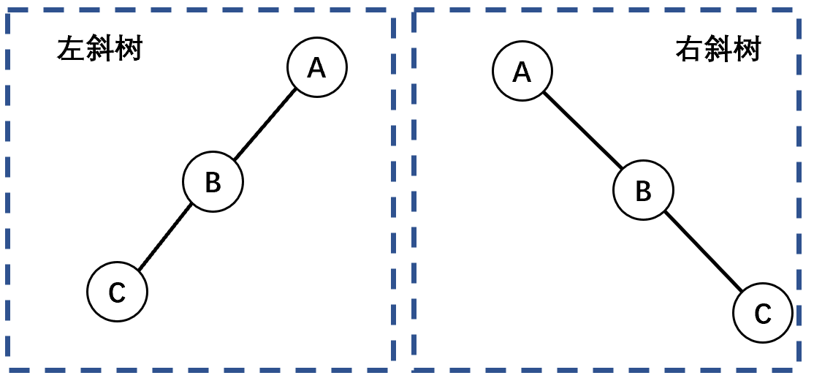

# 二叉树的基本性质

## 基本二叉树

- 二叉树是有序树，有左右子树之分，一个节点最多有两个子节点。

1. 非空二叉树上的叶子节点（度为0）数等于度为2的节点数加1：n<sub>0</sub> = n<sub>2</sub> + 1。

2. 非空二叉树上第k层上至多有2<sup>k-1</sup>（k &ge;1）个节点，二叉树第1层只有一个根节点。
3. 深度为k的二叉树至多（假设该树为满二叉树）有2<sup>k</sup>-1（k &ge;1）个节点。 

- 设n为树的总节点数，n<sub>0</sub>为度为0的节点数，n<sub>1</sub>为度为1的节点数，n<sub>2</sub>为度为2的节点数

 

- 分支的数量：

1. 从进入的角度，只有根节点没有入边，故分支数为 n - 1
2. 从出发的角度，度为2的节点发出2条分支，故2n<sub>2</sub>
3. 度为1的节点发出1条分支，故n<sub>1</sub>

## 斜树

 

## 满二叉树

 

- 所有分支节点都存在左子树和右子树，且所有的叶子节点都处于最底层。（只有度为0和2的节点）满二叉树的每层都含有最多的节点，若高度为h，则有2<sup>h</sup>-1个节点。
- 对满二叉树按层序编号，从根节点（编号1）自上而下，自左向右。对于编号为i的节点：若有双亲，则其双亲编号i/2；若有左孩子，则左孩子编号2i；若有右孩子，则右孩子编号2i+1。

## 完全二叉树

 

- 对一棵具有n个节点的二叉树按层序编号，编号为i的节点与（该二叉树同样深度的）满二叉树中编号为i的节点在二叉树中的位置完全相同。

1. 深度为k的完全二叉树在第k-1层是满二叉树（满二叉树 &sube; 完全二叉树）
2. 叶子节点只可能在层次最大的两层上出现，且最大层次中的叶子节点都集中在该层左侧连续的位置。
3. 若有度为1的节点，则只可能有一个，且该节点只有左孩子而无右孩子。 
4. 按层序编号后，如果编号为i的节点为叶子节点或其只有左孩子，则编号大于i的节点均为叶子节点。
5. 若n为奇数，则每个分支节点都有左孩子和右孩子；若n为偶数，则编号最大（n/2）的分支节点只有左孩子，没有右孩子。
6. 具有n（n&gt;0）个节点的完全二叉树的深度为$\lfloor \log_{2}^{n} \rfloor + 1$

> 设具有n个节点的完全二叉树的深度为k：
> 
>  

7. 对完全二叉树按层序编号，对节点i则有以下关系:
   1. i > 1：节点i的双亲的编号为$\lfloor \frac{i}{2} \rfloor$，否则该节点为根节点。
      - i为偶数：双亲的左孩子。
      - i为奇数：双亲的右孩子。
   2. 2i &le; n：节点i 的左孩子编号为2i,，否则无左孩子。
   3. 2i+1 &le; n：节点i的右孩子编号为2i+1，否则无右孩子。

 

 

# 二叉树的遍历

## <span name="二叉树的遍历方式">二叉树的遍历方式</span>

 

```java
void DLRTree(BinarySortTreeNode node) {
    if (node != null) {
        treeNodeData(node);//输出
        DLRTree(node.left);
        DLRTree(node.right);
    }
}

void LDRTree(BinarySortTreeNode node) {
    if (node != null) {
        LDRTree(node.left);
        treeNodeData(node);//输出
        LDRTree(node.right);
    }
}

void LRDTree(BinarySortTreeNode node) {
    if (node != null) {
        LRDTree(node.left);
        LRDTree(node.right);
        treeNodeData(node);//输出
    }
}

public void levelTree(BinarySortTreeNode node) {
    //需要使用队列辅助
    BinarySortTreeNode curNode;
    BinarySortTreeNode[] nodeQuery = new BinarySortTreeNode[MAXLEN];
    int head = 0, tail = 0;

    //先判断树是否为空
    if (node != null) {
        tail = (tail + 1) % MAXLEN;
        nodeQuery[tail] = node;
    }
    while (head != tail) {
        head = (head + 1) % MAXLEN;
        curNode = nodeQuery[head];

        treeNodeData(curNode);//输出

        //如果当前节点存在子树
        if (curNode.left != null) {
            tail = (tail + 1) % MAXLEN;
            nodeQuery[tail] = curNode.left;
        }
        if (curNode.right != null) {
            tail = (tail + 1) % MAXLEN;
            nodeQuery[tail] = curNode.right;
        }
    }
}
```

## 二叉树的确定

- 先序排列（DLR）、后序排列（LRD）：确定各层级的根节点。
- 中序排列（LDR）：确定节点的左右子树之分。

<details>
    <summary>求先序序列( ABCDEFGHI)和中序序列( BCAEDGHFI）所确定的二叉树</summary>
1. 图a：<br/>
   1.1. 由先序遍历：确定第一层的根节点为A；<br/>
   1.2. 在1.1的基础上，由中序遍历确定BC为A的左子树一侧，而EDGHFI为A的右子树一侧。<br/>
    <br/>
2. 图b：<br/>
   2.1. 在图a的基础上，由先序遍历确定：<br/>
      - B是A的左子树、即C的双亲节点。<br/>
      - D是A的右子树、即EFGHI的双亲/祖先节点。<br/>
   2.2 在2.1的基础上，由中序遍历确定：<br/>
      - C是B的右子树。<br/>
      - E是D的左子树，GHFI在D的右子树一侧。<br/>
    <br/>
3. 图c：<br/>
   3.1. 在图b的基础上，由先序遍历确定：<br/>
      - F是D的右子树、即GHI的双亲/祖先节点。<br/>
   3.2. 在3.1的基础上，由中序遍历确定：<br/>
      - GH在F的左子树一侧。<br/>
      - I是F的右子树。<br/>
    <br/>
   3.3. 最后确定H是G的右子树。<br/>
 
</details>