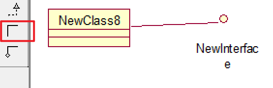

# 关系元素

- UML模型是由各种事物以及这些事物之间的各种关系构成的。
- 关系是指支配、协调各种模型元素存在并相互使用的规则。
- 主要包含四种关系：依赖、关联、泛化、实现。

# 依赖关系 dependency

- 依赖关系：两个事物之间的一种语义关系，当其中一个事物（独立事物）发生变化就会影响另外一个事物（依赖事物）的语义。

 

# 关联关系  associate

- 关联关系：事物之间的结构关系。描述一组链（对象之间的连接）。
  - 聚合：描述整体和部分之间的结构关系。
  - 组成：描述整体和部分之间的结构关系，但部分不能脱离整体而独立存在。
  - 无方向的普通关联关系。

- 如果系统元素之间的关系不能明显地由其他关系来表示，则可以被抽象为关联关系。
- 当一个类“知道”另一个类时，可以使用关联关系来表示：
  - 车间内工人知道他车间的车间主任是谁。
  - 企鹅迁移时必须知道气候。

 

 

# 泛化关系 generalization

- 泛化关系是事物之间的一种特殊/一般关系，特殊元素（子元素）的对象可替代一般元素（父元素）的对象，即继承。

 

# 实现关系 realization

- 实现关系描述了一组操作的规约和一组对操作的具体实现之间的语义关系。
- 通常用于：接口和实现接口的类/构件之间、用例和实现用例的协作之间。

 

