## 哈夫曼树

- 二叉树的带权路径长度WPL：从根节点到各个叶子节点的路径长度与相应叶子节点权值的乘积之和

 

- 哈夫曼树（Hufffman-tree）（最优二叉树）：带权路径长度最小的二叉树。使权值越大的叶子节点越靠近根节点，且不存在度为1的节点。 

1. 由给定的n个权值的\{w<sub>1</sub>, w<sub>2</sub>, ..., w<sub>n</sub>\}，构成n棵只有根节点的二叉树集合F=\{T<sub>1</sub>, T<sub>2</sub>, .., T<sub>n</sub>\}，其中每棵二叉树T<sub>i</sub>中只有一个带权为w<sub>i</sub>的根节点，其左右子树均为空。
2. 在二叉树集合F中选取两棵根节点的值最小的树，作为左右子树以构造一棵新的二叉树，新二叉树的根节点的权值为这两棵二叉树的权值之和。
3. 在二叉树集合F中删除这两棵二叉树，并将新得到的二叉树加入到集合F中。
4. 重复2、3步，直至集合F中只剩下一棵二叉树，即为哈夫曼树。

```java
public class HuffmanTree {
    private HuffmanTreeNode root;
    List<HuffmanTreeNode> nodes;

    public HuffmanTree() {
        this.nodes = null;
    }

    public HuffmanTree(List<HuffmanTreeNode> nodes) {
        this.nodes = nodes;
    }

    public void createTree() {
        Queue<HuffmanTreeNode> queue = new PriorityQueue<>(new Comparator<HuffmanTreeNode>() {
            @Override
            public int compare(HuffmanTreeNode o1, HuffmanTreeNode o2) {
                return o1.value - o2.value;
            }
        });
        queue.addAll(nodes);

        while (!queue.isEmpty()) {
            HuffmanTreeNode n1 = queue.poll();
            HuffmanTreeNode n2 = queue.poll();
            HuffmanTreeNode parent = new HuffmanTreeNode(n1.value + n2.value, n1, n2);
            if (queue.isEmpty()) {
                root = parent;
                return;
            }
            queue.add(parent);
        }
    }

    public int getWeight() {
        Queue<HuffmanTreeNode> queue = new ArrayDeque<>();
        queue.add(root);
        int weight = 0;
        while (!queue.isEmpty()) {
            HuffmanTreeNode curNode = queue.poll();
            if (curNode.left != null) {
                curNode.left.deep = curNode.deep + 1;
                curNode.right.deep = curNode.deep + 1;
                queue.add(curNode.left);
                queue.add(curNode.right);
            } else {
                weight += curNode.deep * curNode.value;
            }
        }
        return weight;
    }
}

class HuffmanTreeNode {
    int value;
    HuffmanTreeNode left;
    HuffmanTreeNode right;
    int deep;

    public HuffmanTreeNode(int value) {
        this.value = value;
        this.deep = 0;
    }

    public HuffmanTreeNode(int value, HuffmanTreeNode left, HuffmanTreeNode right) {
        this.value = value;
        this.left = left;
        this.right = right;
    }
}
```

## 哈夫曼编码

- 哈夫曼编码（Hufffman Coding）：通过数据出现的频率来分配权重，并由该权重来构建哈夫曼树。0和1究竟是表示左子树还是右子树没有明确规定。左、右孩子节点的顺序是任意的，所以构造出的哈夫曼树并不唯一，但各哈夫曼树的带权路径长度WPL相同且为最优。此外，如有若干权值相同的节点，则构造出的哈夫曼树更可能不同，但WPL必然相同且是最优的。

<details>
    <summary>有一段文字内容为“ BADCADFEED”要网络传输给别人：</summary>
    1. 如果使用二进制数据表示：<br/>
 <br/>
- 这样按照固定长度编码编码后就是“001000011010000011101100100011“，按每3位来译码。<br/>
2. 使用哈夫曼树时：<br/>
- 假设六个字母的频率为A 27,B 8,C 15,D 15,E 30,F 5；按权值百分比来分配，并重新按照赫夫曼树来规划它们。<br/>
- 左图为构造赫夫曼树的过程的权值显示。右图为将权值左分支改为0，右分支改为1后的赫夫曼树<br/>
 <br/>
- 原编码二进制串: 000011000011101100100011 (共 30个字符)<br/>
- 新编码二进制串: 10100101010111100(共25个字符)<br/>
- 数据被压缩，节省了空间。<br/>
</details>

- 前缀编码：不等长编码必须满足任一个字符的编码都不是另一个字符的编码的前缀。哈夫曼编码的字符在哈夫曼树中的位置只能是叶子节点、叶子节点一定代表哈夫曼编码的字符，即：n<sub>0</sub>= 哈夫曼编码的字符数。

- 非法的哈夫曼编码，即不满足前缀编码的，如{ 0, 00, 01, 10, 11}，其中0代表的字符是00、01的字符编码的前缀，故不满足前缀编码。

 

```java
package tree;

import java.util.PriorityQueue;

public class HuffmanCode {

    public static void main(String[] args) {
        HuffmanCode huffmanCode = new HuffmanCode();
        PriorityQueue<Node> queue = new PriorityQueue<>();
        queue.add(new Node(15, 'D'));
        queue.add(new Node(27, 'A'));
        queue.add(new Node(5, 'F'));
        queue.add(new Node(8, 'B'));
        queue.add(new Node(15, 'C'));
        queue.add(new Node(30, 'E'));
        huffmanCode.init(queue);
        huffmanCode.DLR(huffmanCode.root);

    }

    Node root;

    /**
     * 依据传入PriorityQueue的Data的weight值来创建哈夫曼树
     *
     * @param queue 创建哈夫曼树的节点
     */
    public void init(PriorityQueue<Node> queue) {
        //只要queue非空就继续添加
        while (!queue.isEmpty()) {
            Node left = queue.poll();
            Node right = queue.poll();
            //父节点
            Node parent = new Node(left, right, left.weight + right.weight);
            //如果队列中没有节点
            if (queue.isEmpty()) {
                root = parent;
                return;
            }
            //将当前的父节点加入到Queue中重新排序
            queue.add(parent);
        }
    }

    public void DLR(Node node) {
        if (node != null) {
            System.out.print(node.characteristic);
            DLR(node.left);
            DLR(node.right);
        }
    }

    //将哈夫曼树变为二进制串
//    public String unCoding() {
        //1.获得编码的顺序
        //2.
//    }
}

class Node implements Comparable {
    Node left;
    Node right;
    int weight; //频率百分比 权值
    char characteristic;

    public Node() {
    }

    public Node(Node left, Node right, int weight) {
        this.left = left;
        this.right = right;
        this.weight = weight;
    }

    public Node(int weight, char characteristic) {
        this.weight = weight;
        this.characteristic = characteristic;
    }

    @Override
    public int compareTo(Object o) {
        if (!(o instanceof Node))
            throw new RuntimeException("不是同一个类型");

        Node node = (Node) o;
        return this.weight - node.weight;
    }
}
```
