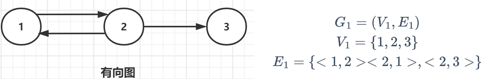
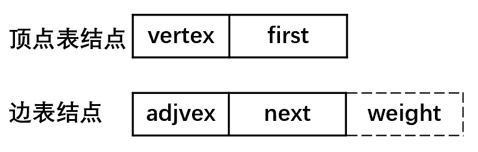
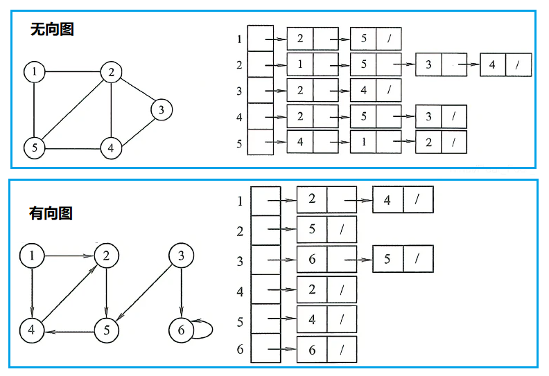

# 图概述

- 图（Graph）是由 顶点的有穷非空集合V ( G ) 和顶点之间 边的集合E ( G ) 组成，即 G = ( V , E ) 。其中，G表示图，V是图G中顶点的集合，E是图G中边的集合。

<table>
    <tr>
        <td width="10%">顶点 V</td>
        <td width="90%"></td>
    </tr>
    <tr>
        <td>边 E</td>
        <td>边可以有方向（关系）</td>
    </tr>
    <tr>
        <td>路径</td>
        <td>一组顶点和边的组合</td>
    </tr>
</table>

| 图的类型 | 说明                                                         |
| -------- | ------------------------------------------------------------ |
| 有向图   | 边是有方向的，E中的元素是有序的<br /> |
| 无向图   | 边是没有方向的，E中的元素是无序的                            |

| 图类型 | 说明                                                         |
| ------ | ------------------------------------------------------------ |
| 简单图 | 不存在重复边<br />不存在顶点到自身的边                       |
| 多重图 | 图中某两个结点之间的边数多于一条<br />允许顶点通过同一条边和自己关联（即存在自环和平行）<br /> |

| 完全图<br />（简单完全图） | 说明                                                         |
| -------------------------- | ------------------------------------------------------------ |
| 无向完全图                 | 任意两个顶点之间都存在边。<br />n个顶点，$\frac{n(n-1)}{2}$条边。 |
| 有向完全图                 | 任意两个顶点之间都存在互为相反的两条弧。<br />n个顶点，$n(n-1)$条边。<br /> |

- 子图：设G(V,E)、G'(V',E')，V'是V的子集，E'是E的子集，则G'是G的子图。并非V和E的任何子集都能构成G的子图，有可能不是图，即E的子集中的某些边关联的顶点可能不在这个V的子集中。
- 若有满足V(G')=V(G)，则称该子图为G的生成子图。

| 术语           | 说明                                                         |
| -------------- | ------------------------------------------------------------ |
| 邻接<br />依附 | 对于任意两个顶点$v_i、v_j$，若存在边$(v_i，v_j)$<br />无向图，顶点$v_i、v_j$互为邻接点（adjacent）。<br />有向图，顶点$v_i$邻接到顶点$v_j$（顶点$v_j$是顶点$v_i$的邻接点），且弧$<v_i，v_j>$依附于顶点$v_i、v_j$。 |
| 度             | 无向图，顶点v的度：依附于该顶点的边的条数（$TD(v)_{无向图} = 2E$）。 |
| 入度<br />出度 | 有向图，入度(弧头)：以顶点v为终点的有向边的数目：$ID(v)$。 出度(弧尾)：以顶点v为起点的有向边的数目：$OD(v)$。<br /> |
| 权<br />网     | 权重：在一个图中，每条边都可以标上具有某种含义的数值。<br />网：带权图。 |
| 路径           | 顶点Vp到顶点Vq之间的一条路径：（$ V_p,V_{i1},...,V_{im},V_{q} $）。<br />路径长度：路径上边的数目。<br />简单路径：在路径序列中，顶点不重复出现的路径。 |
| 回路（环）     | 第一个顶点和最后一个顶点相同的路径。<br />若一个图有n个顶点，并且有大于n-1条边，则此图一定有环。<br />简单回路：除第一个顶点和最后一个顶点外，其余顶点不重复出现的回路。 |
| 距离           | 从顶点u出发到顶点v的最短路径的长度。<br />若从u到v根本不存在路径，则记该距离为无穷。 |

> 有向树：一个顶点的入度为0，其余顶点的入度均为1的有向图。

- 稀疏图的判断条件：$|E| < |V|\log_2^{|V|}$。

## 连通

| 连通                     |                                                              |
| ------------------------ | ------------------------------------------------------------ |
| 连通图<br />（无向图）   | 连通：无向图中，若从顶点v到顶点w有路径存在。 <br />连通图：若图G中任意两个顶点都是连通的，则称图G为连通图，否则称为非连通图。若一个图有n个顶点，并且边数小于n − 1，则此图必是非连通图。<br />连通分量：极大连通子图是无向图的连通分量，要求该连通子图包含其所有的边。<br />极小连通子图：既要保持图连通又要使得边数最少的子图。<br /> |
| 强连通图<br />（有向图） | 强连通：有向图中，若从顶点v到顶点w、从顶点w到顶点v都有路径存在。<br />强连通图：图中任意两个顶点都是强连通的。<br />强连通分量：有向图的极大强连通子图。 |

| 连通子图                       | 说明                                                         |
| ------------------------------ | ------------------------------------------------------------ |
| 极大连通子图<br />（连通分量） | 1. 连通图只有一个极大连通子图，就是它本身。<br/>2. 非连通图有多个极大连通子图。<br/>   - 非连通图的极大连通子图叫做连通分量，每个分量都是一个连通图。<br/>3. 如果此时加入任何一个不在 图的点集 中的点都会导致它不再连通。 |
| 极小连通子图<br />（生成树）   | 1. 连通图的生成树是包含图中全部顶点的一个极小连通子图，而同一个连通图可以有不同的生成树。（极小连通子图只存在于连通图中）（只要能连通图的所有顶点而又不产生回路的任何子图都是它的生成树）<br/>2. 若图中顶点数为n，则它的生成树含有n-1条边，若砍去它的一条边，则会变成非连通图，若加上一条边则会形成一个回路。<br />3. 生成森林：在非连通图中，连通分量的生成树构成了非连通图的生成森林。 |

# 图的数据结构

## 邻接表

- 边表：对图G中的每个顶点V建立一个单链表，第i个单链表中的结点表示依附于顶点$V_i$的边。
  - 出边表：对于有向图：是以$V_i$为尾的弧。

| 结点       | 域                                                           |
| ---------- | ------------------------------------------------------------ |
| 顶点表结点 | data：顶点域 <br />firstarc：指向第一条邻接边的指针域        |
| 边表结点   | adjvex：邻接点域<br />nextarc：指向下一条邻接边的指针域 <br />weight：权值信息的数据域 |

 

 

1. 所需的存储空间：（稀疏图：采用邻接表以节省存储空间）
   - 无向图：$O(|V|+2|E|)$。
   - 有向图：$O(∣V∣+∣E∣)$。
2. 找出顶点的所有邻边：
   - 邻接表：只需要读取该结点的邻接表。
   - 邻接矩阵：需要扫描一行，花费的时间为$O(n)$。

> 若要确定给定的两个顶点间是否存在边：
>
> - 邻接矩阵中可以立刻查到。
> - 邻接表中则需要在相应结点对应的边表中查找另一结点，效率较低。

3. 有向图的邻接表：求一个给定顶点的出度只需计算其邻接表中的结点个数，但求其顶点的入度则需要遍历全部的邻接表。
   - 逆邻接表：加速求解给定顶点的入度。
4. 图的邻接表表示并不唯一，因为在每个顶点对应的单链表中，各边结点的链接次序可以是任意的，它取决于建立邻接表的算法及边的输入次序。

```java
/**
 * 1. 定义一个Node[] 数组，用来存放这几条链表
 * 2. 每个链表的头存放在该数组中，并且链表中的每一个结点均是表示和头结点存在边（而不是路径）
**/
public class AdjacencyList {

    class VexNode {
        public char data; //数值
        public EdgeNode firstEdge = null; //边
    }

    class EdgeNode {
        public EdgeNode preEdge = null; //前一个边
        public EdgeNode nextEdge = null; //后一个边
        public VexNode vex = null; //终点

    }

    private VexNode[] list = new VexNode[5];

    public void init(int nodeNumber) {}
}
```

### 十字链表

- 将邻接表（以入边连接）和逆邻接表（以出边连接）结合。

**结构为：**

- 顶点表结点结构为：数据域data、入边表头指针firstIn、出边表头指针firstOut
- 边表结点结构为：弧起点在顶点表的下标tailVex、弧终点在顶点表的下标headVex、入边表指针域headLink（指向终点相同的下一条边）、出边表指针域tailLink（指向启点相同的下一条边）、权值域weight（可选）

 

```java
public class CrossLinkedList {
    //顶点表结点
    class VexNode {
        int data;
        EdgeNode firstIn;
        EdgeNode firstOut;
    }

    //边表结点
    class EdgeNode {
        VexNode tailVex;
        VexNode headVex;
        EdgeNode headLink;
        EdgeNode tailLink;
        int weight = -1; //权值
    }

    VexNode[] list = null; //存放顶点的数组

    public void creat(int number) {}
}
```

### 邻接多重表

 

 

```java
public class DoubelLinkedList {
    class VexNode {
        int data;
        EdgeNode firstOut;
    }

    class EdgeNode {
        VexNode headVex;
        VexNode tailVex;
        EdgeNode headLink;
        EdgeNode tailLink;
    }

    VexNode[] list = null;

    public void create(int number) {}
}
```

## 邻接矩阵

- 邻接矩阵(Adjacency Matrix) ：一个一维数组存储图中顶点信息，一个二维数组(邻接矩阵)存储图中的边或弧的信息。

 

```java
class GraphMatrix {
    static final int MAXNUM = 20; //最大顶点数
    static final int MAXVALUE = 65535; //权值总和最大值
    char[] vertex = new char[MAXNUM];//保存顶点数据
    int graphType; //图的类型：0无向图，1有向图
    int vertexNum; //顶点数量
    int edgeNum; //边数量
    int[][] edgeWeight = new int[MAXNUM][MAXNUM];//保存顶点的边信息
    int[] isTrav = new int[MAXNUM];//遍历标识
}
```

### 边集数组

| 边集数组（一维数组） | 说明                                                         |
| -------------------- | ------------------------------------------------------------ |
| 顶点数组             | 存储顶点的信息                                               |
| 边数组               | 存储边的信息<br />每个数据元素由一条边的起点下标(begin)、 终点下标(end)和权(weight)组成 |


 

### 关联矩阵
