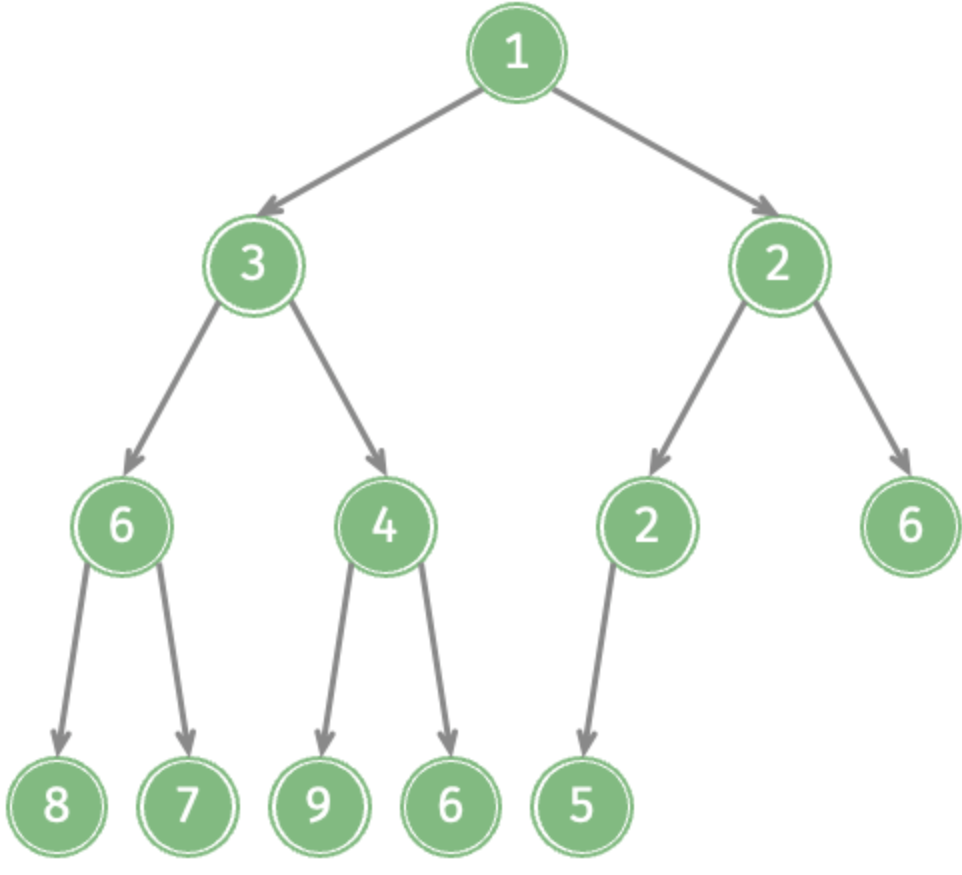
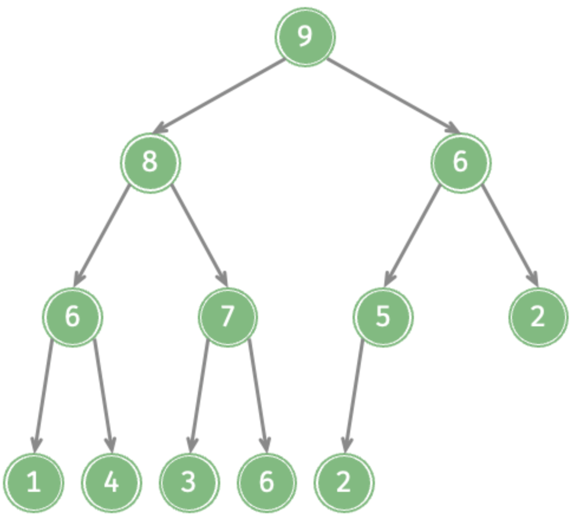
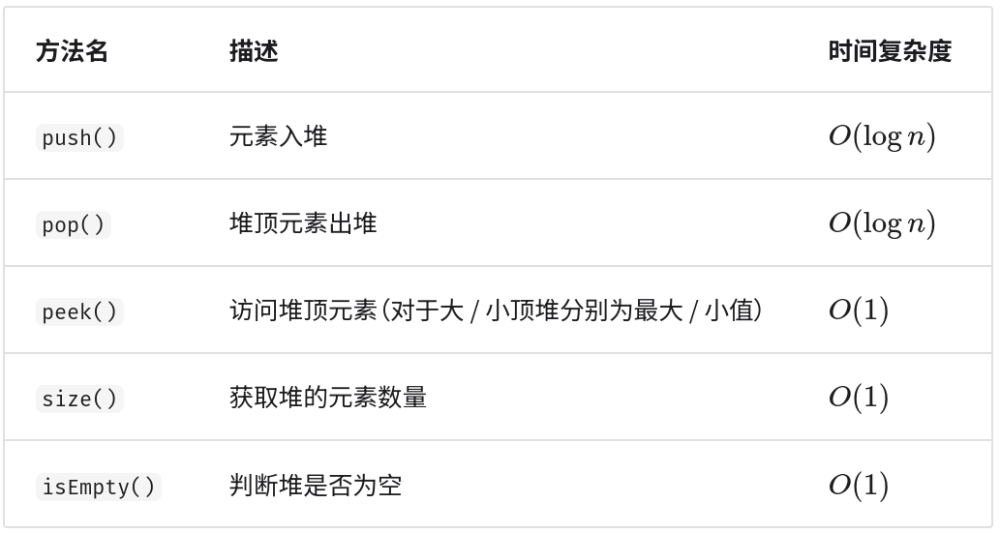

堆的基本性质

- 基于数组实现的堆是一种满足特定条件的完全二叉树，主要可分为两个类型：

<table>
    <tr>
        <th width="50%" align="center">小顶堆 min heap</th>
        <th width="50%" align="center">大顶堆 max heap</th>
    </tr>
    <tr>
        <td align="center">任意节点的值&le;其子节点的值</td>
        <td align="center">任意节点的值&ge;其子节点的值</td>
    </tr>
    <tr>
        <td align="center"></td>
        <td align="center"></td>
    </tr>
</table>

- 堆作为完全二叉树的一个特例，具有以下特性：

1. 最底层节点靠左填充，其他层的节点都被填满。
2. 将堆的根节点称为“堆顶”，将底层最靠右的节点称为“堆底”。
3. 对于大顶堆（小顶堆），堆顶元素（根节点）的值是最大（最小）的。

- 堆通常用于实现优先队列（priority queue），大顶堆相当于元素按从大到小的顺序出队的优先队列。

 

