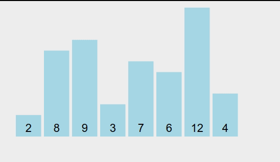
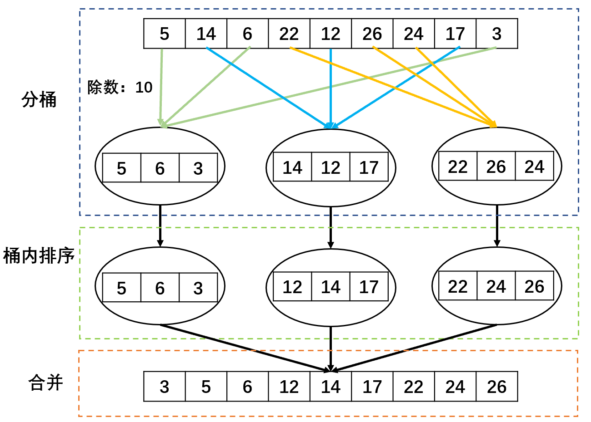

# 排序算法

| 排序算法 | 平均时间复杂度 | 最好           | 最坏           | 空间复杂度   | 稳定性 |
| -------- | -------------- | -------------- | -------------- | ------------ | ------ |
| 冒泡排序 | $O(n^2)$       | $O(n)$         | $O(n^2)$       | $O(1)$       | 稳定   |
| 快速排序 | $O(n\log_2^n)$ | $O(n\log_2^n)$ | $O(n^2)$       | $O(log_2^n)$ | 不稳定 |
| 插入排序 | $O(n^2)$       | $O(n)$         | $O(n^2)$       | $O(1)$       | 稳定   |
| 希尔排序 | $O(n^{1.3})$   | $O(n)$         | $O(n\log_2^n)$ | $O(1)$       | 不稳定 |
| 选择排序 | $O(n^2)$       | $O(n^2)$       | $O(n^2)$       | $O(1)$       | 不稳定 |
| 堆排序   | $O(n\log_2^n)$ | $O(n\log_2^n)$ | $O(n\log_2^n)$ | $O(1)$       | 不稳定 |
| 归并排序 | $O(n\log_2^n)$ | $O(n\log_2^n)$ | $O(n\log_2^n)$ | $O(n)$       | 稳定   |
| 桶排序   | $O(n+k)$       | $O(n+k)$       | $O(n+k)$       | $O(n+k)$     | 稳定   |
| 计数排序 | $O(n+k)$       | $O(n+k)$       | $O(n+k)$       | $O(k)$       | 稳定   |
| 基数排序 | $O(nk)$        | $O(nk)$        | $O(nk)$        | $O(n+k)$     | 稳定   |

## 交换类

### 冒泡排序

- 从前往后把大元素往后调（或 从后向前把小元素往前调），最后一个数只能换一次位置。

 

| 排序                 | 冒泡排序                                             |
| -------------------- | ---------------------------------------------------- |
| 时间复杂度<br />T(n) | 平均：$O(n^2)$<br />最好：$O(n)$<br />最坏：$O(n^2)$ |
| 空间复杂度<br />O(n) | $O(1)$                                               |
| 稳定性               | 稳定                                                 |

```java
public int[] bubblingSort(int[] arr) {
    for (int i = 0; i < arr.length; i++) {
        for (int j = 0; j < i; j++) {
            if (arr[j] > arr[j + 1]) {
                double temp = arr[j];
                arr[j] = arr[j + 1];
                arr[j + 1] = temp;
            }
        }
    }

    return arr;
}
```

### 快速排序

1. 将序列变成两个部分：序列左边全部小于一个数，序列右面全部大于一个数。
2. 递归，将左、右序列各自排序。

| 排序                 | 快速排序                                                     |
| -------------------- | ------------------------------------------------------------ |
| 思想                 |                                                              |
| 时间复杂度<br />T(n) | 平均：$O(n\log_2^n)$<br />最好：$O(n\log_2^n)$<br />最坏：$O(n^2)$ |
| 空间复杂度<br />O(n) | $O(log_2^n)$                                                 |
| 稳定性               | 不稳定                                                       |

```java
public static void quick(int[] arr, int left, int right) {
    //选择排序的范围 下标
    int low = left;
    int high = right;

    //判断是否到达停止条件，是否越界
    if (low > high) {
        return;
    }

    int point = arr[low]; //额外空间，要求左边都小于他，同时右边都大于

    //完成一轮大小互换：将小于point的都放在左边，大于的放在右边
    while (low < high) {
        //找到的第一个小于point的则退出循环，并将该数覆盖arr[low]，即目前point所在的位置。
        //否则继续查找。
        while (low < high && arr[high] >= point) {
            high--;
        }
        arr[low] = arr[high];
        //找到的第一个大于point的则退出循环，并将该数覆盖arr[high]（此时的arr[high]在被覆盖前已经覆盖了之前的arr[low]）。
        //否则继续查找。
        while (low < high && arr[low] <= point) {
            low++;
        }
        arr[high] = arr[low];
    }

    //重置
    arr[low] = point;

    //将一轮大小互换之后的，继续按point分段再次排序，直到达到停止条件。 
    quick(arr, left, low - 1);
    quick(arr, low + 1, right);
}
```

## 插入类

### 直接插入排序

1. 选取当前位置（该位置前的都有序）插入到前面合适的位置
2. 循环不变式

 

| 排序                 | 直接插入排序                                               |
| -------------------- | ---------------------------------------------------------- |
| 思想                 | 之前的元素已经排序好了，只需要将当前元素插入到合适位置即可 |
| 时间复杂度<br />T(n) | 平均：$O(n^2)$<br />最好：$O(n)$<br />最坏：$O(n^2)$       |
| 空间复杂度<br />O(n) | $O(1)$                                                     |
| 稳定性               | 稳定                                                       |

```java
public int[] insertion(int[] arr) {
    for (int i = 0; i < arr.length; i++) {
        int key = arr[i];
        int j = i - 1;
        while (j >= 0 && arr[j] > key) { // arr[j] > key 对应升序（ASC）
            arr[j + 1] = arr[j];
            j--;
        }
        arr[j + 1] = key; // 此处的j+1是对j--的弥补
    }
    return arr;
}
```

### 希尔排序

- 首先将序列非线性分割，按照某个数取模，各组分别进行直接插入排序。每次插入都会使得序列变得更加有序，代价越来越小。数据量和有序性使得序列前后之间小的尽量在前面，大的尽量在后面，进行若干次的分组别计算，最后一组即是一趟完整的直接插入排序。

 

| 排序                 | 希尔排序                                                     |
| -------------------- | ------------------------------------------------------------ |
| 时间复杂度<br />T(n) | 平均：$O(n^{1.3})$<br />最好：$O(n)$<br />最坏：$O(n\log_2^n)$ |
| 空间复杂度<br />O(n) | $O(1)$                                                       |
| 稳定性               | 不稳定                                                       |

```java
public class HillTest {
    public static void hill(int[] arr) {
        for (int i = arr.length; i >= 1; i /= 2) { //分组排序
            for (int j = i; j < arr.length; j++) { 
                for (int k = j - i; k >= 0; k -= i) { //k和i之间保证始终相差i的倍数
                    if (arr[k] > arr[i]) {
                        int temp = arr[i];
                        arr[i] = arr[k];
                        arr[k] = temp;
                    }
                }
            }
        }
    }
}
```

## 选择类

### 简单选择排序

1. 首先在未排序序列中找到最小（大）元素，存放到排序序列的起始位置。
2. 再从剩余未排序元素中继续寻找最小（大）元素，放到已排序序列的末尾。
3. 以此类推，直到所有元素均排序完毕。

| 排序                 | 简单选择排序                                           |
| -------------------- | ------------------------------------------------------ |
| 时间复杂度<br />T(n) | 平均：$O(n^2)$<br />最好：$O(n^2)$<br />最坏：$O(n^2)$ |
| 空间复杂度<br />O(n) | $O(1)$                                                 |
| 稳定性               | 不稳定                                                 |

```java
public static void selectSort(int[] arr) {
    for (int i = 0; i < arr.length; i++) {
        int minIndex = i; //最小值相应的索引
        for (int j = i + 1; j < arr.length; j++) {
            if (arr[j] < arr[minIndex]) {
                minIndex = j;
            }
        }
        if (minIndex != i) {
            int temp = arr[minIndex];
            arr[minIndex] = arr[i];
            arr[i] = temp;
        }
    }
}
```

### 堆排序

1. 建堆，从下往上、从第一个非叶子节点开始判断交换下移。
2. 下移的节点需要再次和其下移之后的节点判断交换下移，直到不下移。

 

| 堆     | 说明                                                   |
| ------ | ------------------------------------------------------ |
| 大根堆 | 堆的最大值在根节点，所有节点的值都大于其孩子节点的值。 |
| 小根堆 | 堆的最小值在根节点，所有节点的值都小于其孩子节点的值。 |

 

| 排序                 | 堆排序                                                       |
| -------------------- | ------------------------------------------------------------ |
| 时间复杂度<br />T(n) | 平均：$O(n\log_2^n)$<br />最好：$O(n\log_2^n)$<br />最坏：$O(n\log_2^n)$ |
| 空间复杂度<br />O(n) | $O(1)$                                                       |
| 稳定性               | 不稳定                                                       |

```java
public class HeadSortDemo {

    public static void shiftDown(int[] arr, int curIndex, int length) {
        //获取子结点的坐标
        int leftIndex = curIndex * 2 + 1;
        int rightIndex = curIndex * 2 + 2;
        //比较结点大小并交换：使得右子结点>左子结点>当前结点 小根堆
        //因为是使用数组储存，所以下标为0~length-1
        if (leftIndex >= length) {//判断是否超过范围，即当前结点是否为叶子结点
            return;
        } else if (rightIndex < length && arr[rightIndex] < arr[curIndex] && arr[rightIndex] < arr[leftIndex]) { //判断是否存在右子结点，以及比较结点大小
            int temp = arr[rightIndex];
            arr[rightIndex] = arr[curIndex];
            arr[curIndex] = temp;
            shiftDown(arr, rightIndex, length);
        } else if (arr[leftIndex] < arr[curIndex]) {
            int temp = arr[leftIndex];
            arr[leftIndex] = arr[curIndex];
            arr[curIndex] = temp;
            shiftDown(arr, leftIndex, length);
        }
    }

    public static void createHeap(int[] arr) {
        //排序为小根堆
        for (int i = arr.length / 2; i >= 0; i--) {
            //arr.length / 2 堆的非叶子结点数 = 堆的总长度 / 2
            shiftDown(arr, i, arr.length);
        }
    }

    public static void heapSort(int arr[]) {
        int[] tempArr = new int[arr.length]; //临时存放结果的空数组
        createHeap(arr);
        //将（小根堆）堆顶元素放入tempArr，依次将末尾元素置为堆顶
        for (int i = 0; i < arr.length; i++) {
            tempArr[i] = arr[0];
            arr[0] = arr[arr.length - 1 - i];
            shiftDown(arr, 0, arr.length - i);
        }
        //将排序好的结果放入arr中
        for (int i = 0; i < arr.length; i++) {
            arr[i] = tempArr[i];
        }
        System.out.println("堆排序：" + Arrays.toString(arr));
    }
}
```

## 归并排序

- 基于分治进行归并：二路归并、多路归并。

1. 非递归：局部—>整体。
2. 递归：整体—>局部—>整体。

 

| 排序                 | 归并排序                                                     |
| -------------------- | ------------------------------------------------------------ |
| 时间复杂度<br />T(n) | 平均：$O(n\log_2^n)$<br />最好：$O(n\log_2^n)$<br />最坏：$O(n\log_2^n)$ |
| 空间复杂度<br />O(n) | $O(n)$                                                       |
| 稳定性               | 稳定                                                         |

```java
public static void mergeSort(int[] arr, int left, int right) {
    int mid = (left + right) / 2; //分为左右两个区间进行分治
    if (left < right) {
        mergeSort(arr, left, mid); //处理左区间
        mergeSort(arr, mid + 1, right); //处理右区间
        merge(arr, left, mid, right); //合并
    }
}

public static void merge(int[] arr, int left, int mid, int right) {
    int leftIndex = left, rightIndex = mid + 1; //分别对mid左边和右边进行处理
    int[] tempArr = new int[right - left + 1]; //临时存放的空数组
    int tempIndex = 0;
    //进行排序，从小到大
    while (leftIndex <= mid && rightIndex <= right) {
        if (arr[leftIndex] <= arr[rightIndex]) {
            tempArr[tempIndex++] = arr[leftIndex++];
        } else {
            tempArr[tempIndex++] = arr[rightIndex++];
        }
    }
    //对剩下越界的分别进行赋值，加入到tempArr的末尾
    while (leftIndex <= mid) {
        tempArr[tempIndex++] = arr[leftIndex++];
    }
    while (rightIndex <= right) {
        tempArr[tempIndex++] = arr[rightIndex++];
    }
    //将排序好的tempArr重新赋值给arr相应下标范围
    for (int i = 0; i < tempIndex; i++) {
        arr[left + i] = tempArr[i];
    }
}
```

## 桶类

### 桶排序

- 空间换取时间，将待排序的序列分到若干个桶中，每个桶内的元素再进行个别排序。

1. 对排序元素进行整除，放入相应的桶中，选择的除数应尽量使各个桶内的元素数量均匀。
2. 对各个桶内部选择排序算法进行排序。
3. 按桶的顺序将各个排序之后的桶合并。

 

| 排序                 | 桶排序                                                 |
| -------------------- | ------------------------------------------------------ |
| 时间复杂度<br />T(n) | 平均：$O(n+k)$<br />最好：$O(n+k)$<br />最坏：$O(n+k)$ |
| 空间复杂度<br />O(n) | $O(n+k)$                                               |
| 稳定性               | 稳定                                                   |

- 假设每个桶内部使用的排序算法为快速排序：

1. 每个桶内的时间复杂度：$T(n)=\frac{n}{m} \log_2^{\frac{n}{m}}$。

2. m个桶的总时间复杂度为`m(n/m)log(n/m) = n(log n-log m)`.

- 最终桶排序的时间复杂度为：`O(n)+O(n*(log n- log m)) = O(n+n*(log n -log m))` 其中m为桶的个数，即O(n+c)，其中c=n\*(log n -log m);

```java
public static void bucketSort(int[] arr) {
    List[] bukects = new ArrayList[5]; //使用5个桶 List
    //初始化桶
    for (int i = 0; i < bukects.length; i++) {
        bukects[i] = new ArrayList<Integer>();
    }
    //将待排序序列放入桶中
    for (int i = 0; i < arr.length; i++) {
        int index = arr[i] / 10; // 入桶的规则
        bukects[index].add(arr[i]);
    }
    //每个桶内部排序
    for (int i = 0; i < bukects.length; i++) {
        bukects[i].sort(null); //快排
        for (int j = 0; j < bukects[i].size(); j++) {
            System.out.println(bukects[i].get(j) + " ");
        }
    }
}
```

### 计数排序

- 牺牲空间换取时间，适用于数据范围波动不是很大，数据相对比较集中。

 

| 排序                 | 计数排序                                               |
| -------------------- | ------------------------------------------------------ |
| 时间复杂度<br />T(n) | 平均：$Ο(n+k)$<br />最好：$Ο(n+k)$<br />最坏：$Ο(n+k)$ |
| 空间复杂度<br />O(n) | $O(k)$                                                 |
| 稳定性               | 稳定                                                   |

```java
public static void count(int[] arr) {
    //存放最小值和最大值
    int min = Integer.MAX_VALUE, max = Integer.MIN_VALUE;
    for (int i = 0; i < arr.length; i++) {
        if (arr[i] < min) {
            min = arr[i];
        }
        if (arr[i] > max) {
            max = arr[i];
        }
    }
    //桶内计数：count[] 内存放的是该数存在的次数
    int count[] = new int[max - min + 1]; //计算出桶的数量为：max - min + 1；对每个数放一个桶
    for (int i = 0; i < arr.length; i++) {
        count[arr[i] - min]++; //相应下标的数的个数增加
    }
    //将计数排序的放入arr原数组
    int index = 0; //放入arr时的下标
    for (int i = 0; i < count.length; i++) {
        while (count[i]-- > 0) { //存在1个以上的该数，则依次取出放入原数组arr
            arr[index++] = i + min; //
        }
    }
}
```

### 基数排序（卡片排序）

- 基数排序多次利用计数排序，并不是将一个整体分配到一个桶中，而是将自身拆分成一个个组成的元素，每个元素分别顺序分配放入桶中、顺序收集，并对每个位置都进行过分配、收集。（基数排序并不需要交换，也不需要比较，就是多次分配、收集得到结果。 
- 保证和相同位进行比较：MSD（最高位优先 Most Significant Digit first）、LSD（最低位优先 Least Significant Digit first）。

 

 

 

| 排序                 | 基数排序                                            |
| -------------------- | --------------------------------------------------- |
| 时间复杂度<br />T(n) | 平均：$O(nk)$<br />最好：$O(nk)$<br />最坏：$O(nk)$ |
| 空间复杂度<br />O(n) | $O(n+k)$                                            |
| 稳定性               | 稳定                                                |


# 查找算法

- 平均查找长度：

 

<details>
    <summary>二分查找的平均查找长度：长度为12的有序表采用顺序存储结构，在等概率的条件下：</summary>
    <br/>
    查找成功： (1*2 + 2*2 + 3*4 + 4*5) / 12 = 37/12<br/>
    查找失败： (3*3 + 4*10) / 13  = 49/13
</details>

## 顺序查找

```java
public static int search(int arr[],int data){
    for(int i = 0;i < arr.length;i++){
        if(arr[i] == data){
            return i;
        }
    }
    return -1;
}
```

## 二分查找

- 二分查找要求有序的线性结构，需要先排序。

```java
public static int search(int[] arr, int data, int start, int end) {
    //先进行排序
    Arrays.sort(arr);
    int mid;
    while (start <= end) {
        mid = (start + end) / 2;
        if(arr[mid]==data){
            return mid;
        }else if (arr[mid] > data){
            end = mid -1;
        } else {
            start = mid +1;
        }
    }
    return -1;
}
```

