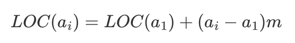

# 数组概述

- 数组（顺序表）：用一段地址连续的存储单元依次存储线性表的数据元素。

> 内存的碎片化问题

- 设顺序表的每个元素占用m个存储单元，则第ai个元素的存储地址为：（与第a1个元素的存储位置关系）
- 随机存取结构：只要确定了顺序表的起始地址（基地址），计算任意一个元素的存储地址的时间是相同的。

# 稀疏数组

- 稀疏数组记录数组一共有几行几列，有多少个不同的值，并把具有不同值的元素的行、列、值记录在一个小规模的数组。一个数组中大部分元素为０，或同一个值时（大多数的数据是重复的、无意义的），应该转换为稀疏数组。

 
