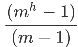
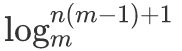

# 树的基本性质

- 树是n个节点的有限集合，一个树有且只有一个根节点（一个节点也可以是树），每个节点只有一个父节点，一个节点可以有多个子节点（子树）。

1. 树中的节点数等于所有节点的度数加1。任意一棵树，若节点数量为n，则边的数量为n-1。
2. 度为m的树中第i层上至多有m(i-1)个节点（i &ge; 1）。
3. 高度为h的m叉树至多有个节点。
4. 具有n个节点的m叉树的最小高度为。

<table>
    <tbody>
        <tr>
            <td width="15%">度</td>
            <td>节点的度：某节点拥有子树的个数。
                 树的度：各节点度的最大值。
            </td>
        </tr>
        <tr>
            <td rowspan="2">节点</td>
            <td>叶子节点（终端节点）：度为0的节点。 
                 分支节点：度不为0的节点。
            </td>
        </tr>
        <tr>
            <td>孩子节点：某节点的子树的根节点。 
                 双亲节点：相对孩子节点而言。 
                 兄弟节点：具有同一个双亲的孩子节点。
            </td>
        </tr>
        <tr>
            <td>祖先、子孙</td>
            <td>若从节点x到节点y存在一条路径，则节点x是节点y的祖先，节点y是节点x的子孙。</td>
        </tr>
        <tr>
            <td>路径</td>
            <td>路径长度：路径上经过的边数。</td>
        </tr>
        <tr>
            <td>节点的层数</td>
            <td>根节点的层数为1。</td>
        </tr>
        <tr>
            <td>树的深度</td>
            <td>树中所有节点的最大层数。</td>
        </tr>
        <tr>
            <td>树的宽度</td>
            <td>树中每一层节点个数的最大值。</td>
        </tr>
    </tbody>
</table>

# 树的节点结构

## 双亲表示法

- 双亲表示法：假设以一组连续空间存储树的节点，同时在每个节点中，附设一个指示器指示其双亲节点到链表中的位置。

<table>
    <tr>
        <td width="20%">Node[] nodeList</td>
        <td colspan="2">存储的连续空间，存放树的节点</td>
    </tr>
    <tr>
        <td rowspan="3">Node node</td>
        <td colspan="2">树节点</td>
    </tr>
    <tr>
        <td width="15%">data</td>
        <td width="65%">数据域</td>
    </tr>
    <tr>
        <td>parent</td>
        <td>指针域，指向该节点的双亲在nodeList中的下标</td>
    </tr>
</table>

 

## 孩子表示法

- 孩子表示法：

1. 把每个节点的孩子节点排列起来，以单链表作存储结构，则n个节点有n个孩子链表，如果是叶子节点则此单链表为空。
2. 然后n个头指针又组成一个线性表，采用顺序存储结构，存放进一个一维数组中。

<table>
    <tr>
        <td width="10%">表头数组</td>
        <td width="20%">Head[] childList</td>
        <td colspan="2">存放表头节点</td>
    </tr>
    <tr>
        <td rowspan="2">表头节点</td>
        <Td rowspan="2">Head</Td>
        <td width="10%">data</td>
        <td width="60%">数据域，存放孩子节点的数据信息</td>
    </tr>
    <tr>
        <td>firstChild</td>
        <td>头指针域，指向存储该节点的孩子节点的头指针</td>
    </tr>
    <tr>
        <td rowspan="2">孩子节点</td>
        <td rowspan="2">Child</td>
        <td>child</td>
        <td>孩子链表的孩子节点（表头数组中的索引）</td>
    </tr>
    <tr>
        <td>next</td>
        <td>指向该节点的下一个孩子节点的指针</td>
    </tr>
</table>

  

## 孩子兄弟表示法

 