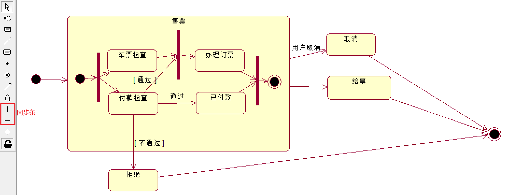
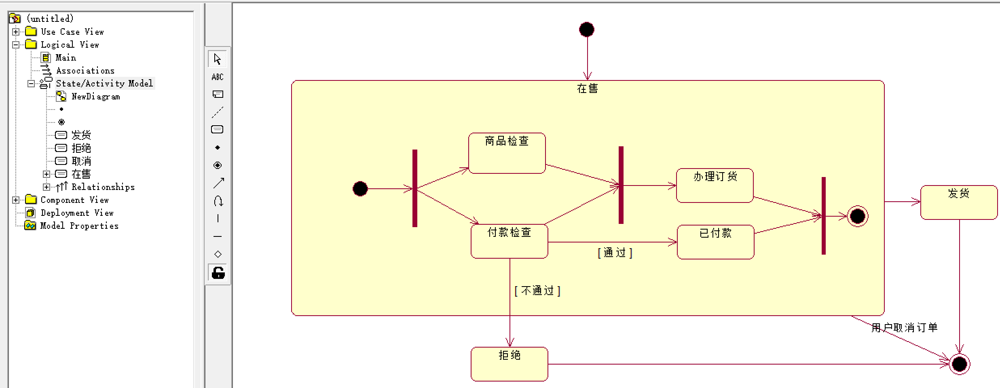
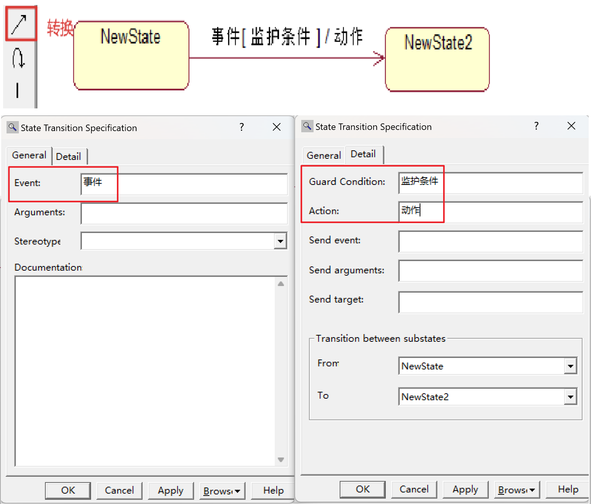
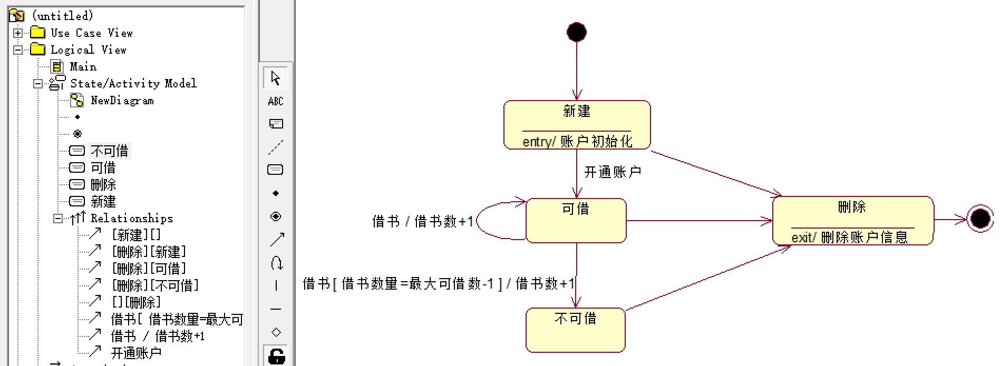

# 状态机视图

- 状态机视图：通过对象的各种状态建立模型来描述对象随时间变化的动态行为。由描述对象状态的一组属性和描述对象变化的动作构成。状态机用状态图来表达。
  - 一个状态机由该对象的各种所处状态以及连接这些状态的符号组成。每个状态对一个对象在其 **生命周期** 中满足某种条件的一个时间段建模。当一个事件发生时，它会触发状态间的转换，导致对象从一种状态转化到另一新的状态。与转换相关的活动执行时，转换也同时发生。
- 对象：
  - 状态机视图以独立的对象为中心，通过不同对象间的相互交互作用来描述系统的行为。
  - 每个对象都拥有自己的状态，通过事件触发改变状态：对象被看作通过事件进行触发并做出相应的动作来与外界的其他对象进行通信的独立实体。
- 事件：任何影响对象状态变化的操作。事件表达了对象可以被使用操作，同时反映了对象状态的变化。
- 状态：状态是使用类的一组属性值来进行标识的，这组属性根据所发生不同的事件进行不同的反应，从而标志对象的不同状态。处于相同状态的对象对同一事件具有相同的反应，处于不同状态下的对象会通过不同的动作对同一事件作出不同的反应。

# 状态图

- 状态图：描述一个对象在其生命周期内的动态行为。

1. 描述状态之间的转换顺序-->事件的执行顺序，避免事件顺序出错。
2. 描述了影响状态的因素，避免非法事件的进入。
3. 描述工作流的分支和汇合。

> 银行账户有三种状态：账户打开状态、透支状态、账户关闭状态。
>
> - 银行账户初始状态是“账户打开状态”，当“客户请求关闭”事件出现时，进入“账户关闭状态”，这是银行账户的终止状态。
> - 当“取款”事件出现，且账户满足“余额小于0”的条件时，银行账户从“账户打开状态”进入“透支状态”。
> - 当“存款”事件出现，且账户满足“余额大于0”的条件时，银行账户从“透支状态”进入“账户打开状态”。
> - 当“检查账户余额”出现，且账户满足“余额小于0且达30天以上”的条件时，银行账户从“透支状态”进入“账户关闭状态”。
>
> 

## 状态机

- 状态机：展示状态和状态转换的图，描述一个对象或一个交互在其生命周期内响应事件所经历的动态序列。
- 状态机包含：状态、转换、事件、活动（动作）。 

## 状态

- 状态：在对象的生命周期中满足某些条件、执行某些活动或等待某些事件时的一个条件或状态。
- 状态包括：名称、进入动作、退出动作、子状态、延迟事件。

| 状态     | 说明                                     |
| -------- | ---------------------------------------- |
| 初始状态 | 伪状态，无监护条件 只能作为转换的源 |
| 终止状态 | 可以存在多个 只能作为转换的目标     |

### 子状态（组合）

| 子状态     | 特征   | 说明                                                         |
| ---------- | ------ | ------------------------------------------------------------ |
| 顺序子状态 | 顺序   | 一个组合状态对应的对象在其生命周期内的任何时刻只能处于一个子状态： 多个子状态之间互斥。 |
| 并发子状态 | 并发条 | 并发工作流的分支和汇合。                                     |

 

> 利用同步机制完善下图，该图是一张采购订单的状态图：
>
> 1. 在售状态是一个复合状态；
> 2. 商品检查和付款检查可以并发进行；
> 3. 付款检查通过后进入已付款状态，不通过进入拒绝状态；
> 4. 商品检查和付款检查都完成后才能进入办理订货状态，如果商品检查先完成，而付款检查还未完成，则商品检查进入等待状态，等到付款检查完成后，才一起进入办理订货状态；
> 5. 办理订货和已付款都完成后才能进入发货状态；
> 6. 在售状态下，用户可以随时取消订单，进入终止态，
>
> 

### 历史状态

- 历史状态：伪状态（初始状态的一种构造型），记住从组合状态中退出时所处的子状态。

 

## 转移

### 转移要素

- 转换：两个状态之间的关系：对象在一个状态中执行一定的动作，并在某个特定事件发生且某个特定条件满足时进入下一个状态。
- 转换包括：源状态、事件触发、监护条件、动作、目标状态。

 

> |      | 空 （指针值=0） | 半满 （0<指针值<1000） | 满 （指针值=1000） |
> | ---- | -------------------- | --------------------------- | ----------------------- |
> | 压入 | 可执行               | 可执行                      | 不可执行                |
> | 弹出 | 不可执行             | 可执行                      | 可执行                  |
>
> 

### 转移类型

| 类型     | 说明                                    |
| -------- | --------------------------------------- |
| 内部转移 | 不导致状态改变 不执行entry、exit动作 |
| 外部转移 |                                         |
| 自转移   | 返回自身状态的转移                      |

| 类型     | 说明             |
| -------- | ---------------- |
| 完成转移 | 有触发器、无条件 |
| 条件转移 | 无触发器、有条件 |

## 动作/活动

- 动作是原子的，活动是由动作组成的非原子的。

| 动作  | 名称     | 说明                                                         |
| ----- | -------- | ------------------------------------------------------------ |
| entry | 入口动作 | 状态的内部初始化、最优先且不可避开                           |
| exit  | 出口动作 | 退出状态时执行 内部活动异常中断                           |
| do    | 内部活动 | 存在外部转移时，do可能不会被执行 do结束 --> 触发转移 外部转移 --> 终止 |

  

## 事件

| 类型     | 说明                                            |
| -------- | ----------------------------------------------- |
| 信号事件 | 异步、对象之间的通信                            |
| 调用事件 | 同步                                            |
| 变化事件 | When(布尔表达式)/动作 When:布尔表达式/动作   |
| 时间时间 | When(时间表达式)/动作 After(时间表达式)/动作 |

**变化事件和监护条件的区别**

- 变化事件：由系统连续测试事件。
- 监护条件：只在触发器事件触发时测试一次。如果监护条件为假，则转换不激活且事件被遗失，条件也不会再被测试。

> 用状态机图描述图书的状态变迁，图书状态如下：
>
> 1. 初始状态为预备流通状态，内部活动是编目；编目完成后从预备流通状态进入流通状态。
> 2. 流通状态是组合状态，包括：在库状态，已预约状态和已借出状态；初始态为在库状态；
> 3. 读者预约后，从在库状态进入已预约状态；取消预约或者超过预约日期时，回到在库状态。
> 4. 借书事件出现时，图书从在馆状态或已预约状态进入到已借出状态；还书事件出现时，回到在馆状态。
> 5. 丢失事件出现时，图书从流通状态进入退出流通状态。
> 6. 终止状态为退出流通状态，出口动作是删除编目信息。
>
>  

> 用状态机图描述借阅者账户的状态变迁，借阅者账户状态如下：
>
> 1. 初始状态为新建状态，入口动作是账户初始化；开通账户事件出现时，进入可借状态。
> 2. 可借状态；借书事件出现时，如果借书数量达到最大可借数，则进入不可借状态，否则还是回到可借状态，借书数+1。
> 3. 不可借状态；还书事件出现时，回到可借状态，借书数-1。
> 4. 删除状态。不管账户处于何种状态，销号事件出现时，均进入删除状态，出口动作为删除账户信息。
>
> 

