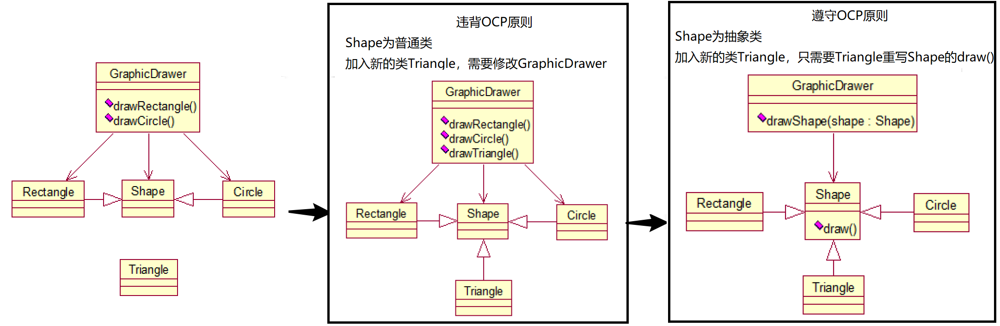
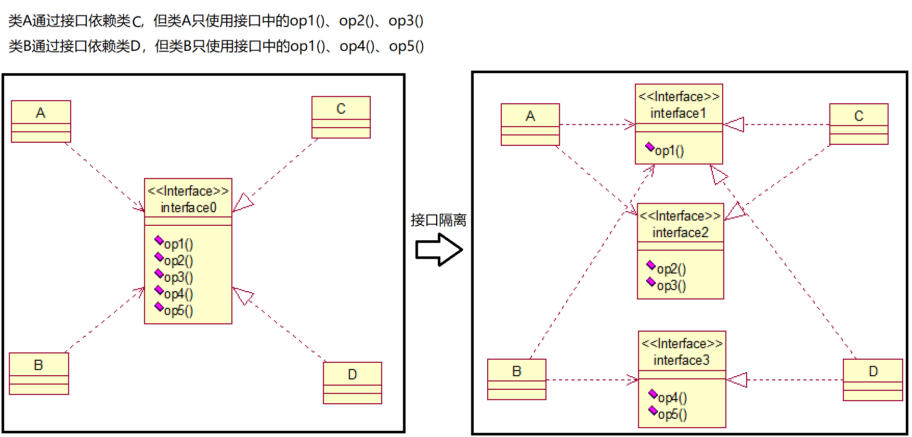
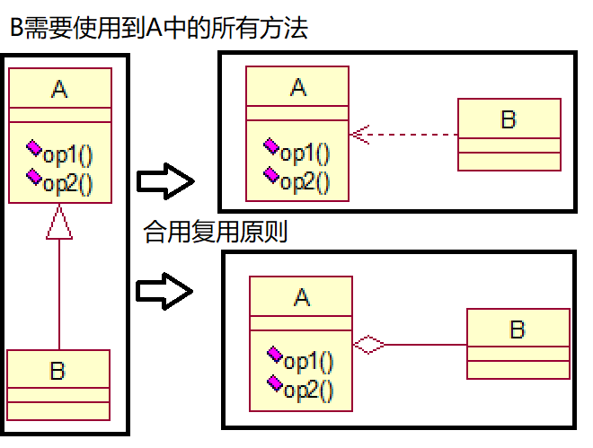

1. 单一职责原则（Single Responsibility）：一个类应该只负责一项职责。如果类的逻辑简单，则方法级别的单一职责原则是被允许的。
2. 开闭原则（Open Close Principle OCP）：对扩展开放，对修改关闭。

3. 里氏代换原则（Liskov Substitution Principle LSP）：任何基类可以出现的地方，子类一定可以出现。 继承复用，只有当衍生类可以替换掉基类，软件单位的功能不受到影响时，基类才能真正被复用，而衍生类也能够在基类的基础上增加新的行为。
   - 子类应避免改变较大的重写，否则子类和父类继承一个更加基础的类（此时关系应为组合、聚合、依赖）。
4. 依赖倒转原则（Dependence Inversion Principle）：高层模块不应该依赖低层模块，依赖于抽象而不依赖于具体。面向接口编程。
   1. 接口依赖传递：方法参数使用接口类型。
   2. 构造器依赖传递：成员变量使用接口类型。
   3. setter()依赖传递：成员变量使用接口类型。
5. 接口隔离原则（Interface Segregation Principle）：一个类对另一个类的依赖应该建立在最小接口上。

6. 迪米特法则（最少知道原则）（Demeter Principle）：对于被依赖的类，尽量将逻辑封装在类的内部，对外除提供public成员外，不泄漏任何信息。只与直接朋友通信、避免非直接朋友。减少不必要的依赖。

> 朋友关系：存在耦合关系的两个对象。
>
> - 直接朋友：成员变量、方法参数、方法返回值中的类。
>
> - 非直接朋友：局部变量中的类。

7. 合成复用原则（Composite Reuse Principle）：尽量使用组合、聚合，而不是继承。

 
