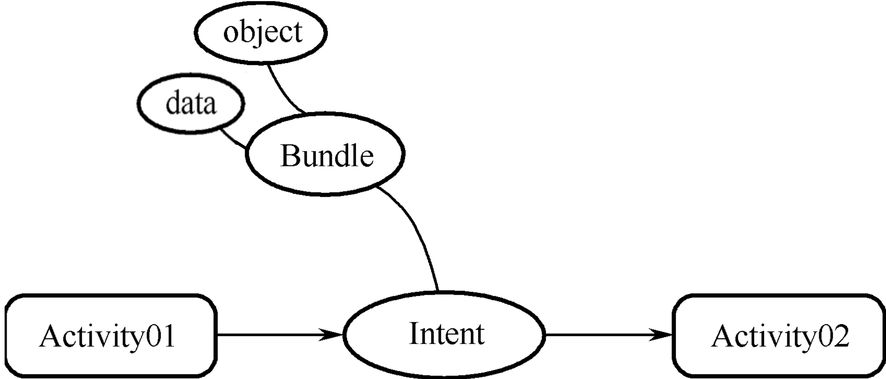
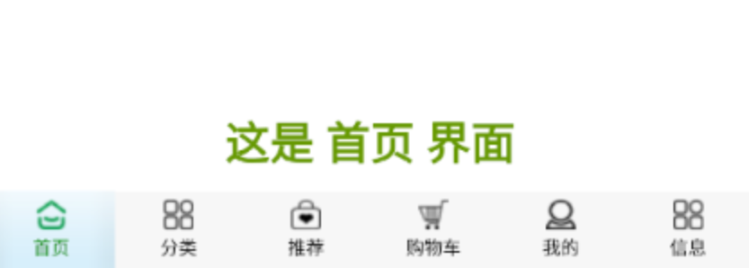
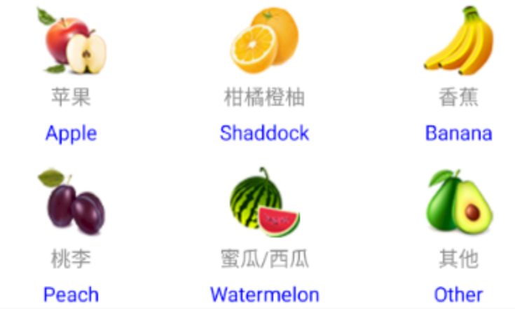
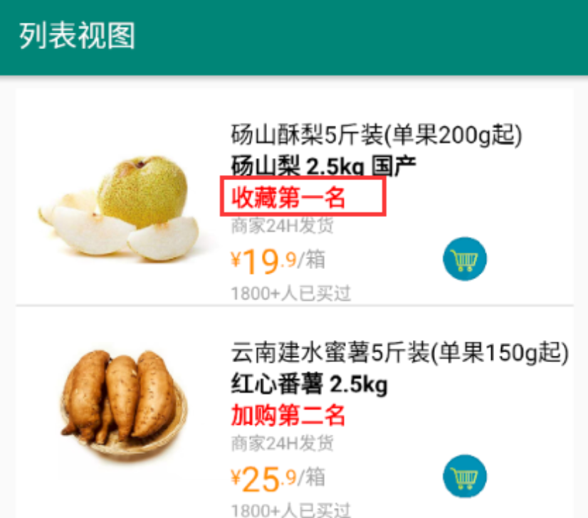
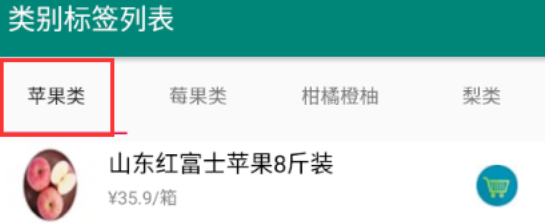

# Android简述

## 平台架构

 

## 项目结构

 

# 界面编程

## AndroidMainifest.xml

- Android界面注册文件

```xml
<?xml version="1.0" encoding="utf-8"?>
<manifest xmlns:android="http://schemas.android.com/apk/res/android"
    package="com.example.dell.mytabhost">

    <application
        android:allowBackup="true"
        android:icon="@mipmap/ic_launcher"
        android:label="@string/app_name"
        android:roundIcon="@mipmap/ic_launcher_round"
        android:supportsRtl="true"
        android:theme="@style/AppTheme">
        <activity android:name=".TabHostActivity">
            <intent-filter>
                <action android:name="android.intent.action.MAIN" />

                <category android:name="android.intent.category.LAUNCHER" />
            </intent-filter>
        </activity>
        <activity android:name=".FirstPageActivity" />
        <activity android:name=".SecondPageActivity" />
        <activity android:name=".ThirdPageActivity" />
        <activity android:name=".FourPageActivity" />
        <activity android:name=".FivePageActivity" />
    </application>

</manifest>
```

## 布局容器

### Constraint Layout 限制布局

| 约束   | 说明                                     |
| :----- | :--------------------------------------- |
| `<<<`  | wrap content，容器跟内容的宽度变化而变化 |
| `---`  | 固定的宽度或高度值                       |
| `-^v-` | match constraint                         |

### LinearLayout 线性布局

<table>
    <tr>
        <th width="20%">属性</th>
        <th width="80%" colspan="2">意义</th>
    </tr>
    <tr>
        <td rowspan="3"><code>android:orientation</code></td>
        <td colspan="2">排列方向</td>
    </tr>
    <tr>
        <td width="20%">vertical</td>
        <td width="60%">垂直</td>
    </tr>
    <tr>
        <td>horizontal</td>
        <td>水平</td>
    </tr>
</table>

```xml
<LinearLayout
              android:id="@+id/myLinearLayout"
              android:orientation="vertical">
	<!--其他的控件元素-->
</LinearLayout>
```

## 基础控件

### View 视图

- 视图文件（View）：此处的视图（View）仅仅是指在App界面上无法直接编辑的控件，即一定程度上的只读。

#### TextView 文本视图

<table>
    <tr>
        <td width="35%">常用的属性</td>
        <td width="10%">意义</td>
        <td width="25%">控制的方法</td>
        <td width="30%">意义</td>
    </tr>
    <tr>
        <td rowspan="2"><code>android:text</code></td>
        <td rowspan="2">文本内容</td>
        <td>getText()</td>
        <td>获取文本内容（String）</td>
    </tr>
    <tr>
        <td>setText()</td>
        <td>设置文本内容（String）</td>
    </tr>
</table>

##### 滚动文本

#### ImageView 图像视图

<table>
    <tr>
        <th width="35%">常用的属性</th>
        <th width="10%">意义</th>
        <th width="25%">控制的方法</th>
        <th width="30%">意义</th>
    </tr>
    <tr>
        <td rowspan="2"><code>app:srcCompat="@drawable/文件前缀"</code></td>
        <td rowspan="2">图像URI</td>
        <td></td>
        <td></td>
    </tr>
    <tr>
        <td></td>
        <td></td>
    </tr>
</table>

#### ImageTextView 图像文本视图

#### AutoCompleteTextView 自动完成文本视图

- AutoCompleteTextVIew：用户在该文本框中输入内容时，`AutoCompleteTextView`会根据已设置的数据源（如数组、数据库查询结果等）动态匹配并显示可能的建议选项列表，用户可以选择列表中的项来快速完成输入

<table>
    <tr>
        <th width="20%">属性</th>
        <th width="80%" colspan="2">意义</th>
    </tr>
    <tr>
        <td><code>android:completionThreshold</code></td>
        <td colspan="2">触发补齐的字符数，默认为2</td>
    </tr>
    <tr>
        <td><code>android:hint</code></td>
        <td>提示信息（相当于placehold）</td>
    </tr>
    <tr>
        <td><code>android:inputType</code></td>
        <td>输入类型</td>
    </tr>
    <tr>
        <td><code>android:maxLines</code>
        </td>
        <td>控制输入框最大显示行数</td>
    </tr>
</table>

```xml
<AutoCompleteTextView
                      android:id="@+id/my_autocomplete"
                      android:completionThreshold="1"
                      android:hint="请输入搜索关键词"
                      android:inputType="text|textAutoComplete"
                      android:maxLines="1"/>
```

```xml
<TextView xmlns:android="http://schemas.android.com/apk/res/android"
    android:id="@+id/myKeyword"
    android:layout_width="match_parent"
    android:layout_height="40dp"
    android:gravity="left"
    android:singleLine="true"
    android:textColor="#4CAF50"
    android:textSize="24sp"
/>
```

```java
private Drawable myDrawable;
private AutoCompleteTextView myAutoCompleteTextView;
private String[] keyWords = {"ZG", "ZGM", "ZGNP", "ZGJZ", "ZHMZWDFX", "ZHRMGHGJG70ZN"};
@Override
protected void onCreate(Bundle savedInstanceState) {
    super.onCreate(savedInstanceState);
    setContentView(R.layout.activity_main);
    
    myAutoCompleteTextView = (AutoCompleteTextView) findViewById(R.id.my_autocomplete");
    myDrawable = getResources().getDrawable(R.drawable.search);
    myDrawable.setBounds(0, 0, myDrawable.getMinimumWidth(), myDrawable.getMinimumHeight());
    myAutoCompleteTextView.setCompoundDrawables(myDrawable, null, null, null);	//顶行首显示
    ArrayAdapter<String> adapter = new ArrayAdapter<String>(this, R.layout.keyword_item, keyWords);
    myAutoCompleteTextView.setAdapter(adapter);
}
```

### Button 按钮

#### Button 普通按钮

<table>
    <tr>
        <td width="35%">常用的属性</td>
        <td width="10%">意义</td>
        <td width="25%">控制的方法</td>
        <td width="30%">意义</td>
    </tr>
    <tr>
        <td><code>android:enabled="true"</code></td>
        <td>是否可用</td>
        <td>setEnabled(boolean f)</td>
        <td>设置是否可用</td>
    </tr>
</table>

#### ImageButton 图像按钮

#### ToggleButton

### 选项/列表

#### CheckBox 复选框

- <span name="CheckBox">CheckBox</span>：复选框的选项，每个CheckBox之间其实没有任何联系，Java需要分别提取不同的CheckBox控件，以提供事件监听（[setOnCheckedChangeListener](#setOnCheckedChangeListener)）或获取数据等操作，而不是直接提取提供复选组。

```xml
<CheckBox    
          android:id="@+id/myCheckBox_sz"
          android:button="@null"
          android:drawableLeft="@drawable/checkbox_style"
          android:text="苏州"/>
```

<table>
    <tr>
        <th width="50%">事件</th>
        <th width="50%">意义</th>
    </tr>
    <tr>
        <td><code>onCheckedChanged</code></td>
        <td>选中状态改变</td>
    </tr>
</table>

#### RadioGroup 单选组

- <span name="RadioGroup">RadioGroup </span>：

```xml
<RadioGroup
            android:id="@+id/myRadioGroup">
    <RadioButton
                 android:id="@+id/myRadioButton_nj"
                 android:button="@null"
                 android:drawableLeft="@drawable/radiobutton_style"
                 android:text="南京" />
    <RadioButton
                 android:id="@+id/myRadioButton_sz"
                 android:button="@null"
                 android:drawableLeft="@drawable/radiobutton_style"
                 android:text="苏州"/>
</RadioGroup>
```

- 单选组的事件监听接口（`new RadioGroup.OnCheckedChangeListener() `）会接收两个参数，第一个是当前的单选组对象；第二个则是int类型的单选组内元素id（`R.id.myRediobutton_one`）

<table>
    <tr>
        <th width="50%">事件</th>
        <th width="50%">意义</th>
    </tr>
    <tr>
        <td><code>onCheckedChanged</code></td>
        <td>选中状态改变</td>
    </tr>
</table>

#### Spinner 列表选项

- Spinner：列表选项控件，其选项需要在特定的模板文件中编辑，并通过在Java中的代码进行选项绑定和事件监听等操作

<table>
    <tr>
        <th width="20%">属性</th>
        <th width="80%" colspan="2">意义</th>
    </tr>
    <tr>
        <td rowspan="3"><code>android:spinnerMode</code></td>
        <td colspan="2">菜单样式</td>
    </tr>
    <tr>
        <td>dropdown</td>
        <td>默认，下拉列表</td>
    </tr>
    <tr>
        <td width="20%">dialog</td>
        <td width="60%">弹出一个对话框样式的选择器</td>
    </tr>
</table>

<table>
    <tr>
        <th width="50%">事件</th>
        <th width="50%">意义</th>
    </tr>
    <tr>
        <td><code>OnItemSelectedListener</code></td>
        <td>用户选择一个新的项时触发回调</td>
    </tr>
</table>

```xml
<Spinner
         android:id="@+id/mySpinner"
         android:spinnerMode="dialog"/>
```

```xml
<!-- myspinner_item文件用于定义每一个选项的模板即可，也就是定义控件的样式和选项中需要的控件 -->
<ImageView
           android:id="@+id/myItem_icon"/>
<TextView
          android:id="@+id/myItem_name"/>
```

```java
// 在Activity等中执行Spinner控件和其Item的绑定与事件监听等操作
private Spinner mySpinner = findViewById(R.id.mySpinner);
private TextView itemTxt = findeViewById(R.id.myItem_name);
private ImageView itemImg = findeViewById(R.id.myItem_icon);

// 定义用于映射的数据
List<Map<String, Object>> itemList = new ArrayList<Map<String, Object>>();
// 提供需要的选项数据
for (int i = 0; i < degreeName.length; i++) {
    Map<String, Object> item = new HashMap<String, Object>();
    item.put("name", myNames[i]);
    item.put("icon", myIcons[i]);
    itemList.add(item);
}

// 该适配器负责将数据绑定到指定的Spinner项布局，并指定了哪些数据映射到布局中的哪些视图ID
SimpleAdapter adapter = new SimpleAdapter(this, itemList, R.layout.myspinner_item, new String[]{"name", "icon"}, new int[]{R.id.myItem_name, R.id.myItem_icon});
// 适配器绑定下拉列表项的显示样式资源（即绑定选项文件myspinner_item.xml）
adapter.setDropDownViewResource(R.layout.myspinner_item);

// 设置提示信息
mySpinner.setPrompt("请选择学历");
// 设置mySpinner的适配器
mySpinner.setAdapter(adapter);
// 设置Spinner默认选中的项目索引位置（下标从0开始）
mySpinner.setSelection(1);

// 设置mySpinner的选项点击事件
mySpinner.setOnItemSelectedListener(v -> {

});
```

### EditText 文本编辑

<table>
    <tr>
        <th width="35%">常用的属性</th>
        <th width="65%">意义</th>
    </tr>
    <tr>
        <td rowspan="2"><code>app:inputType="numberDecimal"</code></td>
        <td>输入源的数据类型限定</td>
    </tr>
    <tr>
        <td>numberDecimal</td>
    </tr>
</table>

```xml
<EditText
          android:id="@+id/myEditText"
          android:background="@drawable/editext_style"
          android:gravity="center|center_vertical"
          android:inputType="numberDecimal"
          android:textCursorDrawable="@android:color/black"
          android:textSize="36sp"
          android:textStyle="bold" />
```

<table>
    <tr>
        <th width="50%">事件</th>
        <th width="50%">意义</th>
    </tr>
    <tr>
        <td><code>afterTextChanged</code></td>
        <td>文本内容改变</td>
    </tr>
    <tr>
        <td><code>setOnKeyListener</code></td>
        <td>键盘按键</td>
    </tr>
</table>


### Toast 消息提醒

- Toast：消息提醒弹窗是通过在Java中定义的事件监听中的预计生成的

```java
// Toast
Toast.makeText(this, "message", Toast.LENGTH_LONG).show();
```

### 日期时间选择器

#### DatePicker 日期选择器

<table>
    <tr>
        <th width="30%">事件</th>
        <th width="70%" colspan="2">意义</th>
    </tr>
    <tr>
        <td rowspan="45"><code>setOnDateChangedListener</code></td>
        <td colspan="2">日期选择改变</td>
    </tr>
    <tr>
        <td>DatePicker view</td>
        <td>该日期选择器控件</td>
    </tr>
    <tr>
        <td>int year</td>
        <td>日期选择器选择的年</td>
    </tr>
    <tr>
        <td>int month</td>
        <td>日期选择器选择的月</td>
    </tr>
    <tr>
        <td>int day</td>
        <td>日期选择器选择的日</td>
    </tr>
</table>


```java
// 生成弹窗式的日期选择器，可在事件中设置
DatePickerDialog datePickerDialog = new DatePickerDialog(MainActivity.this, DateListener, myYear, myMonth, myDay);                         
datePickerDialog.show();
```

#### TimePicker 时间选择器

<table>
    <tr>
        <th width="30%">事件</th>
        <th width="70%" colspan="2">意义</th>
    </tr>
    <tr>
        <td rowspan="4"><code>setOnTimeChangedListener</code></td>
        <td colspan="2">时间选择改变</td>
    </tr>
    <tr>
        <td>TimePicker view</td>
        <td>该时间选择器控件</td>
    </tr>
    <tr>
        <td>int hour</td>
        <td>时间选择器选择的小时</td>
    </tr>
    <tr>
        <td>int minute</td>
        <td>时间选择器选择的分钟</td>
    </tr>
</table>

# Java控件管理

## 基础控制

### findViewById 控件查找

- <span name="findViewById">标签变量绑定</span>： <a href="#Resources">R</a>代表resource目录的类
- `R.id.tv_name`返回resource目录下id为`tv_name`的控件id（int）并通过该数据的枚举来找出对应的控件。

```java
// 从对应的界面文件根据控件id来获取控件对象；不需要强转，自动匹配控件类型。
TextView tvName = findViewById(R.id.tv_name);
```

```xml
<!-- 对应界面文件的该控件的id属性 -->
android:id="@+id/tv_name"
```

### Listener 事件监听

<table>
    <tr>
        <th width="60%">常用的事件监听</th>
        <th width="40%">对应的事件</th>
    </tr>
    <tr>
        <td><code>setOnClickListener</code></td>
        <td>点击</td>
    </tr>
    <tr>
        <td><code>setOnLongClickListener</code></td>
        <td>长点击</td>
    </tr>
    <tr>
        <td><span name="setOnCheckedChangeListener"></span><code>setOnCheckedChanged</code></td>
        <td><a href="#CheckBox">复选框</a>或<a href="#RadioGroup">单选组</a>的选中状态改变</td>
    </tr>
</table>

### Resources 资源目录

- <span name="Resources">resources</span>目录：对应于Java中的R类型对象，<a href="#findViewById">findViewById</a>等查找控件的方法都是基于该类型对象的

#### Drawable 图像文件

```java
// 从resources目录下的drawable目录中根据文件前缀来获取对应的文件
getResources().getDrawable(R.drawable.yuan_1);
```

## Adapter 适配器

## Acitivity 活动类

### Intent 数据传递

 

<table>
    <tr>
        <td rowspan="3" width="10%">Activity</td>
        <td colspan="2">活动页</td>
    </tr>
    <tr>
        <td><code>new Intent(this, ToActivity.class);</code></td>
        <td>创建 Intent 并设置目标 Activity</td>
    </tr>
    <tr>
        <td width="30%"><code>getIntent()</code></td>
        <td width="60%">获取接收到的Intent对象</td>
    </tr>
    <tr>
        <td rowspan="4">Intent</td>
        <td colspan="2">信使对象</td>
    </tr>
    <tr>
        <td><code>putExtra("key", value)</code></td>
        <td>将需要传递的数据以 key-value 存入Intent，这些数据会被封装到一个Bundle</td>
    </tr>
    <tr>
        <td><code>putExtra(bundle)</code></td>
        <td>直接将装好数据的Bundle作为Intent内封装的Bundle</td>
    </tr>
    <tr>
        <td><code>getExtras()</code></td>
        <td>获取当前Intent对象内封装的Bundle，通过该Bundle来获取<code>putExtra</code>方法存入的数据</td>
    </tr>
    <tr>
        <td>Bundle</td>
        <td colspan="2">有序的 Key-Value 集合，通常用于存储数据以提供给Intent传递</td>
    </tr>
</table>


```java
private Intent intent = new Intent(this, ToActivity.class);
private Bundle bundle = new Bundle();

btnSub.setOnClickListener(v -> {
    bundle.putDouble("a", Double.parseDouble(eA.getText().toString()));

    intent.putExtras(bundle);

    startActivity(intent)
});
```

```java
private Intent intent = new Intent(this, FromActivity.class);
private Bundle bundle = getIntent().getExtras();

bundle.putString("x", "1");

intent.putExtras(bundle);

finish();
```

### Activity 页面跳转

<table>
    <tr>
        <td width="50%"><code>startActivity(intent)</code></td>
        <td width="50%">根据Intent内的信息，执行启动新的目标Activity、传递数据等操作</td>
    </tr>
    <tr>
        <td><code>finish()</code></td>
        <td>关闭自己以返回结果给发起请求的 Activity</td>
    </tr>
    <tr>
        <td><code>startActivityForResult(intent, requestCode)</code></td>
        <td>启动新的 Activity，并期待结果返回；</td>
    </tr>
    <tr>
        <td><code>setResult(Activity.RESULT_OK, returnIntent);</code></td>
        <td>设置结果码和结果Intent，此时并没有结束当前页面</td>
    </tr>
    <tr>
        <td rowspan="4"><code>onActivityResult(requestCode, resultCode, data)</code></td>
        <td>重写该方法，以处理收到的结果码和结果Intent</td>
    </tr>
    <tr>
        <td><code>int requestCode</code> 当前页面发出的请求码</td>
    </tr>
    <tr>
        <td><code>int resultCode</code> 当前页面接收到的结果码</td>
    </tr>
    <tr>
        <td><code>Intent data</code> 当前页面接收到的结果Intent</td>
    </tr>
</table>

 

# 高级控件

## TabHost 标签页

 

```xml
<!-- 标签页-->
<TabHost xmlns:android="http://schemas.android.com/apk/res/android"
    android:id="@android:id/tabhost">

    <RelativeLayout
        android:layout_width="match_parent"
        android:layout_height="match_parent" >

        <FrameLayout
            android:id="@android:id/tabcontent"/>

        <TabWidget
            android:id="@android:id/tabs"
            android:visibility="gone" />

        <!-- 标签栏-->
        <LinearLayout
            android:layout_width="match_parent"
            android:layout_height="@dimen/tabbar_height"
            android:layout_alignParentBottom="true"
            android:gravity="bottom"
            android:orientation="horizontal" >

            <!-- 标签1-->
            <LinearLayout
                android:id="@+id/first_linear"
                android:orientation="vertical" >

                <TextView
                    style="@style/TabLabel"
                    android:drawableTop="@drawable/first_tab_selector"
                    android:text="@string/first_tab" />
            </LinearLayout>
            <!-- 标签2-->
            <LinearLayout
                android:id="@+id/second_linear"
                android:orientation="vertical" >

                <TextView
                    style="@style/TabLabel"
                    android:drawableTop="@drawable/second_tab_selector"
                    android:text="@string/second_tab" />
            </LinearLayout>
             <!-- 标签n...-->
        </LinearLayout>
    </RelativeLayout>
</TabHost>
```

```xml
<!-- first_page.xml等需要展示的标签页面的布局：和平常的一致即可-->
<!-- 布局、控件-->
```

```java
// 标签活动页
public class TabHostActivity extends TabActivity implements OnClickListener {
	private TabHost myTabHost;
	private LinearLayout firstLinear, secondLinear;
	// 标签
    private String firstTag = "first";
	private String secondTag = "second";
   

	@Override
	protected void onCreate(Bundle savedInstanceState) {
		super.onCreate(savedInstanceState);
		setContentView(R.layout.tab_host);
        
		firstLinear = findViewById(R.id.first_linear);
		firstLinear.setOnClickListener(this);
		secondLinear = findViewById(R.id.second_linear);
		secondLinear.setOnClickListener(this);
		
        // 初始化：添加标签页
        myTabHost = getTabHost();
		myTabHost.addTab(myTabHost.newTabSpec(firstTag).setIndicator(getString(R.string.first_tab), getResources().getDrawable(R.drawable.first_tab_selector)).setContent(new Intent(this, FirstPageActivity.class)));
		myTabHost.addTab(myTabHost.newTabSpec(secondTag).setIndicator(getString(R.string.second_tab), getResources().getDrawable(R.drawable.second_tab_selector)).setContent(new Intent(this, SecondPageActivity.class)));
        
        // 设置页面选中为firstLinear对应的内容页
		setTabView(firstLinear);
	}

    // 设置点击标签栏后，视图（内容页）切换
	@Override
	public void onClick(View view) {
		setTabView(view);
	}

	private void setTabView(View view) {
		firstLinear.setSelected(false);
		secondLinear.setSelected(false);
		view.setSelected(true);
		
        // 如果选择的视图是指定的标签，则将当前的标签页主内容设为该标签对应的内容页
        if (view == firstLinear) {
			myTabHost.setCurrentTabByTag(firstTag);
		} else if (v == secondLinear) {
			myTabHost.setCurrentTabByTag(secondTag);
		}
	}
}
```

```java
// 标签内容活动页 与一般的Activity一致即可
```

## Banner 轮播条

 

```xml
<!-- 自定义的轮播控件Banner-->
<RelativeLayout xmlns:android="http://schemas.android.com/apk/res/android"
    android:orientation="vertical" >

    <androidx.viewpager.widget.ViewPager
        android:id="@+id/myViewPager" />

    <RadioGroup
        android:id="@+id/myRadioGroup"
        android:paddingBottom="2dp"
        android:orientation="horizontal"
        android:layout_alignParentBottom="true"
        android:layout_centerHorizontal="true" />

</RelativeLayout>
```

```xml
<!--活动页面-->
<LinearLayout xmlns:android="http://schemas.android.com/apk/res/android"
    android:layout_width="match_parent"
    android:layout_height="match_parent"
    android:orientation="vertical" >
    
    <!-- 自定义控件：Banner轮播条-->
    <com.example.dell.myapplication.Banner
        android:id="@+id/myBanner"
        android:layout_width="match_parent"
        android:layout_height="wrap_content" />
    
    <!-- 其他控件-->
    
</LinearLayout>
```

```java
// 自定义Banner控件
public class Banner extends RelativeLayout implements View.OnClickListener {
	private Context context;
	private LayoutInflater inflater;
	private List<ImageView> imageList = new ArrayList<ImageView>();
	private ViewPager viewPager;
	private RadioGroup radioGroup;
	private int imageCount;
	private int dp15;
	private static int interval = 3000;

	public Banner(Context ctx) {
		this(ctx, null);
	}

	public Banner(Context ctx, AttributeSet attrs) {
		super(ctx, attrs);
		context = ctx;
		inflater = ((Activity) context).getLayoutInflater();
		View view = inflater.inflate(R.layout.banner, null);
		viewPager = view.findViewById(R.id.viewPager);
		radioGroup = view.findViewById(R.id.radioGroup);
		addView(view);
		dp15 = dip2px(context, 15);
	}

	public void start() {
		myHandler.postDelayed(scrollRunnable, interval);
	}

	public void setBannerImage(ArrayList<Integer> imageList) {
		for (int i = 0; i < imageList.size(); i++) {
			Integer iId = imageList.get(i).intValue();
			ImageView iView = new ImageView(context);
			iView.setLayoutParams(new LayoutParams(LayoutParams.MATCH_PARENT, LayoutParams.MATCH_PARENT));
			iView.setScaleType(ImageView.ScaleType.FIT_XY);
			iView.setImageResource(iId);
			iView.setOnClickListener(this);
			imageList.add(iView);
		}
		viewPager.setAdapter(new ImageAdapater());
		viewPager.addOnPageChangeListener(new ViewPager.SimpleOnPageChangeListener() {
			@Override
			public void onPageSelected(int pos) {
				((RadioButton) radioGroup.getChildAt(pos)).setChecked(true);
			}
		});

		imageCount = imageList.size();
		for (int i = 0; i < imageCount; i++) {
			RadioButton radioButton = new RadioButton(context);
			radioButton.setLayoutParams(new RadioGroup.LayoutParams(dp15, dp15));
			radioButton.setGravity(Gravity.CENTER);
			radioButton.setButtonDrawable(R.drawable.indicator_selector);
			radioGroup.addView(radioButton);
		}
		viewPager.setCurrentItem(0);
		((RadioButton) radioGroup.getChildAt(0)).setChecked(true);
	}

	//根据手机的分辨率从 dp 的单位 转成为 px(像素)
	public int dip2px(Context ctx, float dpValue) {
		final float scale = ctx.getResources().getDisplayMetrics().density;
		return (int) (dpValue * scale + 0.5f);
	}

	private Handler myHandler = new Handler();
	private Runnable scrollRunnable = new Runnable() {
		@Override
		public void run() {
			//滚动到下一幅
			int index = viewPager.getCurrentItem() + 1;
			if (imageList.size() <= index) {
				index = 0;
			}
			viewPager.setCurrentItem(index);
			myHandler.postDelayed(this, interval);
		}
	};

	private class ImageAdapater extends PagerAdapter {
		@Override
		public int getCount() {
			return imageList.size();
		}

		@Override
		public boolean isViewFromObject(View arg0, Object arg1) {
			return arg0 == arg1;
		}

		@Override
		public void destroyItem(ViewGroup container, int position, Object object) {
			container.removeView(imageList.get(position));
		}

		@Override
		public Object instantiateItem(ViewGroup container, int position) {
			container.addView(imageList.get(position));
			return imageList.get(position);
		}
	}

	@Override
	public void onClick(View v) {
		myBannerListener.onBannerClick(viewPager.getCurrentItem());
	}

	public void setOnBannerListener(BannerClickListener listener) {
		myBannerListener = listener;
	}

	private BannerClickListener myBannerListener;

	public interface BannerClickListener {
		void onBannerClick(int pos);
	}
}
```

```java
// 在活动页使用自定义的Banner控件
public class BannerActivity extends AppCompatActivity {
	private Banner myBanner;
	private TextView myTextView;

	@Override
	protected void onCreate(Bundle savedInstanceState) {
		super.onCreate(savedInstanceState);
		setContentView(R.layout.activity_banner);
		myBanner = findViewById(R.id.myBanner);
		LayoutParams lParams = (LayoutParams) myBanner.getLayoutParams();
		lParams.height = (int) (getSreenWidth(this) * 250f / 640f);
		myBanner.setLayoutParams(lParams);
		ArrayList<Integer> imageList = new ArrayList<Integer>();
		imageList.add(Integer.valueOf(R.drawable.img1));
		imageList.add(Integer.valueOf(R.drawable.img2));
		imageList.add(Integer.valueOf(R.drawable.img3));
		imageList.add(Integer.valueOf(R.drawable.img4));
		imageList.add(Integer.valueOf(R.drawable.img5));
		myBanner.setBannerImage(imageList);
		myBanner.setOnBannerListener(new Banner.BannerClickListener() {
			public void onBannerClick(int pos) {
				myTextView.setText(String.format("第 %d 幅广告", pos + 1));
			}
		});
		myBanner.start();
		myTextView = findViewById(R.id.myTextView);
	}

	public int getSreenWidth(Context ctx) {
		WindowManager wm = (WindowManager) ctx.getSystemService(Context.WINDOW_SERVICE);
		DisplayMetrics dm = new DisplayMetrics();
		wm.getDefaultDisplay().getMetrics(dm);
		return dm.widthPixels;
	}
}
```

## RecyclerView 频道条

 

```xml
<!-- 频道视图页面-->
<LinearLayout xmlns:android="http://schemas.android.com/apk/res/android"
    android:padding="5dp"
    android:orientation="vertical" >
    
    <!-- 频道视图-->
    <androidx.recyclerview.widget.RecyclerView
        android:id="@+id/myRecyclerGrid"/>
    
</LinearLayout>
```

```xml
<!-- 频道视图项-->
<LinearLayout xmlns:android="http://schemas.android.com/apk/res/android"
    android:id="@+id/rcgrid_item"
    android:background="@color/white"
    android:orientation="vertical" >

    <!-- 每个网格中需要展示的控件模板-->
    
</LinearLayout>
```

```java
// 频道视图活动页
RecyclerView myRecyclerGrid = findViewById(R.id.myRecyclerGrid);
GridLayoutManager manager = new GridLayoutManager(this, 5);
myRecyclerGrid.setLayoutManager(manager);
GridAdapter adapter = new GridAdapter(this, Fruit.getDefaultGrid());
adapter.setOnItemClickListener(adapter);
myRecyclerGrid.setAdapter(adapter);
myRecyclerGrid.setItemAnimator(new DefaultItemAnimator());
```

```java
// 频道视图适配器
public class GridAdapter extends RecyclerView.Adapter<RecyclerView.ViewHolder> implements AdapterView.OnItemClickListener {
	private Context context;
	private LayoutInflater inflater;
	private ArrayList<Fruit> fruitsList;

	public GridAdapter(Context ctx, ArrayList<Fruit> lst) {
		context = ctx;
		inflater = LayoutInflater.from(ctx);
		fruitsList = lst;
	}

	@Override
	public int getItemCount() {
		return fruitsList.size();
	}

	@Override
	public RecyclerView.ViewHolder onCreateViewHolder(ViewGroup vg, int viewType) {
		View view = inflater.inflate(R.layout.item_regrid, vg, false);
		RecyclerView.ViewHolder vHolder = new ItemHolder(view);
		return vHolder;
	}

	@Override
	public void onBindViewHolder(RecyclerView.ViewHolder vh, final int pos) {
		ItemHolder iholder = (ItemHolder) vh;
		iholder.rcgrid_picture.setImageResource(fruitsList.get(pos).pid);
		iholder.rcgrid_title.setText(fruitsList.get(pos).title);

		//栏目项的点击事件需要自己实现
		iholder.rcgrid_item.setOnClickListener(new OnClickListener() {
			@Override
			public void onClick(View v) {
				if (myOnItemClickListener != null) {
					myOnItemClickListener.onItemClick(null, v, pos, 0);
				}
			}
		});
	}

	@Override
	public int getItemViewType(int pos) {
		return 0;
	}

	@Override
	public long getItemId(int pos) {
		return pos;
	}

	public class ItemHolder extends RecyclerView.ViewHolder {
		public LinearLayout rcgrid_item;
		public ImageView rcgrid_picture;
		public TextView rcgrid_title;

		public ItemHolder(View view) {
			super(view);
			rcgrid_item = view.findViewById(R.id.rcgrid_item);
			rcgrid_picture = view.findViewById(R.id.rcgrid_picture);
			rcgrid_title = view.findViewById(R.id.rcgrid_title);
		}
	}

	private AdapterView.OnItemClickListener myOnItemClickListener;

	public void setOnItemClickListener(AdapterView.OnItemClickListener listener) {
		this.myOnItemClickListener = listener;
	}

    //频道视图的点击事件
	@Override
	public void onItemClick(AdapterView<?> arg0, View view, int pos, long arg3) {
		String msg = String.format("点击栏目 %s", fruitsList.get(pos).title);
		Toast.makeText(context, msg, Toast.LENGTH_SHORT).show();
	}
}
```

## ListView 列表视图

 

```xml
<!-- 列表视图页面-->
<LinearLayout xmlns:android="http://schemas.android.com/apk/res/android"
    android:orientation="vertical"
    android:padding="5dp" >

    <!-- 列表视图-->
    <ListView
        android:id="@+id/myListView"/>
    
</LinearLayout>
```

```xml
<!-- 列表项-->
<LinearLayout xmlns:android="http://schemas.android.com/apk/res/android"
    android:id="@+id/linear_item"
    android:orientation="horizontal" >
    
    <!-- 此处定义列表项的控件模板-->

</LinearLayout>
```

```java
// 列表视图的Activity
fruitList = FruitService.getFruitList(); // 获取水果列表
MyFruitListViewAdapter adapter = new MyFruitListViewAdapter(this, R.layout.item_list, fruitList, Color.WHITE);

ListView myListView = findViewById(R.id.myListView);
myListView.setAdapter(adapter);
myListView.setOnItemClickListener(adapter);

myListView.setHeaderDividersEnabled(true);
myListView.setFooterDividersEnabled(true);
myListView.setDividerHeight(3);
myListView.setPadding(25, 10, 25, 0);
```

```java
public class MyFruitListViewAdapter extends BaseAdapter implements OnItemClickListener {
	private Context context;
	private LayoutInflater inflater;
	private int layoutId;
	private ArrayList<Fruit> fruitList;
	private int background;

	public MyFruitListViewAdapter(Context ctx, int layoutId, ArrayList<Fruit> fruitList, int background) {
		this.context = context;
		this.inflater = LayoutInflater.from(context);
		this.layoutId = layoutId;
		this.fruitList = fruitList;
		this.background = background;
	}

	@Override
	public int getCount() {
		return fruitList.size();
	}

	@Override
	public Object getItem(int arg0) {
		return fruitList.get(arg0);
	}

	@Override
	public long getItemId(int arg0) {
		return arg0;
	}

	@Override
	public View getView(final int position, View convertView, ViewGroup parent) {
		ViewHolder viewholder = null;
		if (convertView == null) {
			viewholder = new ViewHolder();
			convertView = myInflater.inflate(myLayoutId, null);
			viewholder.linear_item = convertView.findViewById(R.id.linear_item);
			viewholder.list_icon = convertView.findViewById(R.id.list_icon);
			viewholder.list_name = convertView.findViewById(R.id.list_name);
			viewholder.list_note = convertView.findViewById(R.id.list_note);
			viewholder.list_price = convertView.findViewById(R.id.list_price);
			convertView.setTag(vholder);
		} else {
			viewholder = (ViewHolder) convertView.getTag();
		}
		Fruit fruit = fruitList.get(position);
		viewholder.linear_item.setBackgroundColor(background);
		viewholder.list_icon.setImageResource(fruit.icon);
		viewholder.list_name.setText(fruit.name);
		viewholder.list_note.setText(fruit.note);
		viewholder.list_price.setText(fruit.price);
		return convertView;
	}

	public final class ViewHolder {
		private LinearLayout linear_item;
		public ImageView list_icon;
		public TextView list_name;
		public TextView list_note;
		public TextView list_price;
	}

	@Override
	public void onItemClick(AdapterView<?> parent, View view, int position, long id) {
		String msg = String.format("你选了第 %d 个水果 %s", position + 1, fruitList.get(position).name);
		Toast.makeText(context, msg, Toast.LENGTH_LONG).show();
	}
}
```

## GridView 网格视图

 

```xml
<LinearLayout xmlns:android="http://schemas.android.com/apk/res/android"
    android:layout_width="match_parent"
    android:layout_height="match_parent"
    android:orientation="vertical"
    android:padding="5dp" >
    
    <!-- 网格视图控件-->
    <GridView
        android:id="@+id/myGridView"
        android:background="#ff0000"
        android:horizontalSpacing="3dp"
        android:verticalSpacing="3dp"
        android:numColumns="2"
        android:stretchMode="columnWidth" />

</LinearLayout>
```

```xml
<LinearLayout xmlns:android="http://schemas.android.com/apk/res/android"
    xmlns:app="http://schemas.android.com/apk/res-auto"
    android:id="@+id/linear_item"
    android:layout_width="match_parent"
    android:layout_height="wrap_content"
    android:orientation="vertical">

    <!-- 网格视图格内的需要展示的控件-->
    
</LinearLayout>
```

```java
// 网格视图活动页 Activity
ArrayList<Fruit> fruitList = Fruit.getDefaultList();
FruitAdapter adapter = new FruitAdapter(this, R.layout.item_grid, fruitList, Color.WHITE);
GridView myGridView = findViewById(R.id.myGridView);
myGridView.setAdapter(adapter);
myGridView.setOnItemClickListener(adapter);

myGridView.setBackgroundColor(Color.WHITE);
myGridView.setHorizontalSpacing(0);
myGridView.setVerticalSpacing(0);
myGridView.setStretchMode(GridView.STRETCH_COLUMN_WIDTH);
myGridView.setColumnWidth(250);
myGridView.setPadding(0, 0, 0, 0);
```

```java
// 网格视图适配器
public class FruitAdapter extends BaseAdapter implements OnItemClickListener {
	private Context myContext;
	private LayoutInflater myInflater;
	private int myLayoutId;
	private ArrayList<Fruit_GV> myFruitList;
	private int myBackground;

	public FruitAdapter_GV(Context ctx, int lid, ArrayList<Fruit_GV> flst, int bg) {
		myContext = ctx;
		myInflater = LayoutInflater.from(ctx);
		myLayoutId = lid;
		myFruitList = flst;
		myBackground = bg;
	}

	@Override
	public int getCount() {
		return myFruitList.size();
	}

	@Override
	public Object getItem(int arg0) {
		return myFruitList.get(arg0);
	}

	@Override
	public long getItemId(int arg0) {
		return arg0;
	}

	@Override
	public View getView(final int position, View convertView, ViewGroup parent) {
		ViewHolder vholder = null;
		if (convertView == null) {
			vholder = new ViewHolder();
			convertView = myInflater.inflate(myLayoutId, null);
			vholder.linear_item = convertView.findViewById(R.id.linear_item);
			vholder.grid_icon = convertView.findViewById(R.id.grid_icon);
			vholder.grid_name = convertView.findViewById(R.id.grid_name);
			vholder.grid_note = convertView.findViewById(R.id.grid_note);
			vholder.btv_rebate = convertView.findViewById(R.id.btv_rebate);
			vholder.grid_price = convertView.findViewById(R.id.grid_price);
			convertView.setTag(vholder);
		} else {
			vholder = (ViewHolder) convertView.getTag();
		}
		Fruit_GV fruit = myFruitList.get(position);
		vholder.linear_item.setBackgroundColor(myBackground);
		vholder.grid_icon.setImageResource(fruit.icon);
		vholder.grid_name.setText(fruit.name);
		vholder.grid_note.setText(fruit.note);
		vholder.btv_rebate.setText("最高¥" + fruit.rebate + "元");
		vholder.grid_price.setText(fruit.price);
		return convertView;
	}

	public final class ViewHolder {
		private LinearLayout linear_item;
		public ImageView grid_icon;
		public TextView grid_name;
		public TextView grid_note;
		public BorderTextView btv_rebate;
		public TextView grid_price;
	}

	@Override
	public void onItemClick(AdapterView<?> parent, View view, int position, long id) {
		String msg = String.format("你选了第 %d 个水果 %s", position + 1, myFruitList.get(position).name);
		Toast.makeText(myContext, msg, Toast.LENGTH_LONG).show();
	}
}
```

## RecyclerView 标签列表

 

```groovy
implementation 'androidx.recyclerview:recyclerview:1.1.0'
```

```xml
<?xml version="1.0" encoding="utf-8"?>
<LinearLayout xmlns:android="http://schemas.android.com/apk/res/android"
    android:layout_width="match_parent"
    android:layout_height="match_parent">

    <TabHost
        android:id="@+id/myTabHost" >

        <LinearLayout
            android:orientation="vertical">

            <TabWidget
                android:id="@android:id/tabs"/>

            <FrameLayout
                android:id="@android:id/tabcontent">

                <FrameLayout
                    android:id="@+id/frameLayout">
                </FrameLayout>
            </FrameLayout>
        </LinearLayout>
    </TabHost>
</LinearLayout>
```

```xml
<!-- 标签列表视图控件-->
<LinearLayout xmlns:android="http://schemas.android.com/apk/res/android"
    android:orientation="vertical"
    android:padding="5dp" >

    <!-- 标签列表控件-->
    <androidx.recyclerview.widget.RecyclerView
        android:id="@+id/myRecyclerList"
        android:background="#aaaaff" />

</LinearLayout>
```

```xml
<LinearLayout xmlns:android="http://schemas.android.com/apk/res/android"
    android:layout_width="match_parent"
    android:layout_height="wrap_content"
    android:background="@color/white"
    android:orientation="horizontal" >

    <!-- 标签列表控件的内部列表元素需要展示的控件-->
</LinearLayout>
```

```java
public class RecyclerListActivity extends AppCompatActivity {
	private TabHost myTabHost;

	@Override
	protected void onCreate(Bundle savedInstanceState) {
		super.onCreate(savedInstanceState);
		setContentView(R.layout.tabhost_main);
		myTabHost = findViewById(R.id.myTabHost);
		myTabHost.setup();
		myTabHost.addTab(myTabHost.newTabSpec("tab_1").setIndicator("苹果/梨类", getResources().getDrawable(R.drawable.f1)).setContent(R.id.frameLayout));
		myTabHost.addTab(myTabHost.newTabSpec("tab_2").setIndicator("莓果类", getResources().getDrawable(R.drawable.f2)).setContent(R.id.frameLayout));
		myTabHost.addTab(myTabHost.newTabSpec("tab_3").setIndicator("柑橘橙柚", getResources().getDrawable(R.drawable.f3)).setContent(R.id.frameLayout));
		myTabHost.setCurrentTab(1);
		previewFruit(1);
		myTabHost.setOnTabChangedListener(new TabHost.OnTabChangeListener() {
			@Override
			public void onTabChanged(String tabId) {
				switch (myTabHost.getCurrentTabTag()) {
					case "tab_1":
						previewFruit(0);
						break;
					case "tab_2":
						previewFruit(1);
						break;
					case "tab_3":
						previewFruit(2);
						break;
					default:
						break;
				}
			}
		});
	}

	public void previewFruit(int group) {
		//根据用户点击Tab选择的类别,向“水果版块”传递group参数以显示不同类别水果的预览列表
		FragmentManager manager = getSupportFragmentManager();
		FragmentTransaction transaction = manager.beginTransaction();
		FruitFragment fruitFragment = new FruitFragment();
		Bundle bundle = new Bundle();
		bundle.putInt("group", group);
		fruitFragment.setArguments(bundle);
		Fragment fragment = manager.findFragmentById(R.id.frameLayout);
		if (fragment == null) transaction.add(R.id.frameLayout, fruitFragment);
		else transaction.replace(R.id.frameLayout, fruitFragment);
		transaction.commit();
	}
}
```

```java
public class ListAdapter extends RecyclerView.Adapter<RecyclerView.ViewHolder> implements AdapterView.OnItemClickListener {
	private Context myContext;
	private LayoutInflater myInflater;
	private ArrayList<Fruit_RL> myFruitsList;

	public ListAdapter(Context ctx, ArrayList<Fruit_RL> lst) {
		myContext = ctx;
		myInflater = LayoutInflater.from(ctx);
		myFruitsList = lst;
	}

	@Override
	public int getItemCount() {
		return myFruitsList.size();
	}

	@Override
	public RecyclerView.ViewHolder onCreateViewHolder(ViewGroup vg, int viewType) {
		View view = myInflater.inflate(R.layout.item_rclist, vg, false);
		RecyclerView.ViewHolder vholder = new ItemHolder(view);
		return vholder;
	}

	@Override
	public void onBindViewHolder(RecyclerView.ViewHolder vh, final int pos) {
		ItemHolder iholder = (ItemHolder) vh;
		iholder.rclist_picture.setImageResource(myFruitsList.get(pos).pid);
		iholder.rclist_title.setText(myFruitsList.get(pos).title);
		iholder.rclist_note.setText(myFruitsList.get(pos).note);

		//列表项的点击事件需要自己实现
		iholder.rclist_item.setOnClickListener(new OnClickListener() {
			@Override
			public void onClick(View v) {
				if (myOnItemClickListener != null) {
					myOnItemClickListener.onItemClick(null, v, pos, 0);
				}
			}
		});
	}

	@Override
	public int getItemViewType(int pos) {
		return 0;
	}

	@Override
	public long getItemId(int pos) {
		return pos;
	}

	public class ItemHolder extends RecyclerView.ViewHolder {
		public LinearLayout rclist_item;
		public ImageView rclist_picture;
		public TextView rclist_title;
		public TextView rclist_note;

		public ItemHolder(View view) {
			super(view);
			rclist_item = view.findViewById(R.id.rclist_item);
			rclist_picture = view.findViewById(R.id.rclist_picture);
			rclist_title = view.findViewById(R.id.rclist_title);
			rclist_note = view.findViewById(R.id.rclist_note);
		}
	}

	private AdapterView.OnItemClickListener myOnItemClickListener;

	public void setOnItemClickListener(AdapterView.OnItemClickListener listener) {
		this.myOnItemClickListener = listener;
	}

	@Override
	public void onItemClick(AdapterView<?> arg0, View view, int pos, long arg3) {
		String msg = String.format("%s 加入购物车", myFruitsList.get(pos).title);
		Toast.makeText(myContext, msg, Toast.LENGTH_SHORT).show();
	}
}
```

```java
public class FruitFragment extends Fragment {
    protected View myView;
    private RecyclerView myRecyclerList;
    protected Context myContext;
    private int curgroup;
    private ListAdapter adapter;

    @Override
    public View onCreateView(LayoutInflater inflater, ViewGroup container, Bundle savedInstanceState) {
        myView = inflater.inflate(R.layout.recycler_list, container, false);
        myRecyclerList = myView.findViewById(R.id.myRecyclerList);

        myContext = getActivity();
        LinearLayoutManager manager = new LinearLayoutManager(myContext);
        manager.setOrientation(RecyclerView.VERTICAL);
        myRecyclerList.setLayoutManager(manager);

        curgroup = getArguments().getInt("group");//获得水果分类号
        if (curgroup == 0) adapter = new ListAdapter(myContext, Fruit_RL.getDefaultList1());
        if (curgroup == 1) adapter = new ListAdapter(myContext, Fruit_RL.getDefaultList2());
        if (curgroup == 2) adapter = new ListAdapter(myContext, Fruit_RL.getDefaultList3());
        adapter.setOnItemClickListener(adapter);
        myRecyclerList.setAdapter(adapter);
        myRecyclerList.setItemAnimator(new DefaultItemAnimator());
        return myView;
    }
}
```

# SQLite

- SQLite：嵌入式关系型数据库管理系统，以单个文件形式存储数据，跨平台兼容，并全面支持SQL标准及事务处理等功能；在Android开发中，SQLite用于本地设备上存储结构化数据，实现离线功能并有效管理数据持久化。

<table>
    <tr>
        <td width="10%">SQLiteDatabase</td>
        <td width="90%">Android SDK 中用于操作 SQLite 数据库的核心类，它提供了丰富的接口来执行 SQL 语句、管理数据库版本以及进行数据的增删改查等操作。在 Android 应用开发中，通常通过继承 SQLiteOpenHelper 类并重写其方法来获取 SQLiteDatabase 实例。</td>
    </tr>
    <tr>
        <td>SQLiteOpenHelper</td>
        <td>Android 系统中用于操作 SQLite 数据库的一个辅助类，封装了数据库的创建、版本管理以及打开关闭等操作。开发者在使用 SQLite 数据库时，通常需要继承 SQLiteOpenHelper 类并重写部分方法来实现对数据库的操作。</td>
    </tr>
</table>
```java
public class MySQLiteAdapter {
    // 声明数据库的基本信息
    private static final int DB_VERSION = 1; // 数据库版本
    private static final String SQLITE_NAME = "prophet";// 数据库名称

    // 声明操作Sqlite数据库的实例
    private SQLiteDatabase sqliteDb;
    private MyDBOpenHelper sqliteHelper;

    //构造方法
    public MySQLiteAdapter(Context context) {
        sqliteHelper = new MyDBOpenHelper(context, SQLITE_NAME, null, DB_VERSION);
        sqliteDb = sqliteHelper.getWritableDatabase();// 获得可写的数据库，此时有执行OnCreate方法
    }

    //自定义的帮助类，继承SQLitOpenHelper
    private static class MyDBOpenHelper extends SQLiteOpenHelper {
        public MyDBOpenHelper(Context context, String dbname, SQLiteDatabase.CursorFactory factory, int version) {
            super(context, dbname, factory, version);
        }

        // 创建数据时执行的操作
        @Override
        public void onCreate(SQLiteDatabase db) {
            // 创建数据库时执行的SQL语句
            db.execSQL("drop table if exists user");
            db.execSQL("create table user(id varchar(100) primary key, name varchar(255),password varchar(255))");
            db.execSQL("insert into user values('admin','admin','admin')");
        }

        // 再次打开数据库时执行的操作
        @Override
        public void onUpgrade(SQLiteDatabase db, int oldVersion, int newVersion) {
            // 重新执行onCreate方法内定义的操作
            onCreate(db);
        }
    }

    //获取SQLite数据库实例
    public SQLiteDatabase getSQLiteDb() {
        return sqliteDb;
    }
}
```

```java
public class SuperDao {
    private MySQLiteAdapter mySQLiteAdapter = null;
    private SQLiteDatabase sqliteDb = null;

    public Cursor find(Context context, String tableName, String[] fields, String condition) {
        mySQLiteAdapter = new MySQLiteAdapter(context);
        sqliteDb = mySQLiteAdapter.getSQLiteDb();
        Cursor cursor = sqliteDb.query(tableName, fields, null, null, null, null, null);
        return cursor;
    }
    
    public void save(Context context, String tableName, ContentValues values){
        mySQLiteAdapter = new MySQLiteAdapter(context);
        sqliteDb = mySQLiteAdapter.getSQLiteDb();
        sqliteDb.insert(TABLE_NAME, null, values);
    }
    
    public boolean update(Context context, String tableName, ContentValues values, String condition){
        mySQLiteAdapter = new MySQLiteAdapter(context);
        sqliteDb = mySQLiteAdapter.getSQLiteDb();
        sqliteDb.update(tableName, values, condition, null);
        return true;
    }
    
    public boolean delete(Context context, String tableName, String condition){
        mySQLiteAdapter = new MySQLiteAdapter(context);
        sqliteDb = mySQLiteAdapter.getSqliteDb();
        sqliteDb.delete(tableName, condition, null);
        return true;
    }
}
```

```java
public class UserDao extends SuperDao {

    private static final String TABLE_NAME = "user";
    private static final String[] FIELDS = {"id", "name", "password", "role"};

    public User findOne(Context context) {
        Cursor cursor = super.find(context, TABLE_NAME, FIELDS, null);
        // 默认用户
        User user = new User("C10001", "Common", "1234", "common");
        String id;
        String name;
        String password;
        // 获取用户数据
        if (cursor.getCount() > 0) {
            cursor.moveToFirst();
            id = cursor.getString(0);
            name = cursor.getString(1);
            password = cursor.getString(2);
            role = cursor.getString(3);
            user = new User(id, name, password, role);
        }
        return user;
    }
    
    public Cursor findAll(Context context){
        return super.find(context, TABLE_NAME, null, null)
    }
    
    public Cursor findBy(Context context, String condition){
        return super.find(context, TABLE_NAME, null, condition);
    }
    
    public void save(Context context, User user){
        ContentValues values = new ContentValues();
        values.put("id", user.getId());
        values.put("name", user.getName());
        values.put("password", user.getPassword());
        values.put("role", user.getRole());
        super.save(context, TABLE_NAME, values);
    }
    
    public boolean update(Context context, User user, String condition){
        // condition举例 "id='C1001'"、"name like '%zjk%'"
        ContentValues values = new ContentValues();
        values.put("id",user.getId());
        values.put("name", user.getName());
        values.put("password", user.getPassword());
        values.put("role", user.getRole());
        return super.update(context, tableName, values, condition);
    }
    
    public boolean delete(String condition){
        return super.delete(TABLE_NAME, condition);
    }
}
```

