# Android简述

## 平台架构

 

## 项目结构

 

# 界面编程

## 布局容器

### Constraint Layout 限制布局

| 约束   | 说明                                     |
| :----- | :--------------------------------------- |
| `<<<`  | wrap content，容器跟内容的宽度变化而变化 |
| `---`  | 固定的宽度或高度值                       |
| `-^v-` | match constraint                         |

### LinearLayout 线性布局

<table>
    <tr>
        <th width="20%">属性</th>
        <th width="80%" colspan="2">意义</th>
    </tr>
    <tr>
        <td rowspan="3"><code>android:orientation</code></td>
        <td colspan="2">排列方向</td>
    </tr>
    <tr>
        <td width="20%">vertical</td>
        <td width="60%">垂直</td>
    </tr>
    <tr>
        <td>horizontal</td>
        <td>水平</td>
    </tr>
</table>

```xml
<LinearLayout
              android:id="@+id/myLinearLayout"
              android:orientation="vertical">
	<!--其他的控件元素-->
</LinearLayout>
```

## 基础控件

### View 视图

- 视图文件（View）：此处的视图（View）仅仅是指在App界面上无法直接编辑的控件，即一定程度上的只读。

#### TextView 文本视图

<table>
    <tr>
        <td width="35%">常用的属性</td>
        <td width="10%">意义</td>
        <td width="25%">控制的方法</td>
        <td width="30%">意义</td>
    </tr>
    <tr>
        <td rowspan="2"><code>android:text</code></td>
        <td rowspan="2">文本内容</td>
        <td>getText()</td>
        <td>获取文本内容（String）</td>
    </tr>
    <tr>
        <td>setText()</td>
        <td>设置文本内容（String）</td>
    </tr>
</table>

##### 滚动文本

#### ImageView 图像视图

<table>
    <tr>
        <th width="35%">常用的属性</th>
        <th width="10%">意义</th>
        <th width="25%">控制的方法</th>
        <th width="30%">意义</th>
    </tr>
    <tr>
        <td rowspan="2"><code>app:srcCompat="@drawable/文件前缀"</code></td>
        <td rowspan="2">图像URI</td>
        <td></td>
        <td></td>
    </tr>
    <tr>
        <td></td>
        <td></td>
    </tr>
</table>

#### ImageTextView 图像文本视图

#### AutoCompleteTextView 自动完成文本视图

- AutoCompleteTextVIew：用户在该文本框中输入内容时，`AutoCompleteTextView`会根据已设置的数据源（如数组、数据库查询结果等）动态匹配并显示可能的建议选项列表，用户可以选择列表中的项来快速完成输入

<table>
    <tr>
        <th width="20%">属性</th>
        <th width="80%" colspan="2">意义</th>
    </tr>
    <tr>
        <td><code>android:completionThreshold</code></td>
        <td colspan="2">触发补齐的字符数，默认为2</td>
    </tr>
    <tr>
        <td><code>android:hint</code></td>
        <td>提示信息（相当于placehold）</td>
    </tr>
    <tr>
        <td><code>android:inputType</code></td>
        <td>输入类型</td>
    </tr>
    <tr>
        <td><code>android:maxLines</code>
        </td>
        <td>控制输入框最大显示行数</td>
    </tr>
</table>

```xml
<AutoCompleteTextView
                      android:id="@+id/my_autocomplete"
                      android:completionThreshold="1"
                      android:hint="请输入搜索关键词"
                      android:inputType="text|textAutoComplete"
                      android:maxLines="1"/>
```

```java
AutoCompleteTextView myAutoCompleteTextView = findViewById(R.id.my_autocomplete);
myAutoCompleteTextView.setCompoundDrawables(myDrawable, null, null, null); 
ArrayAdapter<String> adapter = new ArrayAdapter<String>(this, R.layout.keyword_item, keyWords);
myAutoCompleteTextView.setAdapter(adapter);
```

### Button 按钮

#### Button 普通按钮

<table>
    <tr>
        <td width="35%">常用的属性</td>
        <td width="10%">意义</td>
        <td width="25%">控制的方法</td>
        <td width="30%">意义</td>
    </tr>
    <tr>
        <td><code>android:enabled="true"</code></td>
        <td>是否可用</td>
        <td>setEnabled(boolean f)</td>
        <td>设置是否可用</td>
    </tr>
</table>

#### ImageButton 图像按钮

### 选项/列表

#### CheckBox 复选框

- <span name="CheckBox">CheckBox</span>：复选框的选项，每个CheckBox之间其实没有任何联系，Java需要分别提取不同的CheckBox控件，以提供事件监听（[setOnCheckedChangeListener](#setOnCheckedChangeListener)）或获取数据等操作，而不是直接提取提供复选组。

```xml
<CheckBox    
          android:id="@+id/myCheckBox_sz"
          android:button="@null"
          android:drawableLeft="@drawable/checkbox_style"
          android:text="苏州"/>
```

<table>
    <tr>
        <th width="50%">事件</th>
        <th width="50%">意义</th>
    </tr>
    <tr>
        <td><code>onCheckedChanged</code></td>
        <td>选中状态改变</td>
    </tr>
</table>

#### RadioGroup 单选组

- <span name="RadioGroup">RadioGroup </span>：

```xml
<RadioGroup
            android:id="@+id/myRadioGroup">
    <RadioButton
                 android:id="@+id/myRadioButton_nj"
                 android:button="@null"
                 android:drawableLeft="@drawable/radiobutton_style"
                 android:text="南京" />
    <RadioButton
                 android:id="@+id/myRadioButton_sz"
                 android:button="@null"
                 android:drawableLeft="@drawable/radiobutton_style"
                 android:text="苏州"/>
</RadioGroup>
```

- 单选组的事件监听接口（`new RadioGroup.OnCheckedChangeListener() `）会接收两个参数，第一个是当前的单选组对象；第二个则是int类型的单选组内元素id（`R.id.myRediobutton_one`）

<table>
    <tr>
        <th width="50%">事件</th>
        <th width="50%">意义</th>
    </tr>
    <tr>
        <td><code>onCheckedChanged</code></td>
        <td>选中状态改变</td>
    </tr>
</table>

#### Spinner 列表选项

- Spinner：列表选项控件，其选项需要在特定的模板文件中编辑，并通过在Java中的代码进行选项绑定和事件监听等操作

<table>
    <tr>
        <th width="20%">属性</th>
        <th width="80%" colspan="2">意义</th>
    </tr>
    <tr>
        <td rowspan="3"><code>android:spinnerMode</code></td>
        <td colspan="2">菜单样式</td>
    </tr>
    <tr>
        <td>dropdown</td>
        <td>默认，下拉列表</td>
    </tr>
    <tr>
        <td width="20%">dialog</td>
        <td width="60%">弹出一个对话框样式的选择器</td>
    </tr>
</table>

<table>
    <tr>
        <th width="50%">事件</th>
        <th width="50%">意义</th>
    </tr>
    <tr>
        <td><code>OnItemSelectedListener</code></td>
        <td>用户选择一个新的项时触发回调</td>
    </tr>
</table>

```xml
<Spinner
         android:id="@+id/mySpinner"
         android:spinnerMode="dialog"/>
```

```xml
<!-- myspinner_item文件用于定义每一个选项的模板即可，也就是定义控件的样式和选项中需要的控件 -->
<ImageView
           android:id="@+id/myItem_icon"/>
<TextView
          android:id="@+id/myItem_name"/>
```

```java
// 在Activity等中执行Spinner控件和其Item的绑定与事件监听等操作
private Spinner mySpinner = findViewById(R.id.mySpinner);
private TextView itemTxt = findeViewById(R.id.myItem_name);
private ImageView itemImg = findeViewById(R.id.myItem_icon);

// 定义用于映射的数据
List<Map<String, Object>> itemList = new ArrayList<Map<String, Object>>();
// 提供需要的选项数据
for (int i = 0; i < degreeName.length; i++) {
    Map<String, Object> item = new HashMap<String, Object>();
    item.put("name", myNames[i]);
    item.put("icon", myIcons[i]);
    itemList.add(item);
}

// 该适配器负责将数据绑定到指定的Spinner项布局，并指定了哪些数据映射到布局中的哪些视图ID
SimpleAdapter adapter = new SimpleAdapter(this, itemList, R.layout.myspinner_item, new String[]{"name", "icon"}, new int[]{R.id.myItem_name, R.id.myItem_icon});
// 适配器绑定下拉列表项的显示样式资源（即绑定选项文件myspinner_item.xml）
adapter.setDropDownViewResource(R.layout.myspinner_item);

// 设置提示信息
mySpinner.setPrompt("请选择学历");
// 设置mySpinner的适配器
mySpinner.setAdapter(adapter);
// 设置Spinner默认选中的项目索引位置（下标从0开始）
mySpinner.setSelection(1);

// 设置mySpinner的选项点击事件
mySpinner.setOnItemSelectedListener(v -> {

});
```

### EditText 文本编辑

<table>
    <tr>
        <th width="35%">常用的属性</th>
        <th width="65%">意义</th>
    </tr>
    <tr>
        <td rowspan="2"><code>app:inputType="numberDecimal"</code></td>
        <td>输入源的数据类型限定</td>
    </tr>
    <tr>
        <td>numberDecimal</td>
    </tr>
</table>

```xml
<EditText
          android:id="@+id/myEditText"
          android:background="@drawable/editext_style"
          android:gravity="center|center_vertical"
          android:inputType="numberDecimal"
          android:textCursorDrawable="@android:color/black"
          android:textSize="36sp"
          android:textStyle="bold" />
```

<table>
    <tr>
        <th width="50%">事件</th>
        <th width="50%">意义</th>
    </tr>
    <tr>
        <td><code>afterTextChanged</code></td>
        <td>文本内容改变</td>
    </tr>
</table>

### Toast 消息提醒

- Toast：消息提醒弹窗是通过在Java中定义的事件监听中的预计生成的

```java
// Toast
Toast.makeText(this, "message", Toast.LENGTH_LONG).show();
```

### 日期时间选择器

#### DatePicker 日期选择器

#### TimePicker 时间选择器

# Java控件管理

## 基础控制

### findViewById 控件查找

- <span name="findViewById">标签变量绑定</span>： <a href="#Resources">R</a>代表resource目录的类
- `R.id.tv_name`返回resource目录下id为`tv_name`的控件id（int）并通过该数据的枚举来找出对应的控件。

```java
// 从对应的界面文件根据控件id来获取控件对象；不需要强转，自动匹配控件类型。
TextView tvName = findViewById(R.id.tv_name);
```

```xml
<!-- 对应界面文件的该控件的id属性 -->
android:id="@+id/tv_name"
```

### Listener 事件监听

<table>
    <tr>
        <th width="60%">常用的事件监听</th>
        <th width="40%">对应的事件</th>
    </tr>
    <tr>
        <td><code>setOnClickListener</code></td>
        <td>点击</td>
    </tr>
    <tr>
        <td><code>setOnLongClickListener</code></td>
        <td>长点击</td>
    </tr>
    <tr>
        <td><span name="setOnCheckedChangeListener"></span><code>setOnCheckedChanged</code></td>
        <td><a href="#CheckBox">复选框</a>或<a href="#RadioGroup">单选组</a>的选中状态改变</td>
    </tr>
</table>

### Resources 资源目录

- <span name="Resources">resources</span>目录：对应于Java中的R类型对象，<a href="#findViewById">findViewById</a>等查找控件的方法都是基于该类型对象的

#### Drawable 图像文件

```java
// 从resources目录下的drawable目录中根据文件前缀来获取对应的文件
getResources().getDrawable(R.drawable.yuan_1);
```

## Adapter 适配器

### AutoCompleteTextView

```java
AutoCompleteTextView actv = findViewById(R.id.actv);
Drawable draw = getResources().getDrawable(R.drawable.testDraw);
ArrayAdapter<String> adapter = new ArrayAdapter<String>(this, R.layout.myKeyItem, keyWords);
actv.setAdapter(adapter);
actv.setCompoundDrawables(draw, null, null, null);
```

### Spinner 列表视图

- Spinner需要单独配置一个界面文件来设置选项，而一个主界面中不能存在两个Spinner。

```xml
<!--主界面-->
<Spinner
         android:id="@+id/mySpinner"
         android:spinnerMode="dialog"
         />
```

```xml
<!--选项界面-->
<TextView
          android:id="@+id/degree_name" />

<ImageView
           android:id="@+id/degree_icon" />
```

```java
Spinner mySpinner = findViewById(R.id.mySpinner);

List<Map<String, Object>> degrees = new ArrayList<>(); //选项的内容
String[] degreeName = {"学士", "硕士", "博士"};
int[] degreeIcon = {R.drawable.bachelor, R.drawable.master, R.drawable.doctor}; 
for (int i = 0; i < degreeName.length; i++) {
    Map<String, Object> item = new HashMap<>();
    item.put("name", degreeName[i]);
    item.put("icon", degreeIcon[i]);
    degrees.add(item);
}

Adapter adapter = new SimpleAdapter(this, degrees, R.layout.myspinner_item, new String[]{"name", "icon"}, new int[]{R.id.degree_name, R.id.degree_icon});
adapter.setDropDownViewResource(R.layout.myspinner_item);
mySpinner.setAdapter(adapter);

mySpinner.setPrompt("选择你的学位："); //选项界面标题

mySpinner.setSelection(1); //设置选中的选项
```

## Acitivity 活动类

### 数据传递

| Acitivity相关类 | 说明                     |
| --------------- | ------------------------ |
| Bundle          | Activity界面之间传递数据 |
| Intent          | App内部传递数据          |

| Activity                 | 说明                                                         |
| ------------------------ | ------------------------------------------------------------ |
| startActivity()          | 启动数据传输，不要求后一个Activity返回值。<br />intent：传递的Intent。 |
| startActivityForResult() | 启动数据传输，要求后一个Activity返回值。<br />intent：传递的Intent。<br />code：状态码。 |
| setResult()              | 设置当前Activity返回值<br />code：状态码。<br />intent：传递的Intent。 |
| getIntent()              | 获取App内的Intent。                                          |
| finish()                 | 关闭当前的Activity并返回上一个Activity                       |

| Bundle                 | 说明                                         |
| ---------------------- | -------------------------------------------- |
| putXxx()<br />getXxx() | 存放Xxx类型的数据。<br />获取Xxx类型的数据。 |

| Intent                       | 说明                                                         |
| ---------------------------- | ------------------------------------------------------------ |
| Intent()                     | content：当前的Activity对象（this）。<br />class：目标Activity的class。 |
| putExtras()<br />getExtras() | bundle：将Bundle存入Intent。<br />获取Intent内部的Bundle。   |

```java
private Intent intent = new Intent(this, CountActivity.class);
private Bundle bundle = new Bundle();

btnSub.setOnClickListener(v -> {
    bundle.putDouble("a", Double.parseDouble(eA.getText().toString()));

    intent.putExtras(bundle);

    startActivity(intent)
});
```

```java
private Intent intent = new Intent(this, MainActivity.class);
private Bundle bundle = getIntent().getExtras();

bundle.putString("x", "1");

intent.putExtras(bundle);

finish();
```

# SQLite

- SQLite：嵌入式关系型数据库管理系统，以单个文件形式存储数据，跨平台兼容，并全面支持SQL标准及事务处理等功能；在Android开发中，SQLite用于本地设备上存储结构化数据，实现离线功能并有效管理数据持久化。
