# Android简述

## 平台架构


## 项目结构



# 界面编程

## 布局

### Constraint Layout

| 约束   | 说明                                       |
| :----- | :----------------------------------------- |
| `<<<`  | wrap content，容器跟内容的宽度变化而变化。 |
| `---`  | 固定的宽度或高度值                         |
| `-^v-` | match constraint                           |

### LinearLayout 线性布局

## 控件

### 基本控件

| 控件                                                         | 说明                     |
| :----------------------------------------------------------- | :----------------------- |
| TextView<br />ImageView<br />MoveTextView<br />ImageTextView | 文本标签<br />图片<br /> |
| Button<br />ImageButton                                      | 按钮<br />图片按钮       |
| EditText                                                     | 文本编辑                 |
| Drawable                                                     |                          |

- 标签变量绑定： R（代表res目录的类）。

> R.id.myTextView：返回res目录下id为myTextView的控件id。

```java
findViewById(int id); //不需要强转，自动匹配控件类型。
```

### CheckBox 复选框

- CheckBox（复选框）需要单独设置一个界面文件，

### 单选组

#### RadioGroup 单选按钮组

| 控件        | 说明     |
| ----------- | -------- |
| RadioGroup  | 单选组   |
| RadioButtun | 单选按钮 |

#### Spinner 列表视图

- Spinner需要单独配置一个界面文件来设置选项，而一个主界面中不能存在两个Spinner。

```xml
<!--主界面-->
<Spinner
         android:id="@+id/mySpinner"
         android:spinnerMode="dialog"
         />
```

```xml
<!--选项界面-->
<TextView
          android:id="@+id/degree_name" />

<ImageView
           android:id="@+id/degree_icon" />
```

```java
Spinner mySpinner = findViewById(R.id.mySpinner);

List<Map<String, Object>> degrees = new ArrayList<>(); //选项的内容
String[] degreeName = {"学士", "硕士", "博士"};
int[] degreeIcon = {R.drawable.bachelor, R.drawable.master, R.drawable.doctor}; 
for (int i = 0; i < degreeName.length; i++) {
    Map<String, Object> item = new HashMap<>();
    item.put("name", degreeName[i]);
    item.put("icon", degreeIcon[i]);
    degrees.add(item);
}

Adapter adapter = new SimpleAdapter(this, degrees, R.layout.myspinner_item, new String[]{"name", "icon"}, new int[]{R.id.degree_name, R.id.degree_icon});
adapter.setDropDownViewResource(R.layout.myspinner_item);
mySpinner.setAdapter(adapter);

mySpinner.setPrompt("选择你的学位："); //选项界面标题

mySpinner.setSelection(1); //设置选中的选项
```

### Toast 消息提醒

```java
Toast.makeText(this, "message", Toast.LENGTH_LONG).show();
```

### 日期时间

| 日期时间控件 | 说明                                   |
| ------------ | -------------------------------------- |
| DatePicker   | 日期控件，getXxx()获取相应的日期格式。 |
| TimePicker   | 时间控件，getXxx()获取相应的时间格式。 |

## Adapter 适配器

## 事件监听

## Acitivity

| Acitivity相关类 | 说明                     |
| --------------- | ------------------------ |
| Bundle          | Activity界面之间传递数据 |
| Intent          | App内部传递数据          |

| Activity                 | 说明                                                         |
| ------------------------ | ------------------------------------------------------------ |
| startActivity()          | 启动数据传输，不要求后一个Activity返回值。<br />intent：传递的Intent。 |
| startActivityForResult() | 启动数据传输，要求后一个Activity返回值。<br />intent：传递的Intent。<br />code：状态码。 |
| setResult()              | 设置当前Activity返回值<br />code：状态码。<br />intent：传递的Intent。 |
| getIntent()              | 获取App内的Intent。                                          |
| finish()                 | 关闭当前的Activity并返回上一个Activity                       |

| Bundle                 | 说明                                         |
| ---------------------- | -------------------------------------------- |
| putXxx()<br />getXxx() | 存放Xxx类型的数据。<br />获取Xxx类型的数据。 |

| Intent                       | 说明                                                         |
| ---------------------------- | ------------------------------------------------------------ |
| Intent()                     | content：当前的Activity对象（this）。<br />class：目标Activity的class。 |
| putExtras()<br />getExtras() | bundle：将Bundle存入Intent。<br />获取Intent内部的Bundle。   |

```java
private Intent intent = new Intent(this, CountActivity.class);
private Bundle bundle = new Bundle();

btnSub.setOnClickListener(v -> {
    bundle.putDouble("a", Double.parseDouble(eA.getText().toString()));

    intent.putExtras(bundle);

    startActivity(intent)
});
```

```java
private Intent intent = new Intent(this, MainActivity.class);
private Bundle bundle = getIntent().getExtras();

bundle.putString("x", "1");

intent.putExtras(bundle);

finish();
```
