# Gradle

## 安装配置

- 环境变量配置
1. JAVA_HOME

2. GRADLE_HOME：gradle-8.2.1/bin/gradle.bat文件。

```shell
export GRADLE_HOME=/opt/gradle-8.2.1
export PATH=$PATH:$GRADLE_HOME/bin
```

3. 输入gradle命令测试。


## 项目结构

```shell
gradle init
```

> application：
> 
> 

### .gradle

- 构建文件（.gradle）：默认build.gradle，通常位于项目文件的根目录。

- Gradle指令：需要在包含构建文件（build.gradle）的目录下执行。

| 指令             | 说明            |
| -------------- | ------------- |
| gradle clean   | 清空build目录     |
| gradle classes | 编译业务代码和配置文件   |
| gradle test    | 编译测试代码，生成测试报告 |
| gradle build   | 构建项目          |

#### .gradle 执行


#### Project、Task



| 项目属性        | 类型           | 默认值                 |
| ----------- | ------------ | ------------------- |
| project     | Project      | 该Project实例          |
| name        | String       | 项目目录的名称。            |
| path        | String       | 项目的绝对路径。            |
| description | String 项目说明。 |                     |
| projectDir  | File         | 包含构建脚本的目录。          |
| buildDir    | File         | *projectDir* /build |
| group       | Object       | unspecified         |
| version     | Object       | unspecified         |
| ant         | ant build    | 一个AntBuilder实例      |

#### repositories 仓库源

```groovy
repositories {
    mavenLocal()
    maven{name "aliyun"; url "https://maven.aliyun.com/repository/public"}
    mavenCentral()
}
```

#### dependencies 依赖

| 依赖方式                      | 说明                                   |
| ------------------------- | ------------------------------------ |
| compileOnly               | 编译生产代码所必需的依赖关系，<br/>但不应该属于运行时类路径的一部分 |
| implementation（取代compile） | 编译和运行时                               |
| runtimeOnly（取代runtime）    | 仅在运行时使用，不用于编译                        |
| testCompileOnly           | 测试相当于compileOnly                     |
| testImplementation        | 测试相当于 implementation                 |
| testRuntimeOnly           | 测试相当于 runtimeOnly                    |

### gradle wrapper

- gradlew指令（gradle wrapper）：对Gradle的包装，不同项目Gradle版本不一致的问题。

> gradlew：对不同版本的Gradle（他人项目、历史项目等）。
> 
> gradle：本地新建项目。 

- gradle-wrapper.properties：首次执行 ./gradlew build时，gradlew读取gradle-wrapper.properties中的配置信息，将指定的Gradle下载并解压到指定目录（GRADLE_USER_HOME/wrapper/dists），并构建本地缓存（GRADLE_USER_HOME/caches）。

> GRADLE_USER_HOME：环境变量。如果未配置，则默认为`$USER_HOME/.gradle`。

```properties
# 解压后的目录
distributionBase=GRADLE_USER_HOME
distributionPath=wrapper/dists

# Gradle下载
distributionUrl=https\://services.gradle.org/distributions/gradle-8.2.1-bin.zip
networkTimeout=10000
validateDistributionUrl=true

# 下载的压缩包存放目录
zipStoreBase=GRADLE_USER_HOME
zipStorePath=wrapper/dist
```


## Groovy

[The Apache Groovy programming language - Documentation](http://www.groovy-lang.org/documentation.html)

- Groovy：Java脚本化改良版。
1. 支持函数式编程，不需要main函数。

2. 默认导入常用包。

3. 类不支持default作用域，默认作用域为public。

4. 基本数据类型也是对象。

5. 支持DSL（Domain Specific Languages）等语法。

```shell
export GROOVY_HOME=/opt/groovy-4.0.13
export PATH=$PATH:$GROOVY_HOME/bin
```

- Groovy：脚本文件（Script 脚本类）、面向对象（GroovyObject）、混合编程。

> 混合编程：脚本文件中不能定义和文件名相同的类，编译时已经存在。

1. def：动态类型声明，定义变量、方法。

> 没有可见性声明的字段也自动转换为变量。

2. 语句结束：分号、换行。

3. 对象：

```groovy
//属性赋值
obj.name = 'Jac'
obj["name"]
obj.setter()
构造器
//属性读取
obj.name
obj["name"]
obj.getter()
```

> getter、setter方法由Groovy自动生成。
> 
> final修饰不默认生成setter。

4. 方法：

| 方法  | 说明                                                 |
| --- | -------------------------------------------------- |
| 声明  | 可省略参数类型、返回值类型<br/>返回值：return、默认使用方法的最后一句的值作为方法的返回值 |
| 调用  | 不引起歧义时可省略()                                        |

5. 字符串：

| 引号  | 说明                                |
| --- | --------------------------------- |
| 单引号 | 字符串常量、无计算能力                       |
| 双引号 | 变量引用`${}`、有计算能力<br/>不引起歧义时可省略`{}` |
| 三引号 | 模板字符串、支持换行                        |

6. 集合：Groovy的集合中可存放多种类型。

7. import：Groovy自动导入常用包。

> ```groovy
> import java.lang.*
> import java.util.*
> import java.io.*
> import java.net.*
> import groovy.lang.*
> import groovy.util.*
> import java.math.BigInteger
> import java.math.BigDecimal
> ```

8. 闭包（Closure）：

```groovy
def obj = { i ->
    print("This is ${i}.");
}
obj(1)

def run(Closure closure){
    closure(2);
}
```


# Android简述

## 平台架构


## 项目结构


# 界面编程

## 布局

### Constraint Layout

| 约束   | 说明                                       |
| :----- | :----------------------------------------- |
| `<<<`  | wrap content，容器跟内容的宽度变化而变化。 |
| `---`  | 固定的宽度或高度值                         |
| `-^v-` | match constraint                           |

### LinearLayout 线性布局

## 控件

### 基本控件

| 控件                                                         | 说明                     |
| :----------------------------------------------------------- | :----------------------- |
| TextView<br />ImageView<br />MoveTextView<br />ImageTextView | 文本标签<br />图片<br /> |
| Button<br />ImageButton                                      | 按钮<br />图片按钮       |
| EditText                                                     | 文本编辑                 |
| Drawable                                                     |                          |

- 标签变量绑定： R（代表res目录的类）。

> R.id.myTextView：返回res目录下id为myTextView的控件id。

```java
findViewById(int id); //不需要强转，自动匹配控件类型。
```

### CheckBox 复选框

- CheckBox（复选框）需要单独设置一个界面文件，

### RadioGroup 单选按钮组

| 控件        | 说明     |
| ----------- | -------- |
| RadioGroup  | 单选组   |
| RadioButtun | 单选按钮 |

### Toast 消息提醒

```java
Toast.makeText(this, "message", Toast.LENGTH_LONG).show();
```

### 日期时间

| 日期时间控件 | 说明                                   |
| ------------ | -------------------------------------- |
| DatePicker   | 日期控件，getXxx()获取相应的日期格式。 |
| TimePicker   | 时间控件，getXxx()获取相应的时间格式。 |

## Adapter 适配器

### AutoCompleteTextView

```java
AutoCompleteTextView actv = findViewById(R.id.actv);
Drawable draw = getResources().getDrawable(R.drawable.testDraw);
ArrayAdapter<String> adapter = new ArrayAdapter<String>(this, R.layout.myKeyItem, keyWords);
actv.setAdapter(adapter);
actv.setCompoundDrawables(draw, null, null, null);
```

### Spinner 列表视图

- Spinner需要单独配置一个界面文件来设置选项，而一个主界面中不能存在两个Spinner。

```xml
<!--主界面-->
<Spinner
         android:id="@+id/mySpinner"
         android:spinnerMode="dialog"
         />
```

```xml
<!--选项界面-->
<TextView
          android:id="@+id/degree_name" />

<ImageView
           android:id="@+id/degree_icon" />
```

```java
Spinner mySpinner = findViewById(R.id.mySpinner);

List<Map<String, Object>> degrees = new ArrayList<>(); //选项的内容
String[] degreeName = {"学士", "硕士", "博士"};
int[] degreeIcon = {R.drawable.bachelor, R.drawable.master, R.drawable.doctor}; 
for (int i = 0; i < degreeName.length; i++) {
    Map<String, Object> item = new HashMap<>();
    item.put("name", degreeName[i]);
    item.put("icon", degreeIcon[i]);
    degrees.add(item);
}

Adapter adapter = new SimpleAdapter(this, degrees, R.layout.myspinner_item, new String[]{"name", "icon"}, new int[]{R.id.degree_name, R.id.degree_icon});
adapter.setDropDownViewResource(R.layout.myspinner_item);
mySpinner.setAdapter(adapter);

mySpinner.setPrompt("选择你的学位："); //选项界面标题

mySpinner.setSelection(1); //设置选中的选项
```

## 事件监听

## Acitivity

| Acitivity相关类 | 说明                     |
| --------------- | ------------------------ |
| Bundle          | Activity界面之间传递数据 |
| Intent          | App内部传递数据          |

| Activity                 | 说明                                                         |
| ------------------------ | ------------------------------------------------------------ |
| startActivity()          | 启动数据传输，不要求后一个Activity返回值。<br />intent：传递的Intent。 |
| startActivityForResult() | 启动数据传输，要求后一个Activity返回值。<br />intent：传递的Intent。<br />code：状态码。 |
| setResult()              | 设置当前Activity返回值<br />code：状态码。<br />intent：传递的Intent。 |
| getIntent()              | 获取App内的Intent。                                          |
| finish()                 | 关闭当前的Activity并返回上一个Activity                       |

| Bundle                 | 说明                                         |
| ---------------------- | -------------------------------------------- |
| putXxx()<br />getXxx() | 存放Xxx类型的数据。<br />获取Xxx类型的数据。 |

| Intent                       | 说明                                                         |
| ---------------------------- | ------------------------------------------------------------ |
| Intent()                     | content：当前的Activity对象（this）。<br />class：目标Activity的class。 |
| putExtras()<br />getExtras() | bundle：将Bundle存入Intent。<br />获取Intent内部的Bundle。   |

```java
private Intent intent = new Intent(this, CountActivity.class);
private Bundle bundle = new Bundle();

btnSub.setOnClickListener(v -> {
    bundle.putDouble("a", Double.parseDouble(eA.getText().toString()));

    intent.putExtras(bundle);

    startActivity(intent)
});
```

```java
private Intent intent = new Intent(this, MainActivity.class);
private Bundle bundle = getIntent().getExtras();

bundle.putString("x", "1");

intent.putExtras(bundle);

finish();
```
