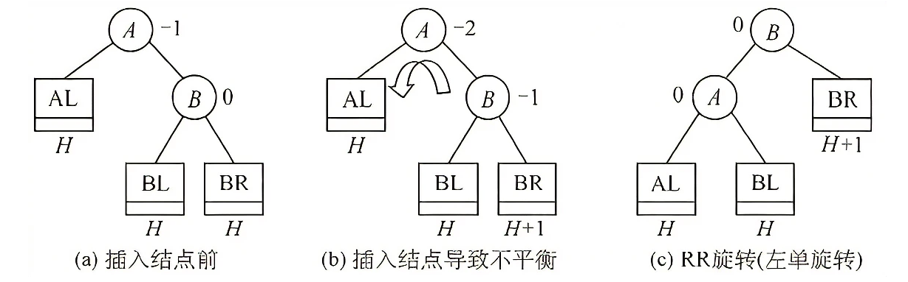

# 平衡二叉树

- 平衡二叉树上任一结点的左子树和右子树的深度之差不超过1。
- 平衡因子BF：将二叉树上结点的左子树深度减去右子树深度的值。只要二叉树上有一个结点的平衡因子的绝对值大于1，则该二叉树就是不平衡的

# 最小不平衡子树

- 在平衡二叉树的构造过程中以距离插入结点最近的且平衡因子绝对值大于1的结点为根的子树。

- 扁担原理：将根结点（支撑点）从A改为B。

```java
Node temp = root; //暂存A结点
root = root.left; //将B结点（A结点的左子树）设为根结点
temp.left = root.right; //将A结点的左子树设为B结点的右子树
root.right = temp; //将A结点设为B结点的右子树
```

| 平衡调整 | 说明                                                         |
| -------- | ------------------------------------------------------------ |
| LL型     | 新插入的结点在结点A的左子树的左子树上。<br /> |
| RR型     |  |
| LR型     | 两次旋转操作，先左旋转后右旋转。先将A结点的左孩子B的右子树的根结点C向左上旋转提升到B结点的位置（即进行一次RR平衡旋转(左单旋转)），然后再把该C结点向右上旋转提升到A结点的位置（即进行一次LL平衡旋转(右单旋转)）。<br /> |
| RL型     | 两次旋转操作，先右旋转后左旋转。先将A结点的右孩子B的左子树的根结点C向右上旋转提升到B结点的位置（即进行一次LL平衡旋转(右单旋转)），然后再把该C结点向左上旋转提升到A结点的位置（即进行一次RR平衡旋转(左单旋转)）。<br /> |
