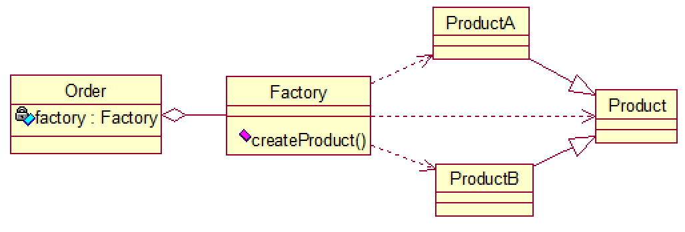

# 工厂模式 Factory

1. 编码时不能预见需要创建哪种类的实例。
2. 系统不应依赖于产品类型实例如何被创建、组合和表达的细节。

# 简单工厂模式（静态工厂模式）

 

```java
class Order{

    private Factory factory = new Factory();

    public Product getProduct(){
        return factory.createProduct();
    }
}

class Factory{
    public Product createProduct(){
        return true? new ProductB(): new ProductA();
    }
}

class Product{}
```

# 工厂方法模式

- 抽象对抽象，具体对具体：定义创建对象的抽象方法，由子类决定要实例化的类。对象的实例化推迟到其子类。

 

```java
public interface FruitFactory {
    public Fruit makeFruit();
}

class AppleFactory implements FruitFactory {

    @Override
    public Fruit makeFruit() {
        return new Apple();
    }
}

class BananaFactory implements FruitFactory {

    @Override
    public Fruit makeFruit() {
        return new Banana();
    }
}

interface Fruit {}
class Apple implements Fruit {}
class Banana implements Fruit {}
```

# 抽象工厂模式

- 抽象工厂模式：interface，创建相关/依赖的对象簇，而无需指明具体的类。
- 将工厂抽象成两层；抽象工厂、具体实现的工厂子类。每个具体工厂生产一个产品簇（相关/依赖的一系列产品），产品族内包含不同等级的产品。

> Intel、Amd分别为一个产品簇，而CPU、主板、硬盘等分别属于不同等级的产品。
>
> - 产品有多个产品簇，而只消费其中某一簇的产品。
> - 同属于同一簇的产品必须一起使用。
> - 系统提供一个产品类的库，所有的产品以相同的接口出现。

 

- 工厂

```java
public interface ComputerFactory {

    CPU createCPU();

    MainBoard createMainBoard();
}

class IntelFactory implements ComputerFactory {

    @Override
    public CPU createCPU() {
        return new IntelCPU();
    }

    @Override
    public MainBoard createMainBoard() {
        return new IntelMainBoard();
    }
}

class AmdFactory implements ComputerFactory {

    @Override
    public CPU createCPU() {
        return new AmdCPU();
    }

    @Override
    public MainBoard createMainBoard() {
        return new AmdMainBoard();
    }
}
```

- 产品CPU

```java
public class CPU {}

class IntelCPU extends CPU {
    public static final int PORT = 1001;
}

class AmdCPU extends CPU {
    public static final int PORT = 1002;
}
```

- 产品MainBoard

```java
public interface MainBoard {}

class IntelMainBoard extends MainBoard {
    public static final int PORT = 1001;
}

class AmdMainBoard extends MainBoard {
    public static final int PORT = 1002;
}
```

- 客服端

```java
public class Client {
    public static void main(String[] args) {
        IntelFactory intelFactory = new IntelFactory();
        makeComputer(intelFactory);
    }

    public static void makeComputer(ComputerFactory factory) {
        if (factory instanceof IntelFactory) {
            IntelCPU cpu = (IntelCPU) factory.createCPU();
            IntelMainBoard mainBoard = (IntelMainBoard) factory.createMainBoard();
        }
        if (factory instanceof AmdFactory) {
            AmdCPU cpu = (AmdCPU) factory.createCPU();
            AmdMainBoard mainBoard = (AmdMainBoard) factory.createMainBoard();
        }
    }
}
```
