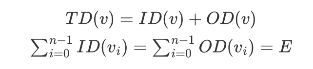
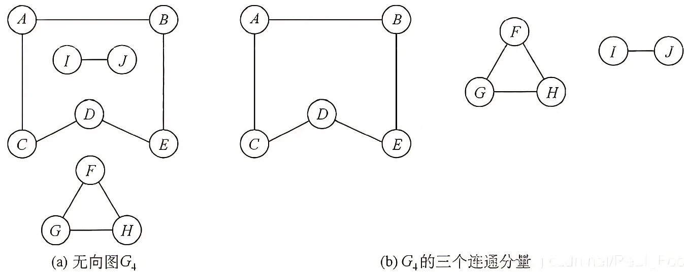

- 图(Graph)是由 **顶点的有穷非空集合V ( G )** 和顶点之间 **边的集合E ( G )** 组成：G = ( V , E ) 。

> G表示图，V是图G中顶点的集合，E是图G中边的集合。

| 结构   | 说明                 |
| ------ | -------------------- |
| 顶点 V |                      |
| 边 E   | 边可以有方向（关系） |
| 路径   | 一组顶点和边的组合   |

| 图的类型 | 说明                                                         |
| -------- | ------------------------------------------------------------ |
| 有向图   | 边是有方向的，E中的元素是有序的  |
| 无向图   | 边是没有方向的，E中的元素是无序的                            |

| 图类型 | 说明                                                         |
| ------ | ------------------------------------------------------------ |
| 简单图 | 不存在重复边 不存在顶点到自身的边                       |
| 多重图 | 图中某两个结点之间的边数多于一条 允许顶点通过同一条边和自己关联（即存在自环和平行）  |

| 完全图 （简单完全图） | 说明                                                         |
| -------------------------- | ------------------------------------------------------------ |
| 无向完全图                 | 任意两个顶点之间都存在边。 n个顶点，$\frac{n(n-1)}{2}$条边。 |
| 有向完全图                 | 任意两个顶点之间都存在互为相反的两条弧。 n个顶点，$n(n-1)$条边。  |

- 子图：设G(V,E)、G'(V',E')，V'是V的子集，E'是E的子集，则G'是G的子图。并非V和E的任何子集都能构成G的子图，有可能不是图，即E的子集中的某些边关联的顶点可能不在这个V的子集中。
- 若有满足V(G')=V(G)，则称该子图为G的生成子图。

| 图相关     | 说明                                                         |
| ---------- | ------------------------------------------------------------ |
| 邻接、依附 | 对于任意两个顶点$v_i、v_j$，若存在边$(v_i，v_j)$ 无向图，顶点$v_i、v_j$互为邻接点（adjacent）。 有向图，顶点$v_i$邻接到顶点$v_j$（顶点$v_j$是顶点$v_i$的邻接点），且弧$<v_i，v_j>$依附于顶点$v_i、v_j$。 |
| 度         | 无向图，顶点v的度：依附于该顶点的边的条数（$TD(v)_{无向图} = 2E$）。 |
| 入度、出度 | 有向图，入度(弧头)：以顶点v为终点的有向边的数目：$ID(v)$。 出度(弧尾)：以顶点v为起点的有向边的数目：$OD(v)$。  |
| 权、网     | 权重：在一个图中，每条边都可以标上具有某种含义的数值。 网：带权图。 |
| 路径       | 顶点Vp到顶点Vq之间的一条路径：（$ V_p,V_{i1},...,V_{im},V_{q} $）。 路径长度：路径上边的数目。 简单路径：在路径序列中，顶点不重复出现的路径。 |
| 回路（环） | 第一个顶点和最后一个顶点相同的路径。 若一个图有n个顶点，并且有大于n-1条边，则此图一定有环。 简单回路：除第一个顶点和最后一个顶点外，其余顶点不重复出现的回路。 |
| 距离       | 从顶点u出发到顶点v的最短路径的长度。 若从u到v根本不存在路径，则记该距离为无穷。 |

> 有向树：一个顶点的入度为0，其余顶点的入度均为1的有向图。

- 稀疏图的判断条件：$|E| < |V|\log_2^{|V|}$。

| 连通                     |                                                              |
| ------------------------ | ------------------------------------------------------------ |
| 连通图 （无向图）   | 连通：无向图中，若从顶点v到顶点w有路径存在。  连通图：若图G中任意两个顶点都是连通的，则称图G为连通图，否则称为非连通图。若一个图有n个顶点，并且边数小于n − 1，则此图必是非连通图。 连通分量：极大连通子图是无向图的连通分量，要求该连通子图包含其所有的边。 极小连通子图：既要保持图连通又要使得边数最少的子图。  |
| 强连通图 （有向图） | 强连通：有向图中，若从顶点v到顶点w、从顶点w到顶点v都有路径存在。 强连通图：图中任意两个顶点都是强连通的。 强连通分量：有向图的极大强连通子图。 |

| 连通子图                       | 说明                                                         |
| ------------------------------ | ------------------------------------------------------------ |
| 极大连通子图 （连通分量） | 1. 连通图只有一个极大连通子图，就是它本身。 2. 非连通图有多个极大连通子图。    - 非连通图的极大连通子图叫做连通分量，每个分量都是一个连通图。 3. 如果此时加入任何一个不在 图的点集 中的点都会导致它不再连通。 |
| 极小连通子图 （生成树）   | 1. 连通图的生成树是包含图中全部顶点的一个极小连通子图，而同一个连通图可以有不同的生成树。（极小连通子图只存在于连通图中）（只要能连通图的所有顶点而又不产生回路的任何子图都是它的生成树） 2. 若图中顶点数为n，则它的生成树含有n-1条边，若砍去它的一条边，则会变成非连通图，若加上一条边则会形成一个回路。 3. 生成森林：在非连通图中，连通分量的生成树构成了非连通图的生成森林。 |
