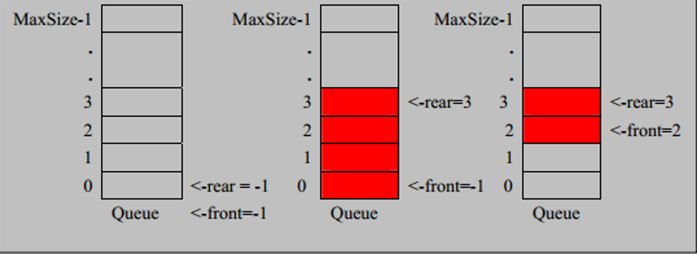
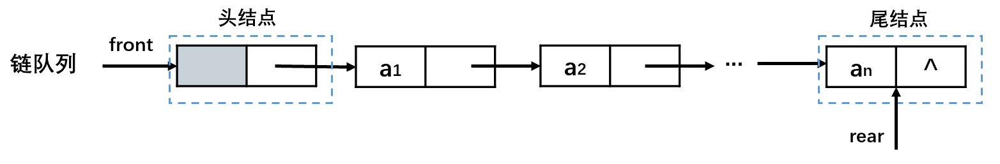

# 线性表概述

- 线性表（线性结构）：数据元素之间存在一对一的线性关系，包括数组、队列、链表、栈。
- 非线性结构：二维数组、多维数组、广义表、树、图。

| 对比   |                     顺序表（数组）                      |                     链表                     |
| ------ | :-----------------------------------------------------: | :------------------------------------------: |
| 存储   |                        顺序存储                         |                   链式存储                   |
| 连续性 | 顺序表中的存储元素是连续的 <br />（一组连续的内存单位） |        链表中的存储元素不一定是连续的        |
| 元素   |                            -                            | 元素节点中存放数据元素以及相邻元素的地址信息 |

# 数组

- 数组（顺序表）：用一段地址连续的存储单元依次存储线性表的数据元素。

> 内存的碎片化问题。

- 设顺序表的每个元素占用m个存储单元，则第$a_i$个元素的存储地址为：（与第$a_1$个元素的存储位置关系）
- 随机存取结构：只要确定了顺序表的起始地址（基地址），计算任意一个元素的存储地址的时间是相同的。

## 稀疏数组

- 稀疏数组记录数组一共有几行几列，有多少个不同的值，并把具有不同值的元素的行、列、值记录在一个小规模的数组。一个数组中大部分元素为０，或同一个值时（大多数的数据是重复的、无意义的），应该转换为稀疏数组。

 

# 链表 Linked List

- 链表：链式存储，以节点的方式存储，用一组任意的存储单元存放线性表，链表的各个节点不一定是连续存储，逻辑次序和物理次序不一定相同。

> **静态链表、动态链表**
>
> - 静态链表：数组存放链表。
> - 动态链表：额外创建expend()方法，动态扩展数组长度。

## 单向链表

 

| 节点域 | 存储               |
| ------ | ------------------ |
| data   | 数据               |
| next   | 下一个节点的引用。 |

| 节点   | 说明                                                         |
| ------ | ------------------------------------------------------------ |
| 头节点 | 保存头引用。<br />第一个元素节点之前附加一个类型相同的节点。 |
| 头引用 | 指向头节点的存储地址。                                       |
| 尾节点 | 保存尾标志，最后一个节点。                                   |
| 尾标志 | 终端节点的引用域为空。                                       |

## 双向链表

 

- 双向链表能够快速确定链表中的前驱节点（保存前驱节点的引用），可以实现当前节点的自我删除，适合频繁的插入删除操作。

> 单向链表需要上一个节点的配合才能实现删除当前节点。

## 循环链表（约瑟夫环）

- 循环链表：将单链表的终端节点的引用域由空改为指向头节点引用，使得链表头尾相接。

 

> **Josephu 约瑟夫环**
> 设编号为1，2，… ，n的n个人围坐一圈，约定编号为k（1<=k<=n）的人从1开始报数，数到m 的那个人出列，它的下一位又从1开始报数，数到m的那个人又出列，依次类推，直到所有人出列为止，由此产生一个出队编号的序列。

# 栈 Stack

- 栈（Stack）：限制线性表中元素的插入和删除只能在线性表的同一端进行。先进后出（FILO）、后进先出（LIFO）。

| 结构           | 说明           |
| -------------- | -------------- |
| 栈顶（Top）    | 允许插入和删除 |
| 栈底（Bottom） | 固定           |


| 方法   | 操作           |
| ------ | -------------- |
| peek() | 查看栈顶元素   |
| pop()  | 弹出栈顶元素   |
| push() | 向栈中压入元素 |

> 顺序栈 SequentialStack
> 链栈 LinkedStack

## 双端栈

 

- 两个顺序栈使用一个数组的两端分别存储（顺序栈单向延申）。栈一的栈顶top1为该数组的0下标开始，每次top1++存放新的元素。栈二的栈顶top2为该数组的length-1下标开始，每次top2--存放新的元素 。`top1 == top2 - 1`时，栈满。
- 两个栈相向增长，减少对数组空间的浪费，减少发生上溢的概率：最好一个栈增长时，另一个栈缩短。

```java
public class BothStack {
    char[] bothStack = new char[20];
    int top1 = 0; //stack1的栈顶
    int top2 = bothStack.length - 1; //stack2的栈顶

    public BothStack(int length) {
        bothStack = new char[length];
        this.top1 = 0; //stack1的栈顶
        this.top2 = bothStack.length - 1; //stack2的栈顶
    }

    public void push(char value, int type) {
        //判断是否栈满
        if (top1 == top2 - 1) {
            throw new RuntimeException("栈满");
        }

        //按不同的栈操作
        if (type == 1) {
            bothStack[top1++] = value;
        } else if (type == 2) {
            bothStack[top2--] = value;
        } else {
            throw new RuntimeException("未选择正确的栈");
        }
    }

    public char pop(int type) {
        //按不同的栈操作
        if (type == 1) {
            if (top1 == 0) {
                throw new RuntimeException("stack1栈空");
            }
            return bothStack[--top1];
        } else if (type == 2) {
            if (top1 == bothStack.length - 1) {
                throw new RuntimeException("stack2栈空");
            }
            return bothStack[++top2];
        } else {
            throw new RuntimeException("未选择正确的栈");
        }
    }
}
```

# 队列 Queue

- 队列：先入先出（FIFO）。

| 结构          | 说明                 |
| ------------- | -------------------- |
| 队头（front） | 队头元素的前一个位置 |
| 队尾（rear）  | 队尾元素位置         |

## 顺序存储结构

### 顺序队列

> 如果将队头固定在数组下标为0的位置：
>
> - 入队：对数组进行追加，T(n) = O(1)。
> - 出队：对数组下标为0的元素删除，T(n) = O(n)：需要向前移动n-1个元素。

 

- 顺序队列：rear、front属性的增长没有可逆的。

```java
public class ArrayQueue {
    private int maxSize; // 表示数组的最大容量
    private int front; // 队列头
    private int rear; // 队列尾
    private int[] arr; // 模拟队列

    // 创建队列的构造器
    public ArrayQueue(int maxSize) {
        this.maxSize = maxSize;
        arr = new int[maxSize];
        front = -1; // 指向队列头的前一个位置
        rear = -1; // 指向队列最后一个数据
    }

    // 判断队列是否满
    public boolean isFull() {
        return rear == maxSize - 1;
    }

    // 判断队列是否为空
    public boolean isEmpty() {
        return rear == front;
    }

    // 添加数据到队列
    public void addQueue(int value) {
        if (isFull()) {
            System.out.println("队列满！！！");
            return;
        }
        rear++; // rear后移
        arr[rear] = value;
    }

    // 获取队列的数据，出队列
    public int getQueue() {
        // 判断队列是否空
        if (isEmpty()) {
            // 通过抛出异常
            throw new RuntimeException("队列为空");
        }
        // front后移
        return arr[++front];
    }

    // 遍历
    public void showQueue() {
        if (isEmpty()) {
            System.out.println("队列空！！！");
            return;
        }
        for (int i : arr) {
            System.out.printf("arr[%d]=%d\n", i, arr[i]);
        }
    }

    // 显示队列的头，并不取出
    public int headQueue() {
        if (isEmpty()) {
            throw new RuntimeException("队列空！！！");
        }
        return arr[front];
    }
}
```

### 循环队列

| 指针  | 说明                                       |
| ----- | ------------------------------------------ |
| front | 队头，初始值=0                             |
| rear  | 队尾，空出一个空间做为约定，rear的初始值=0 |

- 队满：$(rear+1) \% M = front \% M$。

- 队空：$rear==front$。

- 队中有效数据的个数：$(rear+M-front) \% M$。

- 循环增长：对rear和front的取模操作，解决假溢出。

  - `rear = (rear + 1) % maxSize;`

  - `front = (front + 1) % maxSize;`

> 假溢出：数组空间发生上溢，但数组的低端还有空闲空间。

```java
//使用数组模拟队列
public class CircleArrayQueue {
    private int M; // 表示数组的最大容量
    private int front; // 队列头
    private int rear; // 队列尾
    private int[] arr; // 模拟队列

    // 判断队列是否满
    public boolean isFull() {
        return (rear + 1) % M == front % M;
    }

    // 判断队列是否为空
    public boolean isEmpty() {
        return rear == front;
    }

    // 添加数据到队列
    public void addQueue(int value) {
        if (isFull()) {
            System.out.println("队列满！！！");
            return;
        }
        
        arr[rear] = value;
        // 将rear后移 考虑取模，防止数组越界
        rear = (rear + 1) % M;
    }

    // 获取队列的数据，出队列
    public int getQueue() {
        // 判断队列是否空
        if (isEmpty()) {
            // 通过抛出异常
            throw new RuntimeException("队列为空");
        }
        
        int value = arr[front];
        // front 后移
        front = (front + 1) % M;
        return value;
    }

    // 遍历 从front开始遍历
    public void showQueue() {
        if (isEmpty()) {
            System.out.println("队列空！！！");
            return;
        }

        // 求出当前队列有序数据的个数 (rear + M -front) % M
        // 在经过多次使用后，front的值很可能以及超过M，所以需要取模 int i = front % M
        for (int i = front % M; i < front + ((rear + M - front) % M); i++) {
            System.out.printf("arr[%d]=%d\n", i, arr[i]);
        }
    }

    // 显示队列的头，并不取出
    public int headQueue() {
        if (isEmpty()) {
            throw new RuntimeException("队列空！！！");
        }
        return arr[front];
    }
}
```

## 链式存储结构

- 无序添加的单向链表。

 

```java
public class LinkedQueue<T> {

    private Node front; //队头
    private Node rear; //队尾

    public LinkedQueue() {
        front = rear = new Node();
    }

    /**
     * 判断队列空
     *
     * @return true-空
     */
    public boolean isEmpty() {
        return rear == front;
    }

    /**
     * 入队
     *
     * @param element 结点的数值域data
     */
    public void enQueue(T element) {
        Node node = new Node(element);
        rear.setNext(node);
        rear = node;
    }

    /**
     * 出队
     *
     * @return 出队结点的数值域data
     */
    public T deQueue() {
        if (isEmpty()) {
            throw new RuntimeException("队列空");
        }
        Node<T> headNode = front.getNext();
        front.setNext(headNode.getNext());
        if (headNode.getNext() == null)
            rear = front;
        return headNode.getData();
    }

    /**
     * 查看队头
     * @return 队头结点的数值域data
     */
    public T getHead() {
        if (isEmpty())
            throw new RuntimeException("队列空");
        Node<T> head = front.getNext();
        return head.getData();
    }
    
    class Node<T> {
        private T data;
        private Node next;

        public Node() {

        }

        public Node(T data) {
            this.data = data;
        }

        public T getData() {
            return data;
        }

        public void setData(T data) {
            this.data = data;
        }

        public Node getNext() {
            return next;
        }

        public void setNext(Node next) {
            this.next = next;
        }
    }
}
```

## 双端队列

- 双端队列：允许在队列的两端进行插入和删除操作。

> 二进一出队列：允许在两端插入，但只允许在一端删除。
>
> 一进二出队列：只允许在一端插入，允许在两端删除。

