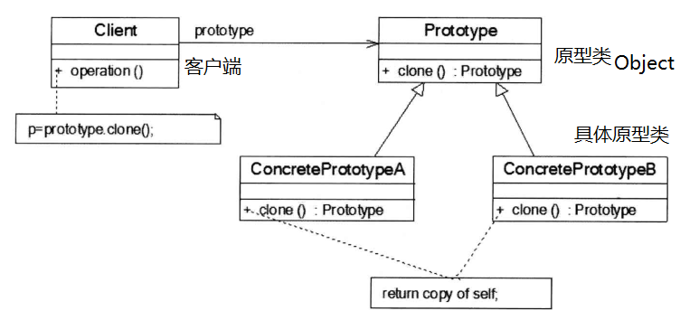

- 原型模式（Prototype）：复制原型对象来创建更多同类型的对象，动态获取对象运行时的状态。

  - java.lang.Object提供clone()，需要实现Cloneable接口，使该类能够复制且具有复制的能力。
  - clone()减少资源的占用：对象拷贝时，不是使用构造器方法，而是从堆内存中以二进流的方式进行拷贝，重新分配一个内存块。

- 相似但不相同：通过复制方法创建的对象是新的对象，在内存中拥有新的地址，每个复制的对象相互独立。在对复制的对象修改时，不会影响原型对象。

 

- clone()：重写java.lang.Object#clone()，实现Cloneable接口（CloneNotSupportException ）。

- 对于任意对象obj：

```java
obj.clone() != obj;
obj.clone().getClass() == obj.getClass();
obj.clone().equals(obj) == true; 
```

| 拷贝方式 | 说明                                                         |
| -------- | ------------------------------------------------------------ |
| 浅拷贝   | 被拷贝对象的所有属性都和原型对象相同<br />其引用数据类型成员的地址仍是原来的地址：即没有被复制。 |
| 深拷贝   | 被拷贝对象的所有属性都和原型对象相同<br />其引用数据类型成员被赋予新的地址：即被复制。 |

> String：尽管没有实现Cloneable接口的clone()方法，但是可以看作基本数据类型一般被拷贝，而StringBuffer不行。

- 浅拷贝：

```java
Person person = new Person(1001, "Jac", new Pet("King"));
Person person1 = person.clone();

System.out.println(person.equals(person1)); //true
System.out.println(person == person1); //false
System.out.println(person.pet.equals(person1.pet)); //true
System.out.println(person.pet == person1.pet); //true  浅拷贝
```

```java
class Person implements Cloneable {
    private int id;
    private String name;
    public Pet pet;

    @Override
    protected Person clone() throws CloneNotSupportedException {
        return (Person) super.clone();
    }
}

class Pet {}
```

- 深拷贝：引用数据类型成员所属的类也重写clone()且实现Cloneable接口，当克隆对象调用其clone()时，其clone()内部也调用了该引用数据类型成员的clone()，对该成员进行克隆。

```java
Person person = new Person(1001, "Jac", new Pet("King"));
Person person1 = person.clone();

System.out.println(person.equals(person1)); //true
System.out.println(person == person1); //false
System.out.println(person.pet.equals(person1.pet)); //true
System.out.println(person.pet == person1.pet); //false  深拷贝
```

```java
class Person implements Cloneable {
    private int id;
    private String name;
    public Pet pet;

    @Override
    protected Person clone() throws CloneNotSupportedException {
        Person person = (Person) super.clone();
        person.pet = pet.clone();
        return person;
    }
}

class Pet implements Cloneable{
    @Override
    protected Pet clone() throws CloneNotSupportedException {
        return (Pet) super.clone();
    }
}
```

- 序列化深拷贝：

```java
public Person deepClone() {
    ByteArrayOutputStream bos = null;
    ObjectOutputStream oos = null;
    ByteArrayInputStream bis = null;
    ObjectInputStream ois = null;
    try {
        bos = new ByteArrayOutputStream();
        oos = new ObjectOutputStream(bos);
        oos.writeObject(this);
        bis = new ByteArrayInputStream(bos.toByteArray());
        ois = new ObjectInputStream(bis);
        return (Person) ois.readObject();
    } catch (Exception ex) {
        ex.printStackTrace();
        return null;
    } finally {
        try {
            bos.close();
            oos.close();
            bis.close();
            ois.close();
        }catch (IOException ex) {
            ex.printStackTrace();
        }
    }
}
```
