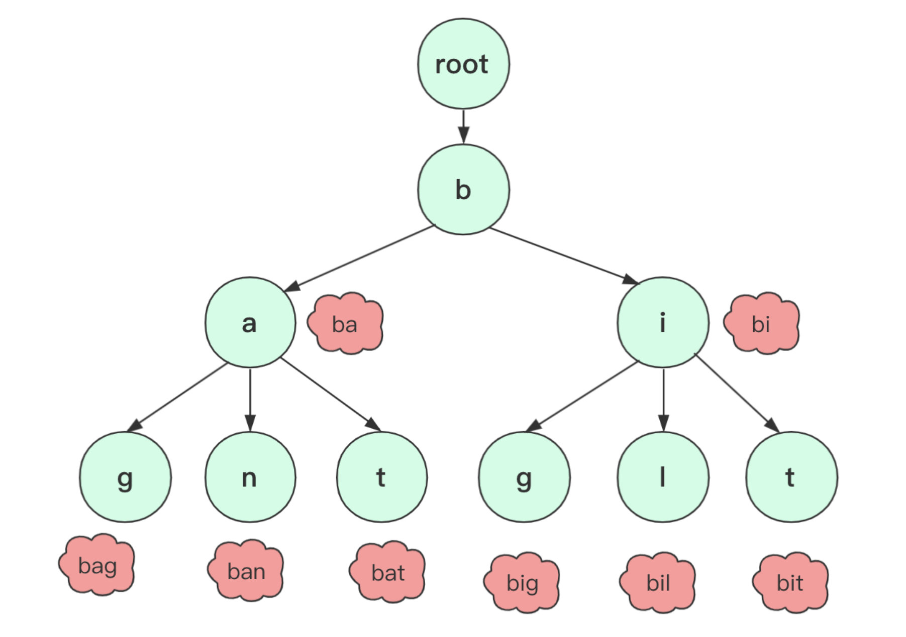

- 字典树（Trie树、前缀树）利用字符串的公共前缀来减少查询时间，最大限度地减少无谓的字符串比较，查询效率比哈希树高。首先看单词的第一个字母是不是在字典的第一层。如果不在，说明字典树里没有该单词；如果在，就在该字母的孩子结点里找是不是有单词的第二个字母，没有说明没有该单词，有的话用同样的方法继续查找。

> 典型用于统计、排序、和保存大量字符串，经常被搜索引擎系统用于文本词频统计。

1. 根结点不包含字符，除了根结点每个结点都只包含一个字符。（为了能够包括所有字符串）
2. 从根结点到目标结点所经过的所有字符都串起来目标结点对应的字符串。
3. 每个结点的子结点字符不同，使得每个单词、字符都是唯一的。

 


```java
class Trie {
    private TrieNode root;

    public Trie() {
        root = new TrieNode();
        root.worldEnd = false;
    }

    public void insert(String word) {
        TrieNode node = root;
        for (int i = 0; i < word.length(); i++) {
            Character character = word.charAt(i);
            //如果当前结点没有包含相关的后缀，则设置并获取该字符
            if (!node.childdren.containsKey(character)) {
                node.childdren.put(character, new TrieNode());
            }
            node = node.childdren.get(character);
        }
        node.worldEnd = true;
    }

    //全词匹配
    public boolean search(String word) {
        TrieNode node = root;
        boolean found = true;
        for (int i = 0; i < word.length(); i++) {
            Character character = word.charAt(i);
            if (!node.childdren.containsKey(character)) {
                return false;
            }
            node = node.childdren.get(character);
        }
        return found && node.worldEnd;
    }

    //前缀匹配
    public boolean starWith(String prefix) {
        TrieNode node = root;
        boolean found = true;
        for (int i = 0; i < prefix.length(); i++) {
            Character character = prefix.charAt(i);
            if (!node.childdren.containsKey(character)) {
                return false;
            }
            node = node.childdren.get(character);
        }
        return found;
    }
}

class TrieNode {
    Map<Character, TrieNode> childdren;
    boolean worldEnd;

    public TrieNode() {
        childdren = new HashMap<>();
        worldEnd = false;
    }
}
```
