# 交互视图

- 交互视图：描述执行系统功能的各个角色之间相互传递信息的顺序关系，是描绘系统中各种角色或功能交互的模型，跨越多个对象的系统控制流程。

**交互视图的表示形式**

- 协作图：表示对象之间是如何协作完成一个功能的。

- 序列图：反映执行系统功能的各个角色之间传递消息的顺序关系。

**通过不同对象间的相互作用描述系统的行为**

- 以独立的对象为中心（状态机）：描述对象内部的深层次的行为。
- 以相互作用的一组对象为中心（交互视图）：描述一组对象的整体行为。

# 协作图

# 顺序图（序列图）

- 顺序图：对象之间随时间的交互，对象之间的通信过程。

1. 对用例中的基本流程和备选流程（用例）进行逻辑描述。
2. 将交互关系表示为一个二维图：
   - 纵向：时间轴，时间沿竖线向下延伸。
   - 横向：参与交互的对象。

- 作用：

1. 对对象之间的交互建模。
2. 业务人员：描述业务流程中对象的交互过程，更精确的描述业务需求。
3. 需求分析：细化用例的表达。
4. 技术人员：记录系统行为。

> 以下是合同管理员通过采购合同数据库增加一个采购合同的描述，用顺序图表示出来。
>
> 参与者“合同管理员”向对象“采购合同数据库”调用操作“增加采购合同”；
>
> 对象“采购合同数据库”创建一个对象“采购合同”；
>
> 对象“采购合同”返回一条消息，通知“采购合同数据库”，一个新的“采购合同”对象创建完毕；
>
> 对象“采购合同数据库”自调用操作“存入采购合同”，将新创建的采购合同对象存入采购合同数据库；
>
> 采购合同数据库返回消息，通知合同管理员，新合同已加入数据库。
>
> 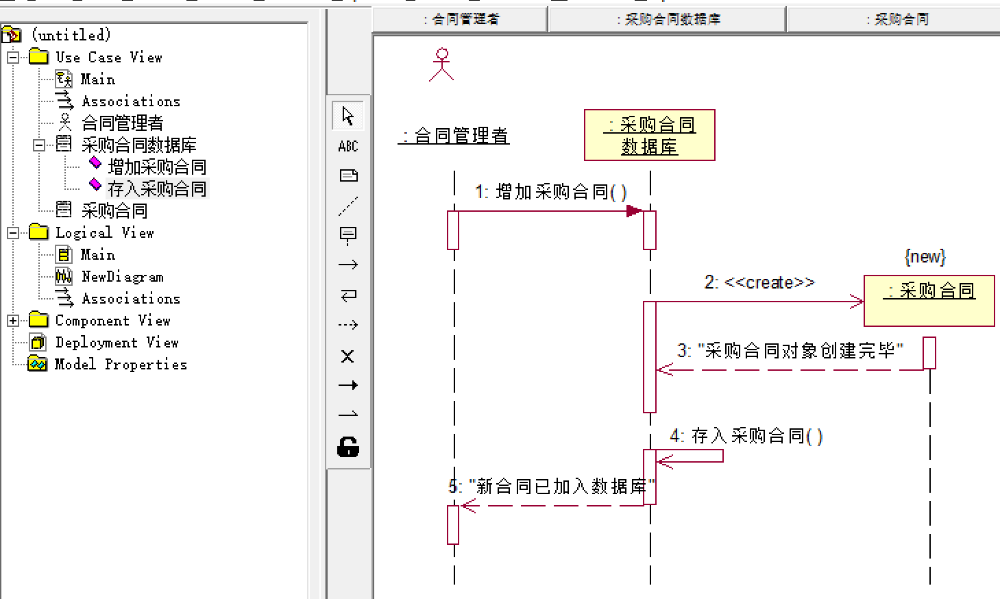

> 还书用例剧本：
>
> 1. 管理员在主界面中点击进入还书界面。
> 2. 主界面创建临时对象“还书界面”。
> 3. 管理员在还书界面中输入“图书编码和借书证号”，还书界面带着参数“图书编码”调用对象“借书记录表”的操作“查借书记录”，并返回消息借书记录。
> 4. 还书界面带着参数“借书证号”调用对象“借阅者信息表”的操作“查借阅者信息”，并返回消息借阅者信息。
> 5. 还书界面自调用操作“显示还书信息” 。
> 6. 管理员确认归还。
> 7. 还书界面分别调用对象“借书记录表”的操作“修改借书记录”，“图书信息表”的操作“图书信息表”的操作“修改图书状态”，“借阅者信息表”的操作“修改借阅者状态”。
> 8. 管理员关闭还书界面。
>
> - 参与者：管理员
> - 交互对象：主界面、还书界面、借阅者信息表、图书信息表、借书记录表
>
> 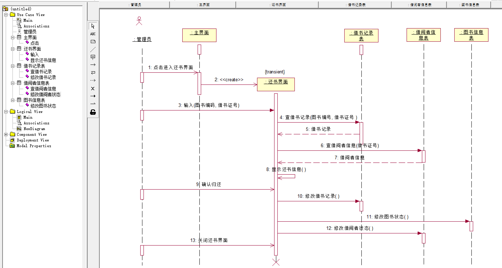 

## 对象、生命线

- 对象：使用生命线进行表示，当对象存在时，生命线用一条虚线表示，此时对象不处于激活状态，当对象的过程处于激活状态时，生命线是一个双道线。
  - 可以是系统的参与者、任何有效的系统对象。
- 如果对象的开始位置位于顺序图的顶部，则表明该对象在顺序图开始交互时就已经存在了，如果对象的位置不在顶部，则表明该对象在交互的过程中被创建。
  - 主角：交互的发起对象，通常放在顺序图的最左端。

| 对象标记    | 说明                     |
| ----------- | ------------------------ |
| {new}       | 在执行期间被创建         |
| {destory}   | 在执行期间被销毁         |
| {transient} | 在执行期间被创建而后销毁 |

> 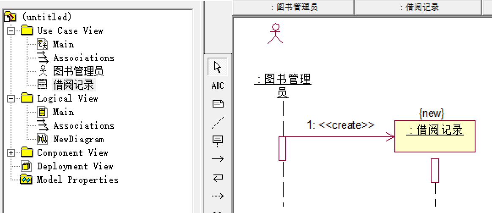 

- 生命线：对象存在的时段。
- 激活：对象接收到一个消息时，该对象中的一个程序启动的过程。
  - 当一个对象在激活期时，该对象处于激活状态，能够响应或发送消息，执行动作或活动。

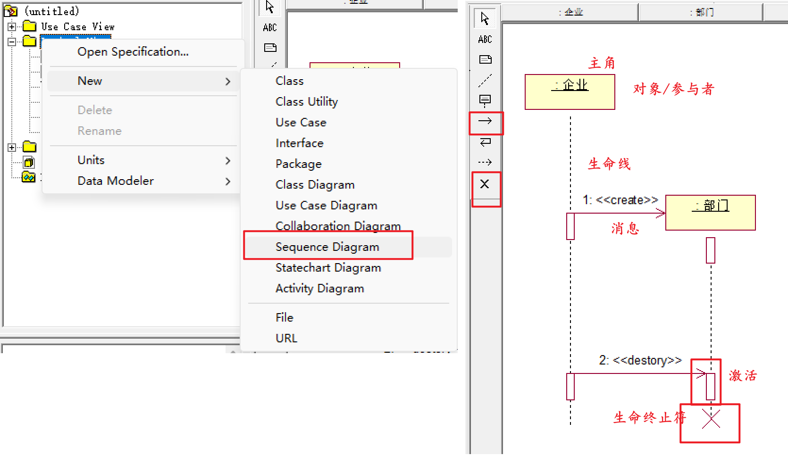 

## 消息

- 消息：对象之间的交互和通信。
  - 从一个对象的生命线到另一个对象生命线的箭头，箭头以时间顺序在图中从上到下排列。

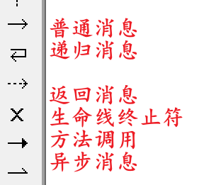 

### 约束

- `序号 [判断条件] *[循环] 返回值:=操作名/消息(参数列表) {约束条件}`
  - 序号一般自动给出。

>序号为1，如果n>1则循环调用fun1()方法10次，且需要在30秒内完成，参数为param，返回result
>
>- 则：1: [n>1] *[i==0,i<10,i++] result:=fun1(param){30秒内完成}

> 顺序图包含三个交互对象A、B、C，它们按以下次序进行交互。
>
> 1. A调用B的操作op1，B执行op1后返回消息return1给A；
> 2. B向C循环发送10次消息message1：B带着参数a自调用op1；
> 3. A在满足条件n>1的情况下向C发出消息message2。
>
> 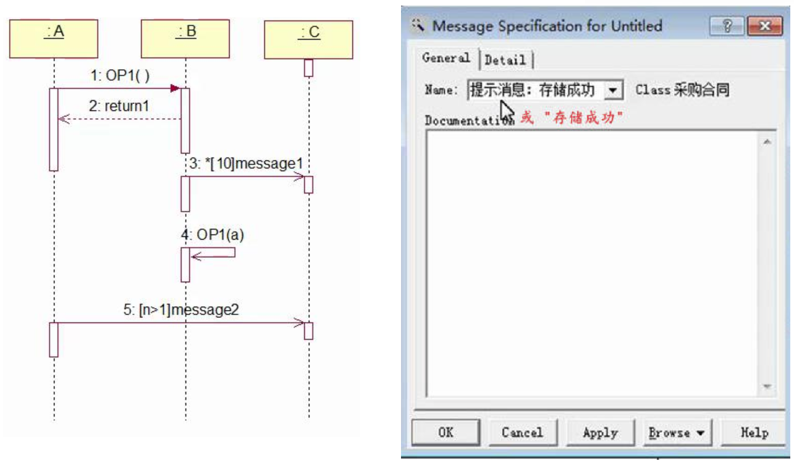 

> 通话管理”顺序图：
>
> - 电话S调用交换机T的操作“激活通话”，激活交换机开始工作；
> - 交换机T返回“拨号提示音”提醒对象S可以开始拨号；
> - S自调用“拨号”操作，在30秒内拨完全部8位号码；
> - 完成拨号后，调用交换机T的操作“逻辑连通”；
> - 交换机T创建会话对象C，由C管理具体的通话事宜；
> - C调用电话R的操作“振铃”，振铃时间少于30秒；
> - 电话R返回本机号码，表示会话被接受；
> - C返回参数S和R号码给交换机T；
> - 交换机T带着参数（S,R）自调用 “通话”操作。
> - 通话结束后，交换机销毁临时对象C。
> - 参与交互的对象：电话S、电话R、交换机T、会话管理对象C。
>
> 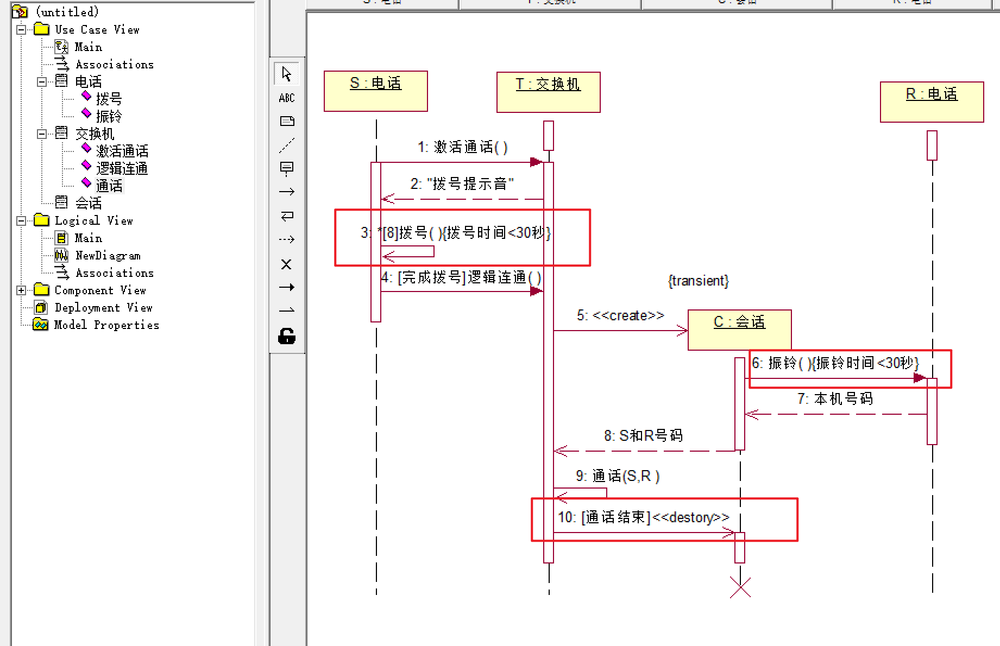

> 客服人员修改客户信息的用例剧本：
>
> 1. 客服人员进入客户信息界面；
> 2. 对象“客户信息界面”创建临时对象“客户信息控制器” ；
> 3. “客户信息控制器”调用对象“数据库管理器”的操作“获取所有客户信息”；
> 4. “数据库管理器”返回消息“所有客户信息”到对象“客户信息控制器”，“客户信息控制器”带参数调用“客户信息界面”的操作“信息显示”，显示所有客户信息；
> 5. 客服人员在客户信息界面中选择要修改的客户；
> 6. “客户信息界面”调用”数据库管理器”的操作“获取特定客户数据”；
> 7. “数据库管理器”返回消息“特定客户信息”到对象“客户信息界面”，“客户信息界面”自调用操作“信息显示”，显示特定客户信息；
> 8. 客服人员在客户信息界面中修改客户的数据；
> 9. 客户信息界面自调用操作“提示”，提示用户“是否确定更新数据”；
> 10. 客户确认后，“客户信息界面”调用“客户信息控制器”的操作“接收需更新的客户数据”；
> 11. “客户信息控制器”调用“数据库管理器”的操作“执行数据的更新”；
> 12. “数据库管理器”返回消息“更新后的所有客户信息”到“客户信息控制器” ；
> 13. “客户信息控制器”带参数调用“客户信息界面”的操作“信息显示”，将“更新后的所有客户信息” 显示到客户信息界面；
> 14. “客户信息控制器”自销毁。
>
> 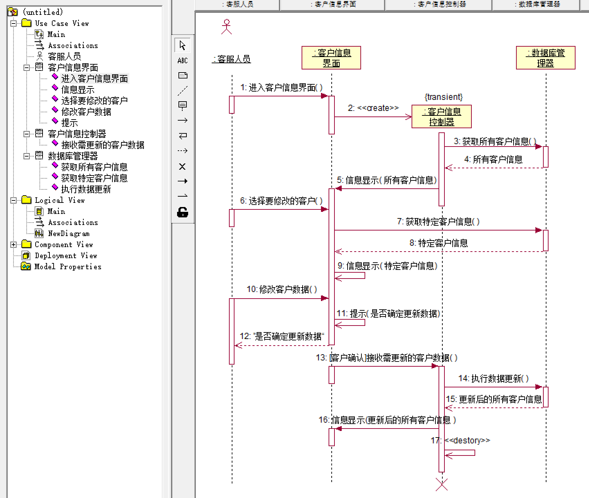 

### 操作

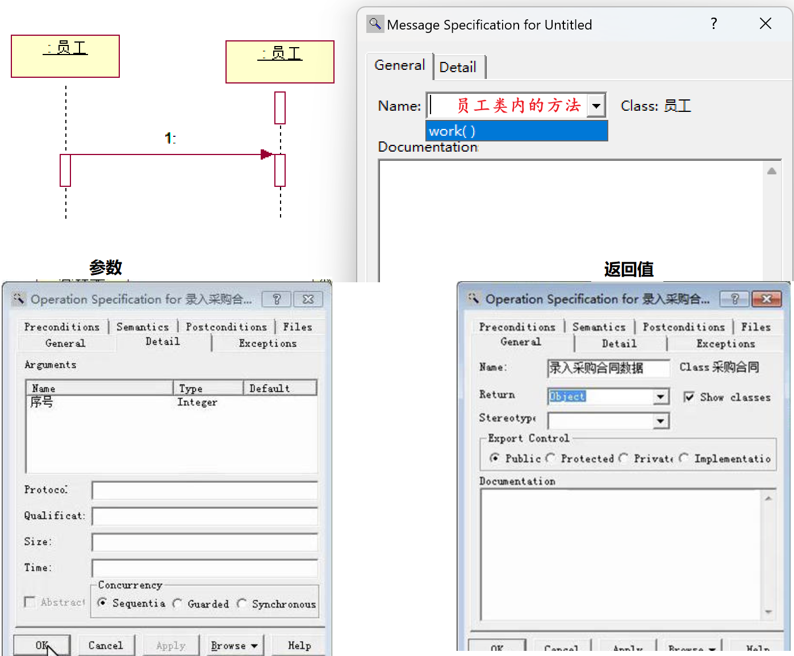 

### 标记

| 消息标记      | 含义     |
| ------------- | -------- |
| `<<create>>`  | 创建对象 |
| `<<destory>>` | 销毁对象 |

## 分支、从属流

- 分支：从同一点发出多个消息的并指向不同的对象，根据条件是否互斥，可以有条件和并行两种结构。

| 分支     | 说明                                                         |
| -------- | ------------------------------------------------------------ |
| 条件分支 | 多个消息的保安条件是互斥的，在一个特定的时刻，仅有一个消息的保安条件会得到满足，导致该消息的发送。 |
| 并发分支 | 多个消息的保安条件是互为相容的，在一个特定的时刻多个消息的保安条件都可能满足，则多个消息可能同时发送。 |

- 从属流：从同一点发出多个消息指向同一个对象的不同生命线。

> 1. 当x=2,y=-1时，有几个对象参与过交互？
> 2. 当x=-1,y=-1时，有几个对象参与过交互？
> 3. 当x=0,y=0时，整个交互过程共传递了多少条信息？
>
> 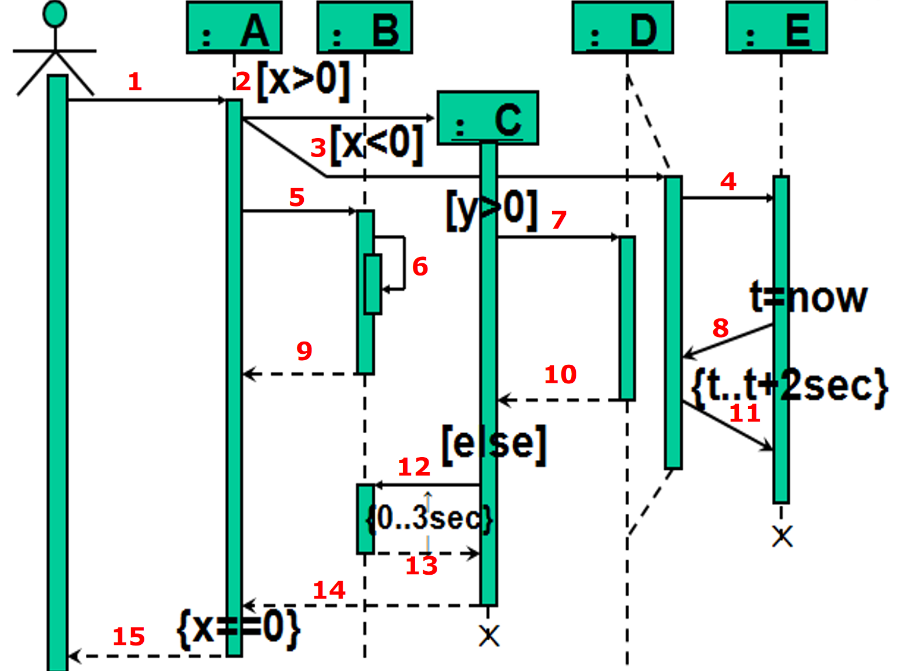 

> 修改采购合同剧本：
>
> - 对象“采购合同管理器” 用异步消息创建一个临时对象“采购合同” ；
> - 对象“采购合同管理器” 带参数“序号”调用“采购合同”对象的操作“录入采购合同数据” ；
> - 对象“采购合同”根据“序号”调用对象“采购合同数据库接口”的操作“提取采购合同” ；
> - 采购合同数据库接口返回“序号”对应的采购合同；
> - 采购合同对象调用自己的操作“修改合同数据”，修改完毕后，调用“采购合同数据库接口”的操作“存储采购合同” ；
> - “采购合同数据库接口”返回提示消息“存储成功” ；
> - “采购合同”对象返回提示消息“修改成功”给“采购合同管理器”；
> - “采购合同管理器”销毁临时对象“采购合同”。
>
> 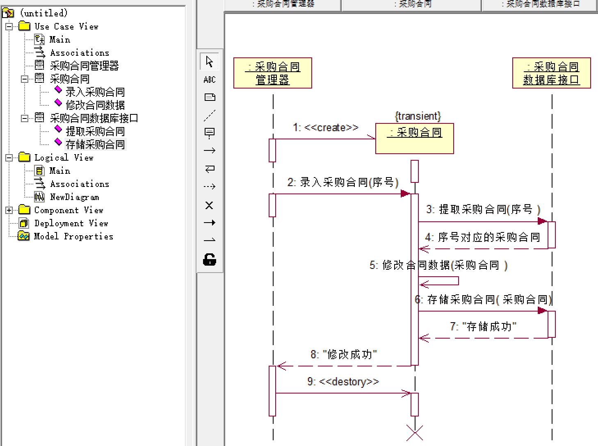 

> 下面是一个客户在ATM机上的取款工作流程：
>
> 1. 客户在ATM对话框中点击选择取款功能选项；
> 2. ATM对话框自调用操作“显示信息”，提示用户插入IC卡，并创建读卡器临时管理对象；
> 3. 读卡器临时管理对象循环自调用IC卡检查操作，当读卡器有IC卡时，返回提示信息用户输入密码给ATM对话框；
> 4. ATM对话框自调用操作“显示信息”，提示客户输入自己的密码；
> 5. ATM对话框调用“后台数据管理”的操作“验证密码”，检查用户密码是否正确；
> 6. 如果密码正确，则系统显示用户账户上的剩余金额，并提示用户输入想要提取的金额；
>
> 7. ATM对话框自调用操作“显示信息”，提示客户账户余额及所需提取金额。用户输入提取金额后，ATM对话框调用“后台数据管理”的操作“检查数据合法性”，检查取款金额是否正确；
> 8. 若取款金额正确，ATM对话框调用“后台数据管理”的操作“更新账户余额”；带着参数“取款金额”调用“出钞设备”的操作“输出现金” 。
>
> - 参与者：客户
> - 交互对象：ATM对话框、读卡器临时管理对象、出钞设备、后台数据管理
>
> 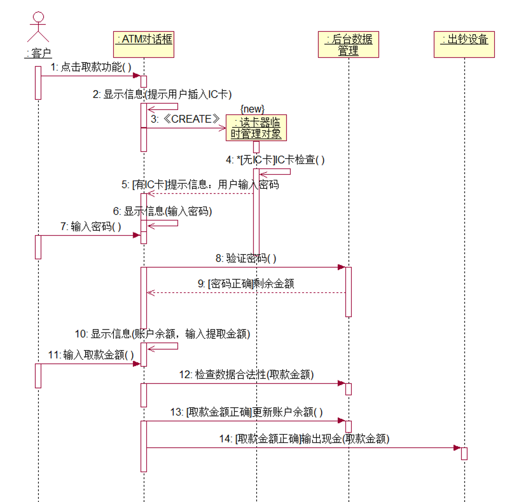

## 交互框架

- 片段（Fragment）、交互片段（Interaction Fragment）：顺序图中的一个分区域，包含着该顺序图的局部内容。对于一个片段允许带有保安条件（Guard），当该条件为真时才执行该片段。 一个或多个片段可以由一个交互框架包围，在框架图形左上角的标题框中给出操作符，表明该交互框架中片段的处理方式。
- 组合片段：把二个或多个片段放在一个交互框架里，各片段的区域之间用一条虚线分隔。组合片段常用于表示交互中的条件选择、并发或引用情况。

| 片段 | 名称 | 说明                                                         |
| ---- | ---- | ------------------------------------------------------------ |
| alt  | 选择 | 有多重片段供选择，且必选其一，只有当其保安条件为真的片段才被执行。 |
| opt  | 任选 | 有多重片段供选择，只有当其保安条件为真的片段才被执行。       |
| par  | 并行 | 每个片段都并发执行                                           |
| loop | 循环 | 片段可重复执行，保安条件给出执行条件。                       |
| ref  | 引用 | 引用在其它图上定义的一个交互                                 |

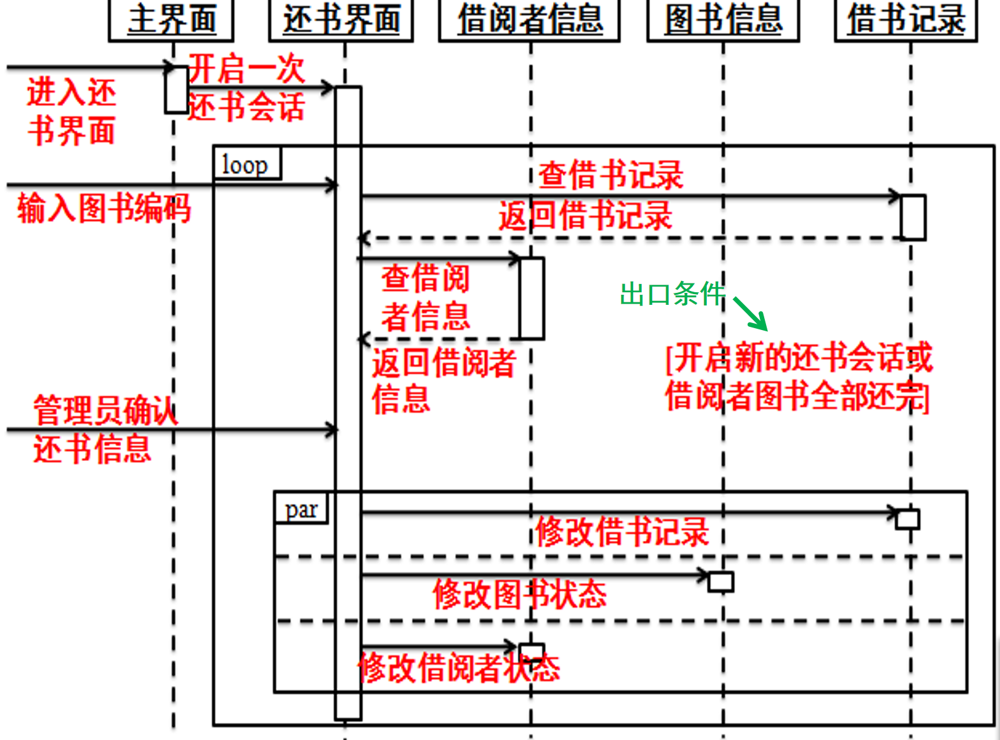 

