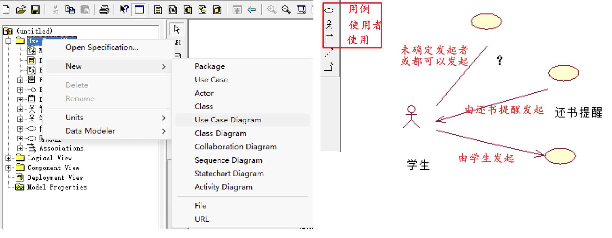
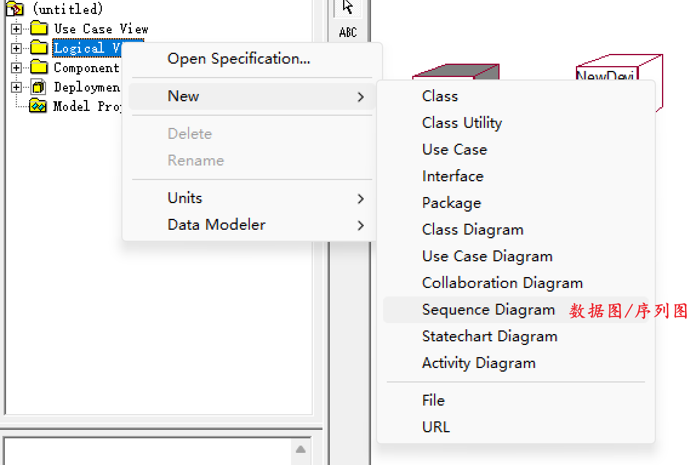
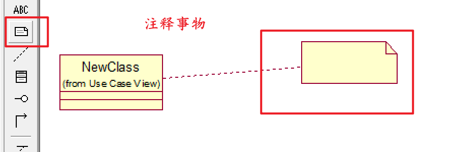

# 结构事物 

- 结构事物：构成模型的静态部分，负责描述静态功能和客观元素。

- UML中一共定义了7种结构事物：类、接口、协作、用例、主动类、构件、节点。

## 类 Class

- 类：完全对应于面向对象分析中的类，具有自己的属性和操作。 

## 接口 Interface

- 接口：由一组对操作的定义组成，但不包括对操作的实现进行详细的描述。
- 接口描述一个类或构件的一个服务的操作集、元素的外部可见的操作。
- 接口往往依赖于实现接口的类或构件。

   

## 协作 Collaboration

- 协作：对一个交互过程的定义，由一组共同工作以提供协作行为的角色和其他元素构成的一个整体。
  - 通常这些协作行为大于所有元素的行为的总和。

- 一个类可以参与到多个协作中，在协作中表现了系统构成模式的实现。

## 用例 user case

- 用例：系统所提供的服务，定义了系统是如何被参与者使用的，描述参与者为了使用系统所提供的某一完整功能而与系统发生的一段对话。（对一组动作序列的抽象描述，即：行为事物）
  - 系统执行这些动作将产生一个对特定的参与者有价值而且可观察的结果。 

## 主动类 active class

- 主动对象：主动类的对象，能够有自动的启动控制行为，其本身至少拥有一个进程或线程，每个主动对象都由它自己的事件驱动控制线程，控制线程与其他主动对象并行执行。
- 被动对象：被主动对象所调用的对象，被动地等待其他对象发出请求，该对象所描述的元素的行为和其他元素的行为并发。只在被调用时接受控制，当被动对象返回时将控制放弃。

## 构件 component

- 构件定义了良好接口的物理实现单元，是系统中物理的、可替代的部件，遵循且提供一组接口的实现，每个构件体现了系统设计中特定类的实现。
  - 良好定义的构件不直接依赖于其他构件而依赖于构件所支持的接口，系统中的一个构件可以被支持正确接口的其他构件所替代。
  - 每个系统中都有不同类型的部署构件。

1. 将一个大系统分解成若干个小软件（子系统），有助于降低系统开发的复杂度。
2. 采用构件机制开发的系统，在系统需要修改时，更为容易。
3. 构件机制有助于提高复用水平，同时也是一种好的销售方法。  

## 节点 node

- 节点 是系统在运行时切实存在的物理对象，表示某种可计算资源，这些资源往往具有一定的存储能力和处理能力。
- 一个构件集可以驻留在一个节点，也可以从一个节点迁移到另一个节点。
- 一个节点可以代表一个物理机或一个虚拟物理机。
- 节点在Rational Rose中分为：设备节点、处理节点。  

# 行为事物

- 行为事物：构成模型的动态部分，描述跨越时间和空间的行为。通常使用动词来表示。
- 行为事物分为：交互、状态机。

## 交互

- 交互：特定的语境中，一组对象为共同完成一定任务而进行的一系列消息交换而组成的动作以及消息交换的过程中形成的消息机制。
- 交互包括：一组对象，连接对象间的消息、消息发出的动作形成的有序的序列和对象间的普通连接。

- 交互的可视化表示主要通过消息来表示：带有名字或内容的有向箭头。

  
  
  

## 状态机

- 是一个类对象所有的**生命历程**模型，因此状态机可以用于描述一个对象在其生命周期内响应时间所经历的**状态序列**。
- 当对象探测到一个**外部事件**后，它依照当前的状态做出反应，这种反应包括执行一个相关动作或转换到一个新的状态中去。
- 单个类的状态变换或多个类之间的协作过程都可以使用状态机描述。

  
  
  

# 分组事物

- 分组事物：UML对模型中的各种组成部分进行事物分组的一种机制。
- 目前只有一种分组事物：包。
- 包：描述拥有和管理模型内容的组织单元，任何元素都可以被包所拥有。   

# 注释事物

- 注释事物：UML模型的解释部分，依附于某个元素或一组建模元素，对该元素/该组建模元素进行约束或解释。

 

