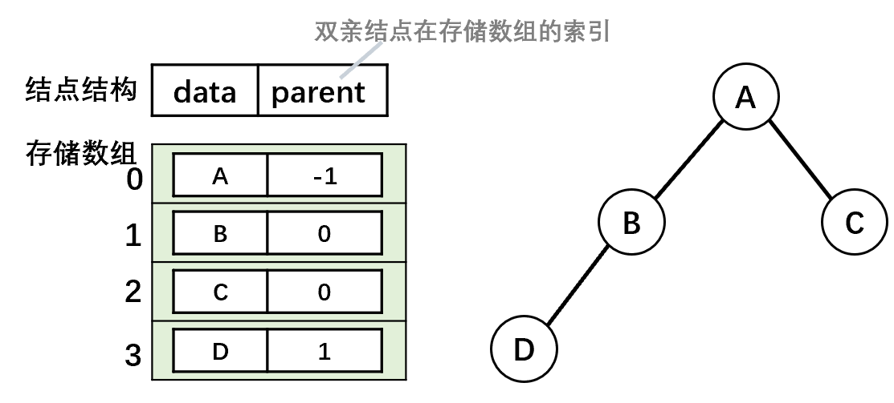
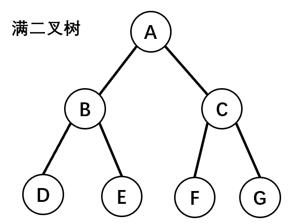
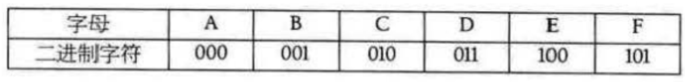

# 树

- 树是n个结点的有限集合。

1. 树有且只有一个根结点（一个结点也可以是树）。
2. 每个结点只有一个父结点。
3. 一个结点可以有多个子结点（子树）。

| 术语       | 说明                                                         |
| ---------- | ------------------------------------------------------------ |
| 度         | 结点的度：某结点拥有子树的个数。<br />树的度：各结点度的最大值。 |
| 结点       | 叶子结点（终端结点）：度为0的结点。 <br />分支结点：度不为0的结点。 |
|            | 孩子结点：某结点的子树的根结点。 <br />双亲结点。 <br />兄弟结点：具有同一个双亲的孩子结点。 |
| 祖先、子孙 | 若从结点x到结点y存在一条路径，则：<br />结点x是结点y的祖先；<br />结点y是结点x的子孙。 |
| 路径       | 路径长度：路径上经过的边数。                                 |
| 结点的层数 | 根结点的层数为1。                                            |
| 树的深度   | 树中所有结点的最大层数。                                     |
| 树的宽度   | 树中每一层结点个数的最大值。                                 |

1. 树中的结点数等于所有结点的度数加1。任意一棵树，若结点数量为n，则边的数量为n-1。
2. 度为m的树中第i层上至多有$m^{(i − 1)}$个结点（i >= 1）。
3. 高度为h的m叉树至多有$ \frac{(m^h-1)}{(m-1)}$个结点。
4. 具有n个结点的m叉树的最小高度为$\log^{n(m−1)+1}_m$。

# 结点结构

## 双亲表示法

- 双亲表示法：假设以一组连续空间存储树的结点，同时在每个结点中，附设一个指示器指示其双亲结点到链表中的位置。

| 结构            | 说明                                                         |
| --------------- | ------------------------------------------------------------ |
| Node[] nodeList | 存储的连续空间，存放树的结点                                 |
| Node node       | 树结点<br />data：数据域<br />parent：指针域，指向该结点的双亲在nodeList中的下标 |

 

## 孩子表示法

- 孩子表示法：把每个结点的孩子结点排列起来，以单链表作存储结构，则n个结点有n个孩子链表，如果是叶子结点则此单链表为空。然后n个头指针又组成一个线性表，采用顺序存储结构，存放进一个一维数组中。

| 结构                      | 说明                                                         |
| ------------------------- | ------------------------------------------------------------ |
| 表头数组 Head[] childList | 存放表头结点                                                 |
| 表头结点 Head             | data：数据域，存放孩子结点的数据信息 <br />firstChild：头指针域，指向存储该结点的孩子结点的头指针 |
| 孩子结点 Child            | child：孩子链表的孩子结点（表头数组中的索引）<br />next：指向该结点的下一个孩子结点的指针 |

  

## 孩子兄弟表示法

 

# 二叉树

- 二叉树是有序树，有左右子树之分，一个结点最多有两个子结点。

| 二叉树     | 图示                                                         |
| ---------- | ------------------------------------------------------------ |
| 斜树       |  |
| 满二叉树   |  |
| 完全二叉树 |  |


1. 非空二叉树上的叶子结点（度为0）数等于度为2的结点数加1：$n_0 = n_2 + 1$。

> 设n为树的总结点数，$n_0$为度为0的结点数，$n_1$为度为1的结点数，$n_2$为度为2的结点数
> $$
> \begin{matrix}
> 结点：& n = n_0 + n_1 + n_2 \\
> 分支：& n - 1 = n_1 + 2 \times n_2
> \end{matrix}
> $$
> 分支：
>
> - 从进入的角度：只有根结点没有入边，故分支数为 n - 1。
> - 从出发的角度：度为2的结点发出2条分支，故$2n_2$；度为1的结点发出1条分支，故$n_1$。

2. 非空二叉树上第k层上至多有 $2^{k-1}，( k \ge 1 )$ 个结点。
3. 深度为k的二叉树至多有$2^k - 1，( k \ge 1 )$个结点。 

>- 至多：假设该树为满二叉树。
>
>- 二叉树第1层：只有一个根结点。

**满二叉树**

- 所有分支结点都存在左子树和右子树，且所有的叶子节点都处于最底层。（只有度为0和2的结点）满二叉树的每层都含有最多的结点，若高度为h，则有$2^h-1$个结点。
- 对满二叉树按层序编号，从根结点（编号1）自上而下，自左向右。对于编号为i的结点：若有双亲，则其双亲编号$\frac{i}{2}$；若有左孩子，则左孩子编号$2i$；若有右孩子，则右孩子编号$2i+1$。

**完全二叉树**

- 对一棵具有n个结点的二叉树按层序编号，编号为i的结点与（该二叉树同样深度的）满二叉树中编号为i的结点在二叉树中的位置完全相同。

1. 深度为k的完全二叉树在第k-1层是满二叉树。（$满二叉树 \subseteq 完全二叉树$
2. 叶子结点只可能在层次最大的两层上出现，且最大层次中的叶子结点都集中在该层左侧连续的位置。
3. 若有度为1的结点，则只可能有一个，且该结点只有左孩子而无右孩子。 
4. 按层序编号后，如果编号为i的结点为叶子结点或其只有左孩子，则编号大于i的结点均为叶子结点。
5. 若n为奇数，则每个分支结点都有左孩子和右孩子；若n为偶数，则编号最大（$\frac{n}{2}$）的分支结点只有左孩子，没有右孩子。

6. 具有n( n > 0 )个结点的完全二叉树的深度为$\lfloor \log_{2}^{n} \rfloor + 1$。

> 设具有n个结点的完全二叉树的深度为k：
> $$
> \begin{matrix}
> & 2^{k-1} \le n \lt 2^k \\
> 取对数：& k-1 \le \log_2^n \lt k \\
> 即：& \log_2^n \lt k \le \log_2^n + 1
> &
> \end{matrix}
> $$

7. 对完全二叉树按层序编号，对结点i则有以下关系:
   1. i > 1：结点i的双亲的编号为$\lfloor \frac{i}{2} \rfloor$，否则该结点为根结点。
      - i为偶数：双亲的左孩子。
      - i为奇数：双亲的右孩子。
   2. $2i \le n$：结点i 的左孩子编号为$2i$,，否则无左孩子。
   3. $2i+1 \le n$：结点i的右孩子编号为$2i + 1$，否则无右孩子。

 

> 

## 二叉树遍历

| 遍历方式     | 说明                                                         |
| ------------ | ------------------------------------------------------------ |
| 先序遍历 DLR |  |
| 中序遍历 LDR |  |
| 后序遍历 LRD |  |
| 层次遍历     |  |

```java
void DLRTree(BinarySortTreeNode node) {
    if (node != null) {
        treeNodeData(node);//输出
        DLRTree(node.left);
        DLRTree(node.right);
    }
}

void LDRTree(BinarySortTreeNode node) {
    if (node != null) {
        LDRTree(node.left);
        treeNodeData(node);//输出
        LDRTree(node.right);
    }
}

void LRDTree(BinarySortTreeNode node) {
    if (node != null) {
        LRDTree(node.left);
        LRDTree(node.right);
        treeNodeData(node);//输出
    }
}

public void levelTree(BinarySortTreeNode node) {
    //需要使用队列辅助
    BinarySortTreeNode curNode;
    BinarySortTreeNode[] nodeQuery = new BinarySortTreeNode[MAXLEN];
    int head = 0, tail = 0;

    //先判断树是否为空
    if (node != null) {
        tail = (tail + 1) % MAXLEN;
        nodeQuery[tail] = node;
    }
    while (head != tail) {
        head = (head + 1) % MAXLEN;
        curNode = nodeQuery[head];

        treeNodeData(curNode);//输出

        //如果当前结点存在子树
        if (curNode.left != null) {
            tail = (tail + 1) % MAXLEN;
            nodeQuery[tail] = curNode.left;
        }
        if (curNode.right != null) {
            tail = (tail + 1) % MAXLEN;
            nodeQuery[tail] = curNode.right;
        }
    }
}
```

### 二叉树的确定

- 先序排列（DLR）、后序排列（LRD）：确定各层级的根结点。
- 中序排列（LDR）：确定结点的左右子树之分。

> 求先序序列( ABCDEFGHI)和中序序列( BCAEDGHFI）所确定的二叉树：
>
> 1. 图a：
>
>    1. 由先序遍历：确定第一层的根结点为A；
>
>    2. 在1.1的基础上，由中序遍历确定BC为A的左子树一侧，而EDGHFI为A的右子树一侧。
>
>     
>
> 2. 图b：
>
>    1. 在图a的基础上，由先序遍历确定：
>       - B是A的左子树、即C的双亲结点。
>       - D是A的右子树、即EFGHI的双亲/祖先结点。
>    2. 在2.1的基础上，由中序遍历确定：
>       - C是B的右子树。
>       - E是D的左子树，GHFI在D的右子树一侧。
>
>     
>
> 3. 图c：
>
>    1. 在图b的基础上，由先序遍历确定：
>       - F是D的右子树、即GHI的双亲/祖先结点。
>    2. 在3.1的基础上，由中序遍历确定：
>       - GH在F的左子树一侧。
>       - I是F的右子树。
>
>     
>
>    3. 最后确定H是G的右子树。
>
>  

# 森林

- 森林是m棵互不相交的树的集合。

**树转为二叉树**

1. 为树中的所有相邻的兄弟结点之间加线。
2. 保留根结点和第一个子结点的连线，去除根结点与其他子结点的连线。
3. 层次调整：
   - 树的前序遍历等于二叉树的前序遍历
   - 树的后序遍历等于二叉树的中序遍历

**森林转二叉树**

1. 将森林的每棵树转为二叉树。
2. 第一棵二叉树保持不变，从第二棵二叉树开始，移除将后一棵二叉树的根结点作为前一棵二叉树的根结点的右子树。
3. 层次调整：
   - 森林的前序遍历等于二叉树的前序遍历
   - 森林的后序遍历等于二叉树的中序遍历

- 森林中树的兄弟结点--->二叉树中父结点的左孩子的右孩子结点、或左孩子的孩子的孩子结点。

**二叉树转树/森林**

1. 若该结点是其父结点的左结点，则将其右结点、右结点的子右结点……与其父结点相连。
2. 删除二叉树中所有的父结点与右结点的连线。
3. 层次调整。

# 二叉排序树

- 从任意结点开始，左子树结点值总比右子树值要小（`左子树结点值<根结点值<右子树结点值`），中序遍历（LDR）可以得到一组有序（从小到大）的数值。

# 平衡二叉树

- 平衡二叉树上任一结点的左子树和右子树的深度之差不超过1。
- 平衡因子BF：将二叉树上结点的左子树深度减去右子树深度的值。只要二叉树上有一个结点的平衡因子的绝对值大于1，则该二叉树就是不平衡的

## 最小不平衡子树

- 在平衡二叉树的构造过程中以距离插入结点最近的且平衡因子绝对值大于1的结点为根的子树。

- 扁担原理：将根结点（支撑点）从A改为B。

```java
Node temp = root; //暂存A结点
root = root.left; //将B结点（A结点的左子树）设为根结点
temp.left = root.right; //将A结点的左子树设为B结点的右子树
root.right = temp; //将A结点设为B结点的右子树
```

| 平衡调整 | 说明                                                         |
| -------- | ------------------------------------------------------------ |
| LL型     | 新插入的结点在结点A的左子树的左子树上。<br /> |
| RR型     |  |
| LR型     | 两次旋转操作，先左旋转后右旋转。先将A结点的左孩子B的右子树的根结点C向左上旋转提升到B结点的位置（即进行一次RR平衡旋转(左单旋转)），然后再把该C结点向右上旋转提升到A结点的位置（即进行一次LL平衡旋转(右单旋转)）。<br /> |
| RL型     | 两次旋转操作，先右旋转后左旋转。先将A结点的右孩子B的左子树的根结点C向右上旋转提升到B结点的位置（即进行一次LL平衡旋转(右单旋转)），然后再把该C结点向左上旋转提升到A结点的位置（即进行一次RR平衡旋转(左单旋转)）。<br /> |

# 最优二叉树（哈夫曼树）

- 二叉树的带权路径长度WPL：从根结点到各个叶子结点的路径长度与相应叶子结点权值的乘积之和：

$$
WPL = \sum_{i=1}^nw_il_i
$$

- 哈夫曼树：带权路径长度最小的二叉树。
  - 使权值越大的叶子结点越靠近根结点，且不存在度为1的结点。 

1. 由给定的n个权值的{$w_1,w_2,_w_3,...,w_n$}，构成n棵只有根结点的二叉树集合F={$T_1,T_2,..,T_n$}，其中每棵二叉树$T_i$中只有一个带权为$w_i$的根结点，其左右子树均为空。
2. 在二叉树集合F中选取两棵根结点的值最小的树，作为左右子树以构造一棵新的二叉树，新二叉树的根结点的权值为这两棵二叉树的权值之和。
3. 在二叉树集合F中删除这两棵二叉树，并将新得到的二叉树加入到集合F中。
4. 重复2、3步，直至集合F中只剩下一棵二叉树，即为哈夫曼树。

```java
public class HuffmanTree {
    private HuffmanTreeNode root;
    List<HuffmanTreeNode> nodes;

    public HuffmanTree() {
        this.nodes = null;
    }

    public HuffmanTree(List<HuffmanTreeNode> nodes) {
        this.nodes = nodes;
    }

    public void createTree() {
        Queue<HuffmanTreeNode> queue = new PriorityQueue<>(new Comparator<HuffmanTreeNode>() {
            @Override
            public int compare(HuffmanTreeNode o1, HuffmanTreeNode o2) {
                return o1.value - o2.value;
            }
        });
        queue.addAll(nodes);

        while (!queue.isEmpty()) {
            HuffmanTreeNode n1 = queue.poll();
            HuffmanTreeNode n2 = queue.poll();
            HuffmanTreeNode parent = new HuffmanTreeNode(n1.value + n2.value, n1, n2);
            if (queue.isEmpty()) {
                root = parent;
                return;
            }
            queue.add(parent);
        }
    }

    public int getWeight() {
        Queue<HuffmanTreeNode> queue = new ArrayDeque<>();
        queue.add(root);
        int weight = 0;
        while (!queue.isEmpty()) {
            HuffmanTreeNode curNode = queue.poll();
            if (curNode.left != null) {
                curNode.left.deep = curNode.deep + 1;
                curNode.right.deep = curNode.deep + 1;
                queue.add(curNode.left);
                queue.add(curNode.right);
            } else {
                weight += curNode.deep * curNode.value;
            }
        }
        return weight;
    }
}

class HuffmanTreeNode {
    int value;
    HuffmanTreeNode left;
    HuffmanTreeNode right;
    int deep;

    public HuffmanTreeNode(int value) {
        this.value = value;
        this.deep = 0;
    }

    public HuffmanTreeNode(int value, HuffmanTreeNode left, HuffmanTreeNode right) {
        this.value = value;
        this.left = left;
        this.right = right;
    }
}
```

## 哈夫曼编码

- 哈夫曼编码：通过数据出现的频率来分配权重，并由该权重来构建哈夫曼树。
  - 0和1究竟是表示左子树还是右子树没有明确规定。左、右孩子结点的顺序是任意的，所以构造出的哈夫曼树并不唯一，但各哈夫曼树的带权路径长度WPL相同且为最优。此外，如有若干权值相同的结点，则构造出的哈夫曼树更可能不同，但WPL必然相同且是最优的。


>有一段文字内容为“ BADCADFEED”要网络传输给别人：
>
>1. 如果使用二进制数据表示：
>
> 
>
>- 这样按照固定长度编码编码后就是“001000011010000011101100100011“，按每3位来译码。
>
>2. 使用哈夫曼树时：
>
>- 假设六个字母的频率为A 27,B 8,C 15,D 15,E 30,F 5；按权值百分比来分配，并重新按照赫夫曼树来规划它们。
>- 左图为构造赫夫曼树的过程的权值显示。右图为将权值左分支改为0，右分支改为1后的赫夫曼树
>
> 
>
>- 原编码二进制串: 000011000011101100100011 (共 30个字符)
>- 新编码二进制串: 10100101010111100(共25个字符)
>- 数据被压缩，节省了空间。

- 前缀编码：不等长编码必须满足任一个字符的编码都不是另一个字符的编码的前缀。
  - 可以得出一个小结论：哈夫曼编码的字符在哈夫曼树中的位置只能是叶子结点、叶子结点一定代表哈夫曼编码的字符。即：$n_0 = 哈夫曼编码的字符数$。

> 非法的哈夫曼编码：不满足前缀编码的：{ 0, 00, 01, 10, 11}。
>
>  
>
> - 其中：0代表的字符是00、01的字符编码的前缀，故不满足前缀编码。

```java
package tree;

import java.util.PriorityQueue;

public class HuffmanCode {

    public static void main(String[] args) {
        HuffmanCode huffmanCode = new HuffmanCode();
        PriorityQueue<Node> queue = new PriorityQueue<>();
        queue.add(new Node(15, 'D'));
        queue.add(new Node(27, 'A'));
        queue.add(new Node(5, 'F'));
        queue.add(new Node(8, 'B'));
        queue.add(new Node(15, 'C'));
        queue.add(new Node(30, 'E'));
        huffmanCode.init(queue);
        huffmanCode.DLR(huffmanCode.root);

    }

    Node root;

    /**
     * 依据传入PriorityQueue的Data的weight值来创建哈夫曼树
     *
     * @param queue 创建哈夫曼树的结点
     */
    public void init(PriorityQueue<Node> queue) {
        //只要queue非空就继续添加
        while (!queue.isEmpty()) {
            Node left = queue.poll();
            Node right = queue.poll();
            //父结点
            Node parent = new Node(left, right, left.weight + right.weight);
            //如果队列中没有结点
            if (queue.isEmpty()) {
                root = parent;
                return;
            }
            //将当前的父结点加入到Queue中重新排序
            queue.add(parent);
        }
    }

    public void DLR(Node node) {
        if (node != null) {
            System.out.print(node.characteristic);
            DLR(node.left);
            DLR(node.right);
        }
    }

    //将哈夫曼树变为二进制串
//    public String unCoding() {
        //1.获得编码的顺序
        //2.
//    }
}

class Node implements Comparable {
    Node left;
    Node right;
    int weight; //频率百分比 权值
    char characteristic;

    public Node() {
    }

    public Node(Node left, Node right, int weight) {
        this.left = left;
        this.right = right;
        this.weight = weight;
    }

    public Node(int weight, char characteristic) {
        this.weight = weight;
        this.characteristic = characteristic;
    }

    @Override
    public int compareTo(Object o) {
        if (!(o instanceof Node))
            throw new RuntimeException("不是同一个类型");

        Node node = (Node) o;
        return this.weight - node.weight;
    }
}
```

# 字典树（前缀树）

- 字典树（Trie树、前缀树）利用字符串的公共前缀来减少查询时间，最大限度地减少无谓的字符串比较，查询效率比哈希树高。首先看单词的第一个字母是不是在字典的第一层。如果不在，说明字典树里没有该单词；如果在，就在该字母的孩子结点里找是不是有单词的第二个字母，没有说明没有该单词，有的话用同样的方法继续查找。

> 典型用于统计、排序、和保存大量字符串，经常被搜索引擎系统用于文本词频统计。

1. 根结点不包含字符，除了根结点每个结点都只包含一个字符。（为了能够包括所有字符串）
2. 从根结点到目标结点所经过的所有字符都串起来目标结点对应的字符串。
3. 每个结点的子结点字符不同，使得每个单词、字符都是唯一的。

 


```java
class Trie {
    private TrieNode root;

    public Trie() {
        root = new TrieNode();
        root.worldEnd = false;
    }

    public void insert(String word) {
        TrieNode node = root;
        for (int i = 0; i < word.length(); i++) {
            Character character = word.charAt(i);
            //如果当前结点没有包含相关的后缀，则设置并获取该字符
            if (!node.childdren.containsKey(character)) {
                node.childdren.put(character, new TrieNode());
            }
            node = node.childdren.get(character);
        }
        node.worldEnd = true;
    }

    //全词匹配
    public boolean search(String word) {
        TrieNode node = root;
        boolean found = true;
        for (int i = 0; i < word.length(); i++) {
            Character character = word.charAt(i);
            if (!node.childdren.containsKey(character)) {
                return false;
            }
            node = node.childdren.get(character);
        }
        return found && node.worldEnd;
    }

    //前缀匹配
    public boolean starWith(String prefix) {
        TrieNode node = root;
        boolean found = true;
        for (int i = 0; i < prefix.length(); i++) {
            Character character = prefix.charAt(i);
            if (!node.childdren.containsKey(character)) {
                return false;
            }
            node = node.childdren.get(character);
        }
        return found;
    }
}

class TrieNode {
    Map<Character, TrieNode> childdren;
    boolean worldEnd;

    public TrieNode() {
        childdren = new HashMap<>();
        worldEnd = false;
    }
}
```

# 线索二叉树

# B树

## B-tree

## B+tree

## B*tree

# 红黑树
