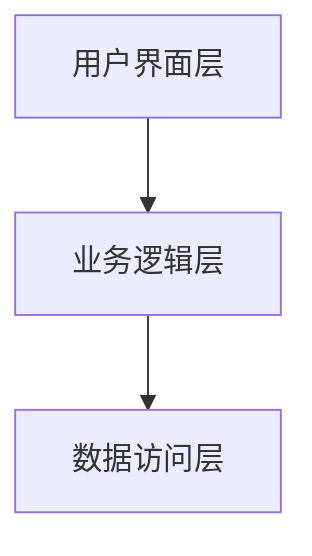
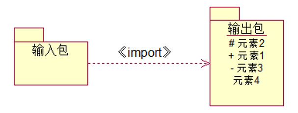
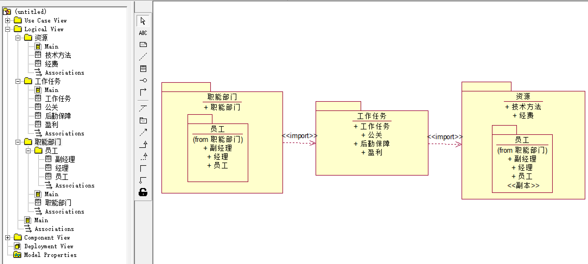

# 模型管理视图

- 模型管理视图是对模型自身组织进行的建模，是由自身的一系列模型元素构成的包所组成的模型。
- 包是操作模型内容、存取控制和配置控制的基本单元。
- 每一个模型元素包含或被包含于其他模型元素中：模型是从某一观点以一定的精确程度对系统所进行的完整描述。模型是一种特殊的包。一个包还可以包含其他的包。整个系统的静态模型实际上可看成是系统最大的包，它直接或间接包含了模型中的所有元素内容。
  - 子系统是另一种特殊的包。它代表了系统的一个部分，它有清晰的接口，这个接口可作为一个单独的构件来实现。任何大的系统都必须被分成几个小的单元，这使得人们可以一次只处理有限的信息，并且分别处理这些信息的工作组之间不会相互干扰。
- 模型管理由包及包之间的依赖组成。模型管理信息通常在类图中表达。

**组织层次结构--三层结构** 如 MVC

- 用户界面层：用户交互。
- 业务逻辑层：系统的业务流程。
- 数据访问层：数据库交互。

# 包图

- 包：将所有模型元素组织成各种功能/用途的模块，并控制包中元素的可见性、描述包之间的依赖关系。

- 包图由包之间的关系组成，描述系统的模块之间的依赖关系。

- 包是可以拥有任何模型元素的通用命名空间：每个建模元素必须在系统中唯一的命名空间进行声明，每个图必须被一个唯一确定的包所有。
- 包构成进行配置控制、存储、访问控制的基础。

| 可见性    | 符号 | 说明                       |
| --------- | ---- | -------------------------- |
| public    | #    | 对所有引入的包及其后代可见 |
| protected | +    | 只对该包的泛化可见         |
| private   | -    | 对包外元素完全不可见       |

- 包是不透明的：通常一个包不能访问另一个包的内容，只有被访问或引入依赖关系才能打开。

- 子系统 subSystem：具有单独说明和实现部分的包、对系统其他部分存在接口的连贯模型单元。

- 构造型 Stereotype

## 关系

- 包的关系有：依赖、泛化。

### 依赖

#### 包的依赖关系

- 包的依赖：两个包所包含的模型元素之间存在一个或多个依赖。
- 基用例依赖扩展用例，基用例依赖被包含用例。
- 包的循环依赖关系：如果把包理解成子系统，那么循环依赖的包意味着这两个子系统的联系是密切的，可能存在高耦合联系，从这个角度看包之间不应该存在有循环依赖的情况。但是，由于包的依赖联系没有传递性，因此，包之间的循环依赖并不完全等同于系统的高耦合联系，应该具体情况具体分析。

#### 引入关系 import

- 引入关系：包与包之间的一种存取依赖关系。引入指允许一个包的元素存取另一个包的公共部分。
- 包的输出：包的公共部分，即其可视性为“公共”的模型元素。包的输出只对另一个与它有引入关系的包才是可视的、可存取的。 

 

- 依赖中扩展和包含的体现：
  - 基用例依赖扩展用例。
  - 基用例依赖被包含用例。

> 系统中有四个包分别是：客户机、服务器、策略、GUI。
>
> - 客户机包中包含三个类：公共的“订货表”类和“追踪表”类，还有一个私有的“订货”类；
> - 策略包中包含两个类:公共的“订货规则”类和私有的“交易规则”类；
> - GUI包中包含三个类：公共的“窗口”类和“表格”类，保护的“事件处理”类；
> - 服务器包中包含两个类：公共的“数据库”类和“登录服务”类。
>
> 其中客户机包需要存取策略包中的“订货规则”类；策略包需要存取GUI包中的“窗口”和“表格”类。
> 根据以上描述绘制包图。
>
> i

> 每个职能部门由一个经理，0-2个副经理和1个以上的员工组成。每个职能部门承担多项工作任务或一项工作任务也可能由多个部门共同承担，工作任务可能是赢利、后勤保障、公关。一项工作任务需要使用一到多种资源，这些资源由设备、经费、技术方法组成。将以下对象类组织成包。
>
>  
>
> 

> 在学生管理系统中，系统的结构设计为三层架构，其中用户服务包中的类为获取数据、显示消息提供了可视化接口。数据服务包中的类负责对数据的存取、更新和维护等。业务服务包是用户服务包和数据服务包的桥梁，业务服务包中的类负责处理用户的请求，执行业务任务。用户服务包和业务服务包之间，业务服务包和数据服务包之间存在着引入依赖关系，用构造型“《import》”标识。根据以上要求，画出系统的包图。
>
>  

### 泛化

- 泛化可以通过嵌套来实现。

### 嵌套

- 包可以拥有其他包作为包内的元素，子包又可以拥有自己的子包。

 

