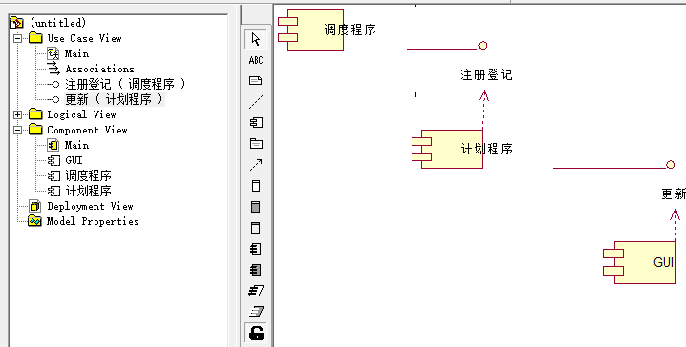
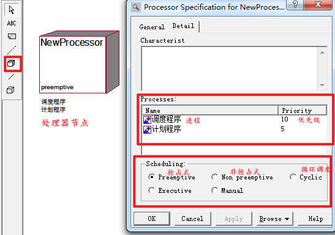
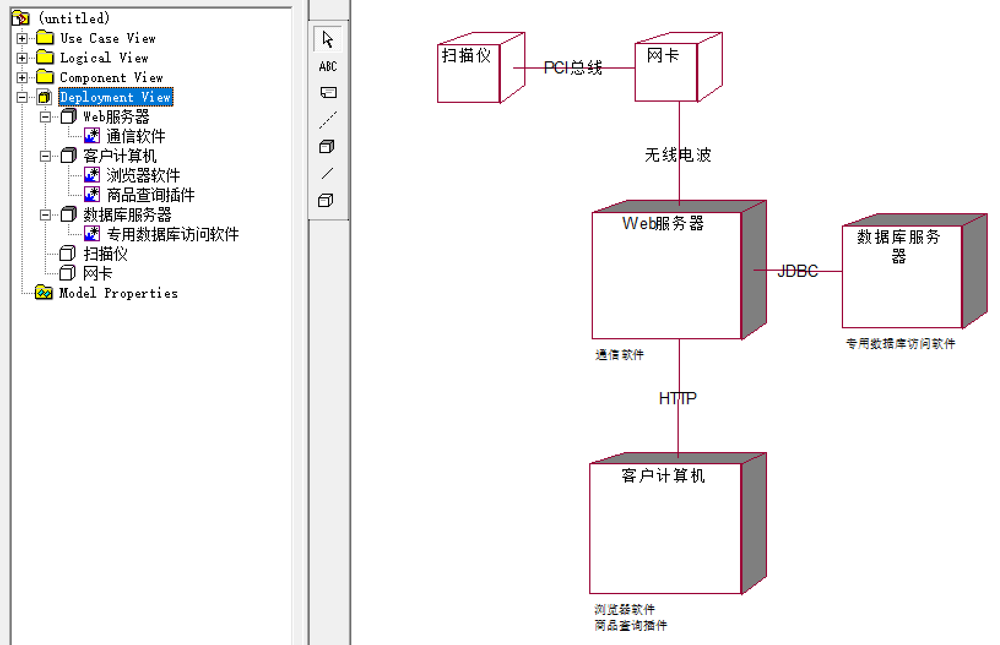

# 物理视图

- 物理视图包含：实现视图（构件图）、部署视图（部署图）。
- 物理视图对应用自身的实现结构建模，提供了将系统中的类映射成物理构件和节点的机制。
- 逻辑方面需要发现和描述对象类、接口、协同、交互和状态机等事物，物理方面需要找出构件和节点。 
- 构件图描述软件的各个构件以及它们之间的关系，部署图描述硬件的各个构件以及它们之间的关系.

# 实现视图（构件图）

- 构件是系统高层的可重用的组成部件：实现视图将系统中可重用的块包装成为具有可替代性的物理单元（构件）。
- 实现视图：构件、构件间的接口、依赖关系。
- 组件图(构件图)=构件（component）+接口（interface）＋关系（relationship） +端口（port）+连接器（connector）
- 构件图：描述各种软件构件之间的依赖关系

 

> 某软件由构件“调度程序”、“计划程序”和“GUI”构成，其中构件“调度程序”实现接口“注册登记”、构件“计划程序”实现接口“更新”，并使用接口“注册登记”，构件“GUI”使用接口“更新”。根据以上信息绘制构件图。
>
> 

## 构件（组件）

- 构件：系统中遵守一组接口且提供其实现的物理的、可替换的部分（物理实现单元）。构件能够完成独立功能，是软件系统的组成部分。
- 良好的构件不依赖于其他构件，而依赖于构件所支持的接口。构件提供接口的实现，一个构件可以实现一个或多个接口。 
- 构件代表了将系统中的类、接口等逻辑模型元素打包后形成的物理模块。

| 构件类型                 | 说明                                                 |
| :----------------------- | :--------------------------------------------------- |
| 基本构件                 | 系统中可执行的元素                                   |
| 包装构件 （扩充构件） | 对基本构件的扩展 一组相关的元素，即构件的命名空间 |

- 构件的命名空间：类、接口、构件、包、用况、依赖、制品。
- 构件的另一含义：可以用构件装配大粒度的构件，方法为把所复用的构件作为大粒度构件的成分，并把他们的请求和提供接口连接在一起。（组件包含组件、组拼大组件）

## 接口

| 接口类型               | 说明                                                   |
| :--------------------- | :----------------------------------------------------- |
| 提供接口 （供接口） | 构件实现的接口 给其他构件提供服务的接口             |
| 请求接口 （需接口） | 构件使用的接口 构件向其他构件请求服务时要遵守的接口 |

 

## 端口

- 端口：描述在构件和其环境之间、构件和其内部构件之间的一个交互点（被分装的构件和外界的交互点），所有进出构件的交互都要通过端口。
- 端口是构件的一部分，端口的实例随着其所属的构件的实例一起被创建和撤销。
- 端口和接口的关系：构件的通讯完全通过端口支持的接口来描述。

## 连接器

- 连接器（连接件）：特点语境下两个部件之间、两个端口之间的通信关系。

### 代理连接器

### 组装连接器

### 装配连接器

## 关系

### 实现关系

- 实现关系：组件与接口之间的联系，代表谁实现了该接口。

### 依赖关系

- 依赖关系：组件使用了另一个组件的接口，依赖于另一个接口的存在。

 

# 部署视图（部署图）

- 部署视图：表示运行时的计算资源（节点）的物理布置。
- 在运行时，节点包含构件和对象，构件和对象的分配可以是静态的，也可以在节点之间迁移。
- 如果含有依赖关系的构件实例放置在不同的节点上，部署视图可以展示出执行过程中的瓶颈。

- 部署图：对部署系统时涉及到的硬件进行建模。
- 一个系统模型只能有一个部署图。
- 标记符：节点、关联关系标记符，描述实际的计算机、设备、连接关系。

### 目的

- 部署图的主要目的：硬件拓扑，代表如何在硬件组件上安装软件，描述了软件以何种方式与硬件交互以执行。

1. 设想系统的硬件拓扑。
2. 表示安装了软件组件的硬件组件。
3. 描述运行时节点的处理。

### 用途

1. 为系统的网络和硬件拓扑建模。
2. 为分布式网络和系统建模。
3. 实施转发和逆向工程流程。
4. 为C/S系统的硬件详细信息建模。
5. 用于对嵌入式系统进行建模。

### 原则

1. 找出所要绘图系统的节点，确定节点。
2. 找出节点间的通信联系。
3. 找出工作。
4. 绘制部署图，每个节点都有名称，写明节点间物理联系的名称。

- 涉及的参数：

1. 高性能
2. 可扩展性
3. 可维护性
4. 可移植性
5. 容易理解

## 节点

- 节点：存在于运行期间的系统的物理元素，代表计算机资源（处理器、其他硬件设备），系统的构件可以配置在节点上。
- 节点实例

| 节点类型   | 说明                                                         |
| ---------- | ------------------------------------------------------------ |
| 处理器节点 | 本身具有计算能力且能执行各软件的节点 包含处理器的调度、进程。 |
| 设备节点   | 本身不具备处理能力的节点。                                   |

- 设备节点：`<<cdrom>>、<<cd-rom>>、<<computer>>、<<disk array>>、<<pc>>、<<pc client>>、<<pc server>>、<<secure>>、<<server>>、<<store>>、<<unix server>>、<<user pc>>`。

 

### 进程、调度策略

| 调度策略                  | 说明                                                         |
| :------------------------ | ------------------------------------------------------------ |
| Preemptive 抢占式         | 默认，高优先级的进程可以抢占低优先级的进程。                 |
| Non preemptive 无优先方式 | 进程没有优先级，当前进程在执行完毕后再执行下一个进程。       |
| Cyclic 循环调度           | 进程循环控制，每个进程都有一定的时间，超过时间 或 执行完毕后交给下一个进程执行。 |
| Executive                 | 使用计算机算法控制进程调度                                   |
| Manual                    | 用户手动计划进程调度                                         |

 

## 物件

- 物件（`<<artifact>>`）：软件开发过程中的产物，包括过程模型（用例图、设计图等）、源代码、可执行文件、设计文档、测试报告、需求模型、用户手册等。

## 连接

- 连接：两个节点之间的硬件连接，连接通常是双向的，有网络协议。

> 假定系统的功能为允许用户通过Web对检索的商品进行扫描。更加详细的软硬件部署需求为：扫描仪通过PCI总线连接到网卡；网卡通过无线电波与Web服务器通信，Web服务器通过HTTP协议与客户计算机通信；将通信软件安装在Web服务器上，通过JDBC协议与数据库服务器连接，并使用专用数据库访问软件与数据库服务器通信；在客户计算机上安装浏览器软件，并在其上运行商品查询插件。按照以上软硬件部署需求绘制部署图。
>
>  

## 节点容器

- 节点容器：包含其他节点的节点（组件、物件等）。

