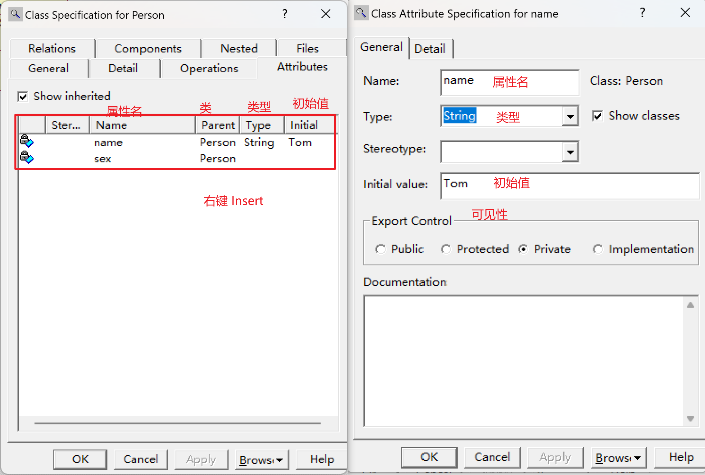
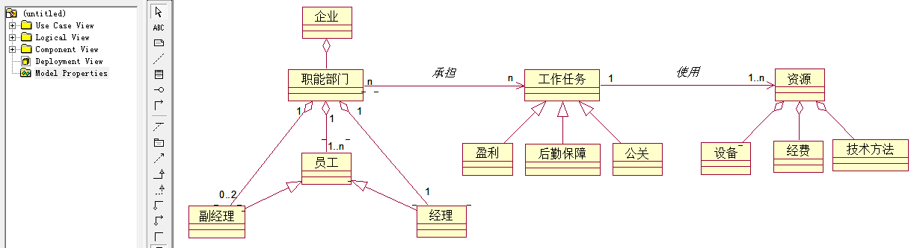
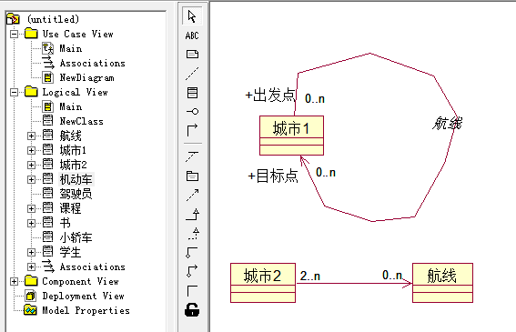
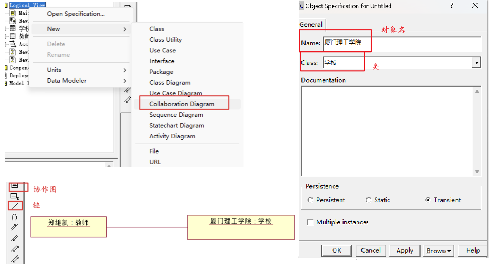

# 静态视图

- 静态视图的基本元素是类元和类元之间的关系，可视化表达的图主要是类图。
- 类元是描述事物的基本建模元素，包括：类、接口、数据类型等。

1. 静态视图是UML的基础，描绘客观现实世界的基本认知元素，是建立一个系统所需概念的集合。
2. 静态视图包括：类（对象数据结构、对数据的操作）。
3. 静态视图是构建其他动态视图的基础，将具体的数据操作使用离散的模型元素进行描述，说明交互作用的进行。

# 类图 Class

- 类图描述系统的静态结构：定义系统中的类、描述类之间的关系、类的内部结构，在系统的整个生命周期中有效。

1. 为系统的词汇建模。
2. 模型化逻辑数据库模式。
3. 模型化简单的协作。

- 通常在用例视图Use Case View创建Class Diagram。

## 类

- 类：一组具有相同属性、操作、关系和语义的事物的抽象。

### 类的基本结构

 

#### 属性

 

#### 方法

 

#### 可见性

| 关键字       | 名称       | 符号 | 图标 | 语义                                          |
| ------------ | ---------- | ---- | ---- | --------------------------------------------- |
| public       | 公有类型   | `+`  |      | 允许在类的外部使用或查看该属性/操作           |
| protected    | 受保护类型 | `#`  |      | 子类允许访问父类中受保护类型的属性/操作       |
| private      | 私有类型   | `-`  |      | 只有类本身才能访问到属性/操作，外部一概不允许 |
| Implemention | 实现类型   |      |      | 属性/操作仅在被定义的包中可见                 |

#### 约束 Constriant

#### 职责 Responsibility

### 类的类型

#### 实例化类 InstantiatedClass

#### 参数化类（模板类） ParameterizedClass

### 类的构造型

- 实体类：保存永久信息的存储体。

- 控制类：负责协调其他类的构造，本身不完成任何业务功能。
- 边界类：位于系统与外界的交界处，包括所有的窗体、报表、打印机等硬件的接口以及其他系统的接口。

 

## 关系

- 关系：角色、名称、多重性（1..n）。

- 由类与类之间的耦合度从弱到强：依赖 < 关联 < 聚合 < 组合 < 泛化 = 实现

> 企业由职能部门组成，每个职能部门由一个经理，0-2个副经理和1个以上的员工组成。每个职能部门承担多项工作任务或一项工作任务也可能由多个部门共同承担，工作任务可能是赢利、后勤保障、公关。一项工作任务需要使用一到多种资源，这些资源由设备、经费、技术方法组成。
>
>  

### 依赖

- 提供者的某些变化会要求或指示依赖关系中客户的变化。

 

### 关联

- 描述对象/实例之间的离散连接。
- 关联类：即是关联也是类，关联本身也有其特性需要描述时。
- 链：关联的一个实例，不独立于对象而存在，是所涉及对象的一个有序表，每个对象必须是关联中对应类的实例或此类后代的实例。

 

> 某系统需要创建三个类“课程”、“学生”和“书”。其中“课程”类含有一个私有属性“课程号”，一个公共操作“选择课程”。学生需要知道课程号，并调用操作“选择课程”才能完成选课。“书”类含有一个私有属性“书号”，一个公共操作“借书”。学生需要知道“书号”，并调用操作“借书”才能完成借阅。为了区分这两个关联的语义，将学生类在两个关联关系中的角色分别命名为“学员”和“借阅者”。将上述需求在ROSE中用类图表达出来。
>
>  

> 1名教师可以为多名学生指导论文，每名学生只能由1名教师指导论文。使用关联类和一般类表达。
>
>  

> 学生可以是在校生或者毕业生。
> 助教必须是在校生。
> 一名助教指导一名学生。
> 教师和教授属于不同级别的教员。
> 一名教师助理可以协助一名教师或一名教授，一名教师最多只能有一名教师助理，一名教授最多可以有5名教师助理。
> 教师助理必须是毕业生。
>
>  

#### 自返关联（递归关联）(一元关联)

- 一个对象类与本身的关联，即类内两个对象的关联。

> 

#### N元关联

- 在3个及以上的对象类之间发生的关联，N元关联的每个实例是被关联的类的对象的多元组。

### 聚合 Aggregation 、组合 Composition

 

> 已知“机床”类和“抽风机” 类都有一组属性和操作描述其中的电动机，则可考虑把这些共同的属性和操作分离出来，设立一个“电动机”类，使之与原先的两个类构成整体-部分结构。将上述需求用ROSE绘制出来。
>
>  

**聚合和组合的区别**

- 相同点：描述部分和整体的关系。

- 聚合关系：成员对象（部分）的生命周期不取决于整体的生命周期：教师和学校。
- 组合关系：成员对象（部分）的生命关系取决于整体的生命周期：手和人体。

### 泛化

- is a kind of ...：父类和子类。 

1. 可替代性
2. 多态操作
3. 继承

### 实现

- 类和接口之间的实现关系。

 

**泛化和实现的关系**

- 泛化和实现关系都可以将一般描述和具体描述联系。
- 泛化：将同一语义层的元素连接，通常在同一模型内。
- 实现：将不同语义层的元素连接，通常在不同模型内。

# 对象图

- 协作图来创建对象。
- 对象之间的关系只有链。

 

## 发现对象

- 先松后紧：候选对象。

**1.问题域、系统边界、系统责任**

1. 人员
2. 组织
3. 物品
4. 抽象事物
5. 事件
6. 文件
7. 系统外人员
8. 系统责任

**2.审查、筛选**

1. 舍弃：是否提供了有用的属性操作。
2. 精简：
   - 对有多个操作，但是每个操作只有一个使用者的，分配到相应的使用者中合并。
3. 特殊结构-->子类：将不适用于所有对象的属性和操作分发给相应的子类。
4. 属性和操作相同的两个类：考虑合并为一个类
5. 属性和操作相似的两个类：一般-特殊结构或者部分-整体关系。
