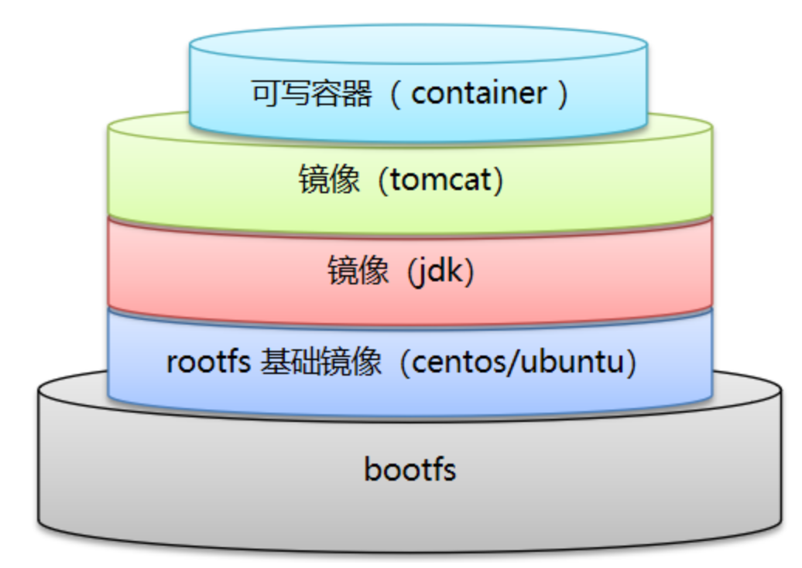

# Docker概述

- 容器技术只隔离应用程序的运行时环境但容器之间可以共享同一个操作系统（程序的运行只和容器有关，即屏蔽环境差异）。

- docker将程序以及程序所有的依赖都打包到docker container。

 

| 概念       | 说明                        |
| ---------- | --------------------------- |
| Dockerfile | 自动化脚本（创建Image）     |
| Image      | 镜像（创建Container的模板） |
| Container  | 容器                        |
| **其他**   | **说明**                    |
| Repository | 仓库（存放镜像）            |

## [Docker命令](https://docs.docker.com/reference/)


> portainer 界面工具。

```shell
# mysql5.7启动
docker run -it --name mysql5.7 \
-p 3306:3306 \
-e MYSQL_ROOT_PASSWORD=root \
-e MYSQL_UNIX_SOCKET=/tmp/mysql.sock \
-d mysql:5.7
```

## image Docker镜像

> UnionFS（联合文件系统）：分层、轻量级、高性能的文件系统，是Docker镜像的基础（所有镜像都基于其基础镜像）。

| 层次   | 说明                                               |
| ------ | -------------------------------------------------- |
| bootfs | Docker最底层，包含bootloader、kernel。<br />公用。 |
| rootfs | 底层直接使用Host的kernel，只需要基本的指令集。     |

- Docker镜像是只读的。当容器启动时，新的可写层（容器）被加载到镜像层顶部，用户的操作都基于容器层。



## volume 容器数据卷

- volume：容器之间数据共享（本地挂载目录）。

> 只要数据卷还存在，删除任何容器都不会导致其他容器在该数据卷中的数据被删除。

```shell
# 指定容器的数据卷
-v [卷名: | /主机目录:]{/容器目录}[:ro | :rw]
# 默认主机目录 /var/lib/docker/volumes，主机目录会覆盖容器目录的内容。
```

> docker inspect `{containerID}`的`"Mount":[{}]`查看挂载具体信息。

```shell
# 继承指定容器（数据卷容器）的数据卷（共用同一个）
--volumes-from {containerName}
```

## [Dockerfile](https://docs.docker.com/engine/reference/builder/)


```shell
# 通过DockerFile构建镜像
docker build [-f {dockerFile}] -t {imageName[:tag]} .
# 如果当前目录下存在文件名为Dockerfile，Docker自动寻找该文件（不需要-f指定）
# 镜像名称必须小写
```

> ```shell
> # 查看镜像构建过程
> docker history {imageID}
> ```

| 执行时机 | DockerFile命令 | 说明                                               |
| -------- | -------------- | -------------------------------------------------- |
| 镜像构建 | FROM           | 基础镜像                                           |
|          | MAINTAINER     | `姓名<邮箱>`                                       |
|          | ENV            | 环境变量                                           |
|          | WORKDIR        | 工作目录                                           |
|          | RUN            | 运行命令                                           |
|          | ADD            | 复制到镜像（自动解压）                             |
|          | COPY           | 复制到镜像                                         |
|          | VOLUME         | 数据卷                                             |
|          | EXPOSE         | 暴露端口                                           |
|          | ONBUILD        |                                                    |
| 容器启动 | CMD            | 运行命令，只有最后一个CMD会执行（替换之前的CMD）。 |
|          | ENTRYPOINT     | 运行命令，在之前ENTRYPOINT基础上追加命令。         |

```dockerfile
FROM ubuntu
MAINTAINER zjk<1054860443@163.com>

ENV MYPATH /usr/local

WORKDIR $MYPATH

RUN touch t1.txt

COPY ReadMe.md /usr/local

ADD apache-tomcat-9.0.80.tar.gz /usr/local

ENV CATALINA_HOME /usr/local/apache-tomcat-9.0.80
ENV CATALINA_BASH /usr/local/apache-tomcat-9.0.80
ENV PATH $PATH:CATALINA_HOME/lib:CATALINA_HOME/bin

EXPOSE 8080

CMD echo "---Tomcat OK---" && pwd
```

### DockerHub国内源

[阿里云-镜像容器服务](https://cr.console.aliyun.com/cn-shenzhen/instances)

[阿里云-镜像仓库文档](https://cr.console.aliyun.com/repository/cn-shenzhen/zhengjk/zhengjk-repo/details)

# Docker0网络 network

> docker run --link 在hosts中配置连接到的容器ip地址（单向的）。不建议使用。

Docker0

| 网络模式  | 说明             |
| --------- | ---------------- |
| bridge    | 默认，桥接       |
| none      | 不配置网络       |
| host      | 和宿主机共享网络 |
| container | 容器网络连通     |

```shell
# docker run 默认--net bridge
--net {bridge | networkName}
```

