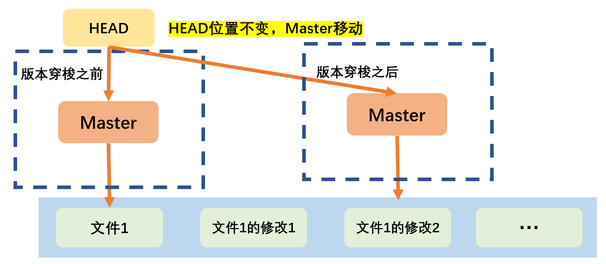
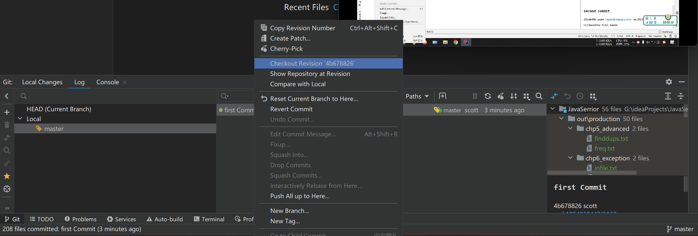
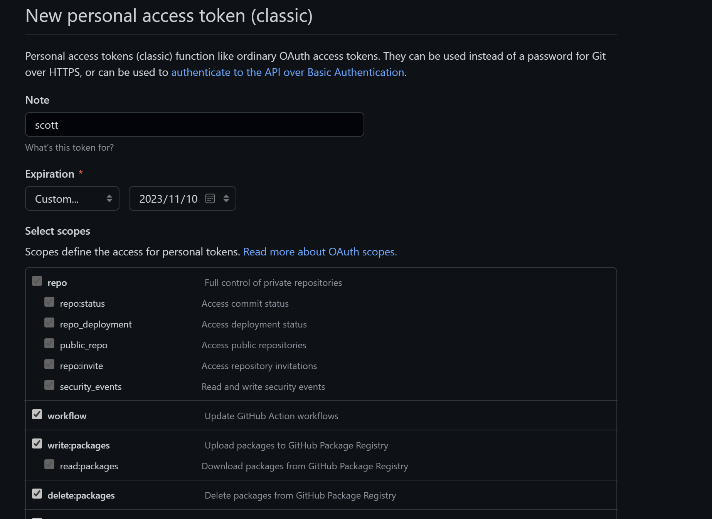
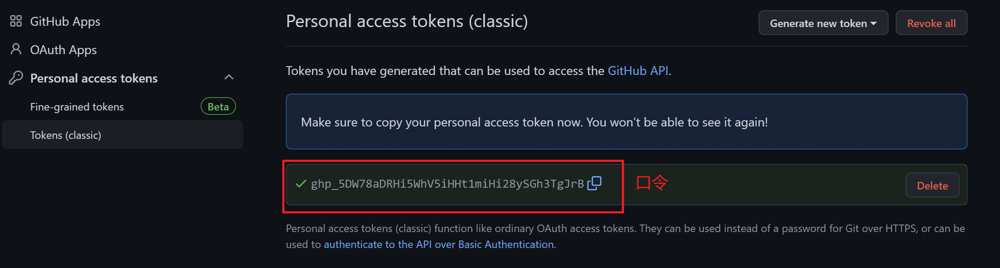

# Git基础

## Git初始化

1. 设置Git用户名、用户签名：首次安装Git时必须设置用户签名，否则无法提交代码。

```git
git config --global user.name 用户名
git config --global user.email 邮箱(不会检验邮箱是否正确)
```

2. 初始化本地库：目标文件目录位置再右键打开Git Bash，自动切换到该路径。

```git
git init
```

## 基础命令

| 基础命令                            | 说明           |
| :---------------------------------- | :------------- |
| `git status`                        | 查看本地库状态 |
| `git add 文件名`                    | 添加到暂存区   |
| `git -rm --cached 文件`             | 从暂存区移除   |
| `git commit [-m "日志信息"] 文件名` | 提交到本地库   |

## 版本控制

- 版本指针的移动：在完成提交之后，会有新的历史版本，同时指针指向该版本。
- 指针文件：`Xxx/.git/refs/heads/分支`。

| 命令       | 说明             |
| :--------- | :--------------- |
| git reflog | 查看版本信息     |
| git log    | 查看版本详细信息 |
| git reset  | 版本穿梭         |

 

## 分支

- 分支：在开发过程中，任何分支的修改都不会对其他分支有影响。通过并行推进多个分支，提高开发效率。

### 分支管理命令

| 命令         | 说明          |
| :----------- | :------------ |
| git branch   | 创建/查看分支 |
| git checkout | 切换分支      |
| git merge    | 分支合并      |

 

### 冲突合并

- 冲突合并：合并分支时，两个分支在同一个文件的同一个位置有两套完全不同的修改。Git无法决定要保留哪个修改，进入MERGING状态，由我们选择保留/修改的内容。只会修改合并到的分支的文件，要被合并的分支不受影响。

## GitHub/Gitee 远程仓库

### 远程管理命令

| 命令       | 说明                                                         |
| :--------- | :----------------------------------------------------------- |
| git remote | 远程地址                                                     |
| git push   | 推送本地仓库上的内容到远程仓库<br />本地库的版本必须高于远程库的版本。 |
| git pull   | 拉取远程库到本地库、且直接合并后自动提交到本地库             |
| git clone  | 克隆远程仓库到本地                                           |

- 版本穿梭之后，本地仓库和远程仓库版本不一致时，只能使用强制推送覆盖远程仓库。

```shell
git push -f 远程仓库地址 远程分支
```

### SSH 公钥与私钥

- 对于网络连接情况不好的，如国外网站，尽量使用SSH协议，而不是HTTP协议；对于国内的使用HTTP协议即可。

| ssh文件    | 说明 |
| ---------- | ---- |
| id_rsa     | 私钥 |
| id_rsa.pub | 公钥 |

```shell
# 生成私钥和公钥
ssh-keygen -t rsa -C 邮箱
```

```shell
# ssh-keygen -t rsa -C zjk1054860443@163.com
Generating public/private rsa key pair.
Enter file in which to save the key (/c/Users/zjk10/.ssh/id_rsa): 生成的ssh文件路径（回车跳过）
Created directory '/c/Users/zjk10/.ssh'. 
Enter passphrase (empty for no passphrase): （回车跳过）
Enter same passphrase again: （回车跳过）
Your identification has been saved in /c/Users/zjk10/.ssh/id_rsa
Your public key has been saved in /c/Users/zjk10/.ssh/id_rsa.pub
The key fingerprint is:
SHA256:Jo45BrJ4Vp9MtMque+T74/vDotYPCrI8wyBMtl6VE8U zjk1054860443@163.com
The key's randomart image is:
+---[RSA 3072]----+
|      o.         |
|     . E         |
|      +          |
| o   = .         |
|= o o = S        |
|+= =.O +         |
|O =oB.*.         |
|.X ++o+.o        |
|..====+*o.       |
+----[SHA256]-----+
```

- 获取公钥：

```shell
# cd ~/.ssh
# ll
total 5
-rw-r--r-- 1 zjk10 197609 2610 Nov  9 23:27 id_rsa
-rw-r--r-- 1 zjk10 197609  575 Nov  9 23:27 id_rsa.pub

# cat id_rsa.pub
# 复制以下公钥到GitHub即可：
ssh-rsa AAAAB3NzaC1yc2EAAAADAQABAAABgQDCo4Y42+qZM6Z0Y3dXnkOnWrP1zhJHfz3v6bRRkHt8o+OtLN1nKK51Lcf05E/ObMsaReKSMwwIomxHYKcpU82A8G5/TekMaYcESSrIgM2jm0k/CTAbSgMC1C0VtSC7ORWUAW6HdNcolusF7lD80Bs61P7A8gr2jYryHBbQfM2vp7n/9BsulTshxPT2azVAhHiz/iaC915eQuLEwvnQMsdGKsplECz2V1WcH8hzy8txiHQJDLYkth5wnBfzBNC8+NjDfAeIAvrk16p9s364grQtt1Hj1lCTeWuqhvQ/JnoyM5G6jQHMxzUIpUpejZF6CJdPpDAYsRm/wTLKeerBpapUh7/TS1nnxbIxiXg6b32UTzdwllggWox7Qj2HbBpdg6MMdCPUlyZWUVpgzjUHf6LSvr0g2h3wSKLWLZWMKbHih2REjKawAGV+6y5JzzfVFSYYN0PnQQwtLHbiJoygRxZ6290tRfpW1vcLvC7/wXFzSASB1WZbvRRBm4HgIAKa8Pc= zjk1054860443@163.com
```

 

# git config 

## alias 命令别名

- 命令别名：简化git命令的使用。文件位置：用户目录下的.gitconfig。

| 语句                                                         | 操作                                       |
| ------------------------------------------------------------ | ------------------------------------------ |
| `git config --global alias.命令别名 '原git命令'`             | 新建全局命令别名                           |
| `git config --global --unset alias.命令别名`                 | 删除全局命令别名                           |
| `git config --local alias.命令别名 '原git命令'`<br />`git config alias.命令别名 '原git命令'` | 新建局部命令别名<br />（只对当前仓库有效） |
| `git config --global --remove-section alias`                 | 删除所有全局别名                           |
| `git config --remove-section alias`                          | 删除所有局部别名                           |

- 相当于`~/.gitconfig`中：

```
[alias]
    book = "!f(){git add --all;git commit -m "$1";git push book;};f"
```

# \.ignore 忽略文件

```
*.class

*.log

*.ctxt

.mtj.tmp/

*.jar
*.war
*.nar
*.ear
*.zip
*.tar.gz
*.rar

hs_err_pid*

.classpath
.project
.settings
target
.idea
*.iml
```

- `~/.gitconfig`文件引用的忽略配置文件：

```
[user]
    name = scott
    email = zjk1054860443@163.com
[core]
    excludesfile = C:/Users/zjk10/git.ignore （忽略配置文件的路径）
```

# IDEA&Git

## 版本控制

- 查看版本信息：

 

- 版本穿梭：

 

## 冲突合并

 

## 口令登录 Token

 

- 设置口令权限：

 

- 获取口令并在IDEA中设置：

 

# 子模块

```shell
# 将另一个仓库作为子模块加入到当前仓库
git submodule add <url> 子模块名
# url 可以是本地地址，也可以是远程仓库地址

# 查看 Git 子模块的信息
git submodule status

# 删除子模块，如果存在.gitmodules，则删除对应的条目；之后执行以下命令
git rm --cached 子模块名
# 上一条命令仍然没有用，则追加执行这一条
# rm -rf .git/modules/子模块名
```

- 当前仓库进行`add commit push`等操作时，如果子模块没有提交，则只会执行到该子模块之前提交过的最新版本，即`modified:   captain-vue (modified content)`
- 对于嵌套的仓库，有两种处理方法：

1. 作为子模块加入
2. 移除被嵌套在内的仓库的`.git`，使其不再作为一个仓库，而是普通目录

