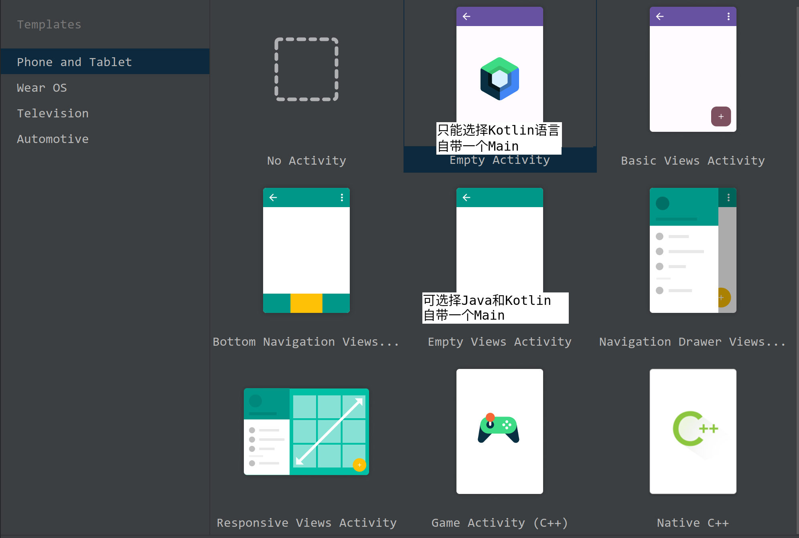

# Gradle

## 安装配置

- 环境变量配置
1. JAVA_HOME

2. GRADLE_HOME：gradle-8.2.1/bin/gradle.bat文件。

```shell
export GRADLE_HOME=/opt/gradle-8.2.1
export PATH=$PATH:$GRADLE_HOME/bin
```

3. 输入gradle命令测试。

 

## 项目结构

```shell
gradle init
```

> application：
> 
> 

### .gradle

- 构建文件（.gradle）：默认build.gradle，通常位于项目文件的根目录。

- Gradle指令：需要在包含构建文件（build.gradle）的目录下执行。

| 指令             | 说明            |
| -------------- | ------------- |
| gradle clean   | 清空build目录     |
| gradle classes | 编译业务代码和配置文件   |
| gradle test    | 编译测试代码，生成测试报告 |
| gradle build   | 构建项目          |

#### .gradle 执行


#### Project、Task



| 项目属性        | 类型           | 默认值                 |
| ----------- | ------------ | ------------------- |
| project     | Project      | 该Project实例          |
| name        | String       | 项目目录的名称。            |
| path        | String       | 项目的绝对路径。            |
| description | String 项目说明。 |                     |
| projectDir  | File         | 包含构建脚本的目录。          |
| buildDir    | File         | *projectDir* /build |
| group       | Object       | unspecified         |
| version     | Object       | unspecified         |
| ant         | ant build    | 一个AntBuilder实例      |

#### repositories 仓库源

```groovy
repositories {
    mavenLocal()
    maven{name "aliyun"; url "https://maven.aliyun.com/repository/public"}
    mavenCentral()
}
```

#### dependencies 依赖

| 依赖方式                      | 说明                                   |
| ------------------------- | ------------------------------------ |
| compileOnly               | 编译生产代码所必需的依赖关系，<br/>但不应该属于运行时类路径的一部分 |
| implementation（取代compile） | 编译和运行时                               |
| runtimeOnly（取代runtime）    | 仅在运行时使用，不用于编译                        |
| testCompileOnly           | 测试相当于compileOnly                     |
| testImplementation        | 测试相当于 implementation                 |
| testRuntimeOnly           | 测试相当于 runtimeOnly                    |

### gradle wrapper

- gradlew指令（gradle wrapper）：对Gradle的包装，不同项目Gradle版本不一致的问题。

> gradlew：对不同版本的Gradle（他人项目、历史项目等）。
> 
> gradle：本地新建项目。 

- gradle-wrapper.properties：首次执行 ./gradlew build时，gradlew读取gradle-wrapper.properties中的配置信息，将指定的Gradle下载并解压到指定目录（GRADLE_USER_HOME/wrapper/dists），并构建本地缓存（GRADLE_USER_HOME/caches）。

> GRADLE_USER_HOME：环境变量。如果未配置，则默认为`$USER_HOME/.gradle`。

```properties
# 解压后的目录
distributionBase=GRADLE_USER_HOME
distributionPath=wrapper/dists

# Gradle下载
distributionUrl=https\://services.gradle.org/distributions/gradle-8.2.1-bin.zip
networkTimeout=10000
validateDistributionUrl=true

# 下载的压缩包存放目录
zipStoreBase=GRADLE_USER_HOME
zipStorePath=wrapper/dist
```


# Android Studio

## 基本安装配置

### Http Proxy

- 网络代理：可以选择No，无太大影响。

### 本地Gradle替换

- 替换Android Studio的Gradle，避免长时间的自动下载Gradle

 

### 项目创建选择

 

## Kotlin DSL Gradle

### build.gradle.kts

### gradle.properties

### gradlew

### gradlew.bat

### local.properties

### settings.gradle.kts

```kotlin
pluginManagement {
    repositories {
        google()
        mavenCentral()
        // 添加国内阿里云仓库
        maven("https://maven.aliyun.com/repository/google")
        maven("https://maven.aliyun.com/repository/jcenter")
        // 或者使用其他国内镜像源
        // maven("https://mirrors.tencent.com/maven/repository/android/public/")
    }
}

dependencyResolutionManagement {
    repositoriesMode.set(RepositoriesMode.FAIL_ON_PROJECT_REPOS)
    repositories {
        google()
        mavenCentral()
        // 同样添加国内阿里云仓库或者其他你信任的国内源
        maven("https://maven.aliyun.com/repository/google")
        maven("https://maven.aliyun.com/repository/jcenter")
    }
}

rootProject.name = "ProphetApp"
include(":app")
```

## Groovy

[The Apache Groovy programming language - Documentation](http://www.groovy-lang.org/documentation.html)

- Groovy：Java脚本化改良版。
1. 支持函数式编程，不需要main函数。

2. 默认导入常用包。

3. 类不支持default作用域，默认作用域为public。

4. 基本数据类型也是对象。

5. 支持DSL（Domain Specific Languages）等语法。

```shell
export GROOVY_HOME=/opt/groovy-4.0.13
export PATH=$PATH:$GROOVY_HOME/bin
```

- Groovy：脚本文件（Script 脚本类）、面向对象（GroovyObject）、混合编程。

> 混合编程：脚本文件中不能定义和文件名相同的类，编译时已经存在。

1. def：动态类型声明，定义变量、方法。

> 没有可见性声明的字段也自动转换为变量。

2. 语句结束：分号、换行。

3. 对象：

```groovy
//属性赋值
obj.name = 'Jac'
obj["name"]
obj.setter()
构造器
//属性读取
obj.name
obj["name"]
obj.getter()
```

> getter、setter方法由Groovy自动生成。
> 
> final修饰不默认生成setter。

4. 方法：

| 方法  | 说明                                                 |
| --- | -------------------------------------------------- |
| 声明  | 可省略参数类型、返回值类型<br/>返回值：return、默认使用方法的最后一句的值作为方法的返回值 |
| 调用  | 不引起歧义时可省略()                                        |

5. 字符串：

| 引号  | 说明                                |
| --- | --------------------------------- |
| 单引号 | 字符串常量、无计算能力                       |
| 双引号 | 变量引用`${}`、有计算能力<br/>不引起歧义时可省略`{}` |
| 三引号 | 模板字符串、支持换行                        |

6. 集合：Groovy的集合中可存放多种类型。

7. import：Groovy自动导入常用包。

> ```groovy
> import java.lang.*
> import java.util.*
> import java.io.*
> import java.net.*
> import groovy.lang.*
> import groovy.util.*
> import java.math.BigInteger
> import java.math.BigDecimal
> ```

8. 闭包（Closure）：

```groovy
def obj = { i ->
    print("This is ${i}.");
}
obj(1)

def run(Closure closure){
    closure(2);
}
```
