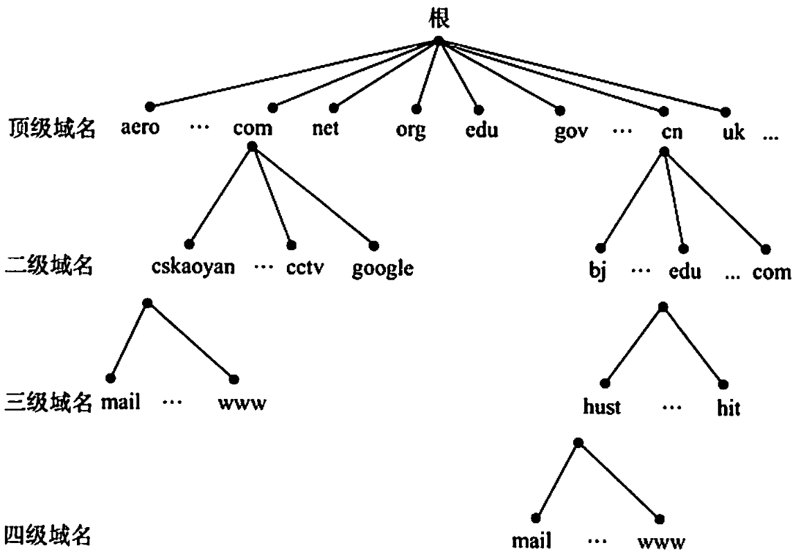
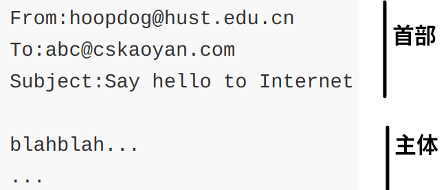

# 网络应用模型

## 客户/服务器模型 C/S

 

- 在客户/服务器（Client/Server，C/S）模型中，有一个总是打开的主机被称为服务器，其服务于许多来自其他被称为客户机的主机请求。服务器的工作流程如下：

1. 服务器处于接收请求的状态。
2. 客户机发出服务请求，并等待接收结果。
3. 服务器收到请求后，分析请求，进行必要的处理，得到结果并发送给客户机。

- C/S模型最主要的特征是：客户是服务请求方，服务器是服务提供方。

<table>
    <tr>
        <td width="15%">客户程序</td>
        <td width="85%">客户程序必须知道服务器程序的地址，客户机上一般不需要特殊的硬件和复杂的操作系统</td>
    </tr>
    <tr>
        <td>服务器程序</td>
        <td>服务器上运行的软件则是专门用来提供某种服务的程序，可同时处理多个远程或本地客户的要求。系统启动后即自动调用并一直不断地运行着，被动地等待并接收各地客户的请求。因此，服务器程序不需要知道客户程序的地址</td>
    </tr>
</table>

- 常见的C/S模型的应用包括Web、文件传输协议（FTP）、远程登录和电子邮件等。
- C/S模型的主要特点还有：

1. 网络中各计算机的地位不平等，服务器可以通过对用户权限的限制来达到管理客户机的目的，使它们不能随意存储/删除数据，或进行其他受限的网络活动。整个网络的管理工作由少数服务器担当，因此网络的管理非常集中和方便。服务器性能的好坏决定了整个系统的性能，当大量用户请求服务时，服务器就必然成为系统的瓶颈。
2. 客户机相互之间不直接通信。例如，在Web应用中两个浏览器并不直接通信。
3. 可扩展性不佳。受服务器硬件和网络带宽的限制，服务器支持的客户机数有限。

## P2P模型

 

- P2P模型的思想是整个网络中的传输内容不再被保存在中心服务器上，每个结点都同时具有下载、上传的功能，其权利和义务都是大体对等的。 

- 在P2P模型中，各计算机没有固定的客户和服务器划分。相反，任意一对计算机称为对等方（Peer），直接相互通信。实际上，P2P模型从本质上来看仍然使用客户/服务器模式，每个结点既作为客户访问其他结点的资源,也作为服务器提供资源给其他结点访问。
- 当前比较流行的 P2P应用有PPlive、Bittorrent 和电驴等。
- 与C/S 模型相比，P2P模型的优点主要体现如下:

1. 减轻了服务器的计算压力，消除了对某个服务器的完全依赖，可以将任务分配到各个结点上，因此大大提高了系统效率和资源利用率。（例如，播放流媒体时对服务器的压力过大，而通过P2P模型，可以利用大量的客户机来提供服务）
2. 多个客户机之间可以直接共享文档。
3. 可扩展性好，传统服务器有响应和带宽的限制，因此只能接受一定数量的请求。
4. 网络健壮性强，单个结点的失效不会影响其他部分的结点。

- P2P模型也有缺点：在获取服务的同时，还要给其他结点提供服务，因此会占用较多的内存，影响整机速度。例如，经常进行P2P下载还会对硬盘造成较大的损伤。据某互联网调研机构统计，当前P2P程序已占互联网50%~90%的流量，使网络变得非常拥塞，因此各大ISP（互联网服务提供商，如电信、网通等）通常都对P2P应用持反对态度。

# 域名系统 DNS

- 域名系统（Domain Name System，DNS）是因特网使用的命名系统，用来便于记忆的具有特定含义的主机名转换为便于机器处理的IP地址。
- DNS系统采用C/S模型，其协议运行在UDP之上，使用53号端口。
- 从概念上可将DNS分为3个部分：层次域名空间、域名服务器、解析器。

## 层次域名空间

- 因特网采用层次树状结构的命名方法，任何一个连接到因特网的主机或路由器，都有一个唯一的层次结构名称（域名，Domain Name）。
- 域（Domain）是名字空间中一个可被管理的划分，域可被划分为子域，而子域还可以继续划分为子域的子域，由此形成顶级域、二级域、三级域等。每个域名都由标号序列组成，而各标号之间用点（“.”）隔开。

 

- 关于域名中的标号有几点注意：

1. 标号中的英文不区分大小写。
2. 标号中除连字符（-）外不能使用其他的标点符号。
3. 每个标号不超过63个字符，多标号组成的完整域名最长不超过255个字符。
4. 级别最低的域名写在最左边，级别最高的顶级域名写在最右边。

- 顶级域名（Top Level Domain，TLD）分为以下三类：

<table>
    <tr>
        <td width="20%">国家（地区）顶级域名 nTLD</td>
        <td width="80%">国家和某些地区的域名。如“.cn”表示中国、“.us”表示美国、“.uk”表示英国</td>
    </tr>
    <tr>
        <td>通用顶级域名 gTLD</td>
        <td>常见的有“.com”公司、“.net”网络服务机构、“.org”非营利性组织、“.gov”国家或政府组织</td>
    </tr>
    <tr>
        <td>基础结构域名</td>
        <td>该类顶级域名只有一个，“arpa”反向域名，用于反向域名解析</td>
    </tr>
</table>

- 国家（地区）顶级域名下注册的二级域名均由该国家（地区）自行确定。
- 在域名系统中，每个域分别由不同的组织进行管理。每个组织都可以将它的域再分成一定数目的子域，并将子域委托给其他组织去管理。

 

## 域名服务器

- 因特网的域名系统被设计成一个联机分布式的数据库系统，并采用C/S模型。域名到IP地址的解析是由运行在域名服务器上的程序完成的，一个服务器所负责管辖的（或有权限的）范围称为区（而不是“域”为单位），各单位根据具体情况来划分自己管辖范围的区，但在一个区中的所有结点必须是能够连通的，每个区设置相应的权限域名服务器，用来保存该区中的所有主机的域名到IP地址的映射。每个域名服务器不但能够进行一些域名到IP地址的解析，而且还必须具有连向其他域名服务器的信息。当自己不能进行域名到IP地址的转换时，能够知道到什么地方去找其他域名服务器。
- DNS使用了大量的域名服务器，它们以层次方式组织。没有一台域名服务器具有因特网上所有主机的映射，相反，该映射分布在所有的DNS上。
- DNS主要有4种类型的域名服务器：

<table>
    <tr>
        <td width="20%" rowspan="3">根域名服务器</td>
        <td width="80%">根域名服务器是最高层次的域名服务器，所有的根域名服务器都知道所有的顶级域名服务器的IP地址。根域名服务器也是最重要的域名服务器，不管是哪个本地域名服务器，若要对因特网上任何一个域名进行解析，只要自己无法解析，就首先要求助于根域名服务器。</td>
    </tr>
    <tr>
        <td>因特网上有13个根域名服务器，尽管我们将这13个根域名服务器中的每个都视为单个服务器，但每个“服务器”实际上是冗余服务器的集群，以提供安全性和可靠性。</td>
    </tr>
    <tr>
        <td>根域名服务器用来管辖顶级域（如.com），通常它并不直接把待查询的域名直接转换成IP地址，而是告诉本地域名服务器下一步应当找哪个顶级域名服务器进行查询。</td>
    </tr>
    <tr>
        <td>顶级域名服务器</td>
        <td>这些域名服务器负责管理在该顶级域名服务器注册的所有二级域名。收到DNS查询请求时，就给出相应的回答（可能是最后的结果，也可能是下一步应当查找的域名服务器的IP地址）</td>
    </tr>
    <tr>
        <td>授权域名服务器 （权限域名服务器）</td>
        <td>每台主机都必须在授权域名服务器处登记。为了更加可靠地工作，一台主机最好至少有两个授权域名服务器。实际上，许多域名服务器都同时充当本地域名服务器和授权域名服务器。授权域名服务器总能将其管辖的主机名转换为该主机的IP地址。</td>
    </tr>
    <tr>
        <td>本地域名服务器</td>
        <td>本地域名服务器对域名系统非常重要。每个因特网服务提供者(ISP)，或一所大学，甚至一所大学中的各个系，都可以拥有一个本地域名服务器。当一台主机发出DNS查询请求时，这个查询请求报文就发送给该主机的本地域名服务器。</td>
    </tr>
</table>
 

## 域名解析过程

- 域名解析：把域名映射成IP地址（正向解析）或把IP地址映射成域名（反向解析）的过程。当客户端需要域名解析时，通过本机的DNS客户端构造一个DNS请求报文，以UDP数据报方式发往本地域名服务器。
- 域名解析有两种方式：递归查询、递归与迭代相结合的查询

- 为了提高DNS的查询效率，并减少因特网上的DNS查询报文数量，在域名服务器中广泛地使用了高速缓存。当一个DNS服务器接收到DNS查询结果时，它能将该DNS信息缓存在高速缓存中。这样，当另一个相同的域名查询到达该DNS服务器时，该服务器就能够直接提供所要求的Ip地址，而不需要再去向其他DNS服务器询问。因为主机名和IP地址之间的映射不是永久的，所以DNS服务器将在一段时间后丢弃高速缓存中的信息。

### 主机向本地域名服务器的查询 递归查询

- 递归查询：本地域名服务器只需向根域名服务器查询一次，后面的几次查询都是递归地在其他几个域名服务器之间进行的。之后，本地服务器从根域名服务器得到了所需的IP地址。最后，本地域名服务器把查询结果告诉发起查询的主机。但该方法对根域名服务器造成的负载过大，在实际中几乎不使用。

 

- 如果本地主机所询问的本地域名服务器不知道被查询域名的IP地址，那么本地城名服务器就以DNS 客户的身份，向根域名服务器继续发出查询请求报文（即替该主机继续查询)，而不是让该主机自己进行下一步的查询。

### 本地域名服务器向根域名服务器的查询 迭代查询

- 当根域名服务器收到本地域名服务器发出的迭代查询请求报文时，要么给出所要查询的IP地址，要么告诉本地域名服务器：“你下一步应当向哪个顶级域名服务器进行查询”。然后让本地城名服务器向这个顶级域名服务器进行后续的查询。同样，顶级域名服务器收到查询报文后，要么给出所要查询的地址，要么告诉本地域名服务器下一步应向哪个权限域名服务器查询。最后，知道所要解析的域名的IP地址后，把这个结果返回给发起查询的主机。

- 域名解析的过程（共使用了8个UDP报文）如下：

 

1. 客户机向其本地域名服务器发出DNS请求报文（递归查询）。
2. 本地域名服务器收到请求后，查询本地缓存，若没有该记录；则以DNS客户的身份向根域名服务器发出解析请求报文（迭代查询）。
3. 根域名服务器收到请求后，判断该域名属于.com域，将对应的顶级域名服务器dns.com的IP地址返回给本地域名服务器。
4. 本地域名服务器向顶级域名服务器dns.com发出解析请求报文（迭代查询）
5. 顶级域名服务器dns.com收到请求后，判断该域名属于abc.com域，因此将对应的授权域名服务器dns.abc.com的IP地址返回给本地域名服务器。
6. 本地域名服务器向授权域名服务器dns.abc.com发起解析请求报文（迭代查询）。
7. 授权域名服务器dns.abc.com收到请求后，将查询结果返回给本地域名服务器。
8. 本地域名服务器将查询结果保存到本地缓存，同时返回给客户机。

# 文件传输协议 FTP

- 文件传输协议（File Transfer Protocol，FTP）是因特网上使用最广泛的文件传输协议。FTP提供交互式的访问，允许客户指明文件的类型与格式，并允许文件具有存取权限。FTP还屏蔽了各计算机系统的细节，适合于在异构网络中的任意计算机之间传送文件。

- FTP提供以下功能：

1. 提供不同种类主机系统（硬、软件体系等都可以不同）之间的文件传输能力。
2. 以用户权限管理的方式提供用户对远程FTP服务器上的文件管理能力。
3. 以匿名FTP的方式提供公用文件共享的能力。

- FTP采用客户/服务器的工作方式，它使用TCP可靠的传输服务。一个FTP服务器进程可同时为多个客户进程提供服务。FTP的服务器进程由两大部分组成：一个主进程，负责接收新的请求；另外有若干从属进程，负责处理单个请求。其工作步骤如下：

1. 打开熟知端口21（控制端口），使客户进程能够连接上。
2. 等待客户进程发连接请求。
3. 启动从属进程来处理客户进程发来的请求。主进程与从属进程并发执行，从属进程对客户进程的请求处理完毕后即终止。
4. 回到等待状态，继续接收其他客户进程的请求。

- FTP服务器必须在整个会话期间保留用户的状态信息。特别是服务器必须把指定的用户账户与控制连接联系起来，服务器必须追踪用户在远程目录树上的当前位置。

## 控制连接与数据连接

- FTP在工作时使用两个并行的TCP 连接：一个是控制连接（服务器端口号21）、一个是数据连接（服务器端口号 20）。使用两个不同的端口号可以使协议更容易实现。

 

### 控制连接

- 服务器监听21号端口，等待客户连接，建立在这个端口上的连接称为控制连接，控制连接用来传输控制信息（如连接请求、传送请求等)，并且控制信息都以7位 ASCII格式传送。FTP客户发出的传送请求，通过控制连接发送给服务器端的控制进程，但控制连接并不用来传送文件。在传输文件时还可以使用控制连接（如客户在传输中途发一个中止传输的命令），因此控制连接在整个会话期间一直保持打开状态。

### 数据连接

- 服务器端的控制进程在接收到FTP客户发来的文件传输请求后，就创建“数据传送进程”和“数据连接”。数据连接用来连接客户端和服务器端的数据传送进程，数据传送进程实际完成文件的传送，在传送完毕后关闭“数据传送连接”并结束运行。
- 数据连接有两种传输模式：主动模式 PORT 和被动模式 PASV。使用PORT模式还是PASV模式，选择权在客户端。主动模式传送数据是“服务器”连接到“客户端”的端口；被动模式传送数据是“客户端”连接到“服务器”的端口。

<table>
    <tr>
        <td width="15%">主动模式 PORT</td>
        <td width="85%">客户端连接到服务器的21端口，登录成功后要读取数据时，客户端随机开放一个端口，并发送命令告知服务器，服务器收到PORT命令和端口号后，通过20端口和客户端开放的端口连接，发送数据</td>
    </tr>
    <tr>
        <td>被动模式 PASV</td>
        <td>客户端要读取数据时，发送PASV命令到服务器，服务器在本地随机开放一个端口，并告知客户端，客户端再连接到服务器开放的端口进行数据传输</td>
    </tr>
</table>

<table>
    <tr>
        <td width="10%">FTP</td>
        <td width="80%">因为FTP使用了一个分离的控制连接，所以也称FTP的控制信息是带外（Out-of-band）传送的。使用FTP时，若要修改服务器上的文件，则需要先将此文件传送到本地主机，然后再将修改后的文件副本传送到原服务器，来回传送耗费很多时间。</td>
    </tr>
    <tr>
        <td>NFS</td>
        <td>网络文件系统（NFS）采用另一种思路，它允许进程打开一个远程文件，并能在该文件的某个特定位置开始读写数据。这样，NFS可使用户复制一个大文件中的一个很小的片段，而不需要复制整个大文件。</td>
    </tr>
</table>

# 电子邮件

## 电子邮件系统的组成结构

- 电子邮件是一种异步通信方式，通信时不需要双方同时在场。电子邮件把邮件发送到收件人使用的邮件服务器，并放在其中的收件人邮箱中，收件人可以随时上网到自己使用的邮件服务器进行读取。
- 一个电子邮件系统应该具有三个最主要的组成构件：用户代理（User Agent，UA）、邮件服务器、电子邮件使用的协议（SMTP、POP3、IMAP等）。

 

<table>
    <tr>
        <td width="15%" rowspan="2">用户代理 UA</td>
        <td width="85%">用户与电子邮件系统的接口。用户代理向用户提供一个很友好的接口来发送和接收邮件，用户代理至少应当具有撰写、显示和邮件处理的功能。</td>
    </tr>
    <tr>
        <td>通常情况下，用户代理就是一个运行在PC上程序（电子邮件客户端软件），常见的有Outlook、Foxmail等</td>
    </tr>
    <tr>
        <td rowspan="2">邮件服务器</td>
        <td>邮件服务器的功能是发送和接收邮件，同时还要向发信人报告邮件传送的情况（已交付、被拒绝、丢失等）。</td>
    </tr>
    <tr>
        <td>邮件服务器采用客户/服务器方式工作，但它必须能够同时充当客户和服务器。例如，当邮件服务器A向邮件服务器B发送邮件时，A就作为SMTP客户，而B是SMTP服务器；反之，当B向A发送邮件时，B就是SMTP客户，而A就是SMTP服务器。</td>
    </tr>
    <tr>
        <td rowspan="3">邮件发送协议和读取协议</td>
        <td>邮件发送协议用于用户代理向邮件服务器发送邮件或在邮件服务器之间发送邮件，如SMTP</td>
    </tr>
    <tr>
        <td>邮件读取协议用于用户代理从邮件服务器读取邮件，如POP3</td>
    </tr>
    <tr>
        <td>SMTP用的是“推”（Push）的通信方式，即用户代理向邮件服务器发送邮件及在邮件服务器之间发送邮件时，SMTP客户将邮件“推”送到SMTP服务器。而POP3用的是“拉”（Pul）的通信方式，即用户读取邮件时，用户代理向邮件服务器发出请求，“拉”取用户邮箱中的邮件。</td>
    </tr>
</table>

 

- 电子邮件的收发过程：

1. 发信人调用用户代理来撰写和编辑要发送的邮件。用户代理用SMTP把邮件传送给发送端邮件服务器。
2. 发送端邮件服务器将邮件放入邮件缓存队列中，等待发送。
3. 运行在发送端邮件服务器的SMTP客户进程，发现邮件缓存中有待发送的邮件，就向运行在接收端邮件服务器的SMTP服务器进程发起建立TCP连接。
4. TCP连接建立后，SMTP客户进程开始向远程SMTP服务器进程发送邮件。当所有待发送邮件发完后，SMTP就关闭所建立的TCP连接。
5. 运行在接收端邮件服务器中的SMTP服务器进程收到邮件后，将邮件放入收信人的用户邮箱，等待收信人在方便时进行读取。
6. 收信人打算收信时，调用用户代理，使用POP3（或IMAP）协议将自己的邮件从接收端邮件服务器的用户邮箱中取回（如果邮箱中有来信的话）。

## 电子邮件格式与MIME

### 电子邮件格式

- 一个电子邮件分为信封和内容两大部分，邮件内容又分为首部和主体两部分。RFC822规定了邮件的首部格式，而邮件的主体部分则让用户自由撰写。用户写好首部后，邮件系统自动地将信封所需的信息提取出来并写在信封上，用户不需要亲自填写信封上的信息
- 邮件内容的首部包含一些首部行，每个首部行由"一个关键字+冒号+值"组成。有些关键字是必需的，有些则是可选的。最重要的关键字是To和Subject。且，首部与主体之间用一个空行进行分割。

<table>
    <tr>
        <td width="10%" rowspan="2">To</td>
        <td width="90%">To是必需的关键字，后面填入一个或多个收件人的电子邮件地址</td>
    </tr>
    <tr>
        <td>电子邮件地址的规定格式为：<code>收件人邮箱名@邮箱所在主机的域名</code>。其中收信人邮箱名即用户名， 用户名在其对应的邮件服务器上必须是唯一的，从而保证了邮件地址在整个因特网上是唯一的。</td>
    </tr>
    <tr>
        <td>Subject</td>
        <td>Subject是可选关键字，是邮件的主题，反映了邮件的主要内容</td>
    </tr>
    <tr>
        <td>From</td>
        <td>有一个必填的关键字是From，但它通常由邮件系统自动填入</td>
    </tr>
</table>

 

### 多用途网际邮件补充 MIME

- MIME（Multipurpose Internet Mail Extensions，多用途网络邮件扩充）：由于SMTP只能传送一定长度的ASCII码邮件，许多其他非英语国家的文字就无法传送，且无法传送可执行文件及其他二进制对象因此提出MIME。MIME并未改动SMTP或取代它，MIME的意图是继续使用目前的格式，但增加了邮件主体的结构，并定义了传送非ASCII码的编码规则，MIME可在现有的电子邮件程序和协议下传送。

 

- MIME主要包括以下三部分内容：

1. 5个新的邮件首部字段，包括MIME版本、内容描述、内容标识、传送编码和内容类型。
2. 定义了许多邮件内容的格式，对多媒体电子邮件的表示方法进行了标准化。
3. 定义了传送编码，可对任何内容格式进行转换，而不会被邮件系统改变。

## SMTP 和 POP3

### SMTP

- SMTP（Simple Mail Transfer Protocol，简单邮件传输协议）是一种提供可靠且有效的电子邮件传输的协议，它控制两个相互通信的SMTP进程交换信息。由于SMTP使用客户/服务器方式，因此负责发送邮件的SMTP进程就是SMTP客户；而负责接收邮件的SMTP进程就是SMTP服务器。SMTP用的是TCP连接，端口号为25。
- SMTP通信有以下三个阶段：

<table>
    <tr>
        <td width="10%" rowspan="2">连接建立</td>
        <td width="90%">发件人的邮件发送到发送方邮件服务器的邮件缓存中后，SMTP客户就每隔一定时间对邮件缓存扫描一次。如发现有邮件，就使用SMTP的熟知端口号（25）与接收方邮件服务器的SMTP服务器建立TCP连接。连接建立后，接收方SMTP服务器发出<code><b>220</b> Service ready（服务就绪）</code>。然后SMTP客户向SMTP服务器发送<b>HELO命令</b>，附上发送方的主机名</td>
    </tr>
    <tr>
        <td>SMTP不使用中间的邮件服务器，其TCP连接总是在发送方和接收方这两个邮件服务器之间直接建立。当接收方邮件服务器因故障暂时不能建立连接时，发送方的邮件服务器只能等待一段时间后再次尝试连接</td>
    </tr>
    <tr>
        <td rowspan="3">邮件传送</td>
        <td>连接建立后，就可开始传送邮件。邮件的传送从<b>MAIL命令</b>开始，MAIL命令后面有发件人的地址（<code>MAIL FROM:&lt;hoopdog@hust.edu.cn&gt;</code>）</td>
    </tr>
    <tr>
        <td>若SMTP服务器已准备好接收邮件，则回答<code><b>250</b> OK</code>。接着SMTP客户端发送一个或多个<b>RCPT</b>（收件人，recipient）命令（<code>RCPT TO：&lt;收件人地址&gt;</code>）。每发送一个RCPT命令，都应有相应的信息从SMTP服务器返回，如<code>250 OK</code>或<code><b>550</b> No such user here（无此用户）</code>。RCPT命令：先弄清接收方系统是否已做好接收邮件的准备，然后才发送邮件，以便不至于发送了很长的邮件后才知道地址错误，进而避免浪费通信资源</td>
    </tr>
    <tr>
        <td>获得OK的回答后，客户端就使用<b>DATA命令</b>，表示要开始传输邮件的内容。正常情况下,SMTP服务器回复的信息是<code><b>354</b> Start mail input; end with &lt;CRLF&gt;.&lt;CRLF&gt;</code>，&lt;CRLF&gt;表示回车换行。此时SMTP客户端就可开始传送邮件内容，并用&lt;CRLF&gt;.&lt;CRLF&gt;表示邮件内容的结束</td>
    </tr>
    <tr>
        <td>连接释放</td>
        <td>邮件发送完毕后，SMTP客户应发送<b>QUIT命令</b>。SMTP 服务器返回的信息是<code><b>221</b>（服务关闭)</code>，表示SMTP同意释放TCP连接。邮件传送的全部过程就此结束</td>
    </tr>
</table>

### POP3 和 IMAP

#### POP

- POP（Post Office Protocol，邮局协议）是一个非常简单但功能有限的邮件读取协议，现在使用的是它的第3个版本POP3。POP3采用的是“拉”（Pull）的通信方式，当用户读取邮件时，用户代理向邮件服务器发出请求，“拉”取用户邮箱中的邮件。
- POP也使用客户/服务器的工作方式，在传输层使用TCP，端口号为110。接收方的用户代理上必须运行POP客户程序，而接收方的邮件服务器上则运行POP服务器程序。
- POP有两种工作方式：“下载并保留”和“下载并删除”。

<table>
    <tr>
        <td width="15%">下载并保留</td>
        <td width="85%">在“下载并保留”方式下，用户从邮件服务器上读取邮件后，邮件依然会保存在邮件服务器上，用户可再次从服务器上读取该邮件</td>
    </tr>
    <tr>
        <td>下载并删除</td>
        <td>使用“下载并删除”方式时，邮件一旦被读取，就被从邮件服务器上删除，用户不能再次从服务器上读取</td>
    </tr>
</table>

#### IMAP

- IMAP（Internet Message Access Protocol，因特网报文存取协议）也是一个邮件读取协议，比POP复杂得多。

1. IMAP为用户提供了创建文件夹、在不同文件夹之间移动邮件及在远程文件夹中查询邮件等联机命令，为此IMAP服务器维护了会话用户的状态信息。
2. IMAP的另一特性是允许用户代理只获取报文的某些部分，例如可以只读取一个报文的首部，或多部分MIME报文的一部分。非常适用于低带宽的情况，用户可能并不想取回邮箱中的所有邮件，尤其是包含很多音频或视频的大邮件。

- 此外，随着万维网的流行，目前出现了很多基于万维网的电子邮件，如Hotmail、Gmail等。这种电子邮件的特点是，用户浏览器与Hotmail或Gmail的邮件服务器之间的邮件发送或接收使用的是HTTP，而仅在不同邮件服务器之间传送邮件时才使用SMTP。

# 万维网 WWW

## WWW的概念与组成结构

- WWW（World Wide Web，万维网）是一个分布式、联机式的信息存储空间。万维网是无数个网络站点和网页的集合，它们共同构成了因特网最主要的部分（因特网也包括电子邮件、Usenet、新闻组）。

- 万维网的内核部分是三个标准构成的：

<table>
    <tr>
        <td width="10%">URL</td>
        <td width="90%">统一资源定位符（Uniform Resource Locator）。负责标识万维网上的各种文档，并使每个文档在整个万维网的范围内具有唯一的标识符URL</td>
    </tr>
    <tr>
        <td>HTTP</td>
        <td>超文本传输协议（Hyper Text Transfer Protocol）。一个应用层协议，使用TCP连接进行可靠的传输，HTTP是万维网客户程序和服务器程序之间交互所必须严格遵守的协议</td>
    </tr>
    <tr>
        <td>HTML</td>
        <td>超文本标记语言（HyperText Markup Language）。一种文档结构的标记语言，使用一些约定的标记对页面上的各种信息（包括文件、声音、图像、视频等）、格式进行描述</td>
    </tr>
</table>

- URL是对可以从因特网上得到的资源的位置和访问方法的一种简洁表示，相当于一个文件名在网络范围的扩展。URL的一般形式是：`<协议>://<主机>:<端口>/<路径>`。且，在URL中不区分大小写。

<table>
    <tr>
        <td width="10%">&lt;协议&gt;</td>
        <td width="90%">获取万维网文档时使用的协议，常见的有http、ftp等</td>
    </tr>
    <tr>
        <td>&lt;主机&gt;</td>
        <td>存放资源的主机在因特网中的域名或IP地址</td>
    </tr>
    <tr>
        <td>&lt;端口&gt; &lt;路径&gt;</td>
        <td>有时可省略</td>
    </tr>
</table>

- 万维网以客户/服务器方式工作。浏览器是在用户主机上的万维网客户程序，而万维网文档所驻留的主机（万维网服务器）则运行服务器程序。客户程序向服务器程序发出请求，服务器程序向客户程序送回客户所要的万维网文档。

1. Web用户使用浏览器（指定URL）与Web服务器建立连接，并发浏览请求。
2. Web服务器把URL转换为文件路径，并返回信息给Web浏览器。
3. 通信完成，关闭连接。

## HTTP

- HTTP（Hyper Text Transfer Protocol，超文本传输协议）：从层次的角度看，HTTP是面向事务的（Transaction-oriented）应用层协议，规定了在浏览器和服务器之间的请求和响应的格式与规则，是万维网上能够可靠地交换文件的重要基础。

### HTTP的操作过程

- 从协议执行过程来说，浏览器要访问WWW服务器时，首先要完成对WWW服务器的域名解析。一旦获得了服务器的IP地址，浏览器就通过TCP向服务器发送连接建立请求。
- WWW的大致工作过程为：

1. 每个万维网站点都有一个服务器进程，其不断地监听TCP的端口80，当监听到连接请求后，便与浏览器建立TCP连接。
2. 然后，浏览器就向服务器发送请求获取某个Web页面的HTTP请求。
3. 服务器收到请求后，将构建所请求Web页的必需信息，并通过HTTP响应返回给浏览器。
4. 浏览器再将信息进行解释，然后将Web页显示给用户。
5. 最后，TCP连接释放。

 

- 在浏览器和服务器之间的请求与响应的交互，必须遵守规定的格式和规则（HTTP）。因此，HTTP具有两类报文：请求报文、响应报文。

<table>
    <tr>
        <td width="10%">请求报文</td>
        <td width="90%">从Web客户端向Web服务器发送服务请求</td>
    </tr>
    <tr>
        <td>响应报文</td>
        <td>从Wbe服务器向Web客户端请求的回答</td>
    </tr>
</table>

 

### HTTP的特点

#### HTTP本身是无连接的

- HTTP使用TCP作为传输层协议，保证了数据的可靠传输，但HTTP本身是无连接的。

#### HTTP是无状态的

- HTTP是无状态的。同一个客户第二次访问同一个服务器上的页面时，服务器的响应和第一次被访问时相同。简化了服务器的设计，使服务器更容易支持大量并发的HTTP请求。在实际应用中，可采用“Cookie+数据库”的方式来跟踪用户的活动。
- Cookie的工作原理：

1. 当用户浏览某个使用Cookie的网站时，该网站服务器会为用户产生一个唯一的识别码（如“123456”），接着在用户的响应报文中添加一个Set-cookie的首部行“Set-cookie: 123456”。
2. 用户收到响应后，就在其管理的特定Cookie文件中添加这个服务器的主机名和Cookie识别码。
3. 当用户继续浏览这个网站时，会取出这个网站的识别码，并放入请求报文的Cookie首部行“Cookie: 123456”。
4. 服务器根据请求报文中的Cookie识别码就能从数据库中查询到该用户的活动记录，进而执行一些个性化的工作。

#### 非持久连接 和 持久连接

- HTTP即可以使用非持久连接，也可以使用持久连接（HTTP/1.1 支持）。这里的连接指的是TCP连接，HTTP本身是无连接的。

##### 非持久连接

- 对于非持久连接，每个网页元素对象的传输都需要单独建立一个TCP连接（第三次握手的报文段中捎带了客户对万维网文档的请求）。
- 请求一个万维网文档所需的时间是该文档的传输时间（与文档大小成正比）加上两倍的往返时间RTT（一个RTT用于TCP连接，另一个RTT用于请求和接收文档）。每个对象引用都导致2RTT的开销，此外每次建立新的TCP连接都要分配缓存和变量，使万维网服务器的负担很重。

 

##### 持久连接

- 持久连接分为非流水线和流水线两种方式。

<table>
    <tr>
        <td width="15%" rowspan="2">非流水线方式</td>
        <td width="85%">客户在收到前一个响应后才能发出下一个请求，服务器发送完一个对象后，其TCP连接就处于空闲状态</td>
    </tr>
    <tr>
        <td>每个引用都必须有一个RTT延迟，浪费了服务器资源</td>
    </tr>
    <tr>
        <td rowspan="2">流水线方式</td>
        <td>HTTP/1.1的默认方式是使用流水线的持久连接。客户每遇到一个对象引用就立即发出一个请求，因而客户可以逐个地连续发出对各个引用对象的请求</td>
    </tr>
    <tr>
        <td>如果所有的请求和响应都是连续发送的，那么所有引用的对象共计经历1个RTT延迟，减少了TCP连接中的空闲时间，提高了效率</td>
    </tr>
</table>
 

#### HTTP的报文结构

- HTTP是面向文本的（Text-Oriented），报文中的每个字段都是一些ASCII码串，并且每个字段的长度都是不确定的。

<table>
    <tr>
        <td width="10%">请求报文</td>
        <td width="90%">从Web客户端向Web服务器发送服务请求</td>
    </tr>
    <tr>
        <td>响应报文</td>
        <td>从Wbe服务器向Web客户端请求的回答</td>
    </tr>
</table>
 

- HTTP请求报文和响应报文都由三个部分组成：开始行、首部行、实体主体。

<table>
    <tr>
        <td width="10%">开始行</td>
        <td width="90%">用于区分请求报文和响应报文。在请求报文中的开始行称为请求行；而在响应报文中的开始行称为状态行。开始行的三个字段之间都以空格分隔，结尾使用CRLF（回车和换行）</td>
    </tr>
    <tr>
        <td>首部行</td>
        <td>用来说明浏览器、服务器或报文主体的一些信息。首部可以有多行，也可以不使用。每个首部行中都有首部字段名和值，每一行结束时使用CRLF。整个首部行结束时，使用一个空行（CRLF）与实体主体分开。</td>
    </tr>
    <tr>
        <td>实体主体</td>
        <td>在请求报文中一般不使用该字段；而在响应报文中也可能没有该字段</td>
    </tr>
</table>

- HTTP请求报文中常用的几个方法：

<table>
    <tr>
        <td width="10%">GET</td>
        <td width="90%">请求读取有URL标识的信息</td>
    </tr>
    <tr>
        <td>HEAD</td>
        <td>请求读取由URL标识的信息的首部</td>
    </tr>
    <tr>
        <td>POST</td>
        <td>给服务器添加信息</td>
    </tr>
    <tr>
        <td>CONNECT</td>
        <td>用于代理服务器</td>
    </tr>
</table>
