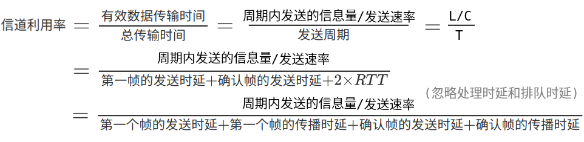
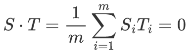
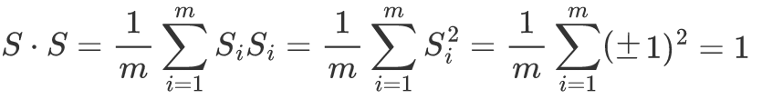
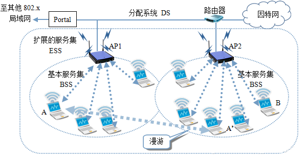
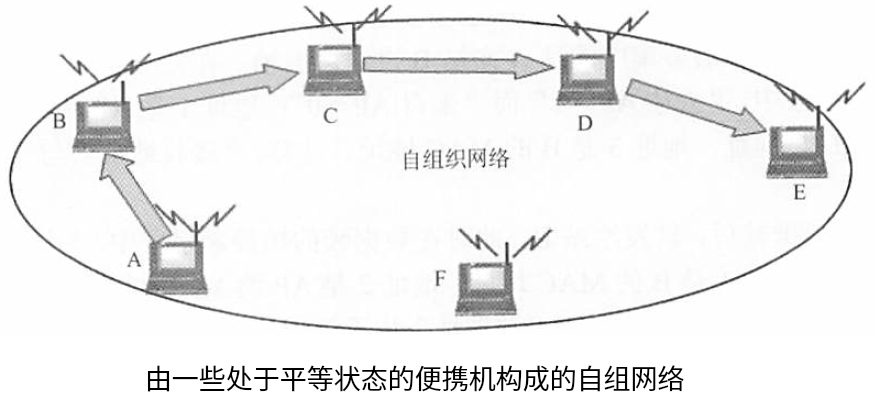
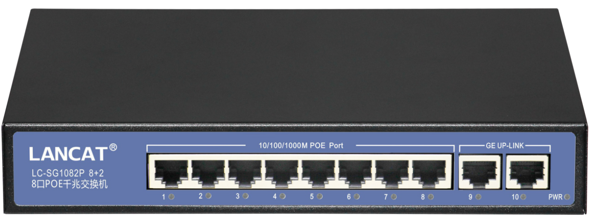

# 数据链路层的功能

- 数据链路层（Data Link Layer）将物理层提供的可能出错的物理连接改造为逻辑上无差错的数据链路，使之对网络层表现为一条无差错的链路。

## 为网络层提供服务

### 无确认的无连接服务

1. 源机器发送数据帧时不需要先建立链路连接
2. 目的机器收到数据帧时不需要返回确认
3. 对丢失的帧，数据链路层不负责重发而是交给上层处理

- 适用于实时通信或误码率较低的通信信道，如以太网。

### 有确认的无连接服务

1. 源机器发送数据帧时不需要先建立链路连接
2. 目的机器收到数据帧时必须返回确认，源机器在规定时间内未收到确定信号时，就重传丢失的帧。
3. 适用于误码率较高的通信信道，如无线通信。

### 有确认的面向连接服务

1. 链路管理：帧传输过程分为建立数据链路、传输帧、释放数据链路三个阶段。
2. 目的机器对收到的每一帧都要给出确认，源机器收到确认后才能发送下一帧，最可靠。
3. 适用于通信要求（可靠性、实时性）较高的场合。

## 帧

### 组帧

- 两台主机之间传输信息时，为了使接收方能够正确地接收并检查所传输的帧，发送方必须按照一定的规则将网络层递交的分组封装成帧（组帧），以帧的格式进行传送。
- 组帧要添加首部和尾部：在网络中信息是以帧为最小单位进行传输的，接受端要正确地接收帧，就必须要确认该帧在一串比特流中的开始和结束位置（帧定界）。

    

        在一个链路层协议中，使用下列字符编码： 
        A 01000111;&nbsp;&nbsp;&nbsp;B 11100011;&nbsp;&nbsp;&nbsp;ESC（转义字符） 11100000;&nbsp;&nbsp;&nbsp;FLAG（首尾标志） 01111110 
        在使用下列成帧方法的情况下，说明为传送4个字符A、B、ESC、FLAG所组织的帧而实际发送的二进制序列。 
        （1）字符计数法 
        （2）字符填充的首尾定界符法 
        （3）比特填充的首尾标志法
    

    （1）第一个字节为计算字符，共有4+1个字符：00000101 01000111 11100011 11100000 01111110 
    （2）FLAG A B ESC ESC ESC FLAG FLAG：01111110 01000111 11100011 11100000 11100000 11100000 01111110 01111110 
    （3）FLAG A B ESC FLAG FLAG：01111110 01000111 11<u>0</u>100011 1110000 0011111<u>0</u>10 01111110

#### 字符计数法

- 字符计数法在帧头部使用一个计数字段来表明帧内字符数（包括该计数字符在内）。若计数字段出错，就失去了帧边界划分的依据，则接收方无法判断所传输帧的结束位和下一帧的开始位，收发双方将失去同步。

#### 字符填充的首尾定界符法

- 字符填充法使用特定字符来定界一帧的开始和结束。

1. 控制字符SOH：放在帧的最前面，表示帧的首部开始
2. 控制字符EOT：表示帧的结束
3. 转义字符ESC：发送方在信息位中出现的特殊字符（SOH、EOT、ESC）前面填充ESC来区分，以实现透明传输。接受方在接受到数据后，会自己删除这些插入的ESC字符，得到原来的数据。

 

#### 零比特填充的首尾标志法

- 零比特填充法允许数据帧包含任意个数的比特，允许每个字符的编码包含任意个数的比特，使用特定的比特模式（01111110）来标志一帧的开始和结束。发送方的数据链路层在信息位中遇到5个连续的“1“时，自动在后面加入一个“0”；而接受方每受到5个连续的“1”，自动删除后面紧跟着的“0”，以恢复原信息。
- 零比特法容易使用硬件实现、性能优于字符填充法。

#### 违规编码法

- 在物理层进行比特编码时，通常采用违规编码法。局域网IEEE 802标准就利用违规编码来定界帧的起始和终止。
- 违规编码法不需要任何填充技术，便能实现数据传输的透明性，但只适合于采用冗余编码的特殊编码环境。

> 违规编码（没有采用的编码）：曼彻斯特编码方法将数据比特“1”编码为“高-低“电平对，“0”编码为“低-高”电平对，而“高-高”电平对和“低-低”电平对没有被采用，在数据比特中是违规的，即违规编码。

### 帧定界、帧同步、透明传输

- 帧定界：帧的首部和尾部中含有大量的控制信息，可以用于确定帧的界限。
- 帧同步：接收方应能从接收到的二进制比特流中区分区帧的起始和终止（HDLC协议中的帧标志位F）。

 

- 透明传输：不管所传数据是什么样的比特组合，都应当能在链路上传送。
- MTU（最大传送单元）：每种数据链路层协议都规定了帧的数据部分的长度上限。

## 差错控制

- 差错控制是用于使发送方确认接收方正确接收到其发送的数据的方法。

1. 位错（比特差错）：帧中的某些位出现错误。通常采用CRC（循环冗余校验）来发现位错，通过ARQ来重传出错的帧。
2. 帧错：帧的丢失、重复、失序等错误。在数据链路层引入定时器和编号机制，保证每一帧最终都能有且仅有一次正确地交付给目的结点。

- 对于位错，利用编码技术进行差错控制，分为检错编码和纠错编码。

1. ARQ（自动重传请求，Automatic Repeat reQuest）让发送方将要发送的数据帧附加一定的CRC冗余检错码一并发送，接受方根据检错码对数据帧进行错误校验，若发现错误则丢弃，发送方超时重传该数据帧，直到接收到正确的码字为止。ARQ只需要返回很少的控制信息就可有效地确认所发数据帧是否被正确接收。
2. FEC（前向纠错）的接受方不仅能发现差错，还能确定比特串的错误位置，从而加以纠正。

### 检错编码

- 检错编码都采用冗余编码技术，在有效数据（信息位）被发送前，先按某种关系附加一定的冗余位，构成一个符合某一规则的码字后再发送。当要发送的有效数据变化时，相应的冗余位也随之变化，使得码字遵从不变的规则。接收端根据收到的码字是否仍然符合原规则来判断是否出错。

#### 奇偶校验码

- 奇偶校验码包括奇校验码和偶校验码，是最基本的检错码，只能检测奇数位的出错情况，并不清楚哪些位出错，也不能发现偶数位的出错情况。
- 奇偶校验码由n-1位信息元和1位校验元组成。

1. 若为奇校验码，则在附加一个校验元后，码长为n的码字中“1”的个数为奇数
2. 若为偶校验码，则在附加一个校验元后，码长为n的码字中“1”的个数为偶数

#### 循环冗余码 CRC

- CRC（循环冗余码、多项式码，Cyclic Redundancy Code），任何一个由二进制数位串组成的代码都可以与一个只含有0和1两个系数的多项式建立一一对应的关系。一个k位帧可以视为从Xk-1到X0的k次多项式的系数序列。
- FCS（帧检验序列）给定一个m bit的帧或报文，发送器生成一个r bit的序列（冗余码、校验码），形成的帧由m+r bit组成。发送方和接收方事先商定一个多项式G(x)（最高位和最低位必须为1），使这个带检验码的帧正好能够被G(X)整除，接受方用同样的G(x)来除收到的帧，若果没有余数，则认为无差错。计算冗余码的步骤如下：

1. 加0：假设G(x)的阶为r（冗余码的位数取决于G(x)的最高次数r），则在帧的低位端加上r个0。
2. 模2除法（实质上就是异或）：利用模2除法，用G(x)对应的数据串区除步骤1中得到的数据串，得到的余数为冗余码（共r位，前面的0不可省略）。

- 通过CRC的检错技术，数据链路层实现了对帧的无差错接收，认为只要是数据链路层接受的帧（而不仅仅是接收），在传输过程中都没有产生差错。

> CRC具有纠错功能，而数据链路层仅使用了其检错功能。

    

        在数据传输过程中，若接收方收到的二进制比特序列为1011011010，接收双方采用的生成多项式为 G(x) = x4 + x3 + 1，则该比特序列在传输过程中是否出错？如果未出现差错，那么发送数据的比特序列和CRC校验码的比特序列分别是什么？
    

    由G(x)得到，用于校验的除数为11001，CRC校验码为4位 
    对1011011010和11001进行模2除法，计算是否出错 
     
    计算结果中，余数为0，故没有出错，发送数据的比特序列为101101，CRC校验码的比特序列为1010

### 纠错编码

- 在每个要发送的数据块上附加足够的冗余信息，使接收方能够推导出发送方实际送出的应该是什么样的比特串。

#### 汉明码

- 在有效信息位中加入几个校验位形成汉明码，并把汉明码的每个二进制位分配到几个奇偶校验组中。当某一位出错后，就会引起有关的几个校验位的值发生变化，不但可以发现错位，还能指出错位的位置，为自动纠错提供依据。

1. 汉明码的位数：假定n为有效信息的位数，k为校验位的位数，则信息位n和校验位k满足 n + k &le; 2k-1
2. 校验位的分布：规定校验位Pi在汉明码位2i-1（H2i-1）的位置上，其余各位为信息位，信息位按原来的顺序插入汉明码的空位。
3. 分组校验：每个数据位用多个校验位进行校验，被校验数据位的汉明位号等于校验该数据位的各校验位汉明位号之和，且校验位不需要再被校验。
4. 校验位的取值：校验位Pi的值为第i组（由该校验位校验的数据位）所有位“异或“得到。
5. 校验：每个校验组利用校验位和参与形成该校验位的信息位进行奇偶校验检查，共有k个校验方程。若校验的结果全为0，则无错；否则出错，校验的结果就是错误位的汉明位号，直接将该位取反即可。

- 汉明码纠错d位，需要码距为2d+1位的编码方案；而汉明码检错d位，只需要码距为d+1位的编码方案。

    
1010对应的汉明码为？

    1. 有效信息的位数n=4，校验位的位数k，满足n+k&le;2k-1，则k=3 
    2. 形成汉明码： 
    H7H6H5H4H3H2H1 
    D4D3D2P3D1P2P1 
    3. 分组校验 
    D1（H3）由P2P1（H2H1）校验 
    D2（H5）由P3P1（H4H1）校验 
    D3（H6）由P3P2（H4H2）校验 
    D4（H7）由P3P2P1（H4H2H1）校验 
    4. 校验位取值： 
    P1=D1&oplus;D2&oplus;D4=0&oplus;1&oplus;1=0 
    P2=D1&oplus;D3&oplus;D4=0&oplus;0&oplus;1=1 
    P3=D2&oplus;D3&oplus;D4=1&oplus;0&oplus;1=0 
    则汉明码为：1001010 
    5. 校验： 
    S1=P1&oplus;D1&oplus;D2&oplus;D4 
    S2=P2&oplus;D1&oplus;D3&oplus;D4 
    S3=P3&oplus;D2&oplus;D3&oplus;D4 
    S3S2S1，找到错位

## 流量控制

- 流量控制实际上是由接收方控制发送方的发送数据的速率，使其发送速率不超过接收方的接收能力。对于数据链路层，控制的是点到点的数据链路上的流量；对于传输层，控制的是端到端之间的流量。

> OSI体系结构中，数据链路层具有流量控制的功能；而TCP/IP体系结构中，流量控制的功能被移到了传输层。

- 数据链路层的可靠传输机制通常使用确认和超时重传两种机制，实际的有线网络的数据链路层很少使用可靠传输。

- 确认是一种无数据的控制帧，使得接收方可以让发送方知道哪些内容被正确接收。

1. 捎带确认是为了提高传输效率，将确认捎带在一个回复帧。
2. [累积确认](#累积确认)：GBN和SR都采用该方式。

- 超时重传（ARQ，Automatic Repeat reQuest）通过接收方请求发送方重传出错的数据帧来恢复出错的帧。（1）停止-等待（Stop-and-Wait）；（2）后退N帧（Go-Back-N）；（3）选择性重传（Selective Repeat）。后两种协议（连续ARQ协议）结合了滑动窗口技术和请求重发技术，由于窗口尺寸开到足够大时，帧在线路上可以连续地流动。

### 滑动窗口 可靠传输协议

- 任意时刻，发送方都维持一组连续的允许发送的帧的序号（发送窗口），接收方也维持一组连续的允许接收帧的序号（接收窗口）。发送窗口用来对发送方进行流量控制，而发送窗口的大小WT代表在还未收到对方确认信息的情况下，发送方最多还可以发送多少个数据帧。而接收方只有在收到的数据帧的序号都落入接收窗口时，才可以将该数据帧收下，否则一律丢弃。

1. 发送端每收到一个确认帧，发送窗口就向前滑动一个帧的位置，发送窗口内没有可以发送的帧（窗口内的帧全部是已发送但未收到确认的帧）时，发送方就会停止发送，直到收到接收方发送的确认帧使窗口移动，窗口内有可以发送的帧后，才开始继续发送。

2. 接收端收到数据帧后，将窗口向前移一个位置，并发回确认帧。若收到的数据帧落在接收窗口外，则丢弃。

- 滑动窗口 = 发送窗口 + 接收窗口，且窗口的大小在传输过程中是固定的：

1. 停止-等待协议：发送窗口WT=1，接收窗口WR=1
2. 后退N帧协议：发送窗口WT&gt;1，接收窗口WR=1
3. 选择重传协议：发送窗口WT&gt;1，接受窗口WR&gt;1

- 对滑动窗口协议而言，发送窗口尺寸范围 1 &le; WR &le; 2n -1；接收窗口的尺寸范围 WR + WT &le; 2n。（n为帧编号比特数）

 

#### 停止-等待协议

- 停止-等待协议（Stop-and-Wait）的发送方每发送一帧，都要等待接收方的应答信号，之后才能发送下一帧；接收方每接收一帧都要反馈一个应答信号，表示可接收下一帧，若接收方不反馈应答信号，则发送方必须一直等待。相当于WT和WR均为1的滑动窗口，传输效率低。
- 发送方和接收方都须设置一个帧缓冲区，发送端在发送完数据帧时，必须在其发送缓存中保留该数据帧的副本（用于出差错时进行重传），只有收到接收方发来的确认帧ACK时，才可以清除该副本。

1. 对于数据帧丢失、收到的帧被破坏的情况，发送端设置了一个计时器。发送一个帧之后，发送端等待确认，若在计时器计满后，仍未收到确认，则重发该帧。
2. 对于数据帧正确而确认帧被破坏的情况，接收端已经收到正确的数据帧，而发送端没有收到确认帧。发送方会重发该数据帧，而接收方收到该数据帧（之前已经正确接收）时，丢弃该数据帧，并重发该数据帧对应的确认帧。
3. 判定重复帧：停止-等待协议每发送一个数据帧就停止并等待，使用1bit编号即可，发送的帧交替使用0和1来标识，确认帧分别使用ACK0和ACK1来表示。若连续收到相同序号的确认帧，则表明接收端收到了重复帧。

 

#### GBN 后退N帧协议

- 在后退N帧式ARQ中，发送方无须在收到上一帧的ACK后才能开始发送下一帧，而是可以连续发送帧，但只允许按顺序接收帧。

1. 累积确认：GBN协议规定接收端可以在连续收到若干个正确的数据帧之后，才对最后一个数据帧发送确认信息，或捎带确认，意味着被确认的帧和其之前的所有帧都正确无误地被收到。
2. 顺序接收：（1）接收方检测出失序的数据帧之后，重复发送此前已经发送的最后一个确认帧ACKn，要求发送方重新发送该出差错的数据帧，而在此期间，若接收方收到在该出差错的数据帧后面的数据帧，则一律丢弃，不管是否正确，直到该出差错的数据帧被正确接收；（2）发送方发现某个已发送的数据帧的计时器超时后仍未收到对应的确认信息，判断该帧出错或丢失，发送方重传该数据帧及其随后的N个帧。因此，若信道的传输质量很差导致误码率较高，则后退N帧协议不一定优于停止-等待协议。

 

- 后退N帧协议的接收窗口WR=1，保证按序接收数据帧。若采用n比特对帧编号，则对应的发送窗口应满足1 &lt; WT &le; 2n-1。若WT &gt; 2n-1，则此时的发送窗口内存在至少一对编号相同的数据帧，导致接收方无法分辨这些帧。

#### SR 选择重传协议

- SR（选择重传协议，Selective Repeat）只重传出现差错的数据帧或计时器超时的数据帧。此时，必须加大接收窗口以缓冲发送序号不连续但仍处在接收窗口中的部分数据帧，等到收到所缺少的数据帧后再一并交付给主机。

1. 每个发送缓冲区对应一个计时器，计时器超时后，该缓冲区的帧就会被重传。
2. NAK机制：一旦接收方怀疑帧出错，就会发送一个否定帧NAK给发生方，要求发送方对NAK指定的帧进行重传。

 

- 选择重传协议中的接收端所需的缓冲区的数目等于接收窗口的大小，要设置足够容量的缓冲区来暂存未按序但正确到达的帧，且不能接受超过接收窗口边界的序号的帧。

1. 对滑动窗口协议而言，发送窗口尺寸范围 1 &le; WR &le; 2n -1；接收窗口的尺寸范围 WR + WT &le; 2n。（n为帧编号比特数）

2. 对SR协议而言，接收窗口与接收窗口长度都不固定，但为提高传输效率，通常设置滑动窗口长度等于接收窗口长度，即WTmax = WRmax = 2n-1。

 

### 信道利用率

- [信道利用率](./网络体系结构.md)（信道效率）是有效数据传输时间占总传输时间的比率，而在数据链路层的流量控制中特指发送方在一个发送周期的时间内 ，有效数据传输时间占整个发送周期的比率。

 

    
两台主机之间的数据链路采用后退N帧协议（GBN）传输数据，数据传输速率为16kb/s，单向传播时延为270ms，数据帧长度范围是128~512字节，接收方总是以与数据帧等长的帧进行确认。为使信道利用率达到最高，帧序号的比特数至少为______。

    数据帧的长度范围是128~512字节，采用最小的数据帧长度128B，保证最少有效数据的信道利用率也达到最高 
    一个数据帧的发送时延 t = 128B / 16 kbit/s = 64ms  
    发送周期 T = 一个数据帧的发送时延 + 一个数据帧的单向传播时延 + 确认帧的发送时延 + 确认帧的单向传播时延 = 64ms + 270ms + 64ms + 270ms = 668ms 
    则，在发送周期T内，可以发送的帧数 = T / t = 668ms / 64 ms = 10.4 帧，至少需要4位进行编号，故，帧序号的比特数至少为4 bit。

    
主机甲通过128kb/s卫星链路，采用滑动窗口协议向主机乙发送数据，链路单向传播时延为250ms，帧长为1000字节。不考虑确认帧的开销，为使链路利用率不小于80%，帧序号的比特数至少是______。

    信道利用率 = (L / 128kbit/s) / (1000B / 128kbit/s + 250ms + 250ms) &ge; 80% 
    则 L &ge; 7200B ，在一个发送周期内，可以发送的帧数为 L / 1000B &ge; 7.2帧，故帧序号的比特数为4 bit

    
主机甲与主机乙之间使用后退N帧协议（GBN）传输数据，甲的发送窗口尺寸为1000，数据帧长为1000字节，信道带宽为100Mb/s，乙每收到一个数据帧立即利用一个短帧（忽略其传输时延）进行确认，若甲乙之间的单向传播时延为50ms，则甲可以达到的最大平均数据传输速率约为______。
    

    甲的发送窗口尺寸为1000，则在甲收到第一个确认帧之前，最多能发送1000个数据帧，即甲在确认之前发送的最大信息量 = 发送窗口尺寸 * 数据帧长度 = 1000 * 1000B = 106B 
    从甲发出第一个数据帧到收到其确认的时间 = 1000B / 100Mbit/s + 50ms + 50ms = 0.1008s 
    则，甲可以达到的最大数据传输速率 = 106B / 0.1008s &asymp; 10MB/s = 80Mbit/s

## 介质访问控制

- MAC（介质访问控制子层，Medium Access Control），决定广播信道中信道分配的协议，为使用介质的每个结点隔离来自同一信道上其他结点所传送的信号，以协调活动结点的传输。使广播信道逻辑上变为点到点的信道。

### 信道划分介质访问控制（多路复用）

- 信道划分介质访问控制将使用介质的每个设备与来自同一信道上的其他设备的通信隔离，将时域和频域资源合理地分配给网络上的设备。
- 多路复用技术：把多个信号组合在一条物理信道上进行传输，使多个计算机或终端设备共享信道资源（复用信道），提高信道的利用率。实质上就是通过分时、分频、分码等方法将原来的一条广播信道从逻辑上分为几条用于两个结点之间通信的互不干扰的子信道，实际上把广播信道转换为点对点信道。

#### FDM 频分多路复用

- 频分多路复用：将多路基带信号调制到不同频率载波上，再叠加形成一个复用信号。在物理信道的可用带宽超过单个原始信号所需带宽的情况下，可将该物理信道的总带宽分割成若干与传输单个信号带宽相同（或略宽）的子信道，每个子信道传输一种信号。每个子信道分配的带宽可不相同，但总和不能超过信道的总带宽。而为了防止子信道之间的干扰，相邻信道之间需要加入保护频带。
- FDM适用于传输模拟信号，FDM技术成熟、较易实现，充分利用了媒体的带宽。

 

#### TDM 时分多路复用

- 时分多路复用：将一条物理信道按时间分成若干时间片，轮流地分配给多个信号使用，每个时间片由复用的一个信号占用。
- TDM适用于传输数字信号，抗干扰能力强、可以逐级再生整形、避免干扰的累积、且数字信号较易实现自动转换。

 

##### STDM 统计时分多路复用

- STDM（统计时分多路复用、异步时分多路复用）：对TDM的一种改进，采用STDM帧，STDM帧并不固定分配时隙，而是按需动态地分配时隙，终端有数据需要传输时，才会分配到时间片。

#### WDM 波分多路复用

- 波分多路复用（光的频分多路复用）：在一根光纤中传输多种不同波长（频率）的光信号，由于波长不同，各路光信号互不干扰，最后再用波长分解复用器将各路波长分解出来。且光波处于频谱的高频段，有很高的带宽。

#### CDMA 码分多址

- CDM（码分多路复用）：采用不同的编码来区分各路原始信号，既共享信道的频率，又共享时间。
- CDMA（码分多址，Code Division Multiple Access）：每个比特时间再划分成m（m的值通常为64或128）个短的时间槽（码片，Chip）。每个站点被指派一个唯一的m位码片序列。发送1时，站点发送它的码片序列；发送0时，站点发送该码片序列的反码。两个及以上的站点同时发送时，各数据在信道中线性相加。为从信道中分离各路信号，要求各个站点的码片序列相互正交。

- 令向量S表示A站的码片向量、向量T表示B站的码片向量：

1. 两个不同站的码片序列正交：S和T的规格化内积（Inner Product）为0。

 

2. 任何一个码片向量和该码片向量自身的规格化内积都是1，任何一个码片向量和该码片向量反码的规格化内积都是-1。

 

- 按惯例将码片中的0写作-1，1写作+1。

1. 令向量S(-1 -1 -1 +1 +1 -1 +1 +1)表示A站的码片向量、向量T(-1 -1 +1 -1 +1 +1 +1 -1)表示B站的码片向量
2. 当A站向C站发送数据1时，就发送了向量S(-1 -1 -1 +1 +1 -1 +1 +1)，即0001 1011；当B站向C站发送数据时，就发送了向量T(+1 +1 -1 +1 -1 -1 -1 +1)。两个向量到了公共信道后就进行叠加（线性相加），得到S+T = (0 0 -2 2 0 -2 0 2)。
3. 到达C站后，进行数据分离，若要得到A站的数据，C站必须知道A站的码片序列，让S与S+T进行规格化内积。根据叠加原理，其他站点的信号都在内积的结果中被过滤掉（内积的相关项为0），只剩下A站的信号，得到S(S+T) = 1，即A站发送的数据是1。若要得到B站的数据，同理得到T(S+T) = -1，即B站发送的信号向量是反码向量（0）。

- 码分多路复用技术的频谱利用率高、抗干扰能力强、保密性强、语音质量好，可以降低投资和运行成本，主要用于无线通信系统、移动通信系统。

### 随机访问介质访问控制

- 随机访问协议不采用集中控制方式解决发送信息的次序问题，所有用户根据自己的意愿随机地发送信息，占用信道全部速率。而在总线型网络中，两个及以上的用户同时发送信息时，会产生帧的冲突（碰撞），导致所有用户的发送均失败。
- 随机访问介质访问控制协议（争用型协议）：为了解决碰撞问题，每个用户需要按照一定的规则反复地重传它的帧，直到该帧无碰撞地通过。

#### ALOHA协议

- ALOHA（随机接入系统，Additive Link On-line Hawaii system），分为纯ALOHA、时隙ALOHA。

##### 纯ALOHA

- 纯ALOHA：网络中的任何一个站点需要发送数据时，可以不进行任何检测就发送数据。若在一段时间内未收到确认，则该站点就认为传输过程中发送了冲突，让发生碰撞的站等待一段随机的时间，然后再进行重传。若再次发生碰撞，则需要再次等待一段随机的时间，直到发送成功。
- 假定纯ALOHA的网络负载（T0时间内所有站发送成功和未成功而重传的帧数）为G，则纯ALOHA网络的吞吐量（T0时间内成功发送的平均帧数）为S = Ge-2G。G=0.5时，S=0.5e-1&asymp;0.184，吞吐量达到可能的极大值，可见纯ALOHA网络的吞吐量很低。

##### 时隙ALOHA

- 时隙ALOHA：把所有站在时间上同步起来，并将时间划分为一段段等长的时隙（Slot），规定只能在每个时隙开始时发送帧，避免用户发送数据的随意性，减少了数据产生冲突的可能，提高了信道利用率。
- 时隙T0使得每个帧正好在一个时隙内发送完毕。每个帧在到达后，一般要在缓存中等待一段小于T0的时间，然后才能发送。若一个时隙内有两个及以上的帧到达，则在下一个时隙将发生碰撞。

- 时隙ALOHA网络的吞吐量 S = Ge-G，G=1时，S=e-1&asymp;0.368，吞吐量达到可能的极大值。

#### CSMA 载波监听多路访问协议

- CSMA（载波监听多路访问协议，Carrier Sense Multiple Access）：每个站点在发送之前都先监听一下共用信道，根据信道状态决定动作。

| 信道状态 | 1-persistent CSMA | Non-persistent CSMA                | p-persistent CSMA                        |
| -------- | ----------------- | ---------------------------------- | ---------------------------------------- |
| 空闲     | 立即发送数据      | 立即发送数据                       | 以概率p发送数据，概率p-1推迟到下一个时隙 |
| 忙       | 继续坚持监听      | 放弃监听，等待一段随机时间后再监听 | 持续监听，直到信道空闲                   |

##### 1-persistent CSMA

- 1-坚持 CSMA：一个结点要发送数据时，首先监听信道；若信道空闲，则立即发送数据（发送的概率为1）；若信道忙，则等待，并继续监听直到信道空闲（persistent，坚持监听）；若发送冲突，则随机等待一段时间后，再重新开始监听信道。
- 多个结点等待信道空闲后同时发送数据会发生冲突。

##### Non-persistent CSMA

- 非坚持 CSMA：一个结点要发送数据时，首先监听信道；若信道空闲，则立即发送数据；若信道忙，则放弃监听（Non-persistent），等待一个随机时间后再重复上述过程。
- 降低了多个结点等待信道空闲后同时发送数据导致冲突的概率，但代价是增加数据在网络中的平均延迟。即信道利用率的提升是以增加数据在网络中的延迟时间为代价的。

##### p-persistent CSMA

- p-坚持 CSMA：用于时分信道，一个结点要发送数据时，首先监听信道；若信道忙，则持续监听（persistent），直到信道空闲；若信道空闲，则以概率p发送数据，以概率1-p推迟到下一个时隙（发送的概率为p）。若推迟到下一个时隙且信道空闲，则仍然以概率p发送数据，以概率1-p推迟到下一个时隙；若推迟到下一个时隙且信道忙，则等待下一个时隙再重新开始监听。
- 以概率p发送的方式降低了多个结点等待信道空闲后同时发送数据导致冲突的概率，而持续监听是为了克服Non-persistent CSMA中由于随机等待而造成的延迟时间较长的缺点。

#### CSMA/CD 载波监听多路访问/碰撞检测协议

- CSMA/CD是对CSMA的改进，适用于总线形网络或半双工网络，采用CSMA/CD协议的以太网只能进行半双工通信；全双工网络采用两条信道分别用于发送和接收，收发双方在任何时间都可以发送或接收数据，不可能产生冲突，不需要CSMA/CD协议。

1. 载波监听：每个站点在发送前和发送中都必须不停地检测信道，在发送前检测信道是为了获得发送权（只有信道空闲才能发送），在发送中检测信道是为了及时发现发送的数据是否发送了碰撞。
2. CD （碰撞检测，Collision Detecion)：边发送边监听，若监听到碰撞，则立即停止数据发送，等待一段随机时间后，重新开始尝试发送数据。

- 电磁波在总线上的传播速率总是有限的，即使某个时刻检测到信道空闲时，此时的信道也不一定是空闲的。

- 假定&tau;为单程传播时延：

| 时刻                  | 事件                                                         |
| --------------------- | ------------------------------------------------------------ |
| t = 0                 | A发送数据                                                    |
| t = &tau; - &delta;   | A发送的数据还未到达B，此时，B检测信道空闲而发送数据          |
| t = &tau; - &delta;/2 | A发送的数据和B发送的数据发生碰撞，此时，A和B均不知道发生了碰撞 |
| t = &tau;             | B检测到碰撞，停止发送数据                                    |
| t = 2&tau; - &delta;  | A检测到碰撞，停止发送数据                                    |

- 争用期（冲突窗口、碰撞窗口）：以太网的信号的最远端到端（冲突域）往返传播时延2&tau;。站点A在发送帧之后至多经过时间2&tau;（&delta;&rarr;0）就能指定所发送的帧是否发生碰撞。每个站在自己发送数据之后的一小段时间内，存在发送碰撞的可能性，只有经过争用期这段时间还未检测到碰撞时，才能确定这次发送不会发送碰撞。
- 最短帧长：以太网规定一个最短帧长（64B），即争用期内可发送的数据长度，若小于该长度，则在MAC子层于数据字段的后面加入一个整数字节的填充字段。如果在争用期内检测到碰撞，站点就s会停止发送，此时已经发送出去的数据一定小于最短帧长。因此，只要是长度小于最短帧长的帧都是由于冲突而异常中止的无效帧，可以通知接收到该帧的站点发生了碰撞，同时丢弃该无效帧。

最短帧长 =  2 x 总线传播时延 x 数据传输速率

- 动态退避（截断二进制指数退避算法）：发生碰撞后的策略，重传需要推迟的平均时间随重传次数的增大而增大，降低发送碰撞的概率

1. 确定基本退避时间，一般取争用期2&tau;
2. 定义参数 k = min\[重传次数, 10\]，重传次数不超过10时，k=重传次数；重传次数超过10次时，k不再增大而是一直等于10
3. 从离散的整数集合\[0, 1, ..., 2k\-1]中随机取出一个数r来确定重传所需的退避时间：2r&tau;，即k值越大，发生冲突的概率越低。
4. 重传16次仍不能成功时，认为该帧永远无法正确发出，抛弃该帧并向高层汇报错误

    

        如图，在Hub再生比特流的过程中会产生1.535us延时（Switch和Hub均为100Base-T设备），信号传播速率为200m/us，不考虑以太网帧的前导码，则H3和H4之间理论上可以相距的最远距离是_____。 
        
    

    100Base-T代表100Mbps的基带传输的以太网，而以太网的最短帧长规定为64B；且Hub没有分割冲突域，并且计算总线传播时延时还要加上其再生操作所耗费的时间 
    最短帧长 = 2 x 总线传播时延 x 数据传输速率，故 64B = 2*(L / 200m/us + 1.535us)*100Mbit/s，得到L=205m

#### CSMA/CA 载波监听多路访问/碰撞避免协议

- CSMA/CD协议应用于使用有线连接的局域网；而在无线局域网环境下，应该采用CSMA/CA协议。无线局域网不采用CSMA/CD的原因如下：

1. 接收信号的强度往往会远小于发送信号的强度，且在无线介质上信号强度的动态变化范围很大，若要使用碰撞检测，则硬件上的花费过大。
2. 隐蔽站问题：在无线通信中，并非所有的站点都能听见对方。

- CSMA/CA协议对CSMA/CD协议进行改进，将碰撞检测改为CA（碰撞避免，Collision Avoidance）：并不是指协议可以完全避免碰撞，而是指协议的设计要尽量降低碰撞发生的概率。802.11 无线局域网不使用碰撞检测，故一旦站点开始发送一个帧，就会完全发送该帧，如果碰撞发生，会严重减低网络的效率（尤其是长数据帧）。
- 由于无线信道的通信质量远不如有线信道，802.11使用ARQ方案（链路层确认/重传）。

| 区别     | CSMA/CD                                            | CAMA/CA                                                      |
| -------- | -------------------------------------------------- | ------------------------------------------------------------ |
| 基本思想 | 发送前监听、边发送边监听、一旦发生碰撞立即停止发送 | 发送数据时先广播告知其他结点                                 |
| 碰撞检测 | 检测冲突，却无法避免                               | 发送数据的同时不能检测信道上是否有无冲突 本结点处没有冲突，不代表接收结点处没有冲突 只能尽量避免冲突 |
| 传输介质 | 总线形以太网                                       | 无线局域网 802.11a/b/g/n等                                   |
| 检测方式 | 通过电缆中的电压变化来检测                         | 采用能量检测、载波检测、能量载波混合检测三种方式检测信道空闲 |

- IFS（帧间间隔，InterFrame Space）：为了尽量避免碰撞，802.11规定，所有的站在完成发送之后，必须等待一段很短的时间（IFS）才能发送下一帧，该时间仍然继续监听。IFS的长度取决于该站要发送的帧的类型：

| IFS类型               | 说明                                                         |
| --------------------- | ------------------------------------------------------------ |
| SIFS（短IFS）         | 最短的IFS，用来分割属于一次对话的各帧 使用SIFS的帧类型包括ACK帧、CTS帧、分片后的数据帧、所有回答AP探询的帧等 |
| PIFS（点协调IFS）     | 中等长度的IFS，在PCF操作中使用                               |
| DIFS（分布式协调IFS） | 最长的IFS，用于异步帧竞争访问的时延                          |

- CSMA/CA的退避算法：信道从忙态变为空闲态时，任何一个站要发送数据帧，不仅都要等待一个时间间隔，而且要进入争用窗口，计算随机退避时间以便再次试图接入信道，降低了碰撞发生的概率。当且仅当检测到信道空闲且该数据帧是要发送的第一个帧时，才不使用退避算法，其他情况必须使用退避算法。

1. 若站点最初有数据要发送（不是重传），且检测到信道空闲，在等待时间DIFS后，就会发送整个数据帧。
2. 否则，站点执行CSMA/CA退避算法，选取一个随机回退值。一旦检测到信道忙，退避计时器就保存不变；只要信道空闲，退避计时器就进行倒计时。
3. 退避计时器减到0时（此时信道必定空闲），站点就发送整个帧并等待确认。
4. 若发送站收到确认，就知道已发送的帧被目的站正确接收。此时，若要发送第二帧，就回到步骤2。
5. 若发送站没有收到确认帧ACK（重传计时器超时），就必须重传该帧，再次使用CSMA/CA协议争用该信道（步骤2），直到收到确认；或经过若干次重传失败后放弃发送。

##### RTS和CTS 处理隐蔽站问题

- 隐蔽站问题：A和B都在AP的覆盖范围内，但A和B相距较远，彼此都听不见对方。若A和B检测到信道空闲时，都向AP发送数据，则导致碰撞发生。

 

- 802.11 允许发送站对信道进行预约，以避免隐蔽站问题：

1. A站点要发送数据之前先广播一个很短的RTS（请求发送，Request To Send）控制帧，包括源地址、目的地址、这次通信所持续的时间（包含相应的确认帧），该帧可以被其范围内包括AP在内的所有站点听到。
2. 若信道空闲，则AP广播一个CTS（允许发送，Clear To Send）控制帧，包括这次通信所需的持续时间（从RTS帧复制），该帧可以被其范围内包括A和B在内的所有站点听到。
3. A站点听到CTS后，等待一个SIFS之后发送数据；B和其他站点听到CTS后，在CTS帧中指明的时间内将抑制发送。

- 信道预约不是强制规定的，各站可以自己决定是否使用。虽然使用RTS和CTS会使网络的通信效率下降，但这两种控制帧很短，与数据帧相比开销小。若不采用这两种控制帧，一旦发生碰撞而导致数据帧重发，则浪费的时间更多。只有当数据帧长度超过某一数值时，使用RTS和CTS才比较有利。

### 轮询访问 令牌传递协议

- 轮询访问：用户不能随机地发送信息，而要通过一个集中控制的监控站，以循环发生轮询每个结点，再决定信道的分配。某个结点使用信道时，其他结点都不能使用信道。令牌传递协议是典型的轮询访问介质访问控制协议，主要用于令牌环局域网。
- 令牌传递协议：一个令牌（Token）沿着环形总线在各结点计算机间依次传递，令牌在设备间的传递通路逻辑上必须是一个环。
- 令牌（Token）：一个特殊的MAC控制帧，本身不包含信息，仅控制信道的使用。站点只有取得令牌后才能发送数据帧，确保同一时刻只有一个站点独占信道，因此不会发生冲突。令牌在网环上是按顺序传递的，对所有入网计算机而言，访问权是公平的。每个结点都可以在一定的时间内（令牌持有时间）获得发送数据的权力，而不是无限制地持有令牌。环上的一个站点希望传送帧时，必须等待令牌；一旦收到令牌，站点便可启动发送帧，帧中包含目的站点地址，以标识哪个站点应接收此帧。

1. 网络空闲时，环路中只有令牌帧在循环传递。即没有计算机需要发送数据时，令牌就在环形网上游荡。
2. 令牌传递到有数据要发送的站点时，该站点就修改令牌中的一个标志位，并在令牌中附加自己想要传输的数据，将令牌变成一个数据帧，并发出该数据帧。
3. 数据帧沿着环路传输，接收到的站点一边转发数据，一般查看帧的目的地址。若目的地址和自己的地址相同，则接收站就复制该数据帧以便进一步处理。
4. 数据帧沿着环路传输，直到到达该帧的源站点，源站点收到自己发出的帧后就不再转发。同时，通过检验返回的帧来查看数据传输过程中是否出错，若有错则重传。
5. 源站点发送完数据后，重新产生一个令牌并传递给下一站点，以交出信道控制权。

- 轮询介质访问控制非常适合负载很高的广播信道，限定了有权力发送数据的结点只能有一个。

# LAN 局域网

## 局域网的基本概念和体系结构

- LAN（局域网，LocalArea Network）是指在一个较小的地理范围（如一所学校）内，将各种计算机、外部设备和数据库系统等通过双绞线、同轴电缆等连接介质互相连接起来，组成资源和信息共享的计算机互连网络。主要特点如下：

1. 为一个单位所拥有，且地理范围和站点数目均有限
2. 所有站点共享较高的总带宽（即较高的数据传输速率）
3. 较低的时延和较低的误码率
4. 各站为平等关系而非主从关系
5. 能进行广播和组播

- 局域网的特性主要由三个要素决定：拓扑结构、传输介质、介质访问控制方式，其中最重要的是介质访问控制方式，它决定着局域网的技术特性。
- 常见的局域网拓扑结构主要有以下4大类：（1）星形结构；（2）环形结构；（3）总线形结构；（4）星形和总线形结合的复合型结构。
- 局域网可以使用双绞线、铜缆和光纤等多种传输介质，其中双绞线为主流传输介质。
- 局域网的介质访问控制方法主要有CSMA/CD、令牌总线和令牌环，其中前两种方法主要用于总线形局域网，令牌环主要用于环形局域网。

| 特殊的局域网拓扑实现                | 逻辑结构   | 物理结构           |
| ----------------------------------- | ---------- | ------------------ |
| 以太网（目前使用范围最广的局域网）  | 总线形结构 | 星形或拓展星形结构 |
| 令牌环（Token Ring，IEEE 802.5)     | 环形结构   | 星形结构           |
| FDDI（光纤分布数字接口，IEEE802.8） | 环形结构   | 双环结构           |

- IEEE 802 标准定义的局域网参考模型只对应于OSI参考模型的数据链路层和物理层，并将数据链路层拆分为两个子层：

1. 媒体接入控制（MAC）子层：接入传输媒体有关的内容都放在MAC子层，它向上层屏蔽对物理层访问的各种差异，提供对物理层的统一访问接口，主要功能包括：组帧和拆卸帧、比特传输差错检测、透明传输。
2. 逻辑链路控制（LLC）子层：LLC子层与传输媒体无关，它向网络层提供无确认无连接、面向连接、带确认无连接、高速传送4种不同的连接服务类型。LLC子层的作用已经不大，目前许多网卡仅仅装有MAC协议而没有LLC协议。

## 以太网与IEEE 802.3

- IEEE802.3标准是一种基带总线形的局域网标准，它描述物理层和数据链路层的MAC子层的实现方法。以太网逻辑上采用总线形拓扑结构，以太网中的所有计算机共享同一条总线，信息以广播方式发送，每个总线上的结点（包括发送结点）都能收听到发送结点发送的数据信号，且由于广播信息的目的地址是该网络的所有计算机，网络中的每台计算机都必须花费时间来处理此信息。为了保证数据通信的方便性和可靠性，以太网简化了通信流程并使用了CSMA/CD方式对总线进行访问控制。

> 严格来说，以太网应当是指符合DIXEthernet V2标准的局域网，但DIX Ethernet V2标准与IEEE 802.3标准只有很小的差别，因此通常将802.3局域网简称为以太网。

- 以太网采用两项措施以简化通信：

1. 采用无连接的工作方式，不对发送的数据帧编号，也不要求接收方发送确认，即以太网尽最大努力交付数据，提供的是不可靠服务，对于差错的纠正则由高层完成
2. 发送的数据都使用曼彻斯特编码的信号，每个码元的中间出现一次电压转换，接收端利用这种电压转换方便地把位同步信号提取出来。

### 以太网的传输介质与网卡

- 以太网常用的传输介质有4种：粗缆、细缆、双绞线和光纤。各种传输介质的适用情况：（常识！）

| 参数         | 10BASE5              | 10BASE2              | 10BASE-T     | 10BASE-FL       |
| :------------: | :--------------------: | :--------------------: | :------------: | :---------------: |
| 传输媒体     | 基带同轴电缆（粗缆） | 基带同轴电缆（细缆） | 非屏蔽双绞线 | 光纤对（850nm） |
| 编码         | 曼彻斯特编码         | 曼彻斯特编码         | 曼彻斯特编码 | 曼彻斯特编码    |
| 拓扑结构     | 总线形               | 总线形               | 星形         | 点对点          |
| 最大段长     | 500m                 | 185m                 | 100m         | 2000m           |
| 最多结点数目 | 100                  | 30                   | 2            | 2               |

> 10BASE-T非屏蔽双绞线以太网拓扑结构为星形网，星形网中心为集线器，但使用集线器的以太网在逻辑上仍然是一个总线形网，属于一个冲突域。

- NIC（网卡）：计算机与外界局域网的连接是通过主机箱内插入的一块网络接口板（网络适配器 Adapter、网络接口卡 Network Interface Card，NIC）实现的。网卡上装有处理器和存储器，是工作在数据链路层的网络组件。网卡和局域网的通信是通过电缆或双绞线以串行方式进行的，而网卡和计算机的通信则是通过计算机主板上的IO总线以并行方式进行的。因此，网卡的重要功能就是进行数据的串并转换。网卡不仅能实现与局域网传输介质之间的物理连接和电信号匹配，还涉及帧的发送与接收、帧的封装与拆封、介质访问控制、数据的编码与解码及数据缓存功能等。
- 全世界的每块网卡在出厂时都有一个唯一的代码，称为介质访问控制（MAC）地址，这个地址用于控制主机在网络上的数据通信。数据链路层设备（网桥、交换机等）都使用各个网卡的MAC地址。另外，网卡控制着主机对介质的访问，因此网卡也工作在物理层，因为它只关注比特，而不关注任何地址信息和高层协议信息。

### 以太网的MAC帧

- 每块网卡中的MAC地址也称物理地址；MAC地址长6字节，一般用由连字符（或冒号）分隔的12个十六进制数表示，如02-60-8c-e4-b1-21。高24位为厂商代码，低24位为厂商自行分配的网卡序列号。严格来讲，局域网的“地址”应是每个站的“名字”或标识符。
- 由于总线上使用的是广播通信，因此网卡从网络上每收到一个MAC帧，首先要用硬件检查MAC帧中的MAC地址，若是发往本站的帧，则收下；否则丢弃。
- 以太网MAC 帧格式有两种标准：DIX Ethernet V2标准（以太网V2标准）和IEEE 802.3标准。

#### DIX Ethernet V2标准

 

1. 前导码：使接收端与发送端时钟同步。物理层在帧前面插入的8字节可再分为两个字段：（1）第一个字段共7字节，是前同步码，用来快速实现 MAC 帧的比特同步；（2）第二个字段是帧开始定界符，表示后面的信息就是MAC帧
2. MAC帧并不需要帧结束符，因为以太网在传送帧时，各帧之间必须有一定的间隙。因此，接收端只要找到帧开始定界符，其后面连续到达的比特流就都属于同一个MAC帧，所以只有帧开始定界符。但以太网MAC帧仍然需要尾部，在数据链路层上，帧既要加首部，也要加尾部。

2. 地址：通常使用6字节（48bit）地址（MAC地址）

3. 类型：2字节，指出数据域中携带的数据应交给哪个协议实体处理

4. 数据：46\~1500字节，包含高层的协议消息。
   - 填充：0~46字节，当帧长太短时填充帧，使之达到64字节的最小长度。由于CSMA/CD算法的限制，以太网帧必须满足最小长度要求64字节，数据较少时必须加以填充（0\~46字节）。MAC帧的首部和尾部长度一共18字节（64B - 18B），且规定MAC帧最大只能1500字节。
5. 校验码（FCS）：4字节，校验范围从目的地址段到数据段的末尾，算法采用32位循环冗余码（CRC），检验MAC帧的数据部分、目的地址、源地址和类型字段，但不校验前导码。

#### IEEE 802.3标准

- 802.3帧格式与DIX以太帧格式的不同之处在于用长度域替代了DIX帧中的类型域，指出数据域的长度。在实践中，前述长度/类型两种机制可以并存，由于IEEE 802.3数据段的最大字节数是1500，所以长度段的最大值是1500，因此从1501到65535的值可用于类型段标识符。

### 高速以太网

- 高速以太网：速率达到或超过100Mb/s的以太网。

#### 100BASE-T 以太网

- 100BASE-T 以太网是在双绞线上传送 100Mb/s 基带信号的星形拓扑结构以太网，既支持全双工方式（不使用CSMA），又支持半双工方式（使用CSMA/CD协议）
- MAC帧格式仍然是IEEE 802.3标准规定的。保持最短帧长不变，但将一个网段的最大电缆长度减小到100m，帧间时间间隔从原来的9.6&mu;s改为现在的0.96&mu;s

#### 吉比特以太网

- 吉比特以太网（千兆以太网）允许在1Gb/s速率下用全双工（不需要使用CSMA/CD协议)）和半双工（使用CSMA/CD协议）两种方式工作
- 使用802.3协议规定的帧格式
- 与10BASE-T和100BASE-T技术向后兼容

#### 10吉比特以太网

- 10吉比特以太网与10Mb/s、100Mb/s和1Gb/s以太网的帧格式完全相同，还保留了802.3标准规定的以太网最小和最大帧长，便于升级
- 不再使用铜线而只使用光纤作为传输媒体，只工作在全双工方式（不使用CSMA/CD协议）
- 以太网从10Mb/s到10Gb/s的演进证明了以太网是可扩展的（从10Mb/s到10Gb/s）、灵活的（多种传输媒体、全/半双工、共享/交换），易于安装，稳健性好

## IEEE 802.11 无线局域网

### 无线局域网的组成

- 无线局域网可分为两大类：有固定基础设施的无线局域网和无固定基础设施的移动自组织网络。所谓“固定基础设施”，是指预先建立的、能覆盖一定地理范围的固定基站。

#### 有固定基础设施无线局域网

- 对于有固定基础设施的无线局域网，IEEE 制定了无线局域网的802.11系列协议标准，包括802.11a/b/g/n等。802.11使用星形拓扑，其中心称为AP（接入点，Access Point)，在MAC层使用CSMA/CA协议。使用802.11系列协议的局域网又称Wi-Fi。
- 802.11标准规定无线局域网的最小构件是BSS（基本服务集，Basic Service Set）。
  - 一个基本服务集包括一个接入点和若干移动站。各站在本BSS内之间的通信，或与本BSS外部站的通信，都必须通过本BSS的AP（基本服务集中的基站，base station）。
  - 安装AP时，必须为该 AP分配一个不超过32字节的SSID（服务集标识符，Service Set IDentifier）和一个信道。SSID是指使用该AP的无线局域网的名字。
  - 一个基本服务集覆盖的地理范围称为一个BSA（基本服务区，Basic Service Area)，无线局域网的基本服务区的范围直径一般不超过100m。
- 一个基本服务集可以是孤立的；也可通过 AP连接到一个DS（分配系统，Distribution System），然后再连接到另一个基本服务集，构成一个ESS（扩展的服务集，Extended Service Set）。分配系统的作用就是使扩展的服务集对上层的表现就像一个基本服务集一样。ESS还可以通过Portal（门户）设备为无线用户提供到有线连接的以太网的接入（作用相当于一个网桥）。

1. 移动站A如果要和另一个基本服务集中的移动站B通信，就必须经过两个接入点AP（AP1和AP2），即A&rarr;AP1&rarr;AP2&rarr;B。而AP1到AP2的通信是使用有线传输的。
2. 移动站A从某个基本服务集漫游到另一个基本服务集时（A\'），仍然可保持与另一个移动站B的通信。但A在不同的基本服务集中使用的AP改变（AP1&rarr;AP2）。

 

#### 无固定基础设施移动自组织网络

- 无固定基础设施的无线局域网（自组网络，ad hoc network）：自组网络没有上述基本服务集中的AP，而是由一些平等状态的移动站相互通信组成的临时网络。各结点之间地位平等，中间结点都为转发结点，因此都具有路由器的功能。

 

- 自组网络通常是这样构成的：一些可移动设备发现在它们附近还有其他的可移动设备，并且要求和其他移动设备进行通信。自组网络中的每个移动站都要参与网络中其他移动站的路由的发现和维护，同时由移动站构成的网络拓扑可能随时间变化得很快，因此在固定网络中行之有效的一些路由选择协议对移动自组网络已不适用。
- 自组网络和移动IP并不相同：移动IP技术使漫游的主机可以用多种方法连接到因特网，其核心网络功能仍然是基于固定网络中一直使用的各种路由选择协议；而自组网络是把移动性扩展到无线领域中的自治系统，具有自己特定的路由选择协议，并且可以不和因特网相连。

### 802.11 局域网的MAC帧

- 802.11 帧共有三种类型：数据帧、控制帧、管理帧。
- 802.11数据帧由以下三大部分组成：

1. MAC首部，共30字节。帧的复杂性都在MAC首部。
2. 帧主体，即帧的数据部分，不超过2312字节。它比以太网的最大长度长很多。
3. 帧检验序列FCS是尾部，共4字节。

 

- 802.11帧的MAC首部中最重要的是4个地址字段（都是MAC地址）。这里仅讨论前三种地址（地址4用于自组网络）。这三个地址的内容取决于帧控制字段中的“去往AP”和“来自AP”这两个字段的数值。表中给出了802.11帧的地址字段最常用的两种情况。

<table>
    <tr>
        <th>去往AP</th>
        <th>来自AP</th>
        <th>地址1</th>
        <th>地址2</th>
        <th>地址3</th>
        <th>地址4</th>
    </tr>
    <tr><td>1</td><td>0</td><td>接收地址 = AP地址</td><td>发送地址 = 源地址</td><td>目的地址</td><td rowspan="2">用于自组网络</td></tr>
    <tr><td>0</td><td>1</td><td>接收地址 = 目的地址</td><td>发送地址 = AP地址</td><td>源地址</td></tr>
</table>
- 地址1是直接接收数据帧的结点地址，地址2是实际发送数据帧的结点地址。

- 假定在一个BSS中的站A向站B发送数据帧：

1. 在站A发往接入点AP的数据帧的帧控制字段中“去往 AP=1”而“来自AP=0”，表示地址1是AP的MAC地址，地址2是A的MAC地址，地址3是B的MAC地址。此时，接收地址&ne;目的地址。
2. AP接收到数据帧后，转发给站B，此时数据帧的帧控制字段中“去往 AP=0”而“来自AP=1”，表示地址1是B的MAC地址，地址2是AP的MAC地址，地址3是A的MAC地址。此时，发送地址&ne;源地址。

- 假定两个 AP通过有线连接到路由器，现在路由器要向站 A 发送数据。路由器是网络层设备，它看不见链路层的接入点AP，只认识站A的IP地址；而AP是链路层设备，只认识MAC地址，并不认识IP地址。

1. 路由器从IP数据报获知A的IP地址，并使用ARP（地址解析协议，Address Resolution Protocol）获取站A的MAC地址。获取站A的MAC地址后，路由器接口R1将该IP数据报封装成802.3帧（802.3帧只有两个地址），该帧的源地址字段是R1的MAC地址，目的地址字段是A的MAC地址。
2. AP收到该802.3帧后，将该802.3帧转换为802.11帧，在帧控制字段中“去往AP=0”而“来自AP=1”；地址1是A的MAC地址，地址2是AP的MAC地址，地址3是R1的MAC地址。此时，A可以确定（从地址3）将数据报发送到子网中的路由器接口的MAC地址。

 

- 现在考虑从站A向路由器接口R1发送数据的情况。

1. A生成一个802.11帧，在帧控制字段中“去往AP=1”而“来自AP=0”；地址1是AP的MAC地址，地址2是A的MAC地址，地址3是R1的MAC地址。
2. AP收到该802.11帧后，将其转换为802.3帧。该帧的源地址字段是A的MAC地址，目的地址字段是R1的MAC地址。

- 由此可见，地址3在BSS和有线局域网互连中起着关键作用，它允许AP在构建以太网帧时能够确定目的MAC地址。

## VLAN 虚拟局域网

- 一个以太网是一个广播域，当一个以太网包含的计算机太多时，往往会导致：

1. 以太网中出现大量的广播帧，特别是经常使用的ARP和DHCP协议。
2. 一个单位的不同部门共享一个局域网，对信息保密和安全不利。

- VLAN（虚拟局域网，Virtual LAN）：以软件方式实现逻辑分组和管理，把一个较大的局域网分割成一些较小的与地理位置无关的逻辑上的VLAN（同一个VLAN不一定连接在相同的物理网段），而每个VLAN是一个较小的广播域。虚拟局域网只是局域网给用户提供的一种服务，并不是一种新型局域网。

- 划分VLAN的三种方法：

1. 基于端口：将交换机的若干端口划为一个逻辑组，最简单、有效，若主机离开原先的端口，则可能进入一个新的子网。
2. 基于MAC地址：按MAC地址将一些主机划分为一个逻辑子网，即使主机的物理位置从一个交换机移动到另一个交换机，也仍然属于原先的子网。
3. 基于IP地址：根据网络层地址或协议划分VLAN，此时，VLAN可以跨越路由器进行扩展，将多个局域网的主机连接起来。

- 802.1Q帧：802.3ac 标准定义了支持VLAN的以太网帧格式的扩展，在以太网帧中插入一个4字节的标识符（VLAN标签）（插入在源地址字段和类型字段之间），用来指明发送该帧的计算机属于哪个虚拟局域网。由于 VLAN帧的首部增加了4字节，因此以太网的最大帧长从原来的1518字节变为1522字节。

 

1. VLAN标签的前两个字节置为0x8100，表示这是一个802.1Q帧。

2. 在VLAN标签的后两个字节中，前4位没有用，后12位是该VLAN的标识符VID，唯一标识了该802.1Q帧属于哪个VLAN。12位的VID可识别4096个不同的VLAN。插入VID后，802.1Q帧的FCS必须重新计算。

- 各主机并不知道自己的VID值，但交换机必须知道这些主机的VID值，主机与交换机之间交互的都是标准以太网帧。一个VLAN的范围可以跨越不同的交换机，前提是所用的交换机能够识别和处理VLAN。交换机连接的每个VLAN各自都是一个广播域。
- 假定交换机1连接了7台计算机，该局域网划分为两个虚拟局域网VLAN-10和VLAN-20（10和20就是802.1Q帧中的VID字段的值，由交换机管理员设定）。交换机2连接了5台计算机，并与交换机1相连。交换机2中的2台计算机加入VLAN-10，另外3台加入VLAN-20，这两个VLAN虽然都跨越了两个交换机，但各自都是一个广播域。

 

1. 假定A向B发送帧，交换机1根据帧首部的目的MAC地址，识别B属于本交换机管理的VLAN-10，因此就像在普通以太网中那样直接转发帧。
2. 假定A向E发送帧，交换机1必须把帧转发到交换机2，但在转发前，要插入VLAN标签，否则交换机2不知道应把帧转发给哪个VLAN。因此在交换机端口之间的链路上传送的帧是802.1Q帧。而交换机2在向E转发帧之前，要拿走已插入的VLAN标签，因此，E收到的帧是A发送的标准以太网帧，而不是802.1Q帧。
3. 若A向C发送帧，则是在不同网络之间的通信；虽然A和C都连接到同一个交换机，但是它们已经处在不同的网络中（VLAN-10和VLAN-20），需要通过上层的路由器来解决，也可以在交换机中嵌入专用芯片来进行转发，这样就在交换机中实现了第3层的转发功能。

# WAN 广域网

# 数据链路层的设备

## 网桥

## 交换机

 
