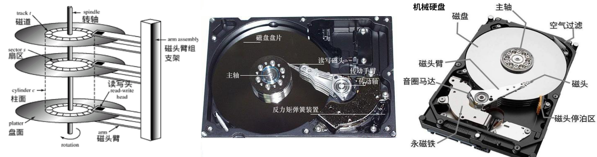

# 存储器概述

## 存储器分类

| 作用（层次）划分        | 特点                                                         |
| ----------------------- | ------------------------------------------------------------ |
| 主存储器（主存）        | CPU可以直接和内存交换信息。 速度快、容量小、单位价格高。 |
| 辅助存储器（辅存）      | 辅存存放当前暂时不用的程序和数据，不能与CPU直接交换信息。 速度慢、容量大、单位价格低。 |
| 高速缓冲存储器（Cache） | Cache存放当前CPU经常使用的指令和数据。 速度快、容量小、单位价格高。 |

| 存取方式                                    | 特点                                                         |
| ------------------------------------------- | ------------------------------------------------------------ |
| 随机存储器（RAM） Random Access Memory | RAM的任何一个存储单元的内容都可以随机存取，存取时间与存储单元的物理位置无关。 可读/写存储器，主要用作主存、Cache，分为静态RAM和动态RAM。 |
| 只读存储器（ROM） Read Only Memory     | ROM存放固定不变的数据（不易失），只能随机读出存储内容，而不能重新写入。 ROM与RAM共同作为主存的一部分，统一构成主存的地址域。 掩模型只读存储器（MROM）、可编程只读存储器（PROM）、可擦除可编程只读存储器（EPROM）、电可擦除可编程只读存储器（EEPROM）。 |
| 串行访问存储器                              | 串行访问存储器对存储单元进行读/写操作时，需按其物理位置的先后顺序寻找地址。（信息所处位置不同，读/写时间不同） 顺序存取存储器（磁带）读/写时必须从介质的始端开始按顺序寻找信息 直接存取存储器（磁盘）直接指出该存储器中的某个小区域（磁道）（直接访问），再按顺序寻访，直到找到位置。 |

> 相联存储器按内容或地址寻址。把存储单元所存内容的某一部分作为检索项，并将存储器中与该检索项符合的存储单元内容进行读/写出操作。

| 信息的可保存性 | 说明                       |
| -------------- | -------------------------- |
| 易失性存储器   | 断电后，存储信息消失       |
| 非易失性存储器 | 断电后，存储信息仍然保留   |
| 破坏性读出     | 读出后，原存储信息被破坏   |
| 非破坏性读出   | 读出后，原存储信息不被破坏 |

| 存储介质     | 特点：能寄存“0”、“1”两种代码，并能区别两种状态的物质/元器件  |
| ------------ | ------------------------------------------------------------ |
| 半导体存储器 | 存储元件由半导体器件组成的存储器。 易失性存储器。体积小、功耗小、存取时间短 双极型（TTL）高速。 MOS：高集成度、制造简单、成本低廉、功耗小。 |
| 磁表面存储器 | 在金属/塑料基体表面涂一层磁性材料作为记录介质，工作时，磁场随载磁体高速运转，用磁头在磁层上进行读/写操作。 按磁体形状不同：磁盘、磁带、磁鼓（很少采用）。 非易失性：磁表面物质具有矩形磁滞回线特性，按其剩磁状态的不同区分“0”、“1”，且剩磁状态不容易丢失。 |
| 磁芯存储器   | 磁芯：由硬磁材料制成的环状元件，在磁芯中穿有驱动线（通电流）和读出线进行读写操作。 不易失的永久记忆存储器。体积大、工艺复杂、功耗太大。（几乎不采用，被半导体存储器替代） |
| 光盘存储器   | 应用激光在记录介质（磁光材料）上进行读/写的存储器。 非易失性。密度高、耐用性好、可靠性高、可互换性强。（用于计算机系统） |

## 存储器性能指标

- 存储器的主要性能指标：速度、容量、每位价格（位价）。速度越高、位价就越高；容量越大，速度必越低，位价就越低。

 

- 存储容量（Byte） = 存储字数（存储单元个数，存储器的地址空间大小） \* 字长（一次存取操作的数据量）

- 每位价格（单位成本） = 总成本 / 总容量
- 数据传输率（存储器带宽，存储速度） = 数据的宽度 / 存取周期（存储周期）

 

| 指标                                 | 说明                                                         |
| ------------------------------------ | ------------------------------------------------------------ |
| 存取时间                             | Memory Access Time，启动一次存储器操作（读/写出）到完成该操作所用时间 读出时间：从存储器接收到有效地址开始，到产生有效输出所需的全部时间 写入时间：从存储器接收到有效地址开始，到数据写入被选中单元为止所需的全部时间 |
| 恢复时间                             | 任何存储器在读/写操作之后，都需要一段恢复内部状态的时间      |
| 存取周期 读写周期 访存周期 | Memory Cycle Time，存储器进行连续两次独立的存储器操作所需的最小间隔时间 存取周期 = 存取时间 \+ 恢复时间 |
| 主存带宽 数据传输率             | 单位时间内存储器存取的信息量（字/秒、字节/秒、位/秒）        |

> 现代MOS型存储器的存取周期可达到100ns、双极型TTL存储器的存取周期接近于10ns。
>

## 缓存-主存-辅存 三级存储系统 

- 存储器层次结构利用上一级存储器作为下一级存储器的高速缓冲（上层作为下层的部分内容的副本），解决速度\-成本\-容量的冲突。

1. 缓存-主存层次：解决CPU和主存速度不匹配的问题。缓存的速度比主存的高，将CPU近期要使用的信息调入缓存，CPU便可直接从缓存获取信息，提高访存速度。由于缓存的容量小，需要不断地将主存的内容调入缓存，使缓存中原有的信息被替换。数据操作由硬件自动完成，对所有程序员透明。

2. 主存-辅存层次：解决存储系统容量问题。辅存的速度比主存低，而且不能直接和CPU交换信息，但辅存的容量大于主存，可存放大量暂时未使用到的信息。当CPU需要使用到这些信息时，将辅存的内容调入主存，供CPU直接访问。数据操作由硬件和操作系统共同完成，对应用程序员透明。

- 虚拟存储系统：编程的地址范围与虚拟存储器的地址空间相对应。当虚地址的内容在主存时，机器可直接使用；若虚地址的内容不在主存，则必须将此虚地址的内容传递到主存的合适单元，再被机器使用。逻辑地址转换为物理地址由硬件和操作系统共同完成，对程序员透明。

| 指令地址 | 说明                                                         |
| -------- | ------------------------------------------------------------ |
| 虚拟地址 | 编程时大于实际主存空间的可用地址空间，实际并不存在。（虚地址、虚存地址、逻辑地址） |
| 物理地址 | 主存的实际地址，程序执行过程中真正访问的地址。               |

# 主存储器 MM

## 主存基本组成

 

- 指令执行过程中需要访问主存时。首先由CPU将被访问单元的地址送到MAR，经地址总线送至主存的地址寄存器，以便地址译码器译码选中的单元。同时CPU将读写信号通过控制线送到主存的读写控制电路。若为写操作，则CPU同时将要写的信息送到MDR，在读写控制电路的控制下，经数据线将信号写入选中的单元；若为读操作，则主存读出选中单元的内容送到数据线，之后送到MDR。

### 存储单元编址

- 主存储器（MM，Main Memory）的核心部分是由一个个存储0或1的记忆单元（存储元件）构成的存储矩阵（[存储体](#存储体)），记忆单元是具有两种稳态的能表示二进制0和1的物理器件，为存取存储体中的信息，必须对存储单元编址。编址单位是具有相同地址的存储元件构成的，按字或字节编址。

> 现代计算机通常采用字节编址，存储体内的一个地址有一个字节。

- 主存各存储单元的空间位置由单元地址号表示，地址总线指出存储单元地址号，根据该地址可读出/写入一个存储字。

> 不同的机器存储字长不同，但都是8的倍数：通常使用8位二进制数表示一个字节，以满足字符处理需要。

- 字寻址、字节寻址。

## 半导体存储芯片

- 存储芯片通过地址总线、数据总线、控制总线与外部连接。
- 半导体存储芯片是超大规模集成电路制造工艺，一个芯片内集成具有记忆功能的存储矩阵、译码驱动电路、读/写电路等。

 

1. 存储体：存储元是存放一个二进制位的物理器件，是存储器最基本的构件；地址码相同的多个存储元构成一个存储单元；若干存储单元的集合构成存储体。存储体由行选择线X和列选择线Y来选择所访问的单元，存储体的相同行、列上的位同时被读出或写入。
2. 地址译码器：将地址转换为译码输出线上的高电平，以便驱动相应的读写电路。将地址总线送来的地址信号翻译成对应存储单元的选择信号，该信号在读/写电路的配合下完成对被选中单元的读/写操作。
3. I/O选择电路：控制被选中单元的读写，具有放大信息的作用。
4. 片选控制信号：保证在访问某个字时，选中该存储字所在的芯片，避免选中其他芯片。
5. 读/写控制信号：根据CPU给出的读/写命令，控制被选中单元进行读/写操作。

| 类型   | 输入 | 位数                                                         |
| ------ | ---- | ------------------------------------------------------------ |
| 地址线 | 单向 | MDR位数相关，位数与芯片容量有关                              |
| 数据线 | 双向 | MDR位数相关，位数与芯片可读出/写入的数据位数有关、与芯片容量有关 |

- 数据线的宽度与MDR宽度相同，地址线的宽度与MAR宽度相同。数据线决定一次可读取的单元数，若为字节编码，则每次最多读取 数据线位数/8个单元的内容。地址线决定主存地址空间（不仅仅是主存储器）的最大可寻址范围，从0开始编址，0\~236\-1。

| 控制线      | 作用                                                         |
| ----------- | ------------------------------------------------------------ |
| 读/写控制线 | 决定芯片进行读/写操作                                        |
| 片选线      | 选择存储芯片 半导体存储器由多个芯片组成，通过片选信号来确定被选中的芯片。 |

- 不同存储芯片的读/写控制线、片选线可以不同。

> 一个64K\*8位的存储器，可由32片16K\*1位的存储芯片组成，每次读出一个存储字时，只需选中8片。
>
>  

- 译码驱动方式：线选法、重合法。

 

### RAM 随机存取存储器

- RAM通常是为用户编程而设置。

| RAM      | SRAM     | DRAM     |
| -------- | -------- | -------- |
| 存储信息 | 触发器   | 电容     |
| 读出     | 非破坏性 | 破坏性   |
| 刷新     | 不需要   | 需要     |
| 行列地址 | 同时送   | 分两次送 |
| 集成度   | 低       | 高       |
| 位价     | 高       | 低       |
| 信息保存 | 易失性   | 易失性   |
| 用途     | Cache    | 主存     |

#### SRAM 静态RAM

- SRAM（Static Random Access Memory）的存储元通过双稳态触发器（六晶体管 MOS）来记忆信息，非破坏性读出x，易失性。存取速度快，集成度低，功耗大，价格贵；一般用于Cache。

##### 基本单元电路

- 存储器的基本单元电路：存储器中用于存储“0”、“1”代码的电路。

 

#### DRAM 动态RAM

- DRAM（Dynamic Random Access Memory）利用存储元电路中栅极电容上的电荷来存储信息，其基本存储元一般只使用一个晶体管（集成度高）。容易集成，价位低，容量大，功耗低，存取速度慢；一般用于主存。
- DRAM一般采用地址引脚复用技术，行地址和列地址（行选线和列选线）通过相同的引脚先后两次输入，可减少一半的地址线引脚。

> 行缓冲区（row buffer），8192\*8192\*8位的DRAM芯片，其芯片内行数为8192，每行大小为8192\*8位。

    
某SRAM存储芯片的容量为32K\*16位，则该芯片的最小引脚数目为____，地址线____根，数据线____根，其他线路____（除了电源和接地端）。若为DRAM芯片呢？

    1. 该芯片的最小引脚数目为34个，地址线15根（32K = 25*210），数据线16根（16bit），片选线1根、读控制线（RD）1根、写控制线（WE）1根。 
    2. 若为DRAM芯片，采用了地址复用技术，则该芯片的最小引脚数目为28个，地址线为8根（15/2 向上取整），数据线为16根，行通选线1根，列通选线1根、读控制线1根、写控制线1根。

    

        假定DRAM芯片中存储阵列的行数为r、列数为c，对于一个2Kx1位的DRAM芯片，为保证其地址引脚数最少，并尽量减少刷新开销，则r、c的取指适宜为_____。 
        A. 2048, 1&nbsp;&nbsp;&nbsp;&nbsp;&nbsp;&nbsp;B. 64, 32&nbsp;&nbsp;&nbsp;&nbsp;&nbsp;&nbsp;C. 32, 64&nbsp;&nbsp;&nbsp;&nbsp;&nbsp;&nbsp;D. 1, 2048
    

    C 
    1. DRAM采用地址引脚复用技术，故行数和列数应该尽量相差不大 
    2. DRAM通常是按行刷新，应该尽量减少行的数量。

 

##### 刷新方式

- DRAM电容上的电荷一般只能维持1\~2ms，即使电源不断电，信息也会自动消失，每隔一段时间就必须刷新，刷新周期一般取2ms。

1. 集中刷新：在一个刷新周期内，利用一段固定的时间（死区），依次对存储器的所有行进行逐一再生，在此期间停止对存储器的读写操作，读写操作和刷新工作分开。
2. 分散刷新：对每行的刷新被分散到各个工作周期（前半部分用于读写操作或保持，后半部分用于刷新），避免了死区，但增长了系统的存取周期。
3. 异步刷新：结合前两种方法，将刷新周期除以行数（两次刷新操作之间的时间间隔 t），利用逻辑电路每隔时间t产生一次刷新请求。

- DRAM的刷新：（1）对CPU透明，不依赖外部访问；（2）以行为单位刷新，由芯片内部自动生成行地址；（3）不需要选片，整个存储器中的所有芯片同时被刷新；（4）一次完整的刷新过程只需要占用一个存储周期，将数据读出经刷新放大器（集成于DRAM）后返回即可（不经过CPU）。

##### 读写周期

- DRAM在读周期中，为使芯片能够正确接收行、列地址，在$\overline{RAS}$有效前将行地址送到芯片的引脚，$\overline{CAS}$滞后$\overline{RAS}$一段时间，在$\overline{CAS}$有效前再将列地址送到芯片的地址引脚，$\overline{RAS}$、$\overline{CAS}$至少保持时间tRAS、tCAS。$\overline{WE}$为高电平，并在$\overline{CAS}$有效前建立。
- DRAM在读周期中，行列选通的时序关系和读周期相同，但写数据必须在$\overline{CAS}$有效前在数据总线上保持稳定。$\overline{WE}$为低电平，并在$\overline{CAS}$有效前建立。

### ROM 只读存储器

- ROM（Read-Only Memory）支持随机访问；非易失性存储器，一旦有了信息就不能轻易改变，即使掉电也不丢失；结构简单，位密度比可读写存储器高。

1. MROM（掩模式只读存储器）由半导体制造厂按用户需求在生产过程中直接写入，任何人都无法改变写入后的内容。可靠性高、集成度高、位价低，但灵活性差。
2. PROM（一次可编程只读存储器）由用户通过编程器写入自己的程序，一旦写入无法改变。
3. EPROM（可擦除可编程只读存储器）由用户通过编程器写入自己的程序，可对其内容多次改写，但次数有限，且写入时间长。
4. Flash（闪存）在EPROM和EEPROM发展而来，可长期断电保存信息。位价低、集成度高，可擦除重写，且速度快，可作为辅存。
5. SSD（固态硬盘 Solid State Drives）基于Flash，由固态电子存储芯片阵列制成的硬盘，由控制单元和存储单元（Flash）组成。

- ROM通常用于存放系统程序、标准子程序、各类常数。

## 多模块存储器

- 多模块存储器是空间并行技术，利用多个结构完全相同的存储模块的并行工作来提高存储器的吞吐率。

1. 单体多字存储器：存储器中只有一个存储体，每个存储体存储m个字，总线宽度也为m个字。一次并行读出m个字，地址必须顺序排列并处于同一存储单元（指令和数据必须是连续存放在内存的）。

> 基于CPU的速度比存储器块。

2. 多体并行存储器由多体模块组成，每个模块都有相同的容量和存取速度，各模块都有独立的读写控制电路、地址寄存器、数据寄存器，各模块既能并行工作，也能交叉工作。

> 双端口存储器具有两套独立的读/写口，具有各自的地址寄存器和译码电路，可以同时访问同一区间、同一单元，也就是端口的地址码相同时，不会发生冲突。

### 高位交叉编址（顺序方式）

- 高位地址表示体号，低位地址表示体内地址，高位交叉编址总是将低位的体内地址送到由高位体号确定的模块内进行译码。访问一个连续主存块时，总是先在一个模块内访问，等待该模块访问结束后才转到下一个模块访问，CPU总是按顺序访问存储模块，各模块不能被并行访问，不能提高存储器的吞吐率。

 

### 低位交叉编址（交叉方式）

- 低位地址表示体号，高位地址表示体内地址，总是把高位的体内地址送到由低位体号确定的模块内进行译码。每个模块按模m（m个模块）交叉编址，模块号 = 单元地址 % m，程序连续存放在相邻模块（交叉存储器）。采用流水线方式并行存取，不改变每个模块存取的周期，提供存储器的带宽。

 

    
假定使用若干16K*8位的存储芯片组成一个64K*8位的存储器，存储芯片各单元采用交叉编址方式，则地址BFFFH所在芯片的最小地址为______。

    0003H 
    模块数 = 64K*8位 / 16K*8位 = 4，则片选信号（体号）需要的地址位数为2，即低2位为体号。而地址BFFFH的低2位为11，即编号3的芯片（从0开始编号），其最小地址为0003H。

- 设模块字长等于数据总线宽度，模块存取一个字的存取周期为T，总线传送周期为r，则：

1. 交叉存取度m = T/r，每经过r时间延迟后启动下一个模块，交叉存储器要模块数必须大于等于m，以保证启动某模块后经过m\*r时间后再次启动该模块时，其上次的存取操作已经完成，保证流水线不被中断。
2. 连续存取m个字所需的时间t = T \+ ( m \- 1)r。

> 高位交叉编址（顺序方式）连续存取m个字所需的时间 = mT。

 

一个四体并行低位交叉存储器，每个模块的容量为64K*32位，存取周期为200ns，总线周期为50ns，则在200ns内，存储器能向CPU提供___位二进制信息。

    128位（4*32位），以下两种角度理解： 
    1. 连续取m个字耗时t=T+(m-1)r,平均每个字的存取时间为t/m。实际工作时，m相当大，t/m近似于r，相当于1个总线周期内存储器能向CPU提供一个字（本题为32位）。 
    2. 低位交叉编址的流水线方式充分流动后，每个总线周期都能完成一个字的读写。

    
某机器采用四体低位交叉存储器，分别执行以下操作：（1）读取6个连续地址单元中存放的存储字，重复80次；（2）读取8个连续地址单元中存放的存储字，重复60次。则（1）（2）花费的时间之比为____。

    4:3 
    总线周期r=T/m=T/4 
    （1）在每轮读取存储器的前6个总线周期内，依次进入各体，而下一轮欲读取存储器时，最近访问的M0还在占用中，需要等待2r的时间才能开始下一轮读取，则读取一轮的耗时为2T；而最后一轮结束的时间是第六个字读取结束，也就是M1第二次读取完成，耗时为2T+r。则总耗时为(80-1)*2T+(2T+r)=160T+r=160.25T 
     
    （2）在每轮读取存储器的前8个总线周期内，依次进入各体，下一轮欲读取存储器时，最近访问的M0未被占用中，不需要等待就可立即开始下一轮读取，则读取一轮的耗时为2T；而最后一轮结束的时间是第8个字读取结束，也就是M3第二次读取完成，耗时为2T+3r。则总耗时为(60-1)*2T+(2T+3r)=160T+3r=120.75T 
    

    
某计算机使用四体交叉编址存储器，假定在存储器总线上出现的主存地址（十进制）序列为8005、8006、8007、8008、8001、8002、8003、8004、8000，则可能出现访存冲突的地址是______。

    8004和8000 
    每个访存地址对应的模块序号（体号）= 访存地址 % 存储器交叉模块数 
    <table>
        <tr>
            <th>访存地址</th>
            <td>8005</td>
            <td>8006</td>
            <td>8007</td>
            <td>8008</td>
            <td>8001</td>
            <td>8002</td>
            <td>8003</td>
            <td>8004</td>
            <td>8000</td>
        </tr>
        <tr>
            <th>模块序号</th>
            <td>1</td>
            <td>2</td>
            <td>3</td>
            <td>0</td>
            <td>1</td>
            <td>2</td>
            <td>3</td>
            <td>0</td>
            <td>0</td>
        </tr>
    </table>
     
    判断是否发生访存冲突的规则为，给定的访存地址在相邻的四次访问中出现在同一个存储体（体号相同）内，违背了流水线式的访存方式。

## 存储器与CPU的连接

### 连接原理

 

1. 选择存储芯片。芯片类型（RAM、ROM）、芯片数量。
2. 地址线的连接。CPU的地址线数往往比存储芯片的地址线数多，通常将CPU地址线的低位和存储芯片的地址线相连，用于字选，译码由芯片的片内逻辑完成；高位则在扩充存储芯片时使用，用于[片选](#片选)，译码由外接译码器逻辑完成。
3. 数据线的连接。CPU的数据线数与存储芯片的数据位数不一定相等，相等时可直接连接；不等时必须对存储芯片[扩位](#位扩展)使得相等。
4. 读/写命令线的连接。（1）CPU读/写命令线一般可直接与存储芯片的读/写控制端相连，通常高电平为读、低电平为写。（2）若CPU的读/写命令线是分开的（$\overline{RD}$、$\overline{WE}$，均为低电平有效），此时CPU的读命令线和存储芯片的运行读控制端相连，而CPU的写命令线和存储芯片的允许写命令控制端相连。
5. 片选线的连接（关键）。那一片存储芯片被选中完全取决于该存储芯片的片选控制端$\overline{CS}$是否能接收到来自CPU的片选有效信号。片选有效信号与CPU的访存控制信号$\overline{MREQ}$有关，只有当CPU要求访存时，才要求选中存储芯片，$\overline{MREQ}$为低电平时有效；若CPU访问I/O，则$\overline{MREQ}$为高电平，表示不要求存储器工作。

### 主存容量扩展

#### 位扩展法

- 位扩展，CPU的数据线数与存储芯片的数据位数不一定相等，此时必须对存储芯片扩位，即用多个存储器件对字长进行扩充，增加存储字长。将多个存储芯片的地址端、片选端、读写控制端相应并联，数据端分别引出，使得存储芯片的数据位数与CPU的数据线数相等。

- 仅采用位扩展时，各芯片连接地址线的方式相同，但连接数据线的方式不同，在某一时刻需要选中所有的存储芯片，片选信号$\overline{CS}$要连接到所有芯片，即位扩展为一组的存储芯片（芯片组）只需要一个片选信号。

 

#### 字扩展法

- 字扩展，增加存储器中字的数量，而位数不变。将多个芯片的地址线、数据线、读写控制线相应并联，由片选信号来区分各芯片的地址范围。

- 仅采用字扩展时，各芯片连接地址线的方式相同，连接数据线的方式也相同，但在某一时刻只需要选中部分存储芯片即可，通过片选信号$\overline{CS}$或采用译码器设计连接到相应的芯片，即字扩展的存储芯片不共用一个片选信号，需要为每个字扩展的存储芯片配置独立的一个片选信号。

 

#### 字位同时扩展法

- 字位同时扩展，存储器往往需要同时扩充字和位，即增加存储字的数量，又增加存储字长。
- 采用字位同时扩展时，各芯片连接地址线的方式相同，但连接数据线的方式不同，且需要通过片选信号$\overline{CS}$或采用译码器设计连接到相应的芯片。

 

### 存储芯片的地址分配和片选

- CPU实现对存储单元的访问，首先需要选择存储芯片（片选），然后为选中的芯片依地址码选择相应的存储单元，以进行数据的存取（字选）。片内的字选通常是由CPU送出的N（片内存储容量2N）条低位地址线完成的，地址线直接接到所有存储芯片的地址输入端。
- 片选信号的产生分为线选法和译码片选法。

    
假定用8片8Kx8位的存储芯片组成64Kx8位存储器（地址线16位，数据线8位），需要___个片选信号，采用________产生片选信号。

    8，译码片选法 
    此题，8片存储芯片对应8个片选信号，且除去片内寻址的13（213=8K）位地址线外，仅余高3位。 
    1. 若采用线选法，只能产生3个片选信号，不满足8个片选信号。 
    2. 若采用译码片选法，用一片74LS148作为地址译码器，可以产生23个片选信号，则A15A14A13=000时选中第一片，以此类推。

    
若片选地址为111时，选定某一32Kx16位的存储芯片工作，则该芯片在存储器中的首地址和末地址为_______。

    38000H，3FFFFH 
    由片选地址为111，得到片选地址线（高位地址线）3根；而存储芯片为32Kx16位，得到片内地址线（低位地址线）为15根；总地址线数为18。故首地址为11,1000,0000,0000,0000（共18位，38000H），末地址为首地址加上32K-1，即11,1111,1111,1111,1111（3FFFFH）。

    

        如下图所示，若低位地址（A0~A11）接在内存芯片地址引脚上，高位地址（A12~A19）进行片选译码（其中A14和A16未参与译码），且片选信号低电平有效，则对图中所示的译码电路，找出不属于此译码空间的地址_______。 
        
    

    此为部分译码的片选信号，高8位地址中A14和A16未参与译码，该译码输出的逻辑表达式为 ，要求A17和A18至少有一个为1且A19A15A13A12应全为1 
    如FE000H~FEFFFH，提取其高8位（A12~A19）并去除A14和A16，得到111110，故不满足。

#### 线选法

- 线选法用除片内寻址外的高位地址线直接（或经反相器）分别接至各个存储芯片的片选端（片选地址线），当某地址线信息为“0”时，就选中与之对应的存储芯片。这些片选地址线每次寻址时只能有一位有效，不允许同时有多位有效，保证每次只选中一个芯片（或芯片组）。

1. 不需要地址译码器。
2. 地址空间不连续，选片的地址线必须分时为低电平（否则不能工作），不能充分利用系统的存储器空间，地址资源浪费（n条地址线原本对应2n个地址，但在片选法中，只能对应n个片选信号，需要保证只有一位有效的“0“）。

    
假设4片2K x 8位存储芯片用线选法构成8K x 8位存储器，则各芯片的片选信号（A11~A14）为______，其中，低位地址线A0~A10为字选线，用于片内寻址。

    <table>
        <tr>
            <th>芯片</th>
            <th>A14</th>
            <th>A13</th>
            <th>A12</th>
            <th>A11</th>
        </tr>
        <tr>
            <td>0#</td>
            <td>1</td>
            <td>1</td>
            <td>1</td>
            <td>0</td>
        </tr>
        <tr>
            <td>1#</td>
            <td>1</td>
            <td>1</td>
            <td>0</td>
            <td>1</td>
        </tr>
        <tr>
            <td>2#</td>
            <td>1</td>
            <td>0</td>
            <td>1</td>
            <td>1</td>
        </tr>
        <tr>
            <td>3#</td>
            <td>0</td>
            <td>1</td>
            <td>1</td>
            <td>1</td>
        </tr>
    </table>

#### 译码片选法

- 译码片选法用除片内寻址外的高位地址线通过地址译码器芯片产生片选信号。

    
地址总线A0（高位）~A15（低位），用4K x 4位的存储芯片组成16KB存储器，则产生片选信号的译码器的输入地址线应该是_____。

    A2A3 
    由4K确定字选需要12根低位地址线，故A4A15都被使用 
    又16KB存储器为16Kx8位，需要位扩展8/4=2。 
    而需要字扩展16K/4K=22，则需要2根高位地址线，则选择A2A3，而不是A0A1

# 外部存储器

## 磁盘存储器

- 磁盘存储器的优点

1. 存储容量大、位价低
2. 记录介质可重复使用
3. 记录信息可长期保存而不丢失
4. 非破坏性读出，读出时不需要再生

- 磁盘存储器的缺点

1. 存取速度慢
2. 机械结构复杂
3. 对工作环境要求较高

### 磁盘设备的组成

 

- 硬盘存储器由磁盘驱动器、磁盘控制器、盘片组成。

1. 磁盘驱动器：核心部分是磁头组件和盘片组件，温彻斯特盘是一种可移动磁头固定盘片的硬盘存储器。
2. 磁盘控制器：硬盘存储器和主机的接口，主流的标准有IDE、SCSI、SATA等。

- 存储区域：一块硬盘含有若干记录面，每个记录面划分为若干个磁道，而每条磁道又划分为若干扇区，扇区（块）是磁盘读写的最小单位（磁盘按块存取）。

1. 磁头数（记录面数，Heads）：表示硬盘共有多少个磁头。磁头用于读取/写入盘片上记录面的信息，一个记录面对应一个磁头。
2. 柱面数（Cylinders）：表示硬盘每面盘片上有多少条磁道。在一个盘组中，不同记录面的相同编号（位置）的诸磁道构成一个圆柱面。
3. 扇区数（Sectors）：表示每条磁道上有多少个扇区。

### 磁记录原理

- 磁记录原理：磁头和磁性记录介质相对运动时，通过电磁转换完成读/写操作。
- 编码方法：按某种方案（规律），把一连串的二进制信息变换成存储介质磁层中一个磁化翻转状态的序列，并使读/写控制电路容易、可靠地实现转换。
- 磁记录方式：通常采用FM（调频制）和MFM（改进型调频制）的记录方式。

### 磁盘的性能指标

- 记录密度：盘片单位面积上记录的二进制信息量，通常以道密度、位密度、面密度表示。

1. 道密度：沿磁盘半径方向单位长度上的磁道数
2. 位密度：磁道单位长度上能记录的二进制代码位数
3. 面密度：道密度 x 位密度

- 磁盘的容量：磁盘的容量分为非格式化容量和格式化容量，格式化后的容量要小于非格式化容量。

1. 非格式化容量：磁记录表面可利用的磁化单元总数，由道密度和位密度计算而来
2. 格式化容量：按照某种特定的记录格式所能存储信息的总量。

- 平均存取时间：由寻道时间（磁头移动到目的磁道的时间）、旋转延迟时间（磁头定位到要读写扇区的时间）、传输时间（传输数据所花费的时间）构成。由于寻道和找扇区的距离远近不一，寻道时间和旋转延迟时间通常取平均值。

- 数据传输率：磁盘存储器在单位时间内向主机传送数据的字节数。假定磁盘转数为r转/秒，每条磁道容量为N字节，则数据传输率 Dr = rN

    
某磁盘的转速为10000转/分，平均寻道时间是6ms，磁盘传输速率是20MB/s，磁盘控制器延迟为0.2ms，读取一个4KB的扇区所需的平均时间约为_________。

    某磁盘的转速为10000转/分，平均寻道时间是6ms，则平均查询扇区的时间为3ms 
    读取一个4KB的扇区信息的时间为 4KB / 20MB/s = 0.2ms 
    故读取一个4KB的扇区所需的平均时间 = 平均寻道时间 + 平均查询扇区的时间 + 信息延迟时间 + 读取扇区信息时间 = 6 + 3 + 0.2 + 0.2 = 9.4ms

    
某磁盘的转速为7200转/分，平均寻道时间是8ms，每个磁道包含1000个扇区，则访问一个扇区的平均存取时间约为_________。

    存取一个扇区的平均延迟时间为旋转半周的时间 =  (60/7200)/2 = 4.17ms 
    传输时间 = (60/7200)/1000 = 0.01ms 
    因此，访问一个扇区的平均存取时间 = 平均寻道时间 + 延迟时间 + 传输时间 = 8ms +  4.17ms + 0.01ms = 12.18ms

### 磁盘地址

- 主机向磁盘控制器发送寻址信息。

 

- 若系统中有4（22）个驱动器，每个驱动器带一个磁盘，每个磁盘256（28）个磁道、16（24）个盘面，每个盘面划分为16（24）个扇区，则每个扇地址需要18（2+8+4+4）位二进制代码。

 

### 硬盘的工作过程

- 硬盘的主要操作是寻址、读盘、写盘。每个操作对应一个控制字，硬盘工作时，第一步取控制字，第二步执行控制字。
- 硬盘属于机械式部件，其读写操作是串行的，不可能在同一时刻既读又写，也不可能在同一时刻读两组数据或写两组数据。

## 磁盘阵列 RAID

- RAID（独立冗余磁盘阵列）：将多个独立的物理磁盘组成一个独立的逻辑盘，数据在多个物理盘上分割交叉存储、并行访问，具有更好的存储性能、可靠性、安全性。

| 分级  | 磁盘阵列                     |
| ----- | ---------------------------- |
| RAID0 | 无冗余和无校验的磁盘阵列     |
| RAID1 | 镜像磁盘阵列                 |
| RAID2 | 采用纠错的汉明码的磁盘阵列   |
| RAID3 | 位交叉奇偶检验的磁盘阵列     |
| RAID4 | 块交叉奇偶检验的磁盘阵列     |
| RAID5 | 无独立校验的奇偶检验磁盘阵列 |

- RAID的分级中RAID1\~RAID5的方案，无论何时有磁盘损坏，都可以随时拔出受损的磁盘再插入好的磁盘，而数据不会损坏，提高了系统的可靠性。
- RAID0：把连续多个数据块交替地存放在不同物理磁盘的扇区中，多个磁盘交叉并行读写。仅扩大了存储容量和磁盘数据存取速度，但RAID0本身没有容错能力。
- RAID1：使两个磁盘同时读写，互为备份，若一个磁盘出现故障，则从另一个磁盘读出数据。将两个磁盘视为一个磁盘使用，减少了一半的容量。

1. RAID通过同时使用多个磁盘，提高了传输率
2. 通过在多个磁盘并行存取来大幅度提高存储系统的数据吞吐量
3. 通过镜像功能，提供安全可靠性
4. 通过数据校验，提供容错能力

## 固态硬盘 SSD

 

- SSD（固态硬盘）是基于闪存（Flash）技术的存储器，与U盘没有本质的区别，只是存储容量更大、存取性能更好。
- 一个SSD由一个或多个闪存芯片和闪存翻译层组成。

1. 闪存芯片替代传统旋转磁盘中的机械驱动器
2. 闪存翻译层将来自CPU的逻辑块读写请求翻译成对底层物理设备的读写控制信号，相当于扮演了磁盘控制器的角色

 

- 一个闪存由B块组成，每块由P页组成。通常，页的大小是512B\~4KB，每块由32\~128页组成，块的大小为16KB\~512KB。数据是页为单位读写的。
- 随机写很慢的原因：

1. 擦除块比较慢（1ms级），比访问页高一个数量级
2. 如果写操作试图修改一个包含已有数据的页Pi，则该页所属块的所有含有数据的页都必须被复制到一个新块（被擦除过的），只有该页所属的块整个被擦除后，才能写这一页。一旦一个块被擦除，块中的每个页都可以直接再写一次。某个块进行了约10万次重复写之后，就会磨损坏，不能再使用。

- SSD的优点：SSD由半导体存储器构成，没有移动的部件，因此，随机访问时间比机械硬盘块，也没有任何机械噪声和震动，能耗更低，抗震性好，安全性高等。
- SSD的缺点：SSD容易磨损，反复写之后，闪存块会磨损。闪存翻译层中有一个平均磨损逻辑试图将擦除平均分布在所有的块上，以此最大化每个块的寿命，因此，SSD的寿命得到延长，通常要很多年之后才磨损坏。

# 高速缓冲存储器 Cache

## Cache的基本工作原理

- 高速缓冲技术利用程序访问的局部性原理，把程序中正在使用的部分数据存放在一个高速的、容量较小的Cache，把CPU的访存操作大多数针对Cache进行，从而提高程序的执行速度。 程序访问的局部性原理包括时间局部性和空间局部性。

1. 时间局部性：最近的未来要用到的信息，很可能是现在正在使用的信息，因为程序中存在循环。
2. 空间局部性：最近的未来要用到的信息，很可能与现在正在使用的信息在存储空间上是邻近的，因为指令通常是顺序存放、顺序执行的，数据也一般是以向量、数组等形式簇聚地存储在一起。

- Cache位于存储器层次结构的顶层，通常由SRAM构成。为方便Cache和主存交换信息，Cache和主存都被划分为相等的块，每个Cache块（Cache行）由若干字节组成，块的长度即块长（Cache行长、块内地址）。CPU与Cache之间的数据交换以字为单位，而Cache与主存之间的数据交换则以Cache块为单位。
- Cache仅保存主存中最活跃的若干块的副本，Cache按照某种策略，预测CPU在未来一段时间内欲访存的数据，将其装入Cache。

1. 当CPU发出读请求时，若访存地址在Cache中命中，就将此地址转换成Cache地址，直接对Cache执行读操作，与主存无关；若Cache未命中，则仍需访问主存，并把此字所在的块一次性地从主存调入Cache；若此时Cache已满，则需根据某种替换算法，用这个块替换Cache中原来的某块信息；以上整个过程都是硬件实现的。若采用同时访问Cache和主存的方式，则Cache命中时，主存访问终止，否则访问主存并替换Cache。（CPU可直接读取主存的数据，数据不需要再从主存经过Cache而到达CPU）
2. 当CPU发出写请求时，若Cache命中，有可能会遇到Cache与主存中的内容不一致的问题，需要按照一定的[写策略](#Cache写策略)处理，全写法和回写法。

 

- 命中率：上级存储器对下级存储器访问时，下级存储器中正好存在需要的数据的概率。对于CPU-Cache-主存，若命中，则耗费时间为Cache的访问时间；若未命中（此时，CPU直接访问主存），则Cache+主存的访问时间（若为同时访问，则为主存的访问时间）。

1. 假定一个程序执行期间，Cache的总命中次数为Nc，访问主存的总次数为Nm，则命中率 H = Nc / (Nc+Nm)
2. 假定tc为命中时的Cache访问时间，tm为未命中时的访问时间（分为Cache未命中才访问主存、Cache与主存同时访问的两种情形），1-H表示未命中率，则Cache-主存系统的平均访问时间 Ta = Htc + (1-H)tm

- Cache需要实现数据查找、地址映射、替换策略、写入策略。

## Cache和主存的映射方式

- Cache行中的信息是主存中某个块的副本，地址映射将主存地址空间映射到Cache地址空间，将存放在主存中的信息按照某种规则装入Cache。（1）为每个块加上一个标记（相当于主存中块的编号），指明其对应主存的哪一块的副本；（2）每个Cache行需要一个有效位来说明Cache行中信息是否有效。

| 映射方式                    | 直接映射                      | 全相联映射                 | N路组相联映射 |
| --------------------------- | ----------------------------- | -------------------------- | ------------- |
| 每个主存块能映射的Cache行数 | 只能映射到Cache中的某一固定行 | 所有的Cache行              | 映射到N行     |
| 命中率                      | 最低                          | 最高                       |               |
| 判断开销                    | 判断开销最小，所需时间最短    | 判断开销最大，所需时间最长 |               |
| 标记所占的额外空间开销      | 最少                          | 最大                       |               |

    

        假定某个计算机的主存地址空间大小为256MB，按字节编址，其数据Cache有8个Cache行，行长为64B 
        （1）若不考虑用于Cache的一致维护性和替换算法控制位，并且采用直接映射方式，则该数据Cache的容量为多少？若采用二路组相联映射方式呢？ 
        （2）若该Cache采用直接映射方式，则主存地址为3200（十进制）的主存块对应的Cache行号是多少？采用二路组相联映射时又是多少？ 
        （3）以直接映射方式为例，简述访存过程（设访存的地址为0123456H）。
    

    （1）Cache的总容量 = 存储容量 + 标记阵列容量（有效位、标记位） ，Cache包括了可以对Cache中所包含的存储器地址进行跟踪的硬件。

### 直接映射

- 在直接映射中，主存中的每块只能装入Cache中的唯一位置，若该位置已有内容，则产生块冲突，原先的块被无条件地替换出去（没有使用替换算法）。但即使Cache中的其他许多地址空着也不能占用，使得直接映射的块冲突概率最高，空间利用率最低。

直接映射的关系函数： Cache行号 = 主存块号 mod Cache总行数

- 假定Cache共有2c行，主存有2m块，则主存号的低c位（mod 2c）正好是其要装入的Cache行号。给每个Cache设置一个长为 t = m - c的标记（tag），当主存某块调入Cache后，就将其块号的高t位设置在对应Cache行的标记中。

 

- CPU访存过程，首先根据访存地址中间的c位（Cache行号），找到对应的Cache行，将对应Cache行中的标记（t位）和主存地址的高t位进行比较，若相等且有效位为1，则访问Cache命中，此时根据主存地址中低位的块内地址，在对应的Cache行中存取信息；若不相等或有效位为0，则访问Cache未命中，此时CPU从主存中读出该地址所在的一块信息送到对应的Cache行中，将有效位置为1，并将标记设置为地址中的高t位，同时将该地址中的内容送CPU。

### 全相联映射

- 在全相联映射中，主存中的每一块都可以装入Cache中的任何位置，每行的标记用于指出该行取自主存的哪一块。Cache访存时，需要与所有Cache行的标记进行比较。该方式比较灵活，Cache块的冲突概率低，空间利用率高，但标记的比较速度较慢，实现成本较高，通常需要采用昂贵的按内容寻址的相联存储器进行地址映射。

 

### 组相联映射

- 将Cache分为Q个大小相等的组，每个主存块可以装入固定组中的任意一行，组间使用直接映射、组内使用全相联映射。Q=1时，变为全相联映射；Q=Cache行数时，直接映射。假定每组有r个Cache行，则称为r路组相联。

组相联映射的关系函数： Cache组号 = 主存块号 mod Cache组数（Q）

- 路数越大，每组Cache行的数量越大，发生块冲突的概率越低，但并联比较电路也越复杂。选择适当的路数，使得组相联映射的成本接近直接映射，而性能接近全相联映射。

 

- CPU访存过程，首先根据访存地址中间的组号找到对应的Cache组；将对应的Cache组中每个行的标记与主存地址的高位进行比较；若有一个相等且有效位为1，则访问Cache命中，此时根据主存地址中的块内地址，在对应Cache行中存取信息；若都不相等或有效位为0，则未命中，此时CPU从主存中读出该地址所在的一块信息送到对应Cache组的任意一个空闲行中，将有效位置为1，并设置标记，同时将该地址中的内容送CPU。

## Cache中主存块的替换算法

- 采用全相联映射或组相联映射方式时，从主存向Cache传送一个新块，而Cache或Cache组中的空间已被占满时，需要使用替换算法置换Cache行。直接映射方法无须考虑替换算法，直接替换。

### RAND 随机算法

- RAND随机地确定替换的Cache块。其实现较简单，但未依据程序访问的局部性原理，可能命中率较低。

### FIFO 先进先出算法

- FIFO选择最早调入的行进行替换。其较容易实现，但未依据程序访问的局部性原理，可能命中率较低，最早进入的内存块也可能是目前经常使用的。

### LRU 近期最少使用算法

- LRU依据程序访问的局部性原理，选择近期内长久未访问过的Cache行作为替换的行，平均命中率比FIFO高，是堆栈类算法。
- LRU对每个Cache行设置一个计数器，用计数值来记录主存块的使用情况，并根据计数值选择淘汰某个块，计数值的位数与Cache组大小有关（2路时有一位LRU位，4路时有两位LRU位）。
- 计数器的变化规则：

1. 命中时，所命中的行的计数器清零，比其低的计数器加1（最多加到3），其余不变
2. 未命中且还有空闲行时，新装入的行的计数器置0，其余全加1（最多加到3）
3. 未命中且没有空闲行时，计数值为3的行的信息块被淘汰，新装行的块的计数器置0，其余全加1。

- 抖动：当集中访问的存储区超过Cache组的大小时，命中率可能会变得很低。

    
假定采用四路组相联映射，有5个主存块{1,2,3,4,5}映射到Cache的同一组，对于主存访问序列{1,2,3,4,1,2,5,1,2,3,4,5}，描述LRU算法的替换过程。什么时候发生抖动？

    

### LFU 最不经常使用算法

- LFU将一段时间内被访问次数最少的存储行换出。每行设置一个计数器，新行建立后从0开始计数，每访问一次，被访问的行计数器加1。需要替换时，比较各特定行的计数值，将计数值最小的行换出。

## Cache写策略

- Cache中的内容是主存块副本，对Cache中的内容进行更新时，需要选用写操作策略使得Cache内容和主存内容保持一致。

### Cache写命中 Write Hit

#### 全写法 write-through

- 全写法（写直通法，write-through），CPU对Cache写命中时，必须把数据同时写入Cache和主存。当某一块需要替换时，不必把这一块写回主存，用新调入的块直接覆盖即可。实现简单，能随时保持主存数据的正确性；但增加了访存次数，降低了Cache的效率。
- 写缓冲（Write  Buffer）是一个FIFO队列，可以缓解速度不匹配的问题。为减少全写法直接写入主存的时间损耗，在Cache和主存之间加入写缓冲。CPU同时写数据到Cache和写缓冲，再控制写缓冲将内容写入主存。若出现频繁写，则会使写缓冲饱和溢出。

 

#### 回写法 write-back

- 回写法，CPU对Cache写命中时，只把数据写入Cache，而不立即写入主存，只有当此块被换出时才写回主存。减少了访存次数，但存在不一致的隐患。
- 脏位：为了减少写回主存的开销，每个Cache行设置一个修改位（脏位）。若修改位为1，则说明对应Cache行中的块被修改过，替换时需要写回内存；若修改位为0，则说明对应Cache行中的块没有被修改过，替换时无须写回内存。

### Cache未命中

1. 写分配法（write-allocate）加载主存中的块到Cache中，然后更新这个Cache块。试图利用程序的空间局部性，但每次未命中都需要从主存中读取一块。通常搭配回写法（write-back）。
2. 非写分配法（not-write-allocate）只写入主存，而不进行调换。通常搭配全写法（write-through）。

## 分离的Cache结构

- 统一的Cache设计和实现相对简单，但由于执行部件存取数据时，预取部件要从同一Cache读指令，会引发冲突。
- 分离的Cache将指令Cache和数据Cache分开设计，充分利用指令和数据的不同局部性来优化性能。

## 多级Cache

- 现代计算机的Cache通常设立多级Cache，假定设3级Cache，按离CPU的远近命名为L1 Cache、L2 Cache、L3 Cache，离CPU越远，访问速度越慢，容量越大。
- 指令Cache与数据Cache的分离通常在L1级，此时通常为写分配法与回写法合用。如L1 Cache对L2 Cache使用全写法，L2 Cache对主存使用回写法，由于L2 Cache的访问速度大于主存，尽量避免了因频繁写造成的写缓冲饱和溢出。

 

