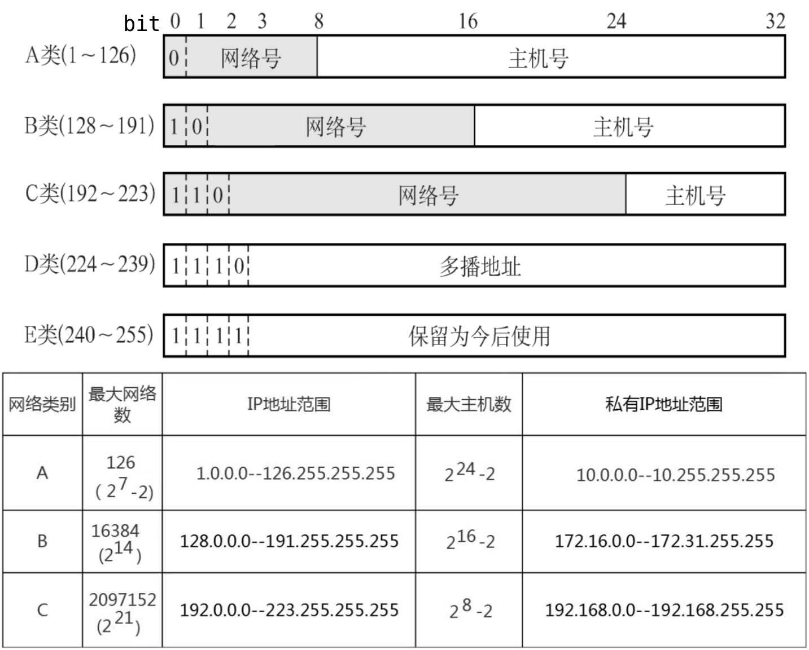
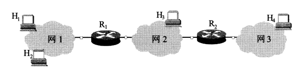
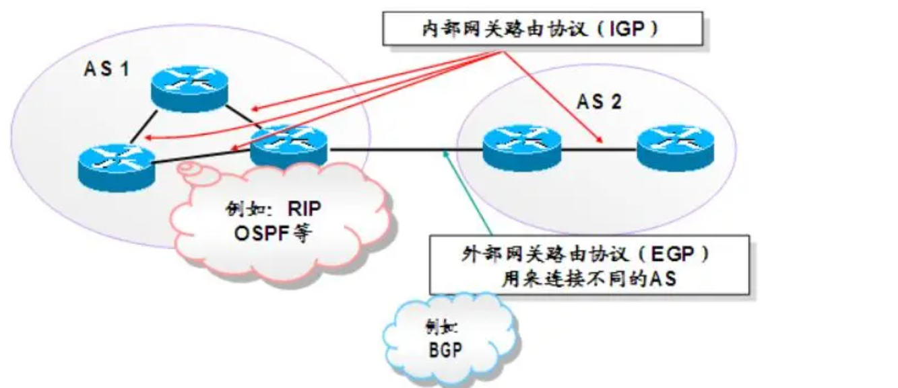

# 网络层的功能

- 网络层：向上只提供简单灵活的、无连接的、尽最大努力的数据报服务。

## 异构网络互连

- TCP/IP体系在网络层采用标准化协议，但相互连接的网络可以是异构的（网络层及数据链路层协议不同），即网络层必须使用相同的IP协议（虚拟互连网络、IP网络）。

## 路由与转发

- 路由表根据路由选择算法给出，转发表根据路由表给出。

1. 路由选择（路由表）：按照路由选择算法，根据从各相邻路由器所得到的关于整个网络拓扑的变化情况，动态地改变选择的路由。
2. 分组转发（转发表）：路由器根据转发表将用户的IP数据报从合适的端口转发出去。

## SDN

- 网络层可以被抽象地分为数据平面（转发层面）和控制平面；数据平面实现转发，控制平面实现路由选择。
- 传统互联网：每个路由器既有转发表（数据平面）又有路由选择软件（控制平面）
- SDN（软件定义网络）：集中式的控制平面和分布式的数据平面，两个平面相互分离。控制平面通过控制-数据接口对数据平面上的路由器进行集中式控制，方便软件来控制网络，适用于一些大型数据中心之间的广域网。

 

- 远程控制器掌握各主机和整个网络的状态，为每个分组计算出最佳路由，通过Openflow协议（或其他途径）将流表（转发表）下发给路由器。
- SDN的可编程性：

1. 北向接口：SDN提供的编程接口，开发者可在此基础上设计自己的应用，而不必关心底层的硬件细节。
2. 南向接口：SDN控制器和转发器设备建立双向会话的接口，SDN控制器通过不同的南向接口协议（Openflow）来兼容不同的硬件设备，并实现上层应用的逻辑。
3. 东西向接口：SDN控制器集群内部控制器之间的通信接口，用于增强整个控制平面的可靠性和可拓展性。

- SDN的优点：

1. 全局集中式控制和分布式高速转发，既利于控制平面的全局优化，又利于高性能的网络转发。
2. 灵活可编程与性能的平衡，控制和转发功能分离后，使得网络可以由专有的自动化工具以编程方式配置。
3. 降低成本，控制和数据平面分离后，尤其是在使用开放的接口协议后，就实现了网络设备的制造与功能软件的开发相分离，从而有效降低了成本。

- SDN的问题：

1. 安全风险，集中管理容易受攻击，如果崩溃，整个网络会受到影响。
2. 瓶颈问题，原本分布式的控制平面集中化后，随着网络规模扩大，控制器可能成为网络性能的瓶颈。

## 拥塞控制

- 拥塞：通信子网中，因出现过量的分组而引起网络性能下降的现象。
- 拥塞判断，即观察网络的吞吐量和网络负载之间的关系：

- 拥塞控制：确保子网能够承载所达到的流量，是全局性的。

| 拥塞控制 | 方法                                                         |
| -------- | ------------------------------------------------------------ |
| 开环控制 | 设计网络时事先考虑发生拥塞的因素，做决定时不考虑当前网络的状态 |
| 闭环控制 | 基于反馈环路，监测网络系统，及时检测拥塞的发生               |

# 路由算法

| 路由算法                         | 说明                                                         |
| -------------------------------- | ------------------------------------------------------------ |
| 静态路由算法（非自适应路由算法） | 网络管理员手动配置和修改路由信息，不能及时适应网络状态的变化，用于简单的小型网络 |
| 动态路由算法（自适应路由算法）   | 路由器上的路由表项由相互连接的路由器之间彼此交换信息，根据一定的算法优化而来，不断更新 |

- 动态路由算法对动态反应过快而引起振荡，反应过慢而影响网络的一致性。
- 动态路由算法分为距离-向量算法和链路状态路由算法。

## 距离-向量算法 RIP

- 距离-向量算法：迭代计算一条路由中的站段数或延迟时间，从而得到到达一个目标的最短路径。所有结点定期地将其整个路由选择表传送给与之相邻的所有结点，路由表中包含每条路径的目的地（另一结点）、路径的代价（距离）。
- 距离：不同的算法对距离的定义不同。RIP将距离定义为跳数，即从源端口到达目的端口所经过的路由个数，每经过一个路由器，跳数加1。
- 所有结点都必须监听从其他结点出来的路由选择更新信息（参与距离向量交换），并在下列情况下更新它们的路由选择表，且每次更新时都要将其全部路由表发送给所有相邻结点，以保证路由的一致性和有效性：

1. 被通告一条新的路由，此时，本地系统加入这条新的路由
2. 发来的路由信息中有某条到达某个目的地的路由比当前使用的路由的代价更小，此时，替换该路由

## 链路状态路由算法 OSPF

- 链路状态路由算法要求每个参与该算法的结点都具有完全的网络拓扑信息，它们执行下述两项任务：

1. 主动测试所有邻接结点的状态。两个共享一条链接的结点是相邻结点，即连接到同一条链路，或者连接到同一广播型物理网络。
2. 定期地将链路状态传播给所有其他结点（路由结点）。

- 典型的链路状态算法是OSPF算法：在一个链路状态路由选择中，一个结点检查所有直接链路的状态，并将所得的状态信息发送给网上的所有其他结点，每个结点都用这种方式从网上所有其他的结点接收包含直接链路状态的路由选择信息。每当链路状态报文到达时，路由结点便使用这些状态信息去更新自己的网络拓扑和状态“视野图”，一旦链路状态发生变化，结点就对更新的网络图利用Dikstra最短路径算法重新计算路由，从单一的源出发计算到达所有目的结点的最短路径。

- 链路状态路由算法主要有三个特征：

1. 洪泛法向本自治系统中所有路由器发送信息，即路由器通过所有端口向所有相邻的路由器发送信息（广播），而每个相邻路由器又将此信息发往其所有相邻路由器（但不再发送给刚刚发来信息的那个路由器）。
2. 发送的信息是与路由器相邻的所有路由器的链路状态，但这只是路由器所知道的部分信息。

> 所谓“链路状态”，是指说明本路由器与哪些路由器相邻及该链路的“度量”。对于OSPF 算法，链路状态的“度量”主要用来表示费用、距离、时延、带宽等。

3. 只有当链路状态发生变化时，路由器才向所有路由器发送此信息。

- 由于一个路由器的链路状态只涉及相邻路由器的连通状态，而与整个互联网的规模并无直接关系，因此链路状态路由算法可以用于大型的或路由信息变化聚敛的互联网环境。
- 链路状态路由算法的主要优点是：

1. 每个路由结点都使用同样的原始状态数据独立地计算路径，而不依赖中间结点的计算
2. 链路状态报文不加改变地传播，因此采用该算法易于查找故障。当一个结点从所有其他结点接收到报文时，它可以在本地立即计算正确的通路，保证一步汇聚。
3. 最后，由于链路状态报文仅运载来自单个结点关于直接链路的信息，其大小与网络中的路由结点数目无关，因此链路状态算法比距离-向量算法有更好的规模可伸展性。

## 层次路由

- 因特网将整个互联网分为许多较小的自治系统，每个自治系统自主决定内部采用的路由选择协议，而两个自治系统通信时需要屏蔽这些差异。

| 路由选择协议分类                  | 具体协议  |
| --------------------------------- | --------- |
| IGP（内部网关协议、域内路由选择） | ROP、OSPF |
| EGP（外部网关协议、域间路由选择） | BGP       |

- 使用层次路由时，OSPF将一个自治系统再划分为若干区域（Area），每个路由器都知道在本区域内如何将分组路由到目的地的细节，而不用知道其他区域的内部结构。

# IPv4

- IP协议定义数据传送的基本单元（IP分组）及其确切的数据格式，一套规则指明分组如何处理、错误如何控制，非可靠传递的思想、分组路由选择思想。

## IPv4分组

### IPv4首部

- 一个IPv4分组由首部和数据部分组成。首部前一部分的长度固定，共20B，是所有IP分组必须具有的；首部固定部分后面是一些可选字段，长度可变，用来提供错误检测及安全等机制。

 

| 字段                                  | 位   | 含义                                                         |
| ------------------------------------- | ---- | ------------------------------------------------------------ |
| 版本                                  | 4    | IP协议的版本（IPv4的版本号为4）                              |
| 首部长度                              | 4    | 以32位为单位，最大值为60B（15\*4B），最常用的首部长度为20B（不使用可选字段时） |
| 总长度                                | 16   | 以字节为单位，首部和数据之和的长度，IP数据报的最大长度为216-1B，但受到数据链路层MTU的限制，超过就需要分片 |
| 标识     | 16   | 标识号（计数器），每产生一个数据报就加1并赋值给标识字段（不是序号）。 分片后，每个数据报片的标识都与原分组的标识字段值相同 |
| 标志     | 3    | 标志字段的最低位为MF（More Fragment）：MF=1表示后面还有分片；MF=0表示最后一个分片 标志中段的中间位为DF（Don't Fragment）：只有DF=0时才允许分片 |
| 片偏移 | 13   | 指出较长的分组分片之后，某片在原分组的相对位置。 以8B为偏移单位，除了最后一个分片外，每个分片的长度必定是8B的整数倍 |
| TTL                                   | 8    | 生存时间，数据报在网络中可通过的路由器数的最大值，标识分组在网络中的寿命。 路由器在转发分组前，先把TTL减1，若TTL被减为0，则丢弃该分组 |
| 协议                                  | 8    | 指出该分组携带的数据使用何种协议，即分组的数据部分应交付给哪个协议处理 值6表示TCP；值17表示UDP |
| 首部检验和                            | 16   | 首部检验和只检验分组的首部，而不检验数据部分                 |
| 源地址字段                            | 32   | 标识发送方的IP地址                                           |
| 目的地址字段                          | 32   | 标识接收方的IP地址                                           |

### IP数据报分片

- MTU（最大传送单元）：一个数据链路层的帧所能承载的最大数据量，以太网帧的MTU为1500B。IP数据报封装在数据链路层的帧中，故MTU严格限制IP数据报的长度，且IP数据报的源与目的地路径上的各段链路可能使用不同的链路层协议，有不同的MTU。
- 分片：IP数据报的总长度大于链路的MTU时，需要将IP数据报中的数据分装在多个较小的IP数据报（片）中。片在目的主机的网络层被重新组装，目的主机使用IP首部的[标识](#IPv4标识)、[标志](IPv4标志)和[片偏移](#IPv4片偏移)字段来完成对片的重组。

## IPv4地址与NAT

### IPv4地址

- IP地址：32bit的全球唯一标识符，连接到因特网上的每台主机（或路由器）都至少分配一个IP地址。IP地址由互联网名字和数字地址分配机构ICANN进行分配。
- 一个IP地址在整个因特网范围内是唯一的，IP地址:: =\{&lt;网络号&gt;，&lt;主机号&gt;\}。互联网早期采用的是分类的IP地址（ABCDE），而无论哪类IP地址，都由网络号和主机号两部分组成。（现在已经基本不采用分类IP地址）

1. 网络号标志主机（或路由器）所连接到的网络。一个网络号在整个因特网范围内必须是唯一的。
2. 主机号标志该主机（或路由器）。一台主机号在它前面的网络号所指明的网络范围内必须是唯一的。

 

| 特殊的IP地址 | 含义                                                         |
| ------------ | ------------------------------------------------------------ |
| 主机号全为0  | 表示本网络本身                                               |
| 主机号全为1  | 表示本网络的广播地址（直接广播地址）                         |
| 127.x.x.x    | 保留为环回自检（Loopback Test）地址，此地址表示任意主机本身 环回地址的IP数据报永远不会出现在任何网络上 |
| 32位全为0    | 0.0.0.0表示本网络上的本主机                                  |
| 32位全为1    | 255.255.255.255表示整个TCP/IP网络的广播地址（受限广播地址） 实际使用时，由于路由器对广播域的隔离，255.255.255.255等效为本网络的广播地址 |

1. IP地址由网络号和主机号两部分组成，是一种分等级的地址结构：（1）IP地址管理机构在分配IP地址时只分配网络号，而主机号则由得到该网络号的单位自行分配；（2）路由器仅根据目的主机所连接的网络号来转发分组。
2. IP地址是标志一台主机（或路由器）和一条链路的接口。当一台主机同时连接到两个网络时，该主机就必须同时具有两个相应的IP地址，每个IP地址的网络号必须与所在网络的网络号相同，且这两个IP地址的主机号是不同的。因此IP网络上的一个路由器必然至少应具有两个IP地址（路由器每个端口必须至少分配一个IP地址）。
3. 在同一个局域网上的主机或路由器的IP地址中的网络号必须是一样的。（1）转发器或桥接器（网桥等）连接的若干LAN仍然是同一个网络（同一个广播域），因此该LAN中所有主机的IP地址的网络号必须相同，但主机号必须不同；（2）路由器总是具有两个或两个以上的IP地址，路由器的每个端口都有一个不同网络号的IP地址。
4. 在IP地址中，所有分配到网络号的网络（无论是LAN还是WAN）都是平等的。

### NAT 网络地址转换

- NAT（网络地址转换）：将专用网络地址转换为公用地址。

1. 使得整个专用网只需要一个全球地址就可以与因特网连通，且专用网本地地址是可重用的。
2. 对外隐藏内部管理的IP地址，从而降低了内部网络受到攻击的风险。

- 专用互联网（本地互联网）：划出部分IP地址为私有IP地址（可重用地址）。私有IP地址只用于LAN，不用于WAN连接，Internet的所有路由器对目的地址是私有地址的数据报一律不进行转发，必须通过网关利用NAT把私有IP地址转换为Internet中合法的全球IP地址后才能用于Internet，并且允许私有IP地址被LAN重复使用。

| 私有IP地址        | 网段                         |
| ----------------- | ---------------------------- |
| A类：1个A类网段   | 10.0.0.0\~10.255.255.255     |
| B类：16个B类网段  | 172.16.0.0\~172.31.255.255   |
| C类：256个C类网段 | 192.168.0.0\~192.168.255.255 |

- NAT路由器：需要在专用网连接到因特网的路由器上安装NAT软件，且至少有一个有效的外部全球IP地址。使用本地地址的主机和外界通信时，NAT路由器使用NAT转换表进行本地IP地址和全球IP地址的转换。
- NAT转换表：\{本地IP地址 : 端口\} 到 \{全球IP地址 : 端口\} 的映射，可让多个私有IP地址映射到一个全球IP地址。

| 路由器     | 转发IP数据报时对地址的处理   | 工作的层次                                             |
| ---------- | ---------------------------- | ------------------------------------------------------ |
| 普通路由器 | 不改变其源IP地址和目的IP地址 | 仅工作在网络层                                         |
| NAT路由器  | 必须转换源IP地址或目的IP地址 | 工作在传输层，转发数据报时需要查看和转换传输层的端口号 |

## 子网划分与子网掩码、CIDR

### 子网划分

- 子网划分：

1. 从主机号借用若干位作为子网号，不改变IP地址原来的网络号，IP地址 = \{\<网络号\>, \<子网号\>, \<主机号\>\}。从一个IP地址本身或IP数据报的首部，无法判断源主机或目的主机所连接的网络是否进行了子网划分。
2. 子网划分是属于单位内部的，对外仍然表现为没有划分子网的网络。凡是从其他网络发送给本单位某台主机的IP数据报，仍然是根据IP数据报的目的网络号，先找到连接到本单位网络上的路由器；然后该路由器在收到IP数据报后，按目的网络号和子网号找到目的子网；最后把IP数据报直接交付给目的主机。

- 子网内主机号全为0的地址为子网的网络号；子网内主机号全为1的地址为子网的广播地址。

> RFC 950：不支持全为0或1的子网号
> CIDR：支持全为0或1的子网号

### 子网掩码

- 子网掩码：表达对原网络中主机号的借位，是一个与IP地址相对应的、长32bit的二进制串。其中1对应与IP地址中的网络号和子网号，0对应主机号。只需要将IP地址和对应的子网掩码逐位“与”即可得到对应子网的网络地址（网络号+子网号）。
- Internet标准规定，所有的网络必须使用子网掩码，若一个网络未划分子网，则采用默认子网掩码。一台主机在设置IP地址信息时，必须设置子网掩码；同属于一个子网的所有主机及路由器的相应端口，必须设置相同的子网掩码。

| 分类网络 | 默认子网掩码  |
| -------- | ------------- |
| A        | 255.0.0.0     |
| B        | 255.255.0.0   |
| C        | 255.255.255.0 |

- 路由器在相互之间交换路由信息时，必须把自己所在网络（或子网）的子网掩码告知对方，即路由表中的每个条目包括目的地址、下一跳地址、该目的网络的子网掩码。

### CIDR 无分类编址

- CIDR（无分类域间路由选择）：在变长子网掩码的基础上提出的消除传统A、B、C类网络划分，且可以在软件的支持下实现超网构造的一种IP地址的划分方法。

1. IP:: = \{\<网络前缀\>, \<主机号\>\}：CIDR使用网络前缀替代子网，网络前缀的位数不是固定的，可以任意选取
2. CIDR记法（斜线记法）：IP地址/网络前缀的位数，其中网络前缀的位数对应于网络号的部分（即子网掩码中1的部分）

- CIDR地址块：网络前缀都相同的连续IP地址。分配到一个CIDR地址块的组织，仍可以在组织内部根据需要来继续划分子网，最多可指派2主机号位数 - 2的地址数

- 路由聚合（构成超网）：CIDR地址块对IP地址的聚合，使得路由表中的一个项目可以表示多个原来传统分类地址的路由。
- 最长前缀匹配（最佳匹配）：查找路由表时，若存在多个匹配，则从匹配结果中选择具有最长网络前缀的路由。网络前缀越长，地址块越小，路由越具体。因此，通常把无分类编址的路由表存放在一种层次式数据结构中（常用二叉线索），然后自上而下地按层次进行查找。将前缀最长的排在第1行，降序排序，查找转发表时从第一行开始查找，只要找到匹配的就无须继续查找。

### 网络层转发分组的过程

- 分组转发都是基于目的主机所在网络的，分组到达路由器后，路由器根据目的IP地址的网络前缀来查找转发表，确定下一跳应当到哪个路由器，即路由必须包括（目的网络, 下一跳地址）。IP数据报最终到达目的主机所在目的网络上的路由器，并在到达最后一个路由器时，才试图向目的主机进行直接交付。

| 特殊路由     | 说明                                                         |
| ------------ | ------------------------------------------------------------ |
| 主机路由 /32 | 对特定目的主机的IP地址专门指明一个路由，以方便网络管理员控制和测试网络 若特定主机的 IP地址是a.b.c.d，则转发表中对应项的目的网络是a.b.c.d/32 /32表示的子网掩码没有意义，但这个特殊的前缀可以用在转发表中 |
| 默认路由 /0  | 0.0.0.0/0表示默认路由，全0掩码和任何目的地址进行按位与运算，结果必然为全0，即必然和转发表中的0.0.0.0/0相匹配 只要目的网络是其他网络（不在转发表中），就一律选择默认路由。 |

- 路由器执行的分组转发算法：

1. 从收到的IP分组的首部提取目的主机的IP地址D（目的地址）
2. 若查找到特定主机路由（目的地址为D），就按照这条路由的下一跳转发分组；否则从转发表中的下一条（按前缀长度排序）开始检查，执行步骤3
3. 将这一行的子网掩码与目的地址D进行按位与运算。若运算结果与本行的前缓匹配，则查找结束，按照“下一跳”指出的进行处理（或者直接交付本网络上的目的主机，或通过指定接口发送到下一跳路由器）。否则，若转发表还有下一行，则对下一行进行检查，重新执行步骤3。否则，执行步骤4。
4. 若转发表中有一个默认路由，则把分组传送给默认路由；否则，报告转发分组出错。

- 转发表（或路由表）并未给分组指明到某个网络的完整路径。转发表指出，到某个网络应当先到某个路由器（即下一跳路由器），在到达下一跳路由器后，再继续查找其转发表，知道下一步应当到哪个路由器。
- 得到下一跳路由器的IP地址后，并不是直接将该地址填入待发送的数据报，而是通过ARP协议将该IP地址转换成MAC地址，并将此MAC地址放到MAC帧首部中，然后根据这个MAC地址找到下一跳路由器。在不同网络中传送时，MAC帧中的源地址和目的地址要发生变化，但是网桥在转发帧时，不改变帧的源地址。

## ARP、DHCP、ICMP

### IP地址与硬件地址

| 地址                      | 对应的层次         | 位置           | 特点       |
| ------------------------- | ------------------ | -------------- | ---------- |
| IP地址                    | 网络层及网络层之上 | IP数据报的首部 | 分层次等级 |
| 硬件地址 （MAC地址） | 数据链路层         | MAC帧的首部    | 平面式     |

- 通过数据封装，把IP数据报分组封装为MAC帧后，数据链路层看不见数据报分组中的IP地址。

- 由于路由器的隔离，IP网络中无法通过广播MAC地址来完成跨网络的寻址，因此在网络层只使用IP地址来完成寻址。寻址时，每个路由器依据其路由表（依靠路由协议生成）选择到目标网络（即主机号全为0的网络地址）需要转发到的下一跳（路由器的物理端口号或下一网络地址），而IP分组通过多次路由转发到达目标网络后，改为在目标LAN中通过数据链路层的MAC地址以广播方式寻址。

1. 在IP层抽象的互联网上只能看到IP数据报，屏蔽了下层的细节。
2. 虽然在IP数据报首部中有源IP地址，但路由器只根据目的IP地址进行转发。
3. 在局域网的链路层，只能看见MAC帧，IP数据报被封装在MAC帧中。通过路由器转发IP分组时，IP分组在每个网络中都被路由器解封装和重新封装，其MAC帧首部中的源地址和目的地址会不断改变，即无法使用MAC地址跨网络通信。
4. 路由器由于互连多个网络，有多个IP地址和多个MAC地址。

### ARP 地址解析协议

- ARP（Address Resolution Protocol，地址解析协议）：完成IP地址到 MAC地址的映射。无论网络层使用什么协议，在实际网络的链路上传送数据帧时，最终必须使用硬件地址。
- ARP表：每台主机都设有一个ARP高速缓存，用来存放本局域网上各主机和路由器的IP地址到MAC地址的映射表（ARP表），使用ARP来动态维护此ARP表。
- ARP工作在网络层，其工作原理如下：

1. 主机A欲向本局域网上的某台主机B发送IP数据报时，先在其ARP高速缓存中查看有无主机B的IP地址。
2. 如果有，就可查出其对应的硬件地址，再将此硬件地址写入MAC帧，然后通过局域网将该MAC帧发往此硬件地址；
3. 如果没有，那么就通过使用目s的MAC地址为`FFFF-FF-FF-FF-FF`的帧来封装并广播ARP请求分组（广播发送）使同一个局域网里的所有主机都收到此ARP请求。主机B收到该ARP请求后，向主机A发出ARP响应分组（单播发送），分组中包含主机B的IP与MAC地址的映射关系，主机A收到ARP响应分组后就将此映射写入ARP缓存，然后按查询到的硬件地址发送MAC帧。

- ARP用于解决同一个局域网上的主机或路由器的IP地址和硬件地址的映射问题。如果所要找的主机和源主机不在同一个局域网上，那么就要通过ARP找到一个位于本局域网上的某个路由器的硬件地址，然后把分组发送给这个路由器，让这个路由器把分组转发给下一个网络，剩下的工作就由下一个网络来做。
- 从IP地址到硬件地址的解析是自动进行的，对用户透明。只要主机或路由器和本网络上的另一个已知IP地址的主机或路由器进行通信，ARP就会自动将IP地址解析为数据链路层所需要的硬件地址。
- 使用ARP的4种典型情况：

 

1. 发送方是主机H1，要把IP数据报发送到本网络上的另一台主机H2。此时，H1在网1用ARP找到目的主机H2的硬件地址。
2. 发送方是主机H1，要把IP数据报发送到另一个网络上的一台主机H3。此时，H1用ARP找到与网1连接的路由器R1的硬件地址，剩下的工作由R1来完成。
3. 发送方是路由器R1，要把IP数据报转发到与R1，连接的网2上的一台主机H3。此时，R1在网2用ARP找到目的主机H3的硬件地址。
4. 发送方是路由器R1，要把IP数据报转发到网3上的一台主机H4。此时，R1在网2用ARP找到与网2连接的路由器R2的硬件地址，剩下的工作由R2来完成。

| 发送方              | 接受方            | ARP工作                                                      |
| ------------------- | ----------------- | ------------------------------------------------------------ |
| 主机H1   | 主机H2 | 找到目的主机H2的硬件地址                          |
| 主机H1   | 主机H3 | 找到与网1连接的路由器R1的硬件地址，剩下的工作由R1来完成 |
| 路由器R1 | 主机H3 | 找到目的主机H3的硬件地址                          |
| 路由器R1 | 主机H4 | 找到与网2连接的路由器R2的硬件地址，剩下的工作由R2来完成 |

### DHCP 动态主机配置协议

- DHCP（Dynamic Host Configuration Protocol，动态主机配置协议）：常用于给主机动态地分配IP地址，提供了即插即用的联网机制，允许一台计算机加入新的网络和获取IP地址而不用手工参与。DHCP是应用层协议，基于UDP。
- DHCP的工作原理（C/S）：需要IP地址的主机在启动时就向DHCP服务器广播发送发现报文，这时该主机就成为DHCP客户。本地网络上所有主机都能收到此广播报文，但只有DHCP服务器才回答此广播报文。DHCP服务器先在其数据库中查找该计算机的配置信息。若找到，则返回找到的信息。若找不到，则从服务器的IP地址池中取一个地址分配给该计算机。DHCP服务器的回答报文称为提供报文。
- DHCP服务器和DHCP客户端的交换过程如下：

1. DHCP客户机广播“DHCP发现”消息（源地址为0.0.0.0，目的地址为255.255.255.255），试图找到网络中的DHCP服务器，以便从DHCP服务器获得一个IP地址。
2. DHCP服务器收到“DHCP发现”消息后，广播“DHCP提供”消息（源地址为DHCP服务器地址，目的地址为255.255.255.255），其中包括提供给DHCP客户机的IP地址。
3. DHCP客户机收到“DHCP提供”消息，如果接受该IP地址，那么就广播“DHCP请求”消息（源地址为0.0.0.0，目的地址为255.255.255.255）向DHCP服务器请求提供IP地址。
4. DHCP服务器广播“DHCP确认”消息（源地址为DHCP服务器地址，目的地址为255.255.255.255），将IP地址分配给DHCP客户机。

- DHCP允许网络上配置多台DHCP服务器，当DHCP客户机发出“DHCP发现”消息时，有可能收到多个应答消息。此时，DHCP客户机只会挑选其中的一个，通常挑选最先到达的。
- DHCP服务器分配给DHCP客户的IP地址是临时的，因此DHCP客户只能在一段有限的时间（租用期）内使用这个分配到的IP地址。租用期的数值应由DHCP服务器自己决定，DHCP客户也可在自己发送的报文中提出对租用期的要求。
- DHCP的客户端和服务器端需要通过广播方式来进行交互，原因是在DHCP执行初期，客户端不知道服务器端的IP地址，而在执行中间，客户端并未被分配IP地址，从而导致两者之间的通信必须采用广播的方式。

### ICMP 网际控制报文协议

- ICMP（Internet Control Message Protocol，网际控制报文协议）：为了提高 IP数据报交付成功的机会，在网络层使用了来让主机或路由器报告差错和异常情况。ICMP报文作为IP层数据报的数据，加上数据报的首部，组成IP数据报发送出去。ICMP是网络层协议。
- ICMP 报文的种类有两种，即ICMP差错报告报文和ICMP询问报文。ICMP差错报告报文用于目标主机或到目标主机路径上的路由器向源主机报告差错和异常情况。

| ICMP差错报告报文   | 说明                                                         |
| ------------------ | ------------------------------------------------------------ |
| 终点不可达         | 当路由器或主机不能交付数据报时，就向源点发送终点不可达报文   |
| 源点抑制           | 当路由器或主机由于拥塞而丢弃数据报时，就向源点发送源点抑制报文，使源点知道应当把数据报的发送速率放慢 |
| 时间超过           | 当路由器收到生存时间（TTL）为零的数据报时，除丢弃该数据报外，还要向源点发送时间超过报文。 当终点在预先规定的时间内不能收到一个数据报的全部数据报片时，就把已收到的数据报片都丢弃，并向源点发送时间超过报文。 |
| 参数问题           | 当路由器或目的主机收到的数据报的首部中有的字段的值不正确时，就丢弃该数据报，并向源点发送参数问题报文 |
| 改变路由（重定向） | 路由器把改变路由报文发送给主机，让主机知道下次应将数据报发送给另外的路由器（可通过更好的路由） |

- 不应发送ICMP差错报告报文的几种情况如下：

1. 对ICMP差错报告报文不再发送ICMP差错报告报文。
2. 对第一个分片的数据报片的所有后续数据报片都不发送ICMP差错报告报文。
3. 对具有组播地址的数据报都不发送ICMP差错报告报文。
4. 对具有特殊地址（如127.0.0.0或0.0.0.0）的数据报不发送ICMP差错报告报文。

- ICMP询问报文有4种类型：回送请求和回答报文、时间戳请求和回答报文、地址掩码请求和回答报文、路由器询问和通告报文，最常用的是前两类。

| ICMP的两个常见应用 | ICMP使用               | 作用                         | 工作的层次                                                   |
| ------------------ | ---------------------- | ---------------------------- | ------------------------------------------------------------ |
| 分组网间探测 PING  | ICMP回送请求和回答报文 | 用来测试两台主机之间的连通性 | 工作在应用层 直接使用网络层的ICMP，而未使用传输层的TCP或UDP |
| Traceroute/Tracert | ICMP时间超过报文       | 用来跟踪分组经过的路由       | 工作在网络层                                                 |

# IPv6

## IPv6的主要特点

- 解决“IP地址耗尽”问题的措施有以下三种：

1. 采用无类别编址CIDR，使IP地址的分配更加合理
2. 采用网络地址转换（NAT）方法以节省全球IP地址
3. 采用具有更大地址空间的新版本的IPv6，只有该方法从根本上解决了问题

- IPv6的主要特点如下：

1. IPv6将地址从IPv4的32位（4B）增大到了128位（16B），地址空间是IPv4的2128-32=296倍
2. 扩展的地址层次结构
3. 灵活的首部格式：简化了IP分组头（没有首部长度字段、校验和字段），它包含8个域（IPv4是12个域），使得路由器能够更快地处理分组，从而可以改善吞吐率
4. 改进的选项：一些从前必要的段现在变成了可选段，此外，表示选项的方式的改变还能加快分组的处理速度
5. 允许协议继续扩充
6. 支持即插即用（自动配置）
7. 支持资源的预分配
8. IPv6只有在包的源结点才能分片，是端到端的；而不支持路由分片，过大的分组只能丢弃并向发送方发送一个指示分组过大得ICMP报文
9. IPv6首部长度必须是8B的整数倍，而IPv4首部是4B的整数倍
10. 增大了安全性，身份验证和保密功能是IPv6的关键特征

- 虽然IPv6与IPv4不兼容，但总体而言它与所有其他的因特网协议兼容，包括TCP、UDP、ICMP、IGMP、OSPF、BGP和DNS，只是在少数地方做了必要的修改（大部分是为了处理长的地址）。

## IPv6地址

- IPv6 数据报的目的地址可以是以下三种基本类型地址之一：

| 地址 | 说明                                                         |
| ---- | ------------------------------------------------------------ |
| 单播 | 传统的点对点通信                                             |
| 多播 | 一点对多点的通信，分组被交付到一组计算机的每台计算机         |
| 任播 | IPv6增加的一种类型，目的站是一组计算机，但数据报在交付时只交付其中的一台计算机，通常是距离最近的一台计算机 |

- IPv4地址通常使用点分十进制表示法，而IPv6采用冒分十六进制表示法：把地址中的每4位用一个十六进制数表示，并用冒号分隔每16位（4BF5:AA12:0216:FEBC:BA5F:039A:BE9A:2170）

1. 当16位域的开头有一些0时，可以采用一种缩写表示法，但在域中必须至少有一个数字（4BF5:0:0:0:BA5F:39A:A:2176）
2. 当有相继的0值域时，还可以进一步缩写，双冒号表示法（::）在一个地址中仅能出现一次，因为0值域的个数没有编码，需要从指定的总的域的个数来推算（4BF5::BA5F:39A:A:2176）

- IPv6扩展了IPv4地址的分级概念，主要是为了使路由器能够更快地查找路由，使用以下3个等级：

1. 第一级（顶级）指明全球都知道的公共拓扑
2. 第二级（场点级）指明单个场点
3. 第三级指明单个网络接口

- 从IPv4向IPv6过渡只能采用逐步演进的办法，同时还必须使新安装的IPv6系统能够向后兼容，IPv6系统必须能够接收和转发IPv4分组，并且能够为IPv4分组选择路由。
- 从IPv4向IPv6过渡可以采用双协议栈和隧道技术两种策略：

1. 双协议栈：在一台设备上同时装有IPv4和IPv6协议栈，既能和IPv4网络通信，又能和IPv6网络通信。如果这台设备是一个路由器，那么在路由器的不同接口上分别配置了IPv4地址和IPv6地址，并很可能分别连接了IPv4网络和IPv6网络；如果这台设备是一台计算机，那么它将同时拥有IPv4地址和IPv6地址，并具备同时处理这两个协议地址的功能。
2. 隧道技术：在IPv6数据报要进入IPv4网络时，把整个IPv6数据报封装到IPv4数据报的数据部分，使得IPv6数据报就好像在IPv4网络的隧道中传输。

# 路由协议

<table>
    <tr>
        <td width="10%">协议</td>
        <td width="30%">RIP</td>
        <td width="30%">OSPF</td>
        <td width="30%">BGP</td>
    </tr>
    <tr>
        <td>类型</td>
        <td colspan="2">内部 IGP</td>
        <td>外部</td>
    </tr>
    <tr>
        <td>路由算法</td>
        <td><a href="#距离向量算法">距离-向量</a></td>
        <td><a href="#链路状态路由算法">链路状态</a></td>
        <td>路径-向量</td>
    </tr>
    <tr>
        <td>传递协议</td>
        <td>UDP</td>
        <td>IP</td>
        <td>TCP</td>
    </tr>
    <tr>
        <td>路径选择</td>
        <td>跳数最少</td>
        <td>代价最低</td>
        <td>较好而非最佳</td>
    </tr>
    <tr>
        <td>交换结点</td>
        <td>和该结点相邻的路由器</td>
        <td>网络中的所有路由器</td>
        <td>和该结点相邻的路由器</td>
    </tr>
    <tr>
        <td rowspan="2">交换内容</td>
        <td rowspan="2">当前该路由器的整个路由表</td>
        <td rowspan="2">与该路由器相邻的所有路由器的链路状态</td>
        <td>首次 整个路由表</td>
    </tr>
    <tr>
        <td>之后 有变化的部分</td>
    </tr>
</table>

## 自治系统 AS

- 自治系统（Autonomous System，AS）：单一技术管理下的一组路由器，这些路由器使用一种AS内部的路由选择协议和共同的度量来确定分组在该AS内的路由，同时还使用一种AS之间的路由选择协议来确定分组在AS之间的路由。一个自治系统内的所有网络都由一个行政单位管辖，一个自治系统的所有路由器在本自治系统内都必须是连通的。

## 域内路由与域间路由

- 自治系统内部的路由选择称为域内路由选择，自治系统之间的路由选择称为域间路由选择。 因特网有两大类路由选择协议：

| 路由选择协议                                   | 说明                                                         |
| ---------------------------------------------- | ------------------------------------------------------------ |
| 内部网关协议（Interior Gateway Protocol，IGP） | 内部网关协议即在一个自治系统内部使用的路由选择协议，它与互联网中其他自治系统选用什么路由选择协议无关。目前这类路由选择协议使用得最多，如RIP和OSPF。 |
| 外部网关协议（External Gateway Protocol，EGP） | 若源站和目的站处在不同的自治系统中，当数据报传到一个自治系统的边界时（两个自治系统可能使用不同的IGP），就需要使用一种协议（EGP）将路由选择信息传递到另一个自治系统中。 |

 

## 路由信息协议 RIP

- RIP（Routing Information Protocol，RIP）：一种分布式的基于距离向量的路由选择协议，最大的优点是实现简单、开销小、收敛过程较快

### RIP规定距离

1. 网络中的每个路由器都要维护从它自身到其他每个目的网络的距离记录，称为距离向量
2. 距离（Hop Count，跳数），规定从一个路由器到直接连接网络的跳数为1，而每经过一个路由器，跳数加1。
3. RIP认为好的路由就是它通过的路由器的数目少，即优先选择跳数少的路径。
4. RIP允许一条路径最多只能包含15个路由器（即最多允许15跳），距离等于16表示网络不可达，可见RIP只适用于小型互联网。距离向量路由可能会出现环路的情况，规定路径上的最高跳数的目的是为了防止数据报不断循环在环路上，减少网络拥塞的可能性。 
5. RIP默认在任意两个使用RIP的路由器之间每30秒广播一次RIP路由更新信息，以便自动建立并维护路由表（动态维护）。
6. 在RIP中不支持子网掩码的RIP广播，所以RIP中每个网络的子网掩码必须相同；但新的RIP2支持变长子网掩码和CIDR。

### RIP的特点

1. 仅和相邻路由器交换信息
2. 路由器交换的信息是当前路由器所知道的全部信息，即自己的路由表
3. 按固定的时间间隔交换路由信息，如每隔30秒 

- RIP通过[距离向量算法](#距离向量算法)来完成路由表的更新：

1. 最初，每个路由器只知道与自己直接相连的网络
2. 通过每30秒的RIP广播，相邻两个路由器相互将自己的路由表发给对方。于是经过第一次 RIP广播，每个路由器就知道了与自己相邻（与自己相距跳数为1）的路由器的路由表。同理，经过第二次RIP广播，每个路由器就知道了距离自己跳数为2的网络的路由…
3. 因此，经过若干RIP广播后，所有路由器都最终知道了整个IP网络的路由表，即RIP最终是收敛的
4. 通过RIP收敛后，每个路由到每个目标网络的路由都是距离最短的，哪怕还存在另一条高速（低时延）但路由器较多的路由

- RIP是应用层协议，它使用UDP传送数据（端口520）；RIP选择的路径不一定是时间最短的，但一定是具有最少路由器的路径（根据最少跳数进行路径选择的） 

- RIP的缺点如下：

1. RIP限制了网络的规模，它能使用的最大距离为15（16表示不可达）
2. 路由器之间交换的是路由器中的完整路由表，因此网络规模越大，开销也越大
3. “坏消息传得慢”：网络出现故障时，会出现慢收敛现象，即需要较长时间才能将此信息传送到所有路由，使更新过程的收敛时间长。 

### [距离向量算法](#距离向量算法)

- 每个路由表项目都有三个关键数据：`<目的网络N，距离d，下一跳路由器地址X>`。对于每 个相邻路由器发送过来的RIP报文，执行如下步骤： 

1. 对地址为X的相邻路由器发来的RIP报文，先修改此报文中的所有项目：把“下一跳” 字段中的地址都改为X，并把所有“距离”字段的值加1。
2. 对修改后的RIP报文中的每个项目，执行如下步骤：
   1. 当原来的路由表中没有目的网络N时，把该项目添加到路由表中。
   2. 当原来的路由表中有目的网络N，且下一跳路由器的地址是X时，用收到的项目替换原路由表中的项目。
   3. 当原来的路由表中有目的网络N，且下一跳路由器的地址不是X时，如果收到的项目中的距离d小于路由表中的距离，那么就用收到的项目替换原路由表中的项目；否则什么也不做。
3. 如果180秒（RIP默认超时时间为180秒）还没有收到相邻路由器的更新路由表，那么把此相邻路由器记为不可达路由器（距离设置为16） 
4. 返回。 

## 开放最短路径优先协议 OSPF

### OSPF的基本特点

- 开放最短路径优先（OSPF）协议：使用分布式[链路状态路由算法](#链路状态路由算法)的典型代表，也是内部网关协议（IGP）的一种。

<table>
    <tr>
        <td rowspan="2">信息的发送</td>
        <td>OSPF</td>
        <td>洪泛法，向本自治系统中的所有路由器发送信息</td>
    </tr>
    <tr>
        <td>RIP</td>
        <td>仅向自己相邻的几个路由器发送信息</td>
    </tr>
    <tr>
        <td rowspan="2">发送的信息</td>
        <td>OSPF</td>
        <td>与本路由器相邻的所有路由器的链路状态，但这只是路由器所知道的部分信息，“链路状态”说明本路由器和哪些路由器相邻及该链路的“度量”（代价）</td>
    </tr>
    <tr>
        <td>RIP</td>
        <td>本路由器所知道的全部信息（整个路由表）</td>
    </tr>
    <tr>
        <td rowspan="2">何时交换信息</td>
        <td>OSPF</td>
        <td>只有当链路状态发生变化时，路由器才用洪泛法向所有路由器发送此信息，并且更新过程收敛得快，不会出现RIP“坏消息传得慢”的问题</td>
    </tr>
    <tr>
        <td>RIP</td>
        <td>不管网络拓扑是否发生变化，路由器之间都会定期交换路由表的信息</td>
    </tr>
    <tr>
        <td rowspan="2">对应的层次</td>
        <td>OSPF</td>
        <td>网络层协议，不使用UDP或TCP，而直接用IP数据报传送（其IP数据报首部的协议字段为89）</td>
    </tr>
    <tr>
        <td>RIP</td>
        <td>应用层协议，在传输层使用UDP</td>
    </tr>
</table> 

1. OSPF对不同的链路可根据IP分组的不同服务类型（TOS）而设置成不同的代价。因此，OSPF对于不同类型的业务可计算出不同的路由
2. 多路径间的负载平衡：若到同一个目的网络由多条相同代价的路径，则OSPF可以将通信量分配给这几条路径
3. 所有在OSPF路由器之间交换的分组都具有鉴别功能，保证了仅在可信赖的路由器之间交换链路状态信息
4. 支持可变长度的子网划分和无分类编址CIDR
5. 个链路状态都带上一个32位的序号，序号越大，状态就越新

### OSPF的基本工作原理

1. 由于各路由器之间频繁地交换链路状态信息，因此所有路由器最终都能建立一个链路状态数据库。这个数据库实际上就是全网的拓扑结构图，它在全网范围内是一致的（链路状态数据库的同步）。
2. 然后，每个路由器根据这个全网拓扑结构图，使用Dijkstra最短路径算法计算从自己到各目的网络的最优路径，以此构造自己的路由表。虽然使用Dijkstra算法能计算出完整的最优路径，但路由表中不会存储完整路径，而只存储“下一跳”，只有到了下一跳路由器，才能知道再下一跳应当怎样走。
3. 此后，当链路状态发生变化时，每个路由器重新计算到各目的网络的最优路径，构造新的路由表。 

- 区域：为使OSPF能够用于规模很大的网络，OSPF将一个自治系统再划分为若干更小的范围（区域）

1. 将利用洪泛法交换链路状态信息的范围局限于每个区域而非整个自治系统，减少了整个网络上的通信量
2. 在一个区域内部的路由器只知道本区域的完整网络拓扑， 而不知道其他区域的网络拓扑情况
3. 区域有层次之分，处在上层的域称为主干区域，负责连通其他下层的区域，并且还连接其他自治域

### OSPF的五种分组类型

| 分组类型         | 说明                                                         |
| ---------------- | ------------------------------------------------------------ |
| 问候分组         | 用来发现和维持邻站的可达性                                   |
| 数据库描述分组   | 向邻站给出自己的链路状态数据库中的所有链路状态项目的摘要信息 |
| 链路状态请求分组 | 向对方请求发送某些链路状态项目的详细信息                     |
| 链路状态更新分组 | 用洪泛法对全网更新链路状态                                   |
| 链路状态确认分组 | 对链路更新分组的确认                                         |

- 通常每隔10秒，每两个相邻路由器要交换一次问候分组，以便知道哪些站可达

1. 在路由器刚开始工作时，OSPF让每个路由器使用数据库描述分组和相邻路由器交换本数据库中已有的链路状态摘要信息
2. 然后，路由器使用链路状态请求分组，向对方请求发送自己所缺少的某些链路状态项目的详细信息
3. 经过一系列的这种分组交换，建立了全网同步的链路数据库

- 网络运行中，只要有一个路由器的链路状态发生变化，该路由器就要使用链路状态更新分组，用洪泛法向全网更新链路状态。其他路由在更新后，发送链路状态确认分组对更新分组进行确认。
- 为确保链路状态数据库的同步，OSPF每隔一段时间就刷新一次数据库中的链路状态。而由于一个路由器的链路状态只涉及与相邻路由器的连通状态，因此与整个互联网的规模无关。

## 边界网关协议 BGP

- BGP（Border Gateway Protocol，边界网关协议）：不同自治系统的路由器之间交换路由信息的协议，是一种外部网关协议，常用于互联网的网关之间。
- 内部网关协议主要设法使数据报在一个AS中尽可能有效地从源站传送到目的站，在一个AS内部不需要考虑其他方面的策略；然而BGP 使用的环境却不同，主要原因如下：

1. 因特网的规模太大，使得自治系统之间路由选择非常困难
2. 对于自治系统之间的路由选择，要寻找最佳路由是很不现实的
3. 自治系统之间的路由选择必须考虑有关策略

- BGP只能力求寻找一条能够到达目的网络且比较好的路由，而并非寻找一条最佳路由。
- BGP采用的是路径向量路由选择协议，与距离向量协议和链路状态协议有很大的区别。
- BGP是应用层协议，它是基于TCP的。

### BGP的工作原理

- BGP的工作原理：

1. 每个自治系统的管理员要选择至少一个路由器（可以有多个）作为该自治系统的“BGP发言人”。
2. 一个BGP发言人与其他自治系统中的BGP发言人要交换路由信息，就要先建立TCP连接（BGP报文是TCP报文的数据部分），然后在此连接上交换BGP报文以建立BGP会话，再利用BGP会话交换路由信息。
3. 当所有BGP发言人都相互交换网络可达性的信息后，各BGP发言人就可找出到达各个自治系统的较好路由。

- 每个BGP发言人除必须运行BGP外，还必须运行该AS所用的内部网关协议，如OSPF或RIP。
- BGP所交换的网络可达性信息就是要到达某个网络（用网络前缀表示）所要经过的一系列AS。

### BGP的特点

1. BGP交换路由信息的结点数量级是自治系统的数量级，而不是网络的数量级
2. 每个自治系统中BGP发言人（或边界路由器）的数目是很少的，使得自治系统之间的路由选择不至于过分复杂
3. BGP支持CIDR，因此BGP的路由表应当包括目的网络前缀、下一跳路由器，以及到达该目的网络所要经过的各个自治系统序列
4. 在BGP刚运行时，BGP的邻站交换整个BGP路由表，但以后只需在发生变化时更新有变化的部分，对节省网络带宽和减少路由器的处理开销都有好处

### BGP-4共使用4种报文

| 报文                     | 说明                                             |
| ------------------------ | ------------------------------------------------ |
| 打开报文（Open）         | 用来与相邻的另一个BGP发言人建立关系              |
| 更新报文（Update）       | 用来发送某一路由的信息，以及列出要撤销的多条路由 |
| 保活报文（Keepalive）    | 用来确认打开报文并周期性地证实邻站关系           |
| 通知报文（Notification） | 用来发送检测到的差错                             |
