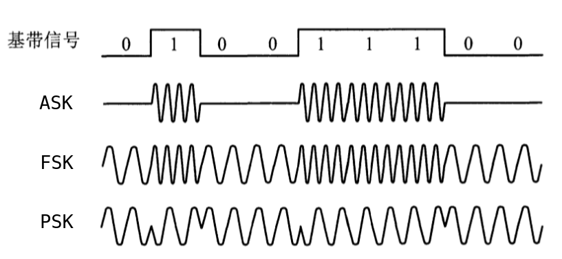
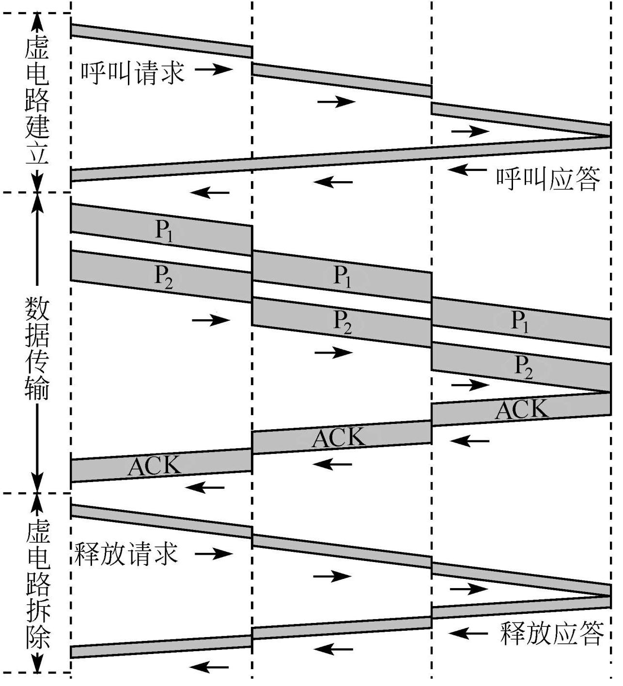
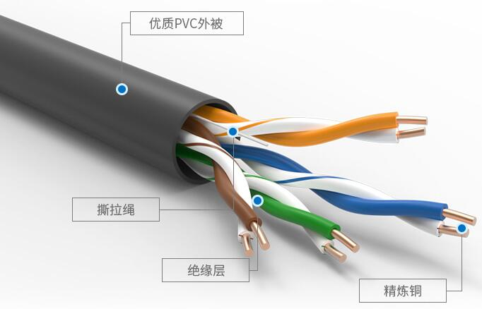
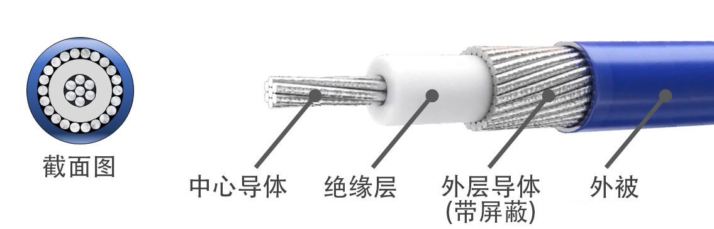
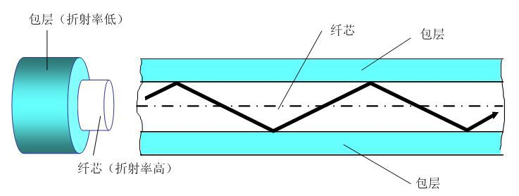
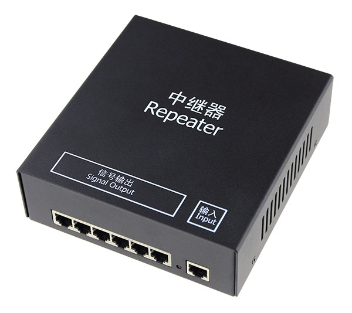
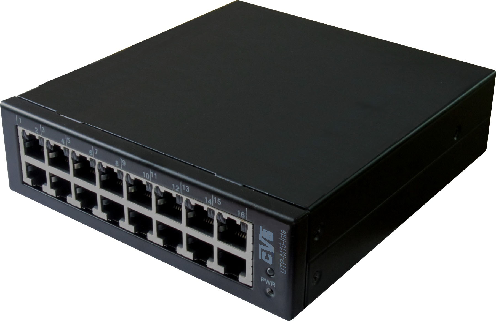

# 通信基础

## 基本概念

### 数据、信号、码元

- 通信的目的是传送信息；数据是信息的载体；信号则是数据的电气或电磁表现，是数据在传输过程中的存在形式。

1. 模拟数据（模拟信号）：连续变化的数据（信号）。
2. 数字数据（数字信号）：取指仅为有限个离散数值的数据（信号）。

- 数据传输方式分为串行传输和并行传输。
- 码元是用一个固定时长的信号波形（数字脉冲）表示一位k进制数字，代表不同离散数值的基本波形，是数字通信中数字信号的计量单位。k进制码元（通常为二进制码元）是该固定时长内的信号，而码元宽度是该固定时长。1码元可以携带若干比特的信息量。
- 有效离散位：码元的离散电平的数目表示有多少种不同的码元。有效离散位的位数：（1）[QAM](#QAM)，m个相位 x n种幅度；（2）二进制信号的有效离散位的位数为2
- 对于k进制码元，m位有效离散位，1码元携带的信息量（bit） = logkm。

### 信源、信道、信宿

- 数据通信是数字计算机或其他数字终端之间的通信，一个数字通信系统主要划分为信源、信道和信宿三个部分。信源发出的信息需要通过变换器转换成适合于在信道传输的信号，而通过信道传输到接收端的信号先由反变换器转换成原始信息，再发送给信宿。

1. 信源是产生和发送数据的源头。
2. 信宿是接收数据的终点。
3. 信道是信号的传输媒介，不等同电路。信道可视为一条线路的逻辑部件，表示向某个方向传送信息的介质，故一条通信线路往往包含一条发送信道和一条接收信道。
4. 噪声源（信噪）是信道上的噪声（干扰）及分散在通信系统其他各处的噪声的集中表示。

 

- 信道按传输信号形式的不同，分为模拟信道（传送模拟信号）和数字信道（传送数字信号）；按传输介质的不同，分为无线信道和有线信道。
- 信道上的信号分为基带信号和宽带信号。

1. 基带信号将数字信号0和1直接用两种不同的电压表示，然后送到数字信道上传输（基带传输）。

2. 宽带信号将基带信号进行调制后形成频分复用模拟信号，然后送到模拟信道上传输（宽带传输、频带传输）。

- 通信双方信息的交换方式分为三种基本方式，单向通信、半双工通信、全双工通信。
- 信道的极限容量是指信道的最高码元传输速率或信道的极限信息传输速率。

### 速率、波特、带宽

- 速率（数据率、数据传输速率）表示单位时间内传输的数据量。

1. 码元传输速率（波特率，波特 Baud）表示单位时间内数字通信系统所传输的码元个数（脉冲个数、信号变化的次数）。一波特表示数字通信系统每秒传输一个码元，码元速率和进制数无关。
2. 信息传输速率（信息速率、比特率，bit/s）表示单位时间内数字通信系统传输的二进制码元个数（比特数）。

- 波特率和比特率的转换主要取决于码元，如[以太网的波特率](#曼彻斯特编码)是比特率的2倍。波特率 = 比特率 / 每码元携带的比特数。

- 带宽即最高数据率（bit/s），而不是一般所认为的信号的频带宽度。

## 奈奎斯特定理、香农定理

- 奈氏准则只考虑带宽与极限码元速率的关系；而香农定理考虑宽带以及信噪比。若给出了[码元与比特数之间的关系](#有效离散位)，则需要受到两个公式的共同制约。

    
二进制信号在信噪比为127 : 1的4kHz的信道上传输，最大数据传输速率可达到_______。

    8000 bit/s 
    “二进制信号”给出了码元与比特数之间的关系，需要受到两个公式的共同制约。 
    1. 奈氏准则：理想低通信道下的极限数据传输速率 = 2Wlog2V = 2*4000*log22 = 8000 bit/s 
    2. 香农定理：信道的极限数据传输速率 = Wlog2(1+S/N) = 4000*log21+127 = 28000 bit/s

### 奈奎斯特定理（奈氏准则）

- 奈氏准则（Nyquist）规定在理想低通（信道没有噪声、带宽有限），为避免码间串扰，极限码元传输速率为2W波特。W是理想低通信道的带宽，V是每个码元[离散电平的数目](#有效离散位)。

理想低通信道下的极限数据传输速率（bit/s） = 2Wlog2V 

1. 在任何信道，码元的传输速率是有上限的，避免码间串扰。
2. 信道的频带越宽（通过的信号高频分量越多），就可用更高的速率进行码元的有效传输。
3. 给出了码元传输速率的限制，而并未对信息传输速率给出限制，即没有限制一个码元对应多少个二进制位，但也侧面反映了一个码元对应的二进制位数是有限的。

- 采样定理：在通信领域，带宽是指信号最高频率和最低频率之差，单位为Hz。因此，将模拟信号转换为数字信号时，假设原始信号中的最大频率为f，则采样频率f采样必须大于或等于最大频率的两倍，才能保证采样后的数字信号完整保留原始模拟信号的信息。

### 香农定理

- 香农定理（Shannon）给出了带宽受限且有高斯白噪声干扰的信道的极限数据传输速率，用此速率进行传输时，可以做到无误差。

1. W为信道的带宽
2. S/N（信噪比），信号的平均功率（S）与噪声的平均功率（N）之比。若给出的S/N的单位为dB（分贝），则x dB = 10log10(S/N)

信道的极限数据传输速率 = Wlog2(1+S/N)

1. 信道的带宽或信道的信噪比越大，信息的极限传输率越高。
2. 对一定的传输带宽和一定的信噪比，信息传输速率的上限是确定的。
3. 只要信息传输速率低于信道的极限传输速率，就能找到某种方法来实现无差错的传输。
4. 香农定理得出的是极限信息传输速率，实际信道能够达到的传输速率要更低。

    
电话系统的典型参数是信道带宽为3kHz，信噪比为30dB，则该系统的最大数据传输速率为_____。

    30000bit/s 
    该题未给出码元和比特之间的关系，仅给出信噪比和带宽，只需要考虑香农定理。 
    由信噪比为30dB，则30 = 10log10S/N，S/N = 1000 
    信道的极限数据传输速率 = Wlog2(1+S/N) = 1000*log2(1+1000)&asymp;30000bit/s 

## 编码与调制

- 数据（数字和模拟）都必须转变成信号才能传输。

1. 调制：把数据变换为模拟信号的过程
2. 编码：把数据变换为数字信号的过程

- 数字数据可以通过数字发送器转换为数字信号，也可以通过调制器转换成模拟信号；模拟数据可以通过PCM编码器转换成数字信号，也可以通过放大器调制器转换成模拟信号。

### 数字数据编码为数字信号

- 数字数据编码用于基带传输，在基本不改变数字数据信号的情况下，直接传输数字信号。
- 编码规定具体使用何种数字信号表示0和1。

 

1. 归零编码（RZ）用高电平代表1、低电平代表0（或相反），每个时钟周期的中间均跳变到低电平（归零）。接收方根据该跳变调整本方的时钟基准，为传输双方提供了自同步机制，但归零需要占用一部分的带宽。
2. 非归零编码（NRZ）不用归零，一个周期可以全部用来传输数据，但无法传输时钟信号，传输双方难以同步。若要参数高速同步数据，则传输双方都需要带有时钟线。
3. 反向非归零编码（NRZI）用信号的翻转表示0、信号保持不变表示1，翻转本身可作为通知机制。既能传输时钟信号，又能尽量不损失系统带宽。

> USB2.0通信的编码方式采用NRZI。

4. 曼彻斯特编码（Manchester Encoding）将一个码元分成两个相等的间隔，前一个间隔为高电平而后一个间隔为低电平表示码元1，码元0的表示则相反，或采用相反的规定。在每个码元的中间出现电平跳变，位中间的跳变既作为时钟信号，又作为数据信号，但占用的频带宽度是原始基带宽度的2倍（此时，波特率是比特率的2倍，每码元携带2bit的信息量）。

> 以太网采用曼彻斯特编码。

5. 差分曼彻斯特编码常用于局域网传输，若码元为1，则前半个码元的电平与上一码元的后半个码元的电平相同；若码元为0，则相反。在每个码元的中间都有一次电平的跳转，可实现自同步，且抗干扰性好。

6. 4B/5B编码将欲发送数据流的每4位作为一组，之后按照4B/5B编码规则将其转换成相应的5位码。5位码共32（25）种组合，但只能采用其中的16种对应16种不同的4位码，其余的16位作为控制码或保留。

    

        下图为10BaseT网卡接收到的信号波形，则该网卡收到的比特串是______。 
        
    

    00110110 
    10BaseT网卡，10-Mbps；Base-基带；T-双绞线；即 基带以太网 
    &gt; 如果是差分曼彻斯特编码或NDRZI，则第一个码元通常无法判断，只能比较之后的码元。

### 数字数据调制为模拟信号

- 数字数据调制技术在发送端将数字信号转换为模拟信号（调制解调器的调制），而在接收端将模拟信号还原为数字信号（调制解调器的解调）。

1. ASK（幅移键控）通过改变载波信号的振幅来表示数字信号1和0，而载波的频率和相位都不改变。较容易实现，抗干扰能力差。
2. FSK（频移键控）通过改变载波信号的频率来表示数字信号1和0，而载波的振幅和相位都不改变。较容易实现，抗干扰能力强，应用广泛。
3. PSK（相移键控）通过改变载波信号的相位来表示数字信号1和0，而载波的频率和振幅都不改变。分为绝对调相和相对调相。
4. QAM（正交振幅调制）在频率相同的前提下，将ASK和PSK相结合，形成叠加信号。设波特率为B，采用m个相位，每个相位有n种振幅，则该QAM技术的数据传输速率R为 R = Blog2(mn)

> 采用QAM的[有效离散位](#有效离散位)数量 = m个相位 x n种幅度。

 

### 模拟数据编码为数字信号

- 该编码的典例为对音频信号进行编码的PCM（脉冲调制，Pulse Code Modulation），主要包括采样、量化、编码三个步骤。

1. 采样是对模拟信号进行周期性扫描，把时间上连续的信号变成时间上离散的信号。由采样原理（[奈奎斯特定理](#奈氏准则)），规定当采样的频率大于或等于模拟数据的频带宽度（最高变化频率）的两倍时，所得的离散信号可以无失真地代表被采样的模拟数据。
2. 量化是将采样取得的电平幅值按照一定的分级标度转换为对应的数字值并取整，将连续的电平幅值转换为离散的数字量。
3. 编码是将量化的结果转换为与之对应的二进制编码。

    

    将1路模拟信号分别编码为数字信号后，与另外7路数字信号采用同步TDM方式复用到一条通信线路上。1路模拟信号的频率变化范围为0~1kHz，每个采样点采用PCM方式编码为4位的二进制数，另外7路数字信号的数据率均为7.2kbit/s。复用线路需要的最小通信能力是______。
    

    由采样原理，f采样 = 2fmax = 2kHz，而每个样值编码为4位二进制数，则比特率 = 4 * 2 kbit/s 
    同步TDM方式复用的每条支路速率要相等，而另外7路数字信号的数据率均为7.2kbit/s，需要采用PCM（脉冲填充），将数据率提高到8kbit/s。 
    故这8路信号复用，需要的通信能力为8*8kbit/s = 64bit/s

### 模拟数据编码为模拟信号

- FDM（频分复用技术）。
- 电话机和本地局交换机采用模拟信号传输模拟数据的编码方式，模拟的声音数据是加载到模拟的载波信号中传输的。

## 交换技术

1. 传送的数据量很大且传送时间远大于呼叫时间，采用电路交换。
2. 端到端的通路由多段链路组成，采用分组交换。
3. 提供整个网络的信道利用率，报文交换和分组交换优于电路交换。
4. 计算机之间的突发式数据通信，采用分组交换，分组交换的平均时延小于报文交换。

 

    
比较电路交换网络和分组交换网络，要传送的报文共x比特。从源点到终点一定经过k段链路，每段链路的传播时延为d秒，数据传输速率为b比特每秒。在电路交换时电路的建立时间为s秒。在分组交换时分组长度为p比特，且各结点的排队等待时间可忽略不计。问在何种条件下，分组交换的时延比电路交换的时延小？

    对于k段链路共经过k-1个结点，设有n个分组（不等于x/p，np&asymp;x） 
    1. 电路交换时延 = s + kd + x/b 
    2. 分组交换时延 = kd + np/b + (k-1)p/b 
    要求 kd + np/b + (k-1)p/b &lt; s + kd + x/b，则 (k-1)p/b &lt; s 
    

### 电路交换

- 电路交换包括连接建立、数据传输、连接释放三个阶段。在进行数据传输之前，源结点和目的结点之间必须先建立一条专用（双方独占）的物理通信路径（由通信双方之间的交换设备和链路逐段连接而成），该路径可以经过多个中间结点，直到通信结束之后才释放。
- 最典型的电路交换网是传统电话网络，在电路交换的整个阶段，比特流连续地从源点直达终点，就好像通道。

 

- 电路交换的优点

1. 数据直接传送、时延小：电路建立后，通信线路被独占，除源结点和目的结点外，电路上的任何结点都采用“直通方式”接收和发送数据，不存在存储转发所消耗的时间。
2. 有序传输：双方通信时按发送顺序传送数据，不存在失序问题。
3. 没有冲突：不同的通信双方独立地拥有不同的信道，不存在信道的争用。
4. 使用范围广：可以用于传输模拟信号和数字信号。
5. 实时性强：通信双方一旦建立物理通路，就可以随时通信。
6. 控制简单。

- 电路交换的缺点

1. 建立连接时间长：电路交换的平均建立时间长。
2. 灵活性差：一旦通信线路中任何一点出现故障，就必须重新拨号建立新的连接。
3. 不便差错控制：中间结点不具备存储和检验数据的能力，无法发现并纠正错误。
4. 线路独占，信道利用率低：电路建立后，通信线路被独占，即使通信线路空闲，也不能被其他用户使用。
5. 难以规格化。

### 报文交换

- 报文交换网络（存储-转发网络）：用户数据加上源地址、目的地址、校验码等辅助信息，之后封装为报文。整个报文传送到相邻结点，全部存储后，再转发到下一个结点，直到到达目的结点。每个报文可以单独选择到达目的结点的路径，可以同时发送给多个目的地。
- 报文交换的优点

1. 无须建立连接。
2. 动态分配线路。
3. 提高线路可靠性。
4. 提高线路利用率：可以较充分地利用线路容量，实现不同链路之间不同数据传输速率的转换、格式转换。
5. 提供多目标服务：可以实现一对多、多对一的访问，实现差错控制。

- 报文交换的缺陷

1. 存储转发时延。
2. 增大了资源开销：封装了额外的辅助信息。
3. 增加了缓冲机制：需要额外的控制机制来保证多个报文的顺序。
4. 缓冲区难以管理：报文的大小没有限制，接收方在接收到报文之前不能预知报文的大小。

### 分组交换

- 分组交换网络（包交换网络）：将数据分成较短的固定长度的数据块，在每个数据块中加上必要的控制信息封装为分组（包，Packet），以存储-转发方式传输。网络结点根据控制信息把分组送到下一个结点，下一个结点接受到分组后，暂时保存并排队等待传输，之后根据分组控制信息选择其下一个结点，直到达目的结点。
- 分组交换的优点

1. 具有报文交换网络的优点。
2. 相对于报文交换，缓冲易于管理：分组交换限制了每次传送的数据块大小的上限，相应的缓冲区的大小也固定。
3. 包的平均时延更小，网络占用的平均缓冲区更少：分组是逐个传输的（流水线），可以使后一个分组的存储和前一个分组的转发并行完成。
4. 减少了出错概率和重发数据量。

- 分组交换的缺点

1. 存储转发时延。
2. 资源开销大于报文交换网络：每个分组（小数据块）都要带上必要的控制信息，使得传送的信息量增大了5%\~10%。
3. 若采用数据报服务，可能会出现失序、丢失、重复分组；若采用虚电路，则无失序问题，但需要呼叫建立、数据传输、虚电路释放三个阶段。

<table>
	<thead>
		<tr>
			<th width="10%"></th>
			<th width="45%">数据报</th>
			<th width="45%">虚电路</th>
		</tr>
	</thead>
	<tbody>
		<tr>
			<td>连接建立</td>
			<td>不需要</td>
			<td>需要</td>
		</tr>
		<tr>
			<td>目的地址</td>
			<td>每个分组都有完整的目的地址</td>
			<td>仅建立连接阶段需要，之后每个分组使用虚电路号</td>
		</tr>
		<tr>
			<td>路由选择</td>
			<td>每个分组独立地进行路由选择和转发</td>
			<td>属于同一条虚电路的分组按照同一路由转发</td>
		</tr>
		<tr>
			<td>可靠性</td>
			<td>尽最大努力交付，可靠性由主机保证</td>
			<td>可靠性由网络保证</td>
		</tr>
		<tr>
			<td>故障适应</td>
			<td>仅出故障的结点丢失分组</td>
			<td>所有经过故障结点或故障链路的虚电路都将遭到破坏</td>
		</tr>
	</tbody>
</table>

#### 数据报

- 作为通信子网用户的端系统发送一个报文时，在端系统中实现的高层协议先把报文拆成若干带有序号的数据单元，并在网络层加上控制信息后形成数据报分组。中间结点存储分组并找到最佳的路由，尽快转发每个分组。每个分组可以选择不同的路径，也可以按照不同的顺序到达目的结点。

1. 发送分组之前不需要建立连接，通信双方不独占某条链路，资源利用率高。
2. 尽最大努力交付，分组可能丢失、失序、重复。
3. 发送的分组在交换结点存储转发时，需要排队等候处理；但存储转发的延时一般较小，提高了网络的吞吐量。
4. 网络具有冗余路径，对故障适应能力强：当某个交换结点或链路出现故障时，可相应地更新转发表，寻找另一条路径转发分组。

#### 虚电路

- 在分组发送之前，要求通信双方建立一条逻辑上相连的虚电路，且连接一旦建立，就固定了虚电路对应的物理路径。通信过程包括虚电路建立、数据传输、虚电路释放三个阶段。
- 虚电路不是专用的，每个结点到其他结点之间的链路可能有多个虚电路通过，也可能同时与多个结点之间建立虚电路。虚电路支持特定的两个端系统之间的数据传输，两个端系统之间也可以有多条虚电路为不同的进程服务，这些虚电路的实际路由可以相同或不同。
- 端系统每次建立虚电路时，选择一个从未使用过的虚电路号（VCID）分配给该虚电路，用以区别该系统中的虚电路。虚电路网络中的每个结点都维护一张虚电路表，每一项记录一个打开的虚电路的信息（接收链路和发送链路上的虚电路号、前一结点和下一结点的标识）（虚电路建立时确定这些信息）。数据的传输是双向进行的。

  

1. 虚电路通信链路的建立和拆除需要时间开销，对交互式应用和小量的短分组情况显得浪费，但对长时间、频繁的数据交换效率较高。
2. 虚电路的路由选择体现在连接建立阶段，连接建立之后就确定了传输路径。
3. 虚电路提供可靠的通信功能，且保证每个分组正确有序地到达，且可以进行流量控制。
4. 网络中的某个阶段或链路出现故障时，所有经过该结点或链路的虚电路都将遭到破坏。
5. 分组的首部在虚电路建立阶段需要包含目的地址，而建立通信链路之后，分组的首部不包含目的地址，而是虚电路标识符。

### 信元交换

# 传输介质

- 传输介质（传输媒体）是数据传输系统中发送设备和接收设备之间的物理通路，分为导向传输介质和非导向传输介质。

1. 导向传输介质的电磁波被导向沿着固体媒介（铜线或光纤）传播。
2. 非导向传输介质可以是空气、真空、海水等。

## 双绞线

 

- 双绞线由两根采用一定规则并排绞合的、相互绝缘的铜导线组成。
- 绞合可以减少对相邻导线的电磁干扰。

<table>
    <tr>
        <td width="20%">STP（屏蔽双绞线）</td>
        <td width="80%">在双绞线的外面再加上一层用金属丝编织成的屏蔽层</td>
    </tr>
    <tr>
        <td>UTP（非屏蔽双绞线）</td>
        <td></td>
    </tr>
</table>

- 双绞线价格便宜，在局域网和传统电话网中普遍使用，模拟传输和数字传输都可使用双绞线，对于数字传输，要使用中继器将失真的信号再生。
- 双绞线的带宽取决于铜线的粗细和传输的距离。

## 同轴电缆

 

- 同轴电缆由内导体、绝缘层、网状编织层、塑料外层构成。按照特性抗阻数值的不同，通常分为50Ω同轴电缆和75Ω同轴电缆。

1. 50Ω同轴电缆（基带同轴电缆）主要用于传送基带数字信号
2. 75Ω同轴电缆（宽度同轴电缆）主要用于传送宽度信号，主要用于有线电视系统 。

- 由于外导体屏蔽层的作用，同轴电缆具有良好的抗干扰特性，被广泛用于传输较高速率的数据，其传输距离更远，价格较双绞线更贵。

## 光纤

- 光纤通信就是利用光导纤维传递光脉冲来进行通信，有光脉冲表示1，无光脉冲表示0，带宽范围极大（光的频率约为108MHz）。
- 光纤主要由纤芯和包层构成。纤芯很细，直径只有8\~100um，光波通过纤芯进行传导；包层较纤芯有较低的折射率，利用光的全反射特性。

 

1. 多模光纤：利用光的全反射特性，将不同角度入射的多条光线在一根光纤中传输。多模光纤的光源为发光二极管。光脉冲在多模光纤中传输时会逐渐展宽，造成失真，只适合近距离传输。

 

2. 单模光纤：光纤的直径减小到只有一个光的波长时，光纤就如同一个波导，光纤可一直向前传播而不会产生多次反射。单模光纤的极细，直接只有几微米，制造成本较高。单模光纤的光源为定向性很好的半导体激光器，衰减较小，可传输数千米甚至数十千米而不必采用中继器，适合远距离传输。

 

- 光纤不仅通信容量非常大，而且具有以下特点：

1. 传输损耗小，中继距离长，对远距离传输特别经济。
2. 抗雷电和电磁干扰性能好。
3. 无串音干扰，保密性好，不容易被窃听或截取数据。
4. 体积小，重量轻。

## 无线传输介质

### 无线电波

1. 无线电波具有较强的穿透能力，可以传输很长的距离，被广泛应用于通信领域。

2. 无线电波使信号向所有方向散播，有效距离内的接收设备无须对准某个方向即可与无线电波反射者进行通信连接。

### 微波、红外线、激光

- 微波、红外线和激光（统称为视线介质）需要发送方和接收方之间存在一条视线（Line-of-sight）通路，有很强的方向性，都沿直线传播。
- 红外通信和微波通信要把传输的信号分别转换为各自的信号格式，即红外信号和激光信号，再直接在空间中传播。
- 微波通信的频率极高，频段范围也很宽，载波频率通常为2\~40GHz，通信信道的容量大。微波通信的信号是沿直线传播的，在地面上的传播距离有限，超过一定距离后就要使用中继站来接力。
- 卫星通信利用地球同步卫星作为中继来转发微波信号，克服了地面微波通信距离的限制，基本能实现全球通信。卫星通信的通信容量大、距离远、覆盖广，但保密性差、端到端传播时延长。

# 物理层接口的特性

- 物理层考虑的是如何在连接到各种计算机的传输媒体上传输数据比特流，而不是具体的传输媒体。

1. 机械特性：指明接口所用接线器的形状和尺寸、引脚数目和排列、固定和锁定装置等。
2. 电气特性：指明在接口电缆的各条线上出现的电压的范围。
3. 功能特性：指明某条线上出现的某一电平的电压表示何种意义。
4. 过程特性（规程特性）：指明对于不同功能的各种可能事件的出现顺序。 

- 常用的物理层接口标准有EIA RS-232-C、ADSL、SONET/SDH等。

# 物理层设备

## 中继器 repeater

 

- 中继器的主要功能是将信号（数字信号）整形并放大再转发出去，以消除信号经过一长段电缆后而产生的失真和衰减，使信号的波形和强度达到所需要的要求，进而扩大网络传输的距离。原理是信号再生（而非简单地将衰减的信号放大）。

> 放大器放大的是模拟信号，原理是将衰减的信号放大；而中继器是将数字信号再生。

1. 中继器是用来扩大网络规模的最简单廉价的互连设备。中继器有输入和输出端口，但端口仅作用于信号的电气部分，而不管是否有错误数据或不适合于网段的数据。
2. 中继器两端的网络部分是网段而不是子网，使用中继器连接的几个网段仍然是一个局域网。若中继器出现故障，对相邻的两个网段的工作都会造成影响。
3. 中继器工作在物理层，且没有存储转发功能，不能连接两个具有不同速率的局域网，中继器连接的网段必须使用同一个协议。物理层没有流量控制功能，若发送方的速率高于接收方，则接收方来不及接收导致溢出，数据丢失；若发送方速率低于接收方，效率低。

> 若某个网络设备具有存储转发功能，则可以认为其能连接两个不同的协议；若该网络设备没有存储转发功能，则认为其不能连接两个不同的协议。

4. 中继器只能在网络标准中对信号具体规定的延迟范围内进行有效的工作，否则会引起网络故障。“5-4-3”规则：采用粗同轴电缆的10Base5以太网规范中，一个网段最多只能分5个子网段，最多只能有4个中继器，最多只能有三个子网段含有PC。

## 集线器 Hub

 

- 集线器实质上是一个多端口的中继器。当集线器工作时，一个端口接收到数据信号后，由于信号在从端口到集线器的过程中已有衰减，所以集线器将该信号进行整形放大，使之再生（恢复）到发送时的状态，紧接着转发到其他所有（除输入端口外）处于工作状态的端口。集线器在网络中只起信号放大和转发作用，目的是扩大网络的传输范围，而不具备信号的定向传送能力，即信息传输的方向是固定的，是标准的共享式设备。/

1. 集线器主要使用双绞线组建共享式网络，是从服务器连接到桌面的最经济方案，但逻辑上仍然是一个总线网。 
2. 在交换式网络中，集线器直接与交换机相连，将交换机端口的数据送到桌面上。
3. 使用集线器组网灵活，其将所有结点的通信集中在以其为中心的结点上，对结点相连的工作站进行集中管理，在拓扑结构上属于星形。
4. 集线器的每个端口连接的网络部分是同一个网络的不同网段。
5. 集线器只能在半双工状态下工作，限制了网络的吞吐率。
6. 集线器不能分割[冲突域](./DataLinkLayer.md#冲突域)，所有集线器都属于同一个冲突域，也属于同一个广播域。若集线器同时有两个或多个端口输入，则输出时会发生冲突，而多台计算机必然会出现同时通信的情形。集线器在一个时钟周期中只能传输一组信息，若集线器连接的机器数目较多，且多台机器经常需要同时通信，则将导致信息碰撞，使得集线器的工作效率低。

> 一个带宽为10Mb/s的集线器上连接了8台计算机，当这8台计算机同时工作时，每台计算机真正拥有的宽带为10/8Mb/s=1.25Mb/s。

> 集线器就是一个USB口扩展出多个USB口的一种设备，相比较集线器，扩展坞除了可以扩展USB类的外部设备，还可以扩展出HDMI和DisplayPort等视频输出接口以及有线网络等其他接口。