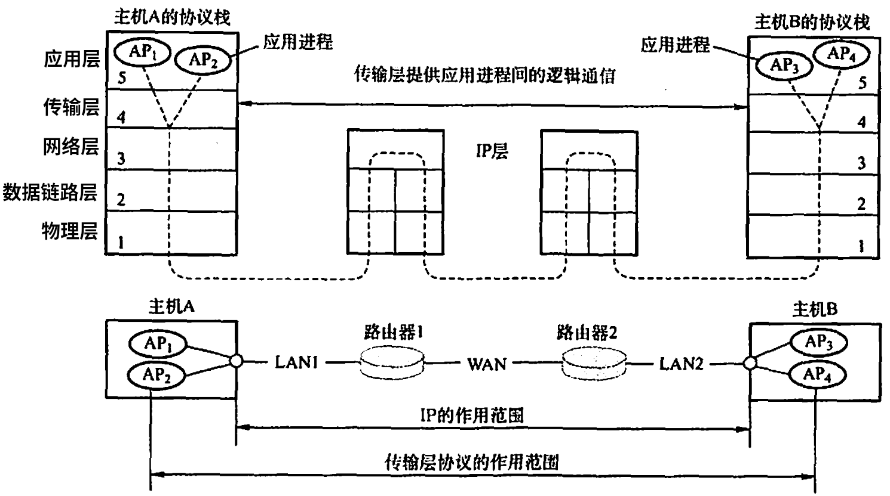
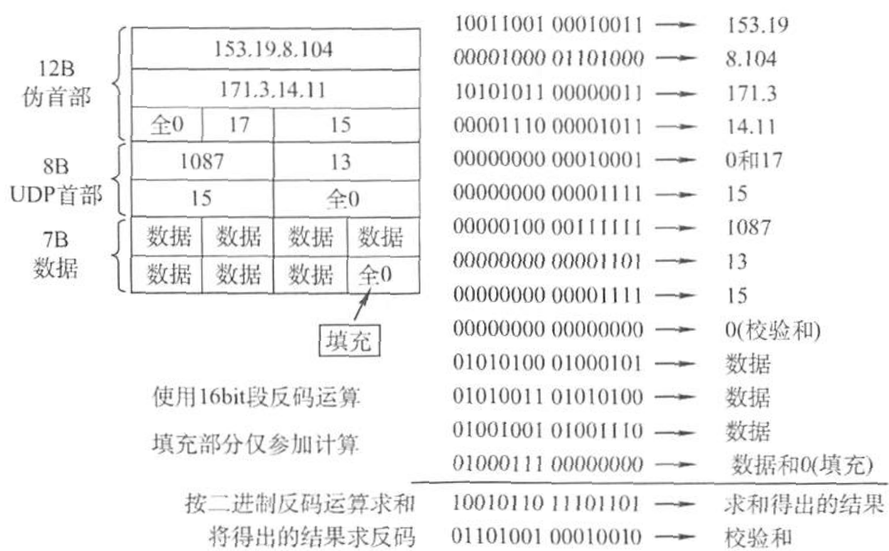

# 传输层提供的服务

## 传输层的功能

- 从通信和信息处理的角度看，传输层向它上面的应用层提供通信访问，属于面向通信部分的最高层，同时也是用户功能中的最底层。
- 传输层位于网络层的之上，为运行在<b>不同主机上的进程之间</b>提供了逻辑通信，而网络层提供主机之间的逻辑通信。
- 在通信子网中没有传输层，传输层只存在于通信子网以外的主机中。

 

<table>
    <tr>
        <th width="10%">功能</th>
        <th width="45%">传输层</th>
        <th width="45%">网络层</th>
    </tr>
    <tr>
        <td>逻辑通信</td>
        <td>提供应用进程之间的逻辑通信（端到端）</td>
        <td>提供的是主机之间的逻辑通信（点到点）</td>
    </tr>
    <tr>
        <td>复用分用</td>
        <td>传输层的复用是<b>发送方不同的应用进程</b>都可使用同一个传输层协议传送数据；分用是指接收方的传输层在剥去报文的首部后能够把这些数据正确交付到目的应用进程</td>
        <td>网络层的复用是指<b>发送方不同协议的数据</b>都可封装成IP数据报发送出去；分用是指接收方的网络层在剥去首部后把数据交付给相应的协议</td>
    </tr>
    <tr>
        <td>差错检测</td>
        <td>还要对收到的报文进行差错检测（首部和数据部分）</td>
        <td>只检查IP数据报的首部，不检验数据部分是否出错</td>
    </tr>
    <tr>
        <td>传输协议</td>
        <td>提供两种不同的传输协议，面向连接的TCP和无连接的UDP</td>
        <td>无法同时实现两种协议，要么只提供面向连接的服务（如虚电路等），要么只提供无连接的服务（如数据报）</td>
    </tr>
</table>

-  传输层向高层用户屏蔽了低层网络核心的细节。

## 传输层的寻址与端口

### 端口

- 端口能够让应用层的各种应用进程将其数据通过端口向下交付给传输层，以及让传输层指定应当将其报文段中的数据向上通过端口交付给应用层相应的进程。
- 端口是传输层服务访问点（TSAP），而端口号标识的是主机中的应用进程。

> 数据链路层的SAP是MAC地址；网络层的SAP是IP地址；传输层的SAP是端口。

- 传输层使用的是软件端口。

<table>
    <tr>
        <td width="10%">软件端口</td>
        <td width="90%">在协议栈层间的抽象的协议端口，应用层的各种协议进程与传输实体进行层间交互的一种地址</td>
    </tr>
    <tr>
        <td>硬件端口</td>
        <td>不同硬件设备进行交换的接口</td>
    </tr>
</table>

### 端口号

- 应用进程通过端口号进行标识，端口号长度为16bit，能够表示65536（216）个不同的端口号。端口号只具有本地意义，即端口号只标识本计算机应用层中的各进程。
- 根据端口号范围可将端口分为两类：服务器端使用的端口号、客户端使用的端口号。

<table>
    <tr>
        <td width="20%" rowspan="2">服务器端使用的端口号</td>
        <td width="15%">熟知端口号</td>
        <td width="65%">数值为0~1023，IANA（互联网地址指派机构）把这些端口号指派给了TCP/IP最重要的一些应用程序，且所有用户都知晓</td>
    </tr>
    <tr>
    <td>登记端口号</td>
    <td>数值为1024~49151，供没有熟知端口号的应用程序使用，必须在IANA登记使用，避免重复</td>
    </tr>
    <tr>
        <td>客户端使用的端口号 （短暂端口号、临时端口）</td>
        <td colspan="2">数值为49152~65535，仅在客户端进程运行时才动态地选择，通信结束后此类端口号就不复存在，以供其他客户进程使用</td>
    </tr>
</table>

- 常见的熟知端口号：

<table>
    <tr>
        <th width="24%">UDP</th>
        <th width="24%">端口号</th>
        <td rowspan="7" width="4%"></td>
        <th width="24%">TCP</th>
        <th width="24%">端口号</th>
    </tr>
    <tr><td>RPC</td><td>111</td><td>SMTP</td><td>25</td></tr>
    <tr><td>DNS</td><td>53</td><td>FTP</td><td>21（控制连接）  20（数据连接）</td></tr>
    <tr><td>TFTP</td><td>69</td><td>Telnet</td><td>23</td></tr>
    <tr><td>SNMP</td><td>161</td><td>HTTP</td><td>80</td></tr>
    <tr><td>SNMP（trap）</td><td>162</td><td>HTTPS</td><td>443</td></tr>
    <tr><td>SMTP</td><td>25</td><td></td><td></td></tr>
</table>

### 套接字 Socket

- 套接字（Socket）：端口号拼接到IP地址即构成套接字Socket，在网络中采用发送方和接收方的套接字来识别端点，即套接字实际上是一个通信端口。套接字唯一地标识网络中的一台主机和其上的一个应用（进程）。

Socket = (IP地址: 端口号)

## 无连接服务与面向连接服务

- UDP提供无连接服务；TCP提供面向连接服务。

# UDP协议

- UDP（User Datagram Protocol，无连接的用户数据报协议）是无连接的非可靠传输层协议，向上提供的是一条不可靠的逻辑信道，所有维护可靠性的工作可由用户在应用层来完成。

1. UDP无须建立连接，无连接状态。UDP在传送数据之前不需要先建立连接，远程主机的传输层收到UDP报文后，不需要给出如何确认。UDP不会引入建立连接的时延，故也不需要维护包括接收和发送缓冲、拥塞控制参数和序号以及确认号的连接状态参数。
2. 应用层能更好地控制要发送的数据和发送时间。UDP没有拥塞控制，主机的发送效率不会被网络中的拥塞影响，适用要求时延低的多媒体通信。
3. UDP比较简单，执行速度比较快、实时性好。主要应用于TFTP（小文件传送协议）、DNS、SNMP、RTP（实时传输协议）
4. UDP支持一对一、一对多、多对一、多对多的交互通信。

- UDP是面向报文的，报文是UDP数据报处理的最小单位。发送方UDP对应用层交下来的报文，在添加首部后就向下交付给IP层，一次发送一个报文，既不合并，也不拆分，而是保留这些报文的边界；接收方UDP对IP层交上来UDP数据报，在去除首部后就原封不动地交付给上层应用进程，一次交付一个完整的报文。因此，应用程序必须选择合适大小的报文，若报文太长，UDP把它交给IP层后，可能会导致分片；若报文太短，UDP把它交给IP层后，会使IP数据报的首部的相对长度太大，两者都会降低IP层的效率。

- IP 数据报和UDP数据报的区别：

1. IP数据报在网络层要经过路由的存储转发；而UDP数据报在传输层的端到端的逻辑信道中传输，封装成IP数据报在网络层传输时，UDP数据报的信息对路由是不可见的。
2. UDP仅在IP数据报服务之上增加了两个最基本的服务：复用分用和差错检测。
3. IP知道怎样把分组投递给一台主机，但不知道怎样把它们投递给主机上的具体应用。

## UDP数据报的首部

- UDP数据报包含两部分：UDP首部和用户数据。UDP首部固定为8B，由4个字段组成，每个字段的长度都是2B。

 

<table>
    <tr>
        <td width="10%">源端口</td>
        <td width="90%">源端口号，在需要对方回信时选用，不需要时可用全0</td>
    </tr>
    <tr>
        <td>目的端口</td>
        <td>目的端口号，传输层从IP层收到UDP数据报时，根据首部中的目的端口，把UDP数据包通过相应的端口上交给应用进程。如果接收方UDP发现收到的报文中的目的端口号不正确（不存在对应端口号的应用进程），则丢弃该报文，并由ICMP发送“端口不可达”差错报文给发送方</td>
    </tr>
    <tr>
        <td>长度</td>
        <td>UDP数据报的长度（包括首部和数据），其最小值是8（仅有首部）</td>
    </tr>
    <tr>
        <td rowspan="2">校验和</td>
        <td>检测UDP数据报在传输中是否有错，有错就丢弃</td>
    </tr>
    <tr>
        <td>该字段是可选的，若源主机
不想计算校验和，则直接令该字段为全0。</td>
    </tr>
</table>

## UDP校验

- 伪首部：UDP在计算检验和时，要在UDP数据报之前临时增加12B的伪首部。伪首部只是用于计算检验和，既不向上传送也不向下递交。通过伪首部不仅可以检查源端口号、目的端口号和UDP用户数据报的数据部分，还可以检查IP数据报的源IP地址和目的地址。

 

- IP数据报的校验和只检验IP数据报的首部；而UDP的校验和检验UDP用户数据报的首部和数据部分。

1. 发送方首先把全零放入校验和字段并添加伪首部，然后把UDP数据报视为许多16位的字串接起来。若UDP数据报的数据部分不是偶数个字节，则要在数据部分末尾填入一个全零字节（此填充字节不发送)。然后按二进制反码计算出这些16 位字的和，将此和的二进制反码写入校验和字段，并发送。
2. 接收方把收到的 UDP 数据报加上伪首部（如果不为偶数个字节，那么还需要补上全零字节）后，按二进制反码求这些16位字的和。当无差错时其结果应为全1，否则就表明有差错出现，接收方可以选择丢弃这个UDP数据报，或交付给上层并附上错误报告。

 

# TCP协议

- TCP（Transmission Control Protocol，面向连接的传输控制协议）使得传输层向上提供的是一条全双工的可靠逻辑信道。提供面向连接的服务，在传输数据之前必须先建立连接，数据传送结束后要释放连接。TCP主要解决传输的可靠、有序、无丢失、不重复的问题。

1. TCP需要建立连接，维护连接状态。不可避免地增加了许多开销，使得协议数据单元的头部增大很多，还要占用许多的处理机资源。
2. TCP不提供广播或组播服务。每一条TCP连接只能有两个端点，即一对一。
3. TCP提供全双工通信，允许通信双方的应用进程在任何时候都能发送数据，在发送两端都设有发送缓冲和接收缓冲，来临时存放双向通信的数据。

<table>
    <tr>
        <td width="10%" rowspan="2">发送缓存</td>
        <td width="90%">发送应用程序传送给发送方TCP准备发送的数据</td>
    </tr>
    <tr>
        <td>TCP已发送但尚未收到确认的数据</td>
    </tr>
    <tr>
        <td rowspan="2">接收缓存</td>
        <td>按序到达但尚未被接收应用程序读取的数据</td>
    </tr>
    <tr>
        <td>不按序到达的数据</td>
    </tr>
</table>

- TCP面向字节流。尽管应用程序与TCP的交互是一次一个大小不等的数据块，但TCP将其视为一连串的无结构的字节流。TCP传输时是逐个字节传送的。
- TCP和UDP在发送报文时所采用的方式完全不同。UDP报文的发送长度由发送应用进程决定，而TCP报文的长度则根据接收方给出的窗口值和当前网络拥塞程度来决定。如果应用进程传送到TCP缓冲的数据块太长，TCP可以将其划分得短一些再传送；如果太短，则TCP也可以等待积累到足够多的字节后再构成报文段发送出去。

- TCP适合可靠性更重要的场合，如FTP（文件传输协议）、HTTP（超文本传输协议）、TELNET（远程登录）

- TCP 和网络层虚电路的区别：

1. TCP报文段在传输层抽象的逻辑信道中传输，对路由器不可见；虚电路所经过的交换结点都必须保存虚电路状态信息。
2. 在网络层若采用虚电路方式，则无法提供无连接服务；而传输层采用TCP不影响网络层提供无连接服务。即，TCP和UDP分别拥有自己的端口号，互不干扰，可共存。

## TCP报文段

- 报文段：TCP传送的数据单元被称为报文段。TCP报文段既可以用来运载数据，也可以用来建立连接、释放连接和应答。一个TCP报文分为首部和数据两部分，整个TCP报文段作为IP数据报的数据部分被封装在IP数据报中。
- TCP报文段的首部至少有20B，其首部的前20B是固定的，后面有4N字节是可根据需要而增加的选项；即，首部的长度为4B的整数倍，最大为60B。

 

<table>
    <tr>
        <th width="10%">字段</th>
        <th width="5%">长度</th>
        <th width="85%">意义</th>
    </tr>
    <tr>
        <td>源端口</td>
        <td>2B</td>
        <td rowspan="2">端口是传输层与应用层的服务接口，传输层的复用和分用功能都要通过端口来实现</td>
    </tr>
    <tr>
        <td>目的端口</td>
        <td>2B</td>
    </tr>
    <tr>
        <td>序号</td>
        <td>4B</td>
        <td>范围为0~232-1。TCP是面向字节流的，序号字段的值指的是本报文段所发送数据的第一个字节的序号</td>
    </tr>
    <tr>
        <td>确认号</td>
        <td>4B</td>
        <td>期望收到对方<b>下一个</b>报文段的第一个数据字节的序号。若确认号为N，则表示到序号N-1为止的所有数据都已正确收到</td>
    </tr>
    <tr>
        <td>数据偏移</td>
        <td>4bit</td>
        <td>表示首部长度，指出TCP报文段的数据部分起始处距离TCP报文段的起始处有多远。数据偏移的单位是4B，因此TCP首部的最大长度为60B</td>
    </tr>
    <tr>
        <td>保留</td>
        <td>6bit</td>
        <td>保留为今后使用，目前应置为0</td>
    </tr>
    <tr>
        <td>URG</td>
        <td>1bit</td>
        <td>紧急位，当URG=1时，表明紧急指针字段有效，表示此报文段有紧急数据（数据部分从第一个字节到紧急指针所指字节），需要尽快传送</td>
    </tr>
    <tr>
        <td>ACK</td>
        <td>1bit</td>
        <td>确认位，仅当ACK=1时，确认号字段才有效；当ACK=0时，确认号字段无效。TCP规定，在连接建立后，所有传送的报文段都必须把ACK置1</td>
    </tr>
    <tr>
        <td>PSH</td>
        <td>1bit</td>
        <td>推送位（Push），接收方TCP收到PSH=1的报文段时，就尽快地交付给接收应用进程，而不是等到整个接收缓存都满了才向上交付</td>
    </tr>
    <tr>
        <td>RST</td>
        <td>1bit</td>
        <td>复位位（Reset），当RST=1时，表明TCP连接中出现严重差错，必须释放连接，然后再重新建立运输连接</td>
    </tr>
    <tr>
        <td>SYN</td>
        <td>1bit</td>
        <td>同步位，当SYN=1时，表示这是一个连接请求报文。若对方同意建立连接，则对方应在响应报文中使用SYN=1，ACK=1</td>
    </tr>
    <tr>
        <td>FIN</td>
        <td>1bit</td>
        <td>终止位（Finish），用来释放一个连接。当FIN=1时，表明此报文段的发送方的数据已发送完毕，并要求释放运输连接</td>
    </tr>
    <tr>
        <td>窗口</td>
        <td>2B</td>
        <td>范围为0~216-1，指出了现在允许对方发送的数据量，单位是字节。若确认号字段为701，窗口字段是1000，则表明从701号算起，发送此报文段的一方还有接收1000字节数据（字节序号701~1700）的接收缓冲空间</td>
    </tr>
    <tr>
        <td>校验和</td>
        <td>2B</td>
        <td>校验和字段检验的范围包括首部和数据。计算校验和时也需要加上12B的伪首部（协议字段为6且TCP长度）</td>
    </tr>
    <tr>
        <td>紧急指针</td>
        <td>2B</td>
        <td>紧急指针仅在URG=1时，才有效，指出本报文段的紧急数据共有多少字节</td>
    </tr>
    <tr>
        <td>选项</td>
        <td>可变</td>
        <td>TCP最初只规定了一种选项，MSS（Maximum Segment Size，最大报文段长度）是TCP报文段中的数据字段的最大长度</td>
    </tr>
    <tr>
        <td>填充</td>
        <td>可变</td>
        <td>全0，使得整个首部长度是4B的整数倍</td>
    </tr>
</table>
## TCP连接管理

- TCP是面向连接的协议，每个TCP连接都有三个阶段：连接建立、数据传送、连接释放。
- TCP把链接作为最基本的抽象，每一条TCP连接有两个端点（Socket），且被这两个套接字唯一确定。
- TCP连接的建立采用客户/服务器模式（C/S）。主动发起连接建立的应用进程称为客户（Client），被动等待连接建立的应用程序称为服务器（Server）。

### 三次握手 TCP连接的建立

 

0. 建立连接之前，服务器进程处于<b>LISTEN</b>（收听）状态，等待客户的连接请求。
1. <b>第一次握手</b>，客户机的TCP首先向服务器的TCP发送<b>连接请求报文段（SYN=1, seq=x）</b>。TCP规定SYN报文段不能携带数据，且要消耗一个序号。此时，TCP客户进程进入<b>SYN-SENT</b>（同步已发送）状态。
2. <b>第二次握手</b>，服务器的TCP收到连接请求报文后，若同意建立连接，则向客户机发回<b>确认报文段（ACK=1, SYN=1, seq=y, ack=x+1）</b>，并为该TCP连接分配缓存和变量（<b>服务器端的资源分配</b>）。该确认报文段不能携带数据，且要消耗一个序号。此时，TCP服务器进程进入<b>SYN-RCVD</b>（同步收到）状态。在该阶段，服务器容易受到SYN洪泛攻击。
3. <b>第三次握手</b>，当客户机收到确认报文段后，还要向服务器给出<b>确认报文段（ACK=1, seq=x+1, ack=y+1）</b>，并为该TCP分配缓存和变量（<b>客户器端的资源分配</b>）。该报文段可以携带数据，若不携带数据则不消耗序号。此时，TCP客户进程进入<b>ESTABLISHED</b>（已建立连接）状态。
4. 以上步骤成功之后，就建立了TCP连接，可以进行全双工通信，传送应用层数据。

### 四次挥手 TCP连接的释放

 

- 参与TCP连接的两个进程中的任何一个都能终止该连接。

1. <b>第一次挥手</b>。客户机打算关闭连接时，向其TCP发送<b>连接释放报文段（FIN=1, seq=u）</b>，并通知发送数据，主动关闭TCP连接。FIN报文段即使不携带数据也要消耗一个序号。此时，TCP客户进程进入<b>FIN-WAIT-1</b>（终止等待1）状态。即，TCP客户进程停止发送数据，但TCP服务进程仍然可以发送数据。（序号u为TCP客户进程之前已传送的数据的最后一个字节的序号加1）
2. <b>第二次挥手</b>。服务器收到连接释放报文段后即发出<b>确认报文段（ACK=1, ack=u+1, seq=v）</b>，之后服务器进入<b>CLOSE-WAIT</b>（关闭等待）状态。此时，<b>TCP连接处于半关闭状态</b>，只释放了从客户机到服务器方向的连接，客户机仍然要接收服务器发送的数据。（序号v为TCP服务器进程之前已传送的数据的最后一个字节的序号加1）
3. <b>第三次挥手</b>。若服务器已经没有要向客户机发送的数据，就通知TCP释放连接，此时发出<b>连接释放报文段（ACK=1, FIN=1, seq=w, ack=u+1）</b>。此时，TCP服务器进入<b>LAST-ACK</b>（最后确认）阶段。（序号w为TCP服务器进程在半关闭状态可能又已传送的数据的最后一个字节的序号加1）
4. <b>第四次挥手</b>。客户机收到连接释放报文段后，必须发出<b>确认报文段（ACK=1, seq=u+1, ack=w+1）</b>。此时，TCP连接还未释放，必须经过时间等待计时器设置的时间<b>2MSL</b>（最长报文段寿命）后，客户机才进入<b>CLOSED</b>（连接关闭）状态。此时，完成TCP连接释放。

## TCP可靠传输

