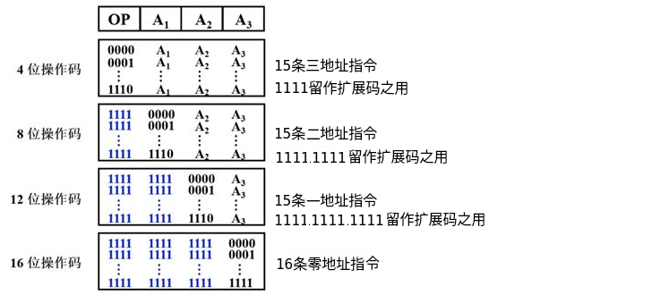

# 指令系统

- 指令（机器指令）是指示计算机执行某种操作的命令；一台计算机的所有指令的集合构成该机的指令系统（指令集）；指令系统是ISA（指令集体系结构）中最核心的部分。
- ISA完整定义了软件和硬件之间的接口，ISA规定的内容包括：指令格式，数据类型及格式，操作数的存放方式，程序可访问的寄存器个数、位数和编号，存储空间的大小和编址方式，寻址方式，指令执行过程的控制方式等。

## 指令的基本格式

- 指令是一组有意义的二进制代码，一条指令就是机器语言的一个语句，包括操作码字段和地址码字段。

 

1. 操作码：指出指令中该指令应该执行什么性质的操作以及具有何种功能，是识别指令、了解指令功能及区分操作数地址内容的组成和使用方法等的关键信息。
2. 地址码：给出被操作的信息（指令或数据）的地址，包括参加运算的一个或多个操作数所在的地址、运算结果的保存地址、程序的转移地址、被调用的子程序的入口地址等。

- 指令操作数的直接寻址范围与地址码字段位数相关：指令操作数的直接寻址范围 = 2一个地址码字段的位数。若指令字长为32位，操作码占8位，4个地址码字段各占6位，则指令操作数的直接寻址范围=26

- 指令字长：一条指令中所包含的二进制代码的位数。指令字长取决于操作码的长度、操作数地址码的长度、操作数地址的个数，与机器字长没有固定的关系。（1）单字长指令：指令长度=机器字长；（2）半字长指令：指令长度=机器字长/2；（3）双字长指令：指令长度=2机器字长
- 定长指令字结构是指一个指令系统中的所有指令的长度都是相等的，执行速度快，控制简单；而变长指令字结构是指各种指令的长度随指令功能而异，而主存一般是字节编址的，通常指令字长为整数字节。

| 操作数地址码的个数           | 说明                                                         |
| ---------------------------- | ------------------------------------------------------------ |
| 零地址指令 堆栈运算指令 | 只给出操作码OP，没有显式地址 1. 不需要操作数的指令：空操作指令、停机指令、关中断指令等。  2. 零地址的运算类指令仅用于堆栈计算机中：通常，参与运算的两个操作数隐含地从栈顶和次栈顶弹出，送到运算器进行运算，运算结果再隐含地压入堆栈。 |
| 一地址指令                   |  1. 只有目的操作数的单操作数指令：按A1地址读取操作数，进行OP操作后，结果存回原地址。加1、减1、求反、求补等。 OP(A1) &rarr; A1 2. 隐含约定目的地址的双操作数指令：按指令地址A1可读取源操作数，指令可隐含约定另一个操作数由ACC（累加器）提供，运算结果也存放在ACC中。 (ACC)OP(A1) &rarr; ACC |
| 二地址指令                   |  对于常用的算术和逻辑指令，往往要求使用两个操作数，需要分别给出目的操作数地址（还用于保存本次的运算结果）和源操作数地址。 (A1)OP(A2) &rarr; A1 |
| 三地址指令                   |  (A1)OP(A2) &rarr; A3 |
| 四地址指令                   |  (A1)OP(A2) &rarr; A3 ，A4 = 下一条将要执行的指令的地址 |

- 堆栈指令的访存次数取决于采用的是软堆栈还是硬堆栈。若采用软堆栈（堆栈区由内存实现），则对于双目运算需要访问4次主存（取指、取源数1、取源数2、存结果）；若采用硬堆栈（堆栈区由寄存器实现），则只需要在取指令时访问一次内存。

    
一个计算机采用32位单字长指令，地址码为12位，若定义了250条二地址指令，则还可以有____条单地址指令。

    地址码为12位，则二地址指令的操作码长度为 32 - 12 - 12 = 8位；已定义250条二地址指令，则28 - 250 = 6；可设计出单地址指令 6 * 212 = 24K条 然而实际上，由于原始问题描述可能存在误解(即二地址指令并非简单相加占用24位)，因此以上计算仅供参考。正确的解题思路应当基于对指令格式的精确设计和分配，而非简单的位数相减。如按照常规理解，若二地址指令确实占用24位，则无法推算出还能有多少单地址指令。

 

    
某计算机按字节编址，指令字长固定且只有两种指令格式，其中三地址指令29条、二地址指令107条，每个地址字段为6位，则指令字长至少应该是____。

    三地址指令有29条，则其操作码至少为5位，则其剩余25 - 29 = 3种操作码给二地址 
    二地址另外多了6位给操作码，则其数量最大达 3 * 26 = 192 满足二地址指令的107条。 
    故，操作码至少为5位，地址码总共为18位，因此，指令字长最少为23位；而因为该计算机按字节编址，则指令字长最少应该为24位。

    
设计某指令系统时，假设采用16位定长指令字格式，操作码使用扩展编码方式，地址码为6位，包含零地址、一地址和二地址3种格式的指令。若二地址指令有12条，一地址指令有254条，则零地址指令的条数最多为_____。

    采用16位定长指令字格式，若全部都是零地址指令，则最多有216条；而地址码为6位，则一条二地址指令占用26条一地址指令，一条一地址指令占用26条二地址指令。 
    故，零地址指令的条数最多 = 216 - 254*26 - 12*26*26 = 128

## 定长操作码指令格式

- 定长操作码指令：在指令字的最高位部分分配固定的若干位（定长）表示操作码。通常，n位操作码字段的指令系统最大能够表示2n条指令。定长操作码对于简化计算机硬件设计，提高指令译码和识别速度很有利。计算机字长为32位以上时，该格式为常规用法。

## 扩展操作码指令格式

- 变长操作码：在指令字长有限的前提下，仍保持比较丰富的指令种类。全部指令的操作码字段的位数不固定，且分散地放在指令字的不同位置上。增加指令译码和分析的难度，使控制器的设计复杂化。
- 扩展操作码：最常见的变长操作码，使操作码的长度随地址码的减少而增加，不同地址码数的指令可具有不同长度的操作码，保持指令字长不变而增加指令的数量。

1. 不允许短码和长码的前缀相同：短操作码不能与长操作码的前面一部分的代码相同
2. 各指令的操作码一定不能重复
3. 通常，对使用频率较高的指令分配较短的操作码，对使用频率较低的指令分配较长的操作码，从而尽可能地减少指令译码和分析的时间。

 

## 指令的操作类型

| 指令操作类型的功能划分 | 说明                                                         |
| ---------------------- | ------------------------------------------------------------ |
| 数据传送               | MOV（寄存器之间的传送）、LOAD（从内存单元读取到CPU寄存器）、STORE（从CPU寄存器写数据到内存单元）等 |
| 算术和逻辑运算         | ADD（加）、SUB（减）、CMP（比较）、MUL（乘）、DIV（除）、INC（加1）、DEC（减1）、AND（与）、OR（或）、NOT（取反）、XOR（异或）等 |
| 移位操作               | 算术移位、逻辑移位、循环移位等                               |
| 转移操作               | JMP（无条件转移）、BRANCH（条件转移）、CALL（调用）、RET（返回）、TRAP（陷阱）等 |
| 输入输出操作           | 用于完成CPU与外部设备交换数据或传送控制命令及状态信息        |

- 无条件转换指令在任何情况下都执行转移操作；而条件转移指令仅在特定条件满足时才执行转移操作，转移条件一般是某个标志位的值，或几个标志位的组合。
- 执行调用指令时必须保存下一条指令的地址（返回地址），子程序执行结束时，根据返回地址返回到主程序继续执行；而转移指令则不返回执行。
- 特权指令：仅用于操作系统或其他系统软件的命令，不提供给用户使用。

# 指令的寻址方式

- 寻址方式：寻址指令或操作数有效地址的方式，即确定本条指令的数据地址及下一条待执行指令的地址的方法。寻址方式分为指令寻址和数据寻址。

| 寻址方式 | 说明                         |
| -------- | ---------------------------- |
| 指令寻址 | 寻址下一条将要执行的指令地址 |
| 数据寻址 | 寻址本条指令的数据地址       |

- 指令中的地址码字段（形式地址 (A)）并不代表操作数的真实地址；形式地址结合寻址方法，可以计算出操作数在存储器中的真实地址（有效地址 (EA)）。

> (A)表示地址为A的数值，A可以是寄存器编号或内存地址，对应的的(A)就是寄存器或相应内存单元的数值。

## 指令寻址

### 顺序寻址

- 顺序寻址：通过PC（程序计数器）加1（1个指令字长），自动形成下一条指令的地址。

### 跳跃寻址

- 跳跃寻址：通过转移类指令实现。跳跃是指下一条指令的地址不由PC自动给出（而是PC给出当前指令修改后的值），而由本条指令给出下条指令地址的计算方式。而是否跳跃可能受到状态寄存器和操作数的控制。跳跃的地址分为绝对地址（由标记符直接得到）和相对地址（相对于当前指令地址的偏移量），跳跃的结果是当前指令修改PC值，下一条指令仍然通过PC给出。 

## 数据寻址

- 数据寻址：如何在指令中表示一个操作数的地址，如何用该表示来得到操作数或怎样计算出操作数的地址。
- 数据寻址的方式较多，通常在指令字中设一个字段来指明属于哪种数据寻址方式。

 

| 寻址方式           | 有效地址           | 访存次数 |
| ------------------ | ------------------ | -------- |
| 隐含寻址           | 程序指定           | 0        |
| 立即寻址           | A即是操作数        | 0        |
| 直接寻址           | EA=A               | 1        |
| 一次间接寻址       | EA=(A)             | 2        |
| 寄存器寻址         | EA=Ri   | 0        |
| 寄存器间接一次寻址 | EA=(Ri) | 1        |
| 相对寻址           | EA=(PC)+A          | 1        |
| 基址寻址           | EA=(BR)+A          | 1        |
| 变址寻址           | EA=(IX)+A          | 1        |

### 隐含寻址

- 隐含寻址：不明显给出操作数的地址，而是在指令中隐含操作数的地址。

 

- 优点：有利于缩短指令字长
- 缺点：需要增加存储操作数或隐含地址的硬件

### 立即(数)寻址

- 立即寻址：地址字段指出的不是操作数的地址，而是操作数本身（立即数），采用补码表示。

 

- 优点：指令在执行阶段不访问主存，指令执行时间最短
- 缺点：A的位数限制了立即数的范围 

### 直接寻址

- 直接寻址：指令字中的形式地址A是操作数的真实地址EA，即EA=A

 

- 优点：简单，指令在执行阶段仅访问一次主存，不需要专门计算操作数的地址
- 缺点：A的位数决定了该指令操作数的寻址范围，操作数的地址不易修改

### 间接寻址

- 间接寻址：相对于直接寻址，指令的地址字段给出的形式地址不是操作数的真正地址，而是操作数有效地址所在的存储单元的地址（操作数地址的地址），即EA=(A)。间接寻址可以是一次间接寻址，也可以是多次间接寻址。

 

- 优点：可扩大寻址范围（有效地址EA的位数大于形式地址A的位数），便于编制程序（用间接寻址可方便完成字程序返回）
- 缺点：指令在执行阶段要多次访存（一次间接寻址需要两次访存，多长间接寻址需要根据存储字的最高为确定访存次数），访存速度过慢，通常不采用该寻址方式，通常采用[寄存器间接寻址](#寄存器间接寻址)来扩大寻址范围。

### 寄存器寻址

- 寄存器寻址：在指令字中直接给出操作数所在的寄存器编号，即EA=Ri，其操作数在由Ri所指的寄存器内

 

- 优点：指令在执行阶段不访问主存，只访问寄存器。因寄存器数量较少，对应地址码长度较小，使得指令字短；且因不用访存，执行速度快，支持向量/矩阵运算
- 缺点：寄存器价格昂贵，计算机中的寄存器个数有限

### 寄存器间接寻址

- 寄存器间接寻址：在寄存器Ri中给出一个不是操作数，而是操作数所在主存单元的地址，即EA=(Ri)

 

- 优点：与一般间接寻址相比，速度更快
- 缺点：指令的执行阶段需要访问主存（操作数在主存）

### 相对寻址

- 相对寻址：把PC的内容加上指令格式中的形式地址A而形成操作数的有效地址，即EA=(PC)+A，其中A是相对于当前PC值的位移量，可正可负，补码表示。A的位数决定操作数的寻址范围

 

- 优点：操作数的地址不是固定的，而是随PC值的变化而变化，且与指令地址之间总是相差一个固定值，便于程序浮动。相对寻址广泛应用于转移指令。
- 对于转换指令JMPA，当CPU从存储器中取出一字节时，会自动执行(PC)+1 &rarr; PC。若转移指令的地址为X，且占2B，在取出指令后，PC的值会增2，即(PC)=X+2，此时，在执行完指令后，会自动跳转到X+2+A的地址继续执行。

### 基址寻址

- 基址寻址：将CPU中BR（基址寄存器）的内容加上指令格式中的形式地址A而形成操作数的有效地址，即EA=(BR)+A。其中，BR可以采用专用寄存器或通用寄存器。

- 基址寻址是面向操作系统的，其内容由操作系统或管理程序确定，主要用于解决程序逻辑空间与存储器物理空间的无关性。在程序执行过程中，基址寄存器的内容不变（作为基地址），形式地址可变（作为偏移量）。采用通用寄存器作为基址寄存器时，可由用户指定哪个寄存器作为基址寄存器，但其内容仍然由操作系统确定
- 优点：可扩大寻址范围（基址寄存器的位数大于形式地址A的位数）；用户不必考虑自己的程序位于主存的哪个空间区域，有利于多道程序设计，并可用于编制浮动程序，但偏移量（形式地址A）的位数较短。

### 变址寻址

- 变址寻址：有效地址EA等于指令字中的形式地址A与变址寄存器IX的内容之和，即EA=(IX)+A，其中IX为变址寄存器（专用，也可使用通用寄存器作为变址寄存器）

 

- 变址寄存器是面向用户的，在程序执行过程中，变址寄存器的内容可由用户改变（作为偏移量），形式地址A不变（作为基地址）。
- 优点：可扩大寻址范围（基址寄存器的位数大于形式地址A的位数）；在数组处理过程中，可设定A为数组的首地址，不断改变变址寄存器IX的内容，便可很容易形成数组中任意一个数据的地址，特别适合编制循环程序；偏移量（变址寄存器IX）的位数足以表示整个存储空间。

| 寻址方式 | 区别                                                         |
| -------- | ------------------------------------------------------------ |
| 基址寻址 | 基址寻址面向系统，主要用于为多道程序或数据分配空间，内容通常由操作系统或管理程序确定， 在程序的执行过程中，其值不可变，而指令字中的A是可变的 |
| 变址寻址 | 变址寻址面向用户，主要用于处理数组问题，变址寄存器的内容由用户设定， 在程序执行过程中，其值可变，而指令字中的A是不可变的 |

### 堆栈寻址

- 堆栈：存储器（或专用寄存器组）中一块特定的、按后进先出（LIFO）原则管理的存储器，该存储器中读/写单元的地址是用一个特定的寄存器（SP，堆栈指针）给出的，分为硬堆栈和软堆栈。

| 堆栈类型             | 说明                           |
| -------------------- | ------------------------------ |
| 硬堆栈（寄存器堆栈） | 成本较高，不适合做大容量的堆栈 |
| 软堆栈               | 从主存中划出一段区域来做堆栈   |

- 采用堆栈结构的计算机系统中，大部分指令表面上都表现为无操作数指令的形式，操作数地址都隐含使用了SP。通常，在读/写堆栈中的一个单元的前后都伴有自动完成对SP内容的增量或减量操作。