# 操作系统的概念

## 操作系统的定义

- 计算机系统自下而上分为4个部分：硬件、操作系统、应用程序、用户。
- 操作系统（Operating System，OS）控制硬件，并协调各个用户应用程序的硬件使用。具体来说，操作系统是指控制和管理整个计算机系统的硬件与软件资源，合理地组织、调度计算机的工作与资源的分配，进而为用户和其他软件提供方便接口与环境的程序集合。操作系统是计算机系统中最基本的系统软件。
- 一种公认的操作系统的定义是：操作系统是一直运行在计算机上的程序（内核，kernel）。（程序主要分为：内核、系统程序、应用程序）
- 分层次结构的现代操作系统，各项功能分别被设置在不同的层次。与硬件关联密切的模块（时钟管理、中断处理、设备驱动等），其次是运行频率较高的程序（进程管理、存储器管理、设备管理等），这两个部分共同组成了操作系统的内核。
- 内核是计算机上配置的底层软件，管理系统的各种资源，相当于应用程序与硬件的桥梁。大多数操作系统的内核包括4方面的内容：时钟管理、中断机制、原语、系统控制的数据结构及处理。

## 计算机系统的组成

### 计算机系统的运行

- 现代通用计算机系统包括一个或多个CPU和若干设备控制器，通过公用总线（提供了共享内存的访问）相连而成。每个设备控制器负责一类特定的设备。CPU和设备控制器可以并发执行，并且竞争访问内存。

1. 引导程序（bootstrap program）：计算机电源打开或重启以开始运行时，需要运行一个初始程序（引导程序）。引导程序一般位于计算机的固件（firmware）（如，ROM、EEPROM），初始化系统的各个组件，从CPU寄存器、设备控制器到内存内容。引导程序必须知道如何加载操作系统并且开始执行系统，也就是说，引导程序必须定位到操作系统内核并且加到内存中。
2. 一旦内核加到内存并执行，内核就开始为系统与用户提供服务。
3. 系统程序的生命周期和内核一样，其在启动时加到内存而成为系统进程（system process）或系统后台程序（system daemon），以提供一些服务。对于UNIX，首个系统进程“init”启动许多其他系统的后台程序。
4. 该阶段完成后，系统就完全启动了，并且等待事件发生。
5. 事件发生通常通过硬件或软件的中断（interrupt）来通知。硬件可以随时通过系统总线发送信号到CPU，以触发中断。软件可以通过执行系统调用（system call）（也称，监督程序调用 monitor call），以触发中断。
6. 当CPU被中断时，其停止当前正在做的事，并立即转到固定位置（通常包含中断服务程序的开始地址）再继续执行。
7. 中断服务程序开始执行，在执行完后，CPU重新执行被中断的计算。

### 存储结构

### I/O结构

## 操作系统的基本特征

- 操作系统的基本特征包括：并发（Concurrence）、共享（Sharing）、虚拟（Virtual）、异步（Asychronism）。其中，并发和共享是操作系统的两个最基本的特征，二者互为存在的条件。

<table>
    <tr>
        <td width="20%" rowspan="2">并发（Concurrence）</td>
        <td width="80%" colspan="2">并发是指两个或多个事件在<b>同一时间间隔</b>内发生</td>
    </tr>
    <tr>
        <td colspan="2">并行性是指系统具有同时进行运算或操作的特性，在<b>同一时刻</b>能完成两种或两种以上的工作；需要硬件的支持</td>
    </tr>
    <tr>
        <td width="20%" rowspan="3">共享（Sharing）</td>
        <td width="20%" colspan="2">共享（资源共享）是指系统中的资源可供内存中多个并发执行的进程共同使用。共享分为：互斥共享方式、同时访问方式</td>
    </tr>
    <tr>
        <td>互斥共享方式</td>
        <td>临界资源是指在一段时间内只允许一个进程访问的资源</td>
    </tr>
    <tr>
        <td>同时访问方式</td>
        <td>此处的“同时”是宏观的；而在微观上，可能是通过“分时共享”等方式实现的</td>
    </tr>
    <tr>
        <td width="20%" rowspan="2">虚拟（Virtual）</td>
        <td rowspan="2">虚拟技术</td>
        <td>时分复用技术</td>
    </tr>
    <tr>
        <td>空分复用技术</td>
    </tr>
    <tr>
        <td width="20%">异步（Asychronism）</td>
        <td width="80%" colspan="2">进程的异步性使得操作系统运行在一种随机的环境下；但只要运行环境相同，操作系统就须保证多次运行的结果也相同</td>
    </tr>
</table>

## 操作系统的目标与功能

- 操作系统的目标与功能：

1. 操作系统作为计算机资源的管理者，包括处理机管理、存储器管理、设备管理、文件管理。
2. 操作系统作为用户与计算机硬件系统之间的接口。

<table>
    <tr>
        <td width="10%" rowspan="3">命令接口</td>
        <td width="90%" colspan="2">命令接口的作用控制的主要方式分为联机控制方式和脱机控制方式。用户利用这些操作命令来组织和控制作业的执行</td>
    </tr>
    <tr>
        <td>联机命令接口（交互式命令接口）</td>
        <td>适用于分时或实时系统，由一组键盘操作命令组成</td>
    </tr>
    <tr>
        <td>脱机命令接口（批处理命令接口）</td>
        <td>适用于批处理系统，由一组作业控制命令组成</td>
    </tr>
    <tr>
        <td>程序接口</td>
        <td colspan="2">程序接口由一组系统调用（广义指令）组成，是为编程人员提供的接口。用户通过在程序中使用这些系统调用来请求操作系统（内核）服务</td>
    </tr>
</table>

3. 操作系统实现了对计算机资源的扩充。（扩充机器、虚拟机）

## 操作系统的发展历程

<table>
    <tr>
        <td width="15%">手工操作阶段</td>
        <td colspan="2">无操作系统。（1）用户独占主机；（2）CPU等待手工操作</td>
    </tr>
    <tr>
        <td rowspan="3">批处理阶段</td>
        <td colspan="2">作业自动控制，不能人机交互</td>
    </tr>
    <tr>
        <td width="15%">单道批处理系统</td>
        <td width="70%">（1）自动性；（2）顺序性；（3）单道性</td>
    </tr>
    <tr>
        <td>多道批处理系统</td>
        <td>（1）多道；（2）宏观上并行，微观上串行（轮占CPU）</td>
    </tr>
    <tr>
        <td>分时操作系统</td>
        <td colspan="2">分时技术（时间片）；实现了人机交互；多个用户通过终端同时共享一台主机。（1）同时性、多路性；（2）交互性；（3）独立性；（4）及时性</td>
    </tr>
    <tr>
        <td rowspan="3">实时操作系统</td>
        <td colspan="2">适合处理紧急任务（1）及时性；（2）可靠性</td>
    </tr>
    <tr>
        <td>硬实时操作系统</td>
        <td>某个地址必须绝对地在规定的时刻（或时间范围）发生</td>
    </tr>
    <tr>
        <td>软实时操作系统</td>
        <td>能够接受偶尔违反时间规定且不会引起任何永久性的损害</td>
    </tr>
    <tr>
        <td>网络操作系统</td>
        <td colspan="2">网络中各种资源的共享及各台计算机之间的通信</td>
    </tr>
    <tr>
        <td>分布式操作系统</td>
        <td colspan="2">分布式操作系统中的若干计算机相互协同完成同一任务，主要特点是分布性和并行性</td>
    </tr>
</table>

### 多道程序设计

- 多道程序设计（multiprogramming）通过安排作业（编码与数据）使得CPU总有一个执行作业，从而提高CPU利用率。
- 作业池（job pool）：操作系统在内存中同时保存多个任务，而由于主存大小不能容纳所有作业，于是将这些作业首先保存在磁盘的作业池上。该作业池包括磁盘上的、等待分配内存的所有进程。
- 内存的作业集是作业池的作业集的一个子集。从内存的作业集中，操作系统可以选择执行一个作业。该作业可能需要等待某个任务，此时，CPU会切换到另一个作业，最终该作业会完成等待并重新获得CPU。只要有一个任务可以执行，CPU就不会空闲。

### 分时操作系统

- 分时系统（time sharing）（多任务 multitasking）是多道程序设计的自然延伸。

1. 分时系统要求计算机系统是可交互的（interactive），以便用户与系统直接通信。由于分时系统的CPU切换作业的切换频率很高，用户可以在程序运行时与其交互。
2. 分时操作系统允许许多用户同时共享一台计算机。由于分时系统的每个动作或命令往往较短，因而每个用户只需要少量的CPU时间（时间片）。
3. 分时操作系统采用CPU调度和多道程序设计，为每个用户提供一小部分的分时计算机资源。每个用户至少有一个程序在内存中。当进程（process，加载到内存并执行的程序）执行时，其通常在执行较短一段时间后，要么完成，要么需要进行I/O操作（可交互）。在用户进行交互输入时，操作系统为了不让CPU空闲，会将CPU切换到其他用户程序。

### 实时操作系统

### 网络操作系统

### 分布式操作系统

- 分布式操作系统是由多台计算机组成并满足下列条件的系统：

1. 系统中任意两台计算机通过通信方式交换信息；
2. 系统中的每条计算机都具有同等的地位；
3. 每台计算机上的资源为所有用户共享；
4. 系统中的任意台计算机都可以构成一个子系统，并且还能重构；
5. 任何工作都可以分布在多台计算机上，由它们并行工作、协同完成。

## 操作系统的执行

### 双重模式与多重模式的执行

#### 用户模式和内核模式的切换（双重模式）

- 为了确保操作系统的正确运行，必须区分操作系统代码和用户代码的执行。大多数计算机系统采用硬件支持，以便区分各种执行模式。至少需要两种单独运行模式（双重模式）：用户模式（user mode）、内核模式（kernel model）（监视模式 superisor mode）（系统模式 system mode）（特权模式 privileged mode）。
- 模式位（mode bit）计算机可以通过一个模式位来表示当前模式\[内核模式（0）和用户模式（1）\]，通过模式位可区分为操作系统执行的任务和为用户执行的任务。
- 当计算机系统执行用户应用时，系统处于用户模式。当用户应用通过系统调用，请求操作系统服务时，系统必须从用户模式切换到内核模式，以满足请求。

 

- 当系统引导时，硬件从内核模式开始。操作系统接着加载，然后开始在用户模式下执行用户程序。一旦有陷阱或中断，硬件会从用户模式切换到内核模式（模式位 = 0）。因此，每当操作系统能能够控制计算机时，就处于内核模式。在将控制权交给用户程序前，系统会切换到用户模式（模式位 = 1）。

#### 特权指令

- 双重模式执行提供保护手段，以便防止操作系统和用户程序受到错误用户程序的影响。实现为：将可能引起损害的机器指令作为特权指令（privileged instruction），并且只有在内核模式下才允许执行特权指令。如果在用户模式下试图执行特权指令，那么硬件并不执行该指令，而是认为该指令非法，并将其以<b>陷阱</b>形式通知操作系统。

> 在操作系统中，CPU执行两种不同性质的程序：（1）操作系统内核程序；（2）用户自编程序（应用程序）。内核程序是应用程序的管理者，只有作为管理者的内核程序可以执行特权指令，而应用程序作为被管理者出于安全问题而不可以执行

<table>
    <tr>
        <td rowspan="2" width="15%">特权指令</td>
        <td width="85%">不允许用户直接使用的指令</td>
    </tr>
    <tr>
        <td>特权指令包括：切换到用户模式的指令、I/O控制、定时器管理、中断管理等</td>
    </tr>
    <tr>
        <td>非特权指令</td>
        <td>允许用户直接使用的指令，不能直接访问系统中的软硬件资源，仅限于访问用户的地址空间</td>
    </tr>
</table>

- CPU的运行模式分为用户态和核心态。应用程序运行在用户态，内核程序运行在核心态。应用程序向操作系统请求服务时，通过使用访管指令，从而产生一个中断事件将操作系统切换至核心态。由用户态进入核心态，不仅状态切换，而且所用的堆栈可能需要由用户堆栈切换为系统堆栈，但这个系统堆栈仍然是属于该进程的。

 

#### 多重模式

- 模式概念可以扩展，从而超过两个，这样CPU在设置和检测模式时，就会用到多个位。

### 中断

- 中断（interrupt）应将控制转移到合适的中断服务程序。处理该转移的直接方法是，调用一个通用程序以检查中断信息，接着，该程序回调用特定的中断处理程序。
- 中断处理程序的指针表：由于只有少量预先定义的中断，所以可以通过中断处理程序的指针表来提高处理中断的速度。通过指针表可以间接调用中断处理程序，而无需通过其他中介程序。指针表通常位于低地址内存（前100左右的位置），这些位置包含各种设备的中断处理程序的地址。这种地址的数组或中断向量（interrupt vector），对于给定的中断请求，可通过唯一的设备号来索引，进而提供设备的中断处理程序的地址。
- 中断体系结构也应保持中断指令的地址。以前的大部分设计只是简单地将中断地址保持在某个固定位置或可用设备号来索引的位置。而现代体系结构将返回地址保存在系统堆栈上。如果中断程序需要修改处理器状态，则应明确保存当前状态，并在返回之前恢复该状态。在处理完中断之后，保存的返回地址会加载到程序计数器，被中断的计算可以重新开始（就像未被中断一样）。

- 现代操作系统是靠中断驱动的软件。中断机制只有一小部分属于内核，负责保护和恢复中断现场的信息，转移控制权到相关的处理程序，以此减少中断的处理时间。

 

<table>
    <tr>
        <td width="15%" rowspan="3">中断（外中断） Interruption</td>
        <td colspan="2">来自CPU执行指令外部的事件，通常用于信息输入/输出</td>
    </tr>
    <tr>
        <td width="15%">可屏蔽中断</td>
        <td width="70%">通过INTR线发出的中断请求，通过改变屏蔽字可实现多重中断</td>
    </tr>
    <tr>
        <td>不可屏蔽中断</td>
        <td>通过NMI线发出的中断请求，通常是紧急的硬件故障</td>
    </tr>
    <tr>
        <td rowspan="4">异常（内中断） Exception</td>
        <td colspan="2">来自CPU执行指令内部的事件。异常也不能被屏蔽，一旦发生就该立即处理</td>
    </tr>
    <tr>
        <td>故障 fault</td>
        <td>通常是由指令执行引起的异常</td>
    </tr>
    <tr>
        <td>自陷 trap</td>
        <td>“事先安排”的异常事件，用于在用户态下调用操作系统内核程序</td>
    </tr>
    <tr>
        <td>终止 abort</td>
        <td>出现了使得CPU无法继续执行的硬件故障</td>
    </tr>
</table>

- 发生中断或异常时，运行用户态的CPU会立即进入核心态，该方式通过硬件实现。中断实现了在程序未使用某种资源的情况下，将程序对该种资源的占有权释放。通常情况下，对中断和异常的具体处理过程由操作系统（和驱动程序）完成：

1. CPU在执行用户程序的第i条指令时检查到一个异常事件、或在执行第i条指令后发现一个中断请求信号，则CPU打断当前的用户程序，然后转到相应的中断或异常处理程序去执行。
2. 若中断或异常处理程序能够解决相应的问题，则在中断或异常处理程序的最后，CPU通过执行中断或异常返回指令，回到被打断的用户程序的第i条指令或第i+1条指令继续执行。
3. 若中断或异常处理程序发现是不可恢复的致命错误，则终止用户程序。

 

### 系统调用

- 系统调用（system call）为用户程序提供手段，以便请求操作系统完成某些特权任务。系统调用可以有多种方式，取决于底层处理器提供的功能。系统调用通常会陷入中断向量的某个指定位置，一般可由trap指令完成，有的系统由专用syscall指令来完成系统调用。
- 当要执行系统调用时，硬件通常将它作为软件中断。控制通过中断向量转到操作系统的中断服务程序，并且模式位也设为内核模式。系统调用服务程序是操作系统的一部分。内核检查中断指令，判断发生了什么系统调用；参数表示用户程序请求何种服务。请求所需的其他信息可以通过寄存器、堆栈或内存（内存指针也可通过寄存器传递）来传递。内核首先验证参数是否正确和合法，然后执行请求，最后控制返回到系统调用之后的指令。
- 系统调用按功能分为设备管理、文件管理、进程控制、进程通信、内存管理。
- 系统调用的处理需要由操作系统内核程序负责完成，运行在核心态。用户程序可通过陷入指令（访管指令，trap指令）来发起系统调用，请求操作系统提供服务。即通过访管指令来实现CPU状态从用户态切换到核心态；并在处理完成后，操作系统内核程序将CPU的使用权还给用户程序，即CPU状态从核心态切换到用户态。目的是，用户程序不能直接执行对系统影响非常大的操作，必须通过系统调用的方式请求操作系统代为执行，以保证系统的稳定性和安全性。

### 定时器

- 在计算机的各种部件中，时钟是最关键的设备。

1. 时钟的第一功能是计时，操作系统需要通过时钟管理，向用户提供标准的系统时间。
2. 操作系统通过时钟中断的管理，实现进程间的切换。

- 定时器（timer）：操作系统应该维持控制CPU，防止用户陷入死循环，或不调用系统服务并且不将控制返给操作系统。定时器可设置为在指定周期后中断计算机。指定周期可以是固定的或可变的。
- 可变定时器（variable timer）一般通过一个固定速率的时钟和计数器来实现。操作系统设置计数器，每次时钟滴答，计数器都要递减。当计数器的值为0时，就会产生中断。

1. 在将控制交给用户之前，操作系统确保定时器已设置好以便产生中断。当定时器中断时，控制自动转到操作系统，而操作系统可以将中断作为致命错误来处理，也可以给用户程序更多时间。（修改定时器的指令是特权的）
2. 定时器可以防止用户程序运行过长。一种简单的方法是，采用程序允许执行的时间来初始化计数器，定时器每隔一段时间（`允许执行的时间/计数器的值`）产生一次中断，计数器相应减1。只要计数器的值为正，控制就返回到用户程序。当计数器的值为负时（超时），操作系统就会中止程序执行。

# 操作系统结构

## 分层法

- 分层法将操作系统分为若干层，最底层（层 0）为硬件，最高层（层 N）为用户接口，每层只能调用其底下一层的功能和服务（单向依赖）

