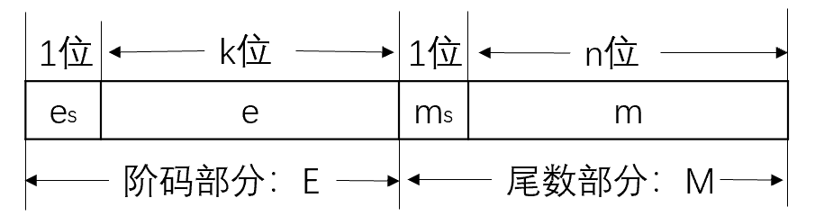

# 数制与编码

## 定点数的移位运算

### 算术移位

- 算术移位的对象是有符号数，在移位过程中符号位保持不变。

1. 对于正数，左移时，若高位丢1，则结果出错；右移时，若低位丢1，则影响精度。
2. 对于负数原码，左移时，若高位丢1，则结果出错；右移时，若低位丢1，则影响精度。
3. 对于负数补码，左移时，若高位丢0，则结果出错；右移时，若低位丢1，则影响精度。
4. 对于负数反码，左移时，若高位丢0，则结果出错；右移时，若低位丢0，则影响精度。

<table>
    <tr>
        <th></th>
        <th>码制</th>
        <th>填补代码</th>
    </tr>
    <tr>
        <td>正数</td>
        <td>原码、补码、反码</td>
        <td>0</td>
    </tr>
    <tr>
        <td rowspan="4">负数</td>
        <td>原码</td>
        <td>0</td>
    </tr>
    <tr>
        <td rowspan="2">补码</td>
        <td>左移补0</td>
    </tr>
    <tr>
        <td>右移补1</td>
    </tr>
    <tr>
        <td>反码</td>
        <td>1</td>
    </tr>
</table>

### 逻辑移位

- 逻辑移位将操作数视为无符号数。

1. 逻辑左移时，高位移丢，低位补0。
2. 逻辑右移时，低位移丢，高位补0。

### 循环移位

- 循环移位分为带进位标志CF的循环移位（大循环）和不带进位标志的循环移位（小循环），移出的数位又被移入数据中。

1. 若带进位循环左移，则将数据位连同进位标志一起移动，数据的最高位移入进位标志位CF，进位位则依次进入数据的最低位。
2. 若不带进位循环左移，则将数据位连同进位标志一起移动，数据的最高位分别移入进位标志位CF和数据的最低位。

> 适合将低字节的数据和高字节的交换。

 

## 定点数的加减运算

> 在机器中，小数点并不存在，只是人为约定的小数点位置。

### 补码加减运算

- 补码加减运算的公式（字长为n\+1），减法运算可视为与被减数（负数）的补码相加。

\[A\+B\]补 = \[A\]补 \+ \[B\]补  （mod 2n+1）

\[A\-B\]补 = \[A\]补 \+ \[\-B\]补  （mod 2n+1）

- 按二进制运算，逢二进一；符号位和数值位一起参与运算；最终运算结果的高位丢弃，保留n\+1位，运算结果仍然为补码。

### 补码加减运算电路

- 已知一个数的补码表示为Y，则这个数的负数的补码为$\overline{Y}$+1。只要在原加法器的Y输入端加n个反向器以实现各位取反的功能，之后加一个2选1多路选择器，用一个控制端Sub来控制，以选择是将Y输入加法器还是将y̅输入加法器，并把控制端Sub同时作为低位进位送到加法器。（可通过标志信息来区分带符号整数运算结果和无返回整数运算结果）

 

1. 零标志ZF=1，表示结果F为0。对无符号数和带符号数运算都有意义。
2. 溢出标志OF=1，表示带符号整数运算时发生溢出。对无符号数运算无意义。
3. 符号标志SF，表示结果的符号，即F的最高位。对无符号数运算无意义。
4. 进/借位标志CF=Sub&oplus;Cout，表示无符号整数运算时的进位/借位，判断是否发生溢出。加法时，若CF=1，则结果溢出，此时CF=Cout；减法时，若CF=1，则表示有借位（不够减），此时CF=Cout取反。对带符号数运算无意义。

### 补码溢出判别

- 仅当两个符号相同的数相加、两个符号相异的数相减才可能发生溢出。

#### 一位符号位

- 只要参加操作的两个操作数符号相同，而结果的符号与原操作数的符号不同，就判断结果溢出。

- 设A的符号为As、B的符号为Bs、运算结果的符号为Ss，则溢出逻辑表达式为。若V=0，则表示无溢出；若V=1，则表示结果溢出。

#### 双符号位（mod 4）

- 双符号位（模4补码）的溢出逻辑表达式为 V=Ss1&oplus;Ss2 。若V=0，则表示无溢出；若V=1，则表示结果溢出。

| 符号位 Ss1Ss2 | 溢出判断   |
| ----------------------------------- | ---------- |
| 00                                  | 正数无溢出 |
| 01                                  | 正溢出     |
| 10                                  | 负溢出     |
| 11                                  | 负数无溢出 |

#### 进位判断

- 溢出逻辑表达式为 V=Cs&oplus;C1 。若V=0，符号位的进位Cs与最高数位的进位C1相同，则表示无溢出；否则V=1，表示发生溢出。

## 定点数的乘除运算

### 定点数的乘法运算

- 乘法运算由累加和右移操作实现，分为原码一位乘法和补码一位乘法。

#### 原码一位乘法

- 原码一位乘法的符号位和数值为分开求，乘积的符号位由两个操作数的符号位‘’异或“得到，乘积的数值位是两个数的绝对值乘积。

- 设\[X\]原=xs\.x1x2...xn、\[Y\]原=ys\.y1y2...yn，则运算规则为：

1. 被乘数和乘数均取绝对值（数值位）运算；符号位单独运算xs&oplus;ys
2. 部分积是乘法过程的中间结果，初始值为0。乘数的每一位yi乘以被乘数得到X\*yi，并将该结果和之前的部分积相加，得到当前的部分积。（部分积由高位部分积和低位部分积拼接而成）
3. 从乘数的最低位yn开始判断，若yn=1，则部分积加上被乘数\|x\|，然后部分积都右移一位；若yn=0，则部分积加上0，然后部分积都右移一位。
4. 重复步骤3，判断n次（右移n次，n为字长-1）。

 

##### 无符号数乘法运算电路

#### 补码一位乘法（Booth算法）

- 补码一位乘法是有符号数的乘法，利用相加和相减计算补码数据的乘积。
- 设\[X\]补=xs\.x1x2...xn、\[Y\]补=ys\.y1y2...yn，则运算规则为：

1. 符号位参与运算，运算的数均为补码表示。
2. 被乘数一般取双符号位参与运算；<a href="#部分积">部分积</a>取双符号位，初始值为0；乘数取单符号位。
3. 乘数末位增设附加位yn+1，初始值为0。
4. 根据（yn, yn+1）的取值来确定操作，按补码移位规则移位。

| yn（高位） | yn+1（低位） | 操作                                  |
| --------------------- | ----------------------- | ------------------------------------- |
| 0                     | 0                       | 部分积右移一位                        |
| 0                     | 1                       | 部分积加\[x\]补，右移一位  |
| 1                     | 0                       | 部分积加\[-x\]补，右移一位 |
| 1                     | 1                       | 部分积右移一位                        |

5. 重复以上步骤n+1次，第n\+1步不再移位（共n\+1次累加、n次右移），仅根据yn和yn+1的比较结果做相应运算。

 

##### 补码乘法运算电路

### 定点数的除法运算

- 除法运算可转换为“累加\-左移”（逻辑左移），分为原码除法和补码除法。

- 符号扩展将带符号的定点数转换成不同位数的表示。

1. 正数的符号扩展，符号位不变，扩展位使用0填充。
2. 原码负数的符号扩展，与正数相同。
3. 补码负数的符号扩展，原有的符号位移动至新符号位，附加位整数使用1填补，小数使用0填补。

#### 原码除法运算（不恢复余数法）

- 原码不恢复余数法（原码加减交替除法），商符和商值是分开进行的。
- 设被除数\[X\]原=xs\.x1x2...xn、\[Y\]原=ys\.y1y2...yn

1. 商符：Qs=xs&oplus;ys
2. 商值：\|Q\|=\|X\|/\|Y\|

- 求\|Q\|的不恢复余数法运算

1. 先用被除数减去除数（\|X\|-\|Y\|=\|X\|+(\-\|Y\|)=\[X\]+\[\-\|Y\|\]补），当余数为正时，商末位加上1，余数和商左移一位，再减去余数；当余数为负时，商末位加上0，余数和商左移一位，再加上余数。（包括符号位移动）
2. 第n+1步余数为负时，需要加上\|Y\|以得到第n\+1步正确的余数（余数与被除数同号）。

 

#### 补码除法运算（加减交替法）

- 补码一位除法，符号位和数值位一起参与运算，商符自然形成。除法第一步根据被除数和除数的符号决定加法或减法。上商的原则根据余数和除数和符号位决定。

1. 符号位参与运算，除数、被除数、商、余数使用补码表示。
2. 若被除数与除数同号，则被除数减去除数；若被除数和除数异号，则被除数加上除数。
3. 若余数与除数同号，则商上1，余数左移一位减去除数；若余数与除数异号，则商上0，余数左移一位加上除数。
4. 重复第3步n次。
5. 若对商的精度没有特殊要求，则一般采用“末位恒置1”。

 

##### 除法运算电路

# 浮点数

## 浮点数的表示

- 浮点数以适当的形式将比例因子表示在数据中，让小数点的位置根据需要而浮动，即扩大了数的范围，又保持了数的有效精度。

$$
N= (-1)^S \times M \times r^E
$$

 

- 阶码的值反映浮点数的小数点的实际位置；阶码的位数反映浮点数的表示范围；尾数的位数反映浮点数的精度。

1. r（基数，浮点数阶码的底），通常r=2，在浮点数中隐含。r增大，可表示数的范围增大、可表示数的个数增加、数在数轴上的分布密度越稀疏、可表示数的精度下降、降低因尾数右移导致的运算精度损失、使运算中移位的次数减少，提高运算速度

2. E（阶码，Exponent），定点整数（移码/补码）。浮点数的指数部分，数量级、小数点的位置。

3. M（尾数，Mantissa），定点小数（原码/补码）。浮点数的小数部分，精度。尾数位数决定浮点数的有效数位，有效数位越多，数据的精度越高。

### 浮点数的表示范围

- 浮点数的表示范围是关于原点对称的。

1. 上溢，运算结果大于最大正数时为正上溢，小于绝对值最大负数时为负上溢。数据一旦产生上溢，计算机必须中断运算操作，进行溢出处理。
2. 下溢，运算结果在0\~最小正数之间时为正下溢，在0\~绝对值最小负数之间时为负下溢。数据下溢时，浮点数值趋于零，计算机仅将其动作机器零处理。

 

## 浮点数规格化

- 浮点数规格化，调整一个非规格化浮点数的尾数和阶码的大小，使非零的浮点数在尾数的最高数位上保证是一个有效值。浮点数的表示形式不唯一，需要找到规格化浮点数。

1. 左规，运算结果的尾数的最高数位不是有效位时，可能需要多次左规，尾数每左移一位、阶码减1（基数为2）。
2. 右规，运算结果的尾数的有效位进到小数点前时，需要且只需一次右规，尾数右移一位、阶码加1（基数为2）。

- 规格化浮点数的尾数M的绝对值应满足 1/r &le;\|M\| &le; 1。当浮点数尾数的基数为2时，原码规格化的尾数最高位一定是1；当基数为4时，原码规格化形式的尾数最高两位不全为0。

## IEEE 754 标准

 

- IEE754标准规定常用的浮点数格式有短浮点数（单精度、float型）、长浮点数（双精度、double型）、临时浮点数，其基数隐含为2。IEEE754标准的浮点数（除临时浮点数之外）是尾数用采取隐藏位策略的原码表示，且阶码用移码表示的浮点数。
- 对于规格化的二进制浮点数，数值的最高位总是1，为了使得尾数多表示一位有效数值，隐藏该最高位的1。故23位的尾数实际表示24位有效数字。

<table>
    <tr>
        <th rowspan="2">类型</th>
        <th rowspan="2">数符</th>
        <th rowspan="2">阶码</th>
        <th rowspan="2">尾数</th>
        <th rowspan="2">总位数</th>
        <th colspan="2">偏置值</th>
        <th rowspan="2">真值</th>
        <th rowspan="2">最小值</th>
        <th rowspan="2">最大值</th>
    </tr>
    <tr>
        <td>HEX</td>
        <td>DEC</td>
    </tr>
    <tr>
        <td>短浮点数 （单精度）</td>
        <td>1</td>
        <td>8</td>
        <td>23</td>
        <td>32</td>
        <td>7FH</td>
        <td>127</td>
        <td>(-1)Sx1.Mx2E-127</td>
        <td>E=1，M=0 2-126</td>
        <td>E=254，M=2127 2127x(2-2-23)</td>
    </tr>
    <tr>
        <td>长浮点数 （双精度）</td>
        <td>1</td>
        <td>11</td>
        <td>52</td>
        <td>64</td>
        <td>3FFH</td>
        <td>1023</td>
        <td>(-1)Sx1.Mx2E-1023</td>
        <td>E=1，M=0 2-1022</td>
        <td>E=2046，M=21023 21023x(2-2-52)</td>
    </tr>
    <tr>
        <td>临时浮点数</td>
        <td>1</td>
        <td>15</td>
        <td>64</td>
        <td>80</td>
        <td>3FFFH</td>
        <td>16383</td>
        <td></td>
        <td></td>
        <td></td>
    </tr>
</table>

<table>
    <tr>
        <th rowspan="2">值的类型</th>
        <th colspan="4">单精度</th>
        <th colspan="4">双精度</th>
    </tr>
    <tr>
        <th>符号</th>
        <th>阶码</th>
        <th>尾数</th>
        <th>值</th>
        <th>符号</th>
        <th>阶码</th>
        <th>尾数</th>
        <th>值</th>
    </tr>
    <tr>
        <td>正零</td>
        <td>0</td>
        <td>0</td>
        <td>0</td>
        <td>0</td>
        <td>0</td>
        <td>0</td>
        <td>0</td>
        <td>0</td>
    </tr>
    <tr>
        <td>负零</td>
        <td>1</td>
        <td>0</td>
        <td>0</td>
        <td>-0</td>
        <td>1</td>
        <td>0</td>
        <td>0</td>
        <td>-0</td>
    </tr>
    <tr>
        <td>正无穷大</td>
        <td>0</td>
        <td>255（全1）</td>
        <td>0</td>
        <td>&infin;</td>
        <td>0</td>
        <td>2047（全1）</td>
        <td>0</td>
        <td>&infin;</td>
    </tr>
    <tr>
        <td>负无穷大</td>
        <td>1</td>
        <td>255（全1）</td>
        <td>0</td>
        <td>-&infin;</td>
        <td>1</td>
        <td>2047（全1）</td>
        <td>0</td>
        <td>-&infin;</td>
    </tr>
</table>
- 浮点数运算结果超过尾数并不一定溢出，只有规格化后阶码超出所能表示的范围后，才发生溢出。

## 浮点数的加减运算

- 浮点数运算的阶码和尾数分开进行。

1. 对阶，使两个操作数的小数点位置对齐（阶码相等）。以小阶向大阶看齐的原则，将阶码小的尾数右移一位（基数为2），阶加1，直到两个数的阶码相等为止。尾数右移时，若舍弃有效位，则会产生误差，影响精度。
2. 尾数求和，将对阶后的尾数按定点数规则运算。运算后的尾数不一定是规格化的，需要再次[规格化](#规格化)。
3. 舍入，对阶和尾数右规时，可能会对尾数右移，一般将低位移出的两位保留，参加中间过程的运算，最后将运算结果进行舍入，还原为IEE754标准浮点数。（1）0舍1入法，若运算结果保留位的最高位为0，则舍去；若保留位的最高位为1，则尾数末位加1，可能导致尾数溢出，若溢出，则再次右规。（2）恒置1法，将右移后的尾数末位恒置1。（3）截断法，直接截断所需的位数，丢弃后面的所有位。
4. 溢出判断，（1）右规和尾数舍入时，需要判断是否发生了指数上溢；（2）左规时，需要判断是否发生了指数下溢。
