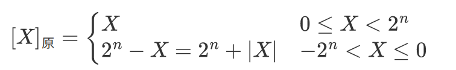

# 数制与编码

## 进位计数法

- 进位计数法，基数是每个数位所用到的不同数码的个数（十进制的基数为10，逢十进一），位权是与数码本身相关的参数，一个进位数所表示的数值是其各位数码按权相加。一个r进制数（KnKn-1...K0K-1...K-m）的数值可表示为Knrn+Kn-1rn-1+...+K0r0+K-1r-1+...+K-mr-m，其中r是基数，ri是第i位的位权（整数位最低位规定为第0位），Ki的取指可以是0,1,...,r-1共r个数码中的任意一个。

1. 二进制只有0和1两种数字符号，逢二进一，基数r=2，位权为2i。
2. 八进制只有0\~7的数字符号，逢八进一，基数r=8=23，只要将二进制的3位数码编为一组就是一个八进制数码。
3. 十六进制只有0\~9、A、B、C、D、E、F的符号，逢十六进一，基数r=16=24，只要将二进制的4位数码编为一组就是一个十六进制数码。

- BCD码（Binary\-Coded Decimal）通常采用4位二进制来表示一位十进制数中的0\~9，使得二进制数和十进制数之间的转换得以快速进行。但4位二进制数可组合出16种代码，故必有6种状态为冗余状态。

1. 8421码，设其各位的数值为b3、b2、b1、b0，位权从高到低依次为8、4、2、1，表示的十进制数D=8b3+4b2+2b1+1b0。若两个8421码相加之和小于等于(1001)2即(9)10，则不需要修正；若两个相加之和大于等于(1010)2即(10)10，则加6修正（从1010\~1111这6个为无效码），并向高位进位。
2. 余3码，在8421码的基础上加(0011)2形成，每个数都多余3。
3. 2421码，权值由高到低分别为2、4、2、1，大于等于5的4位二进制码中的最高位为1，小于5的最高位为0。

## 进制转换

### 二进制转换八进制/十六进制

- 对于一个二进制混合数（包含整数和小数部分），转换时以小数点为界。

1. 整数部分，从小数点开始往左数，将一串二进制数分为3位一组（八进制）、4位一组（十六进制），根据情况在最左边补0。
2. 小数部分，从小数点开始往右数，将一串二进制数分为3位一组（八进制）、4位一组（十六进制），根据情况在最右边补0。

- 八进制/十六进制\-\>二进制同理，每组分解为3位（八进制）、4位（十六进制）。

### 十进制\-\>任意进制

- 十进制数转换为任意进制数，采用基数乘除法，对整数部分使用除基取余法，对小数部分使用乘基取整法。

1. 除基取余法（整数部分），整数部分除基取余，最先取得的余数为数的最低位，商为0时结束。

2. 乘基取整法（小数部分），小数部分乘基取整，最先取得的整数为数的最高位，乘积为1.0时结束，或满足精度要求即可。

> 并非所有十进制小数都可以准确地用二进制小数表示。

 

# 定点数的编码表示

- 由小数点的位置是否固定，分为定点表示和浮点表示。现代计算机通常使用定点补码整数表示整数，定点原码小数表示浮点数的尾数部分，移码表示浮点数的阶码部分。

## 机器数的定点表示

- 真值：带符号（+、-）的数。
- 机器数：符号数字化（用0、1表示符号）的数，按机器的字长补足位数（补0）。

1. 定点小数是纯小数，约定小数点位置在符号位之后、有效值部分最高位之前。

 

2. 定点整数是纯整数，约定小数点位置在有效数值部分最低位之后。

 

## 原码、补码、反码、移码

### 原码

- 原码表示法用机器数的最高位表示数的符号（0正数、1负数），其余各位表示数的绝对值。

1. 纯小数，若字长为n+1，则原码小数的表示范围为 \- (1\-2-n) &le; x &le; 1 - 2-n（关于原点对称）。

 

2. 纯整数，若字长为n+1，则原码小数的表示范围为 \- (2n-1) &le; x &le; 2n-1（关于原点对称）。

 

3. 真值0的原码表示有正0和负0两种，\[\+0\]原=00000、\[\-0\]原=10000。

### 补码

- 补码表示法中的加减运算统一采用加法操作实现，使负数通过与其同余的整数来表示。

> - 同余：整数A和B在以M为模时相等：A = B (mod M).。
>   - 5 = 17 (mode 12)、-2 = 10 (mod 12)。
> - 同余的两个数具有互补关系：通过与负数等价的正数来表示。
>   - 9 - 5 = 9 + (-5) = 9 + (12 - 5) = 4 (mod 12)。

1. 纯小数，若字长为n+1，则补码小数的表示范围为 \-1 &le; x &le; 1\-2-n（比原码多表示\-1）。

 

2.  纯整数，若字长为n+1，则补码整数的表示范围为 -2n &le; x &le; 2n-1（比原码多表示-2n）。

 

3. 真值0的补码表示只有一种，\[\+0\]补 = \[\-0\]补 = 0\.0000。

- 将\[X\]补的符号位与数值位一起右移并保持符号位不变，可实现除法。
- 补码转换为真值，若为正数，则去除符号位即可；若为负数，真值的数值部分各位可由原码“各位取反，末位加1”得到。

- 模4补码，双符号位的补码小数，双符号位00表示正，11表示负，用于完成算术运算的ALU部件。

 

### 反码

1. 纯小数

 

2. 纯整数，表示范围比补码少一个2-n

 

- 真值0的反码表示不唯一，\[\+0\]反=00000、\[\-0\]反=11111。

### 移码

- 移码只能表示整数，常用作浮点数的阶码。补码在真值X上加上一个偏置值，通常为2n，相等于X在数轴上偏移了若干个单位。

\[X\]移 = 2n + x       (-2n &le; x &le; 2n，字长为n+1)

1. 真值0的补码表示只有一种，\[\+0\]补 = \[\-0\]补 = 2n+0 = 10000。
2. 移码和补码只相差一个符号位，补码的符号位取反即为移码。
3. 移码全0时，对应真值的最小值-2n；移码全1时，对应真值的最大值2n-1。
4. 移码保持了真值原有的大小顺序。

## 无符号数、有符号数

- 无符号数由寄存器的位数反映表示范围。
- 有符号数分为数值和符号两部分，最高位表示符号。在计算机中，带符号整数都是补码表示。

# 运算方法与运算电路

## 基本运算部件

### 一位全加器

- 全加器（FA）是最基本的加法单元，有加数Ai、加数Bi、低位传来的进位Ci-1共3个输入，有本位和Si、向高位的进位Ci共2个输出。
- 全加器的逻辑表达式

1. 和表达式：Si=Ai&oplus;Bi&oplus;Ci-1
2. 进位表达式：Ci=AiBi \+ (Ai&oplus;Bi)Ci-1

 

### 串行进位全加器

- 串行进位全加器，把n个全加器相连可得到n位加法器。串行进位（行波进位）的每级进位直接依赖于前一级的进位，即进位信号是逐级形成的。

 

-  串行进位加法器实现了两个二进制数A=AnAn-1...A1、B=BnBn-1>...B1逐相加的功能，得到的二进制和S=SnSn-1...S1，进位输出Cn。由于位数有限，高位自动丢失，本质上是模2n的加法运算。
- 串行进位加法器的最长运算时间主要由进位信号的传递时间决定，位数越多，延迟越高，低位运算产生进位所需的时间影响高位运算的时间。

### 并行进位加法器

- 令Gi=

### 带标志加法器

### ALU 算术逻辑单元

## 定点数的移码运算

## 定点数的加减运算

## 定点数的乘除运算

# 定点表示、浮点表示

## 定点表示法

- 所有数据的小数点位置固定不变：
  - 定点小数（纯小数）：小数点隐含在最高有效数位之前、符号位之后。
  - 定点整数（纯整数）：小数点隐含在最低有效数位之后。
- 参加运算的数和结果都必须保证落在该定点数所能表示的数值范围，否则溢出。

### 定点小数

### 定点整数

## 浮点表示法

$$
N = M \times r^E
$$

- r：浮点数阶码的底，通常r=2，在浮点数中隐含。
- E：阶码 Exponent，纯整数（移码/补码）。浮点数的指数部分，数量级、小数点的位置。
- M：尾数 Mantissa，纯小数（原码/补码）。浮点数的小数部分，精度。

 

## 尾数基数 r

**对浮点数的影响**

- r增大：

1. 可表示数的范围增大
2. 可表示数的个数增加
3. 数在数轴上的分布密度越稀疏
4. 可表示数的精度下降
5. 降低因尾数右移导致的运算精度损失
6. 使运算中移位的次数减少，提高运算速度

## 浮点数规格化

- 规格化：规定尾数的最高数位必须是一个有效值。
- 浮点数的表示形式不唯一：需要找到规格化浮点数。

**规格化浮点数 M的绝对值范围**

$$
\frac{1}{r} \le |M| < 1
$$

## IEEE 754 标准浮点数
