# 数制与编码

## 进位计数法与其转换

### 进位计数法

#### 进位计数法（进制）

- 进位计数法，基数是每个数位所用到的不同数码的个数（十进制的基数为10，逢十进一），位权是与数码本身相关的参数，一个进位数所表示的数值是其各位数码按权相加。一个r进制数（KnKn-1...K0K-1...K-m）的数值可表示为Knrn+Kn-1rn-1+...+K0r0+K-1r-1+...+K-mr-m，其中r是基数，ri是第i位的位权（整数位最低位规定为第0位），Ki的取指可以是0,1,...,r-1共r个数码中的任意一个。

<table>
    <tr>
        <th>进制</th>
        <th>后缀</th>
        <th>描述</th>
    </tr>
    <tr>
        <td width="15%">二进制 binary</td>
        <td width="5%">B</td>
        <td width="80%">二进制只有0和1两种数字符号，逢二进一，基数r=2，位权为2i。</td>
    </tr>
    <tr>
        <td>八进制 Oct</td>
        <td>O</td>
        <td>八进制只有0~7的数字符号，逢八进一，基数r=8=23，只要将二进制的3位数码编为一组就是一个八进制数码。</td>
    </tr>
    <tr>
        <td>十六进制 HEX</td>
        <td>H</td>
        <td>十六进制只有0~9、A、B、C、D、E、F的符号，逢十六进一，基数r=16=24，只要将二进制的4位数码编为一组就是一个十六进制数码。</td>
    </tr>
</table>

#### 二进制的优势

- 在计算机系统内部，所有信息都是用二进制进行编码：

1. 二进制只有两种状态，使用有两个稳定状态的物理器件就可以表示二进制数的每一位，制造成本比较低，例如高低电平、电荷的正负极性可以表示0和1。
2. 二进制位1和0正好和逻辑值“真”和“假”相对应，为计算机实现逻辑运算和程序中的逻辑判断提供了便利条件。
3. 二进制的编码和运算规则都很简单，通过逻辑门电路能方便地实现算术运算。

#### BCD码

- BCD码（Binary\-Coded Decimal）通常采用4位二进制来表示一位十进制数中的0\~9，使得二进制数和十进制数之间的转换得以快速进行。但4位二进制数可组合出16种代码，故必有6种状态为冗余状态。

<table>
    <tr>
        <td width="10%" rowspan="3">8421码</td>
        <td width="90">8421码设其各位的数值为b3、b2、b1、b0，位权从高到低依次为8、4、2、1，表示的十进制数D=8b3+4b2+2b1+1b0。</td>
    </tr>
    <tr>
        <td>若两个8421码相加之和小于等于(1001)2即(9)10，则不需要修正。</td>
    </tr>
    <tr>
        <td>若两个相加之和大于等于(1010)2即(10)10，则加6修正（从1010~1111这6个为无效码），并向高位进位。</td>
    </tr>
    <tr>
        <td>余3码</td>
        <td>在8421码的基础上加(0011)2形成，每个数都多余3。</td>
    </tr>
    <tr>
        <td>2421码</td>
        <td>权值由高到低分别为2、4、2、1。大于等于5的4位二进制码中的最高位为1，小于5的最高位为0。</td>
    </tr>
</table>

### 不同进制间的转换

#### 二进制&rarr;八进制/十六进制

- 对于一个二进制混合数（包含整数和小数部分），转换时以小数点为界。

1. 整数部分，从小数点开始往左数，将一串二进制数分为3位一组（八进制）、4位一组（十六进制），根据情况在最左边补0。
2. 小数部分，从小数点开始往右数，将一串二进制数分为3位一组（八进制）、4位一组（十六进制），根据情况在最右边补0。

- 八进制/十六进制&rarr;二进制同理，每组分解为3位（八进制）、4位（十六进制）。

#### 十进制&rarr;任意进制

- 十进制数转换为任意进制数，采用<b>基数乘除法</b>，对整数部分使用除基取余法，对小数部分使用乘基取整法。但并非所有十进制小数都可以准确地用二进制小数表示。

<table>
    <tr>
        <td width="25%">除基取余法（整数部分）</td>
        <td width="75%">整数部分除基取余，最先取得的余数为数的最低位，商为0时结束。</td>
    </tr>
    <tr>
        <td>乘基取整法（小数部分）</td>
        <td>小数部分乘基取整，最先取得的整数为数的最高位，乘积为1.0时结束，或满足精度要求即可。</td>
    </tr>
</table>
 

## 定点数

### 真值和机器数

<table>
    <tr>
        <td width="10%">真值</td>
        <td width="90%">带符号（+、-）的数（可以是二进制数、十进制数等进制，为方便和机器数的计算，通常使用二进制）</td>
    </tr>
    <tr>
        <td rowspan="2">机器数</td>
        <td>符号数字化（用0、1表示符号）的数，按机器的字长补足位数（补0）</td>
    </tr>
    <tr>
        <td>常用的有原码、补码、反码表示法等</td>
    </tr>
</table>

### 机器数的定点表示（定点小数与定点整数）

- 由小数点的位置是否固定，分为定点表示和浮点表示。现代计算机通常使用如下方式表示：

1. 定点补码整数表示整数。
2. 定点原码小数表示浮点数的尾数部分，移码表示浮点数的阶码部分。

<table>
    <tr>
        <td width="12%"  rowspan="2">定点小数 （纯小数）</td>
        <td width="88%">定点小数是纯小数，约定小数点位置在符号位之后、有效值部分最高位之前。</td>
    </tr>
    <tr>
        <td></td>
    </tr>
    <tr>
        <td rowspan="2">定点整数 （纯整数）</td>
        <td>定点整数是纯整数，约定小数点位置在有效数值部分最低位之后。</td>
    </tr>
    <tr>
        <td></td>
    </tr> 
</table>

- 机器内部实际上并不存在小数点，只是人为约定了小数点的位置。因此，在定点数的编码和运算中，只需要考虑符号位和数值位即可。

### 原码、补码、反码、移码

#### 原码

##### 原码表示法

- 原码表示法用机器数的最高位表示数的符号（0正数、1负数），其余各位表示数的绝对值。

1. 纯小数，若字长为n+1，则原码小数的表示范围为 \- (1\-2-n) &le; x &le; 1 - 2-n（关于原点对称）。

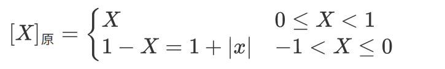 

2. 纯整数，若字长为n+1，则原码小数的表示范围为 \- (2n-1) &le; x &le; 2n-1（关于原点对称）。

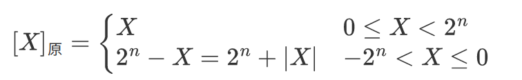 

##### 原码表示的特点

- 原码表示的优点：

1. 与真值的对应关系简单、直观，与真值的转换简单。
2. 用原码实现乘除运算比较简便。

- 原码表示的缺点：

1. 0的表示不唯一，真值0的原码表示有正0和负0两种编码，\[\+0\]原=00000、\[\-0\]原=10000。
2. 原码加减运算复杂。在原码加减运算中，对于两个不同符号数的加法（或同符号数的减法），先要比较两个数的绝对值大小，然后用绝对值大的数减去绝对值小的数，最后为结果选择合适的符号。

#### 补码

##### 补码表示法

1. 纯小数，若字长为n+1，则补码小数的表示范围为 \-1 &le; x &le; 1\-2-n（比原码多表示\-1）。

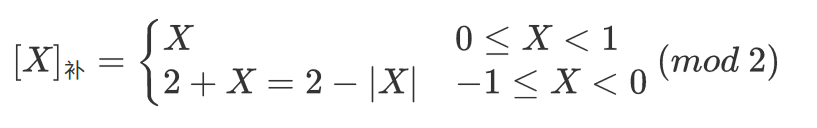 

2.  纯整数，若字长为n+1，则补码整数的表示范围为 -2n &le; x &le; 2n-1（比原码多表示-2n）。

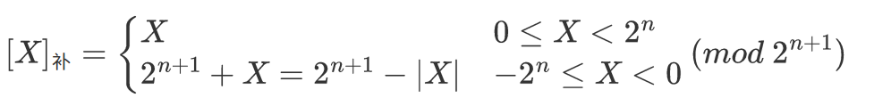 

##### 补码的特点

1. 真值0的补码表示只有一种编码，\[\+0\]补 = \[\-0\]补 = 0\.0000。
2. 将\[X\]补的符号位与数值位一起右移并保持符号位不变，可实现除法。
3. 补码转换为真值，若为正数，则去除符号位即可；若为负数，真值的数值部分各位可由原码“各位取反，末位加1”得到。

##### 补码与真值的转换

- 真值&rarr;补码 （补码表示法的应用）

1. 对于正数，与原码的方式一样。
2. 对于负数，符号位取1，其余各位由真值 “各位取反，末位加1”得到。

- 补码&rarr;真值

1. 若符号位为0，则与原码的方式一样。
2. 若符号位为1，则真值的符号为负，数值部分由补码“各位取反，末位加1”得到。

##### 模运算

- [补码表示法中的加减运算](#补码的加减运算)统一采用加法操作实现，使负数通过与其同余的整数来表示。也就是，负数取反加1可以得到对应的正数，反之亦然。

1. 同余：整数A和B在以M为模时相等，<code>A = B (mod M)</code>。例如 5 = 17 (mode 12)、-2 = 10 (mod 12)。
2. 同余的两个数具有互补关系，通过与负数等价的正数来表示，也就是可以通过加法来表示减法 <code>[A]补-[B]补 = [A]补+M-[B]补 = [A]补+[-B]补</code>。例如 9 - 5 = 9 + (-5) = 9 + (12 - 5) = 4 (mod 12)。

##### 模4补码

- <a href="#mod4">模4补码</a>，双符号位的补码小数，双符号位00表示正，11表示负，更容易检查加减算法的溢出，用于完成算术运算的ALU部件。每个模4补码存储时只需要1个符号位。

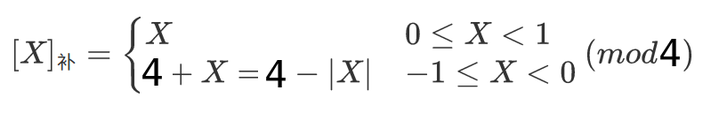 

#### 反码

##### 反码表示法

1. 纯小数

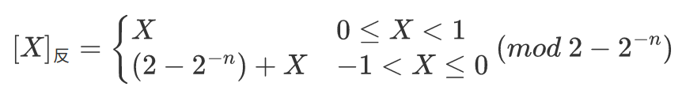 

2. 纯整数，表示范围比补码少一个2-n

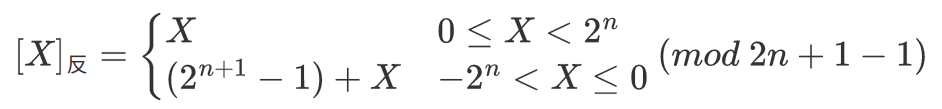 

##### 反码的特点

1. 真值&rarr;反码表示，可采用符号位取1，并对真值的“各位取反”来得到。因此，负数反码的定义就是在相应的补码表示中再末位减1。
2. 正数反码的定义和相应的补码（或原码）表示相同。

- 反码表示的缺点：

1. 真值0的反码表示不唯一，\[\+0\]反=00000、\[\-0\]反=11111。
2. 表示范围比补码少一个最小负数。
3. 反码在计算机中很少使用，通常用作数码变换的中间表示形式。

#### 移码

##### 移码表示法

1. 移码只能表示整数，常用作浮点数的阶码。
2. 补码在真值X上加上一个偏置值，通常为2n，相等于X在数轴上偏移了若干个单位。

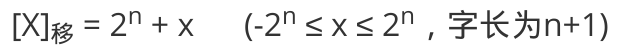 

##### 移码的特点

1. 真值0的移码表示只有一种，\[\+0\]移 =  2n+0  = \[\-0\]移 =  2n-0 = 10000。（n个0，机器字长为n+1）
2. 一个真值的移码和补码只相差一个符号位，补码的符号位取反即为移码。
3. 移码全0时，对应真值的最小值-2n；移码全1时，对应真值的最大值2n-1。
4. 移码保持了真值原有的大小顺序，移码的大小对应了真值的大小。

#### [x]原 [x]补 [x]反 [x]移 的对比

1. 原码、补码、反码的符号位相同，正数的机器码相同。
2. 原码、反码的表示在数轴上对称，二者都存在+0和-0两种编码。
3. 补码、移码的表示在数轴上不对称，零的表示唯一，比原码、反码多表示一个数。
4. 整数的补码、移码的符号位相反，数值位相同。
5. 负数的补码、反码末位差1。
6. 原码很容易判断大小；而负数的补码、反码很难直接判断大小。因此，补码和反码对于负数，数值位部分越小，其绝对值越大，就越小。

## 整数的表示

### 无符号(整)数

- 当一个编码的全部二进制位均为数值位，而没有符号位时，该编码表示就是<b>无符号数</b>。

1. 无符号数默认数的符号为正，不能表示负数。
2. 无符号数省略了一个符号位，在字长相同的情况下，可以比有符号数多一个数值位。也就是字长相同的无符号数比有符号数表示的最大值要大。
3. 无符号数由寄存器的位数反映表示范围。
4. 无符号数通常用于地址运算或表示指针。

### 有符号(整)数

- 将符号数值化，并将符号位放在有效数字的前面，就是<b>有符号数</b>。也就是说，有符号数分为数值和符号两部分，最高位表示符号。
- 在计算机中，带符号整数都是补码表示，表示范围为<code>-2n-1~2n-1-1</code>。优势如下：

1. 与原码和反码相比，0的补码表示唯一。
2. 与原码和移码相比，补码运算规则比较简单，且符号位可以和数值位一起参加运算。
3. 与原码和反码相比，补码比原码和反码多表示一个最小负数。

### [C语言的整数类型与类型转换](../C/基础配置与语法.md)

#### C语言的整型数据类型

1. C语言的整型数据就是定点整数，根据位数的不同，分为char(8)、short(16)、int(16/32)、long(32)。
2. char默认是unsigned，而short、int、 long等默认是signed。
3. C语言的整形数据类型是按<b>补码</b>形式存储的。signed（有符号数）的最高位是符号位；unsigned（无符号数）的最高位仍然是数值位。

#### 有符号数与无符号数的转换

1. C语言的强制类型转换的结果是保持位值不变，而改变了解释这些位的方式。例如符号位被解释为数值位。
2. 若无符号数和有符号数一起参与运算，则C标准规定按无符号数进行运算。

#### 零扩展与符号扩展

1. 如果是占用空间更大的数据类型转换位占用空间更小的数据类型，则可能发生数据丢失问题（高位截断）。
2. 如果是占用空间更小的数据类型转换位占用空间更大的数据类型，则根据是否有符号位，分别进行零扩展与符号扩展。（这和补码的运算有关）
   1. 若原数字是无符号数，则进行<b>零扩展</b>。扩展后的高位部分用0填充。
   2. 若原数字是有符号数，则进行<b>符号扩展</b>，扩展后的高位部分用原数字的符号位填充。

# 运算方法和运算电路

## 基本运算部件

### [运算器](组成原理概述.md)

- 在计算机中，运算器由ALU（Arithmetic Logic Unit，算术逻辑单元）、移位器、PSW（状态寄存器）和GPRs（通用寄存器组）等组成。

1. 运算器的基本功能包括加、减、乘、除四则运算，与、或、非、异或等逻辑运算，以及移位、求补等操作。
2. ALU的核心部件是加法器。

### 加法器

#### 一位全加器

- 全加器（FA）是最基本的加法单元，有加数Ai、加数Bi、低位传来的进位Ci-1共3个输入，有本位和Si、向高位的进位Ci共2个输出。
- 全加器的逻辑表达式

1. 和表达式：Si=Ai&oplus;Bi&oplus;Ci-1
2. 进位表达式：Ci=AiBi \+ (Ai&oplus;Bi)Ci-1

 

#### 串行进位全加器

- 串行进位全加器，把n个全加器相连可得到n位加法器。串行进位（行波进位）的每级进位直接依赖于前一级的进位，即进位信号是逐级形成的。

 

-  串行进位加法器实现了两个二进制数A=AnAn-1...A1、B=BnBn-1>...B1逐相加的功能，得到的二进制和S=SnSn-1...S1，进位输出Cn。由于位数有限，高位自动丢失，本质上是模2n的加法运算。
-  串行进位加法器的最长运算时间主要由进位信号的传递时间决定，位数越多，延迟越高，低位运算产生进位所需的时间影响高位运算的时间。

#### 并行进位加法器

- 令Gi=AiBi，Pi=Ai&oplus;Bi，全先行进位加法器的进位表达式Ci=Gi\+PiCi-1，通过CLA部件（先行进位部件、超前进位部件）实现，各个进位都是并行产生的。Ci仅与Ai、Bi、最低进位C0有关，相互之间的进位没有依赖关系（与位数无关）。只要Ai、Bi、最低进位C0都到达即可几乎同时形成C1\~C4，并同时生成各位的和。

1. Gi=AiBi为进位产生函数（本地进位），Ai与Bi均为1时，Ci=1，有进位信号产生。
2. Pi=Ai&oplus;Bi为进位传递函数（进位传递条件），

C1=G1+P1C0

C2=G2+P2C1=G2+P2G1+P2P1C0

C3=G3+P3C2=G3+P3G2+P3P2G1+P3P2P1C0

C4=G4+P4C3=G4+P4G3+P4P3G2+P4P3P2G1+P4P3P2P1C0

 

 

#### 带标志加法器

- 无符号数加法器只能用于两个无符号数相加，不能进行有符号数的加/减运算。为了进行有符号数的加/减运算，还需要在无符号数加法器的基础上增加相应的逻辑门电路，使得加法器不仅能计算和/差，还要能生成相应的标志信息。

1. 溢出标志的逻辑表达式为OF=Cn&oplus;Cn-1
2. 符号标志就是和的符号，SF=Fn-1
3. 零标志ZF=1，当且仅当F=0
4. 进位/借位标志CF=Cout&oplus;Cin。即Cin=0时，CF为进位Cout；Cin=1时，CF为进位Cout取反

 

### [ALU 算术逻辑单元](./组成原理概述.md)

- ALU是一种功能较强的组合逻辑电路，能进行多种算术运算和逻辑运算（包括移位操作），核心是带标志加法器（所有加减乘除运算都能最终归结为加法运算）。
- ALU的基本结构：

1. A、B是两个n位操作数输入端
2. Cin是进位输入端
3. ALUop是操作控制端（发出控制信号），决定ALU执行的处理功能，其位数决定了操作的种类数量（2n）。

 

## 定点数的移位运算

### 逻辑移位

- 逻辑移位将操作数视为无符号数。

1. 逻辑左移时，高位移丢，低位补0。如果高位的1被移出，则发生溢出。
2. 逻辑右移时，低位移丢，高位补0。

### 算术移位

- 算术移位的对象是有符号数，在移位过程中符号位保持不变。

1. 对于正数，左移时，若高位丢1，则结果出错；右移时，若低位丢1，则影响精度。
2. 对于负数原码，左移时，若高位丢1，则结果出错；右移时，若低位丢1，则影响精度。
3. 对于负数补码，左移时，若高位丢0，则结果出错；右移时，若低位丢1，则影响精度。
4. 对于负数反码，左移时，若高位丢0，则结果出错；右移时，若低位丢0，则影响精度。

- 计算机内的有符号数都是补码表示的，因此，对于有符号数的移位操作应该采用<b>补码算术移位</b>方式。

<table>
    <tr>
        <th width="10%"></th>
        <th width="10%">码制</th>
        <th width="80%">填补代码</th>
    </tr>
    <tr>
        <td>正数</td>
        <td>原码 补码 反码</td>
        <td>0</td>
    </tr>
    <tr>
        <td rowspan="4">负数</td>
        <td>原码</td>
        <td>0</td>
    </tr>
    <tr>
        <td rowspan="2">补码</td>
        <td>左移补0</td>
    </tr>
    <tr>
        <td>右移补1</td>
    </tr>
    <tr>
        <td>反码</td>
        <td>1</td>
    </tr>
</table>

### 循环移位

- 循环移位分为带进位标志CF的循环移位（大循环）和不带进位标志的循环移位（小循环），移出的数位又被移入数据中。

1. 若带进位循环左移，则将数据位连同进位标志一起移动，数据的最高位移入进位标志位CF，进位位则依次进入数据的最低位。
2. 若不带进位循环左移，则将数据位连同进位标志一起移动，数据的最高位分别移入进位标志位CF和数据的最低位。

> 适合将低字节的数据和高字节的交换。

 

## 定点数的加减运算

- 在机器中，小数点并不存在，只是人为约定的小数点位置。

### 补码的加减运算

#### <a href="#补码的模运算">补码加减运算规则</a>

- 计算机采用的大多是补码加减运算。
- 补码加减运算的公式（字长为n\+1），减法运算可视为与被减数（负数）的补码相加。

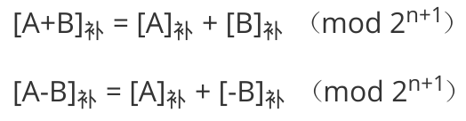 

#### 补码运算的特点

1. 按二进制运算，逢二进一。
2. 若做加法，两个数的补码直接相加；若做减法，则将减数与减数的负数补码相加。
3. 符号位和数值位一起参与运算，加、减运算结果的符号位也在运算中直接得出。
4. 最终运算结果的高位丢弃，保留n\+1位，运算结果仍然为补码。

#### 补码溢出判别的方法

##### 溢出发生的条件

- 仅当两个符号相同的数相加或两个符号相异的数相减才可能发生溢出。

##### 一位符号位

- 由于减法运算在机器中是用加法器实现的，因此，只要参加操作的两个操作数符号相同，而结果的符号与原操作数的符号不同，就判断结果溢出。

- 设A的符号为As、B的符号为Bs、运算结果的符号为Ss，则溢出逻辑表达式为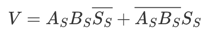。若V=0，则表示无溢出；若V=1，则表示结果溢出。

##### 双符号位（mod 4）

- 双符号位（<a href="#模4补码">模4补码</a>）的溢出逻辑表达式为 V=Ss1&oplus;Ss2 。若V=0，则表示无溢出；若V=1，则表示结果溢出。

<table>
    <tr>
        <th width="5%">Ss1</th>
        <th width="5%">Ss2</th>
        <th width="90%">溢出判断</th>
    </tr>
    <tr>
        <td>0</td>
        <td>0</td>
        <td>正数无溢出</td>
    </tr>
    <tr>
        <td>0</td>
        <td>1</td>
        <td>正溢出</td>
    </tr>
    <tr>
        <td>1</td>
        <td>0</td>
        <td>负溢出</td>
    </tr>
    <tr>
        <td>1</td>
        <td>1</td>
        <td>负数无溢出</td>
    </tr>
</table>
#### 补码加减运算电路

##### 运算逻辑

- 已知一个数的补码表示为Y，则这个数的负数的补码为&#89;&#773;+1。因此，只要在原加法器的Y输入端加n个反向器以实现各位取反的功能，之后加一个2选1多路选择器，用一个控制端Sub来控制，以选择是将Y输入加法器还是将&#89;&#773;输入加法器，并把控制端Sub同时作为低位进位送到加法器（做减法时实现末位加1）。
- 可通过标志信息来区分有符号整数运算结果和无符号整数运算结果，但运算器本身无法识别所处理的二进制串是有符号数还是无符号数。
- 例如，对于模2n补码加减运算

1.  当Sub为1时，做减法，实现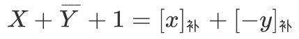。
2. 当Sub为0时，做加法，实现 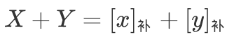。

 

<table>
    <tr>
        <td width="15%" rowspan="2">零标志 ZF</td>
        <td width="20%" rowspan="2">ZF</td>
        <td width="65%">零标志ZF=1，表示结果F为0。</td>
    </tr>
    <tr>
        <td>ZF对无符号数和带符号数运算都有意义。</td>
    </tr>
    <tr>
        <td rowspan="3">溢出标志 OF</td>
        <td rowspan="3">OF=Cn&oplus;Cn-1</td>
        <td>OF用于判断有符号数运算是否溢出，是符号位进位和最高数位进位的异或结果 OF=Cn&oplus;Cn-1。</td>
    </tr>
    <tr>
        <td>溢出标志OF=1，表示带符号整数运算时发生溢出。</td>
    </tr>
    <tr>
        <td>对无符号数运算无意义。</td>
    </tr>
    <tr>
        <td rowspan="2">符号标志 SF</td>
        <td rowspan="2">SF</td>
        <td>符号标志SF表示结果的符号，即F的最高位。</td>
    </tr>
    <tr>
        <td>对无符号数运算无意义。</td>
    </tr>
    <tr>
        <td rowspan="3">进/借位标志 CF</td>
        <td rowspan="3">CF=Sub&oplus;Cout</td>
        <td>进/借位标志CF表示无符号整数运算时的进位/借位，判断是否发生溢出。</td>
    </tr>
    <tr>
        <td>加法时，若CF=1，则结果溢出，此时CF=Cout；减法时，若CF=1，则表示有借位（不够减），此时CF=Cout取反。</td>
    </tr>
    <tr>
        <td>对有符号数运算无意义，CF无法判断有符号数运算是否溢出。</td>
    </tr>
</table>

- 溢出逻辑表达式为 V=Cs&oplus;C1 。若V=0，符号位的进位Cs与最高数位的进位C1相同，则表示无溢出；否则V=1，表示发生溢出。

##### 无符号数大小的比较

- 对于无符号数的运算，零标志ZF、进/借位标志CF 有意义。假定无符号数A、B：

<table>
    <tr>
        <th width="10%" align="center">情况</th>
        <th width="40%" align="center">举例</th>
        <th width="5%" align="center">ZF</th>
        <th width="45%">CF</th>
    </tr>
    <tr>
        <td align="center">A=B</td>
        <td>A-B = 011-011 = 000</td>
        <td align="center">1</td>
        <td>0</td>
    </tr>
    <tr>
        <td align="center">A&gt;B</td>
        <td>A-B = 010-001 = 001</td>
        <td align="center">0</td>
        <td>0</td>
    </tr>
    <tr>
        <td align="center">A&lt;B</td>
        <td>A-B = 000-001 = (1)000-001 = 111</td>
        <td align="center">0</td>
        <td>1</td>
    </tr>
</table>

##### 有符号数大小的比较

- 对于有符号数的运算，零标志、溢出标志OF、符号标志SF 有意义。假定有符号数A、B使用补码表示：

<table>
    <tr>
        <th width="10%" align="center">情况</th>
        <th width="55%" align="center">举例</th>
        <th width="5%" align="center">ZF</th>
        <th width="5%">OF</th>
        <th width="25%">SF</th>
    </tr>
    <tr>
        <td align="center">A=B</td>
        <td>[A]补-[B]补 = 011-011 = [A]补+[-B]补 = 011+101 = (1)000</td>
        <td align="center">1</td>
        <td align="center">0</td>
        <td>0</td>
    </tr>
    <tr>
        <td align="center">A&gt;B</td>
        <td>[A]补-[B]补 = 010-101 = [A]补+[-B]补 = 010+011 = 101</td>
        <td align="center">0</td>
        <td align="center">1</td>
        <td>1</td>
    </tr>
    <tr>
        <td align="center" rowspan="2">A&lt;B</td>
        <td>[A]补-[B]补 = 000-001 = [A]补+[-B]补 = 000+111 = 111</td>
        <td align="center">0</td>
        <td align="center">0</td>
        <td>1</td>
    </tr>
    <tr>
        <td>[A]补-[B]补 = 101-011 = [A]补+[-B]补 = 101+101 = (1)010</td>
        <td align="center">0</td>
        <td align="center">1</td>
        <td>0</td>
    </tr>
</table>

1. 如果ZF=1，那么A=B。
2. 如果ZF=0且OF=SF，那么A&gt;B。
3. 如果ZF=0且OF&ne;SF，那么A&lt;B。

### 原码的加减运算

- 在原码加减运算中，将符号位和数值位分开处理。

<table>
    <tr>
        <td rowspan="3">加法规则</td>
        <td>“同号求和，异号求差”。先判断两个操作数的符号位。</td>
    </tr>
    <tr>
        <td>如果符号位相同，则数值位相加，结果的符号位不变。若最高数值位相加产生进位，则发生溢出。</td>
    </tr>
    <tr>
        <td>如果符号位不同，则做减法，绝对值大的数减去绝对值小的数，结果的符号位与绝对值大的数相同。</td>
    </tr>
    <tr>
        <td>减法规则</td>
        <td>先将减数的符号取反，然后将被减数与“符号位取反后的减数”按原码加法进行运算。例如 011-001转换为011+101。</td>
    </tr>
</table>

## 定点数的乘除运算

### 定点数的乘法运算

- 乘法运算由累加和右移操作实现，分为原码一位乘法和补码一位乘法。

#### 原码一位乘法

##### 基本原理：无符号数的乘积

- 原码一位乘法的符号位和数值位分开求：

1. 乘积的符号位由两个操作数的符号位‘’异或“得到。
2. 乘积的数值位是两个数的绝对值的积。两个定点数的数值部分的积可视为两个<b>无符号数的乘积</b>。

- 设\[X\]原=xs\.x1x2...xn、\[Y\]原=ys\.y1y2...yn，则运算规则为：

1. 被乘数和乘数均取绝对值（数值位）运算；符号位单独运算xs&oplus;ys
2. 部分积是乘法过程的中间结果，初始值为0。乘数的每一位yi乘以被乘数得到X\*yi，并将该结果和之前的部分积相加，得到当前的部分积。（部分积由高位部分积和低位部分积拼接而成）
3. 从乘数的最低位yn开始判断，若yn=1，则部分积加上被乘数\|x\|，然后部分积都右移一位；若yn=0，则部分积加上0，然后部分积都右移一位。
4. 重复步骤3，判断n次（右移n次，n为字长-1）。

 

##### 无符号数乘法运算电路

 

- 部分积和被乘数做无符号加法时，可能产生进位，因此设置进位位C。

1. 乘积寄存器P初始置0，计数器Cn初值为32，每循环一次减1。
2. ALU是乘法器的核心部件，对乘积寄存器P和被乘数寄存器X的内容做“无符号数加法运算”，结果送回寄存器P，进位存放在C中。
3. 每次循环都对进位位C、寄存器P和寄存器Y实现同步“逻辑右移”，此时，进位位C移入寄存器P的最高位，寄存器Y的最低位移出。
4. 每次从寄存器Y移出的最低位都被送到控制逻辑，以决定被乘数是否“加”到部分积上。

#### 补码一位乘法

##### Booth算法

- 补码一位乘法是有符号数的乘法，利用相加和相减计算补码数据的乘积。
- 设\[X\]补=xs\.x1x2...xn、\[Y\]补=ys\.y1y2...yn，则运算规则为：

1. 符号位参与运算，运算的数均为补码表示。
2. 被乘数一般取双符号位参与运算；<a href="#部分积">部分积</a>取双符号位，初始值为0；乘数取单符号位。
3. 乘数末位增设附加位yn+1，初始值为0。
4. 根据（yn, yn+1）的取值来确定操作，按补码移位规则移位。

<table>
	<thead>
		<tr>
			<th width="6%">yn 高位</th>
			<th width="6%">yn+1 低位</th>
			<th width="80%">操作</th>
		</tr>
	</thead>
	<tbody>
		<tr>
			<td>0</td>
			<td>0</td>
			<td>部分积右移一位</td>
		</tr>
		<tr>
			<td>0</td>
			<td>1</td>
			<td>部分积加[x]
				补，右移一位
			</td>
		</tr>
		<tr>
			<td>1</td>
			<td>0</td>
			<td>部分积加[-x]
				补，右移一位
			</td>
		</tr>
		<tr>
			<td>1</td>
			<td>1</td>
			<td>部分积右移一位</td>
		</tr>
	</tbody>
</table>

5. 重复以上步骤n+1次，第n\+1步不再移位（共n\+1次累加、n次右移），仅根据yn和yn+1的比较结果做相应运算。

 

##### 补码乘法运算电路

### 定点数的除法运算

- 除法运算可转换为“累加\-左移”（逻辑左移），分为原码除法和补码除法。

- 符号扩展将带符号的定点数转换成不同位数的表示。

1. 正数的符号扩展，符号位不变，扩展位使用0填充。
2. 原码负数的符号扩展，与正数相同。
3. 补码负数的符号扩展，原有的符号位移动至新符号位，附加位整数使用1填补，小数使用0填补。

#### 原码除法运算

##### 不恢复余数法

- 原码不恢复余数法（原码加减交替除法），商符和商值是分开进行的。
- 设被除数\[X\]原=xs\.x1x2...xn、\[Y\]原=ys\.y1y2...yn

1. 商符：Qs=xs&oplus;ys
2. 商值：\|Q\|=\|X\|/\|Y\|

- 求\|Q\|的不恢复余数法运算

1. 假定一个2n位的数除以一个n位的数，则应当得到n位的商，且需要为被除数进行扩展。
   1. 对于定点正小数（原码小数），只需在被除数低位添n个0即可。
   2. 对于定点正整数（无符号数），只需在被除数高位添n个0即可。
   3. 若除数为0，则需要操作系统调用相应的异常处理程序来处理该“除数为0”异常。
2. 先用被除数减去除数（\|X\|-\|Y\| = \|X\|+(\-\|Y\|) = \[X\]+\[\-\|Y\|\]补）。
   1. 当余数为正时，商末位加上1，余数和商左移一位，再减去余数。（包括符号位移动）
   2. 当余数为负时，商末位加上0，余数和商左移一位，再加上余数。（包括符号位移动）
3. 第n+1步余数为负时，需要加上\|Y\|以得到第n\+1步正确的余数（余数与被除数同号）。

 

##### 除法运算电路

 

<table>
    <tr><td width="10%">寄存器Y</td><td width="90%">寄存器Y存放除数</td></tr>
    <tr><td>寄存器R</td><td>寄存器R初始时存放扩展被除数的高32位；运算过程中存放中间余数的高位部分；结束时存放的是余数</td></tr>
    <tr><td>寄存器Q</td><td>寄存器Q初始时存放扩展被除数的低32位；运算过程中部分存放中间余数的低位部分、部分存放商；结束时存放的是32位商</td></tr>
    <tr><td>ALU</td><td>ALU是除法器的核心部件，对寄存器R和Y的内容做加/减运算，运算结果被送回寄存器R</td></tr>
    <tr><td>计数器Cn</td><td>计数器Cn初值为32，每循环一次减1</td></tr>
</table>

1. 每次循环，寄存器R和Q实现同步左移，左移时，Q的最高位移入R的最低位，Q中空出的最低位被上商。
2. 从低位开始，逐次把商的各个数位左移到Q中。
3. 每次由控制逻辑根据ALU运算结果的符号来决定上商是0还是1。

- 若是两个32位int类型的整数使用上图的逻辑来相除，则除了 -231/-1 会溢出外，其余情况都不会溢出。

##### 不恢复余数法的另一种方式

- 假定一个2n位的数除以一个n位的数，则应当得到n位的商，且需要为被除数进行扩展。对被除数和除数的预处理与不恢复余数法相同，符号位和数值位分开计算。

1. 被除数与除数相减，够减则上商为1；不够减则上商为0。
2. 每次得到的差为中间余数，将除数右移后与上次的中间余数比较。
3. 用中间余数减除数，够减则上商为1，不够减则上商为0。
4. 重复第2步和第3步，直到商的位数满足要求为止。

#### 补码除法运算（加减交替法）

- 补码一位除法，符号位和数值位一起参与运算，商符自然形成。除法第一步根据被除数和除数的符号决定加法或减法。上商的原则根据余数和除数和符号位决定。

1. 符号位参与运算，除数、被除数、商、余数使用补码表示。
2. 若被除数与除数同号，则被除数减去除数；若被除数和除数异号，则被除数加上除数。
3. 若余数与除数同号，则商上1，余数左移一位减去除数；若余数与除数异号，则商上0，余数左移一位加上除数。
4. 重复第3步n次。
5. 若对商的精度没有特殊要求，则一般采用“末位恒置1”。

 

##### 除法运算电路
