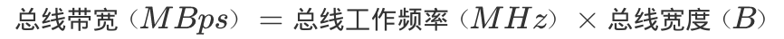
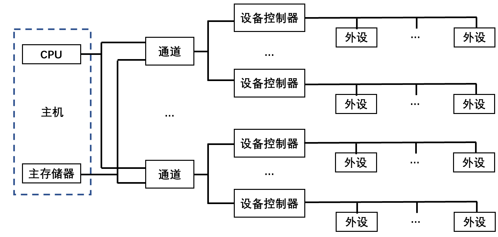
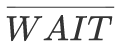

# 系统总线基本概念

- 系统部件间的互连方式：分散连接、总线连接。

<table>
	<tbody>
		<tr>
			<td width="10%">分散连接</td>
			<td width="90%">各部件之间使用单独的连线</td>
		</tr>
		<tr>
			<td>总线连接</td>
			<td>各部件连接到一组公共信息传输线</td>
		</tr>
	</tbody>
</table>

- 总线（Bus）：连接多个部件的信息传输线，是各部件共享的传输介质。

1. 在同一时刻内，只允许有一个部件向总线发送信息，而多个部件可以同时从总线接受相同的信息。
2. 总线实际上由许多传输线、通路组成。每条线可以一位一位地传输二进制代码，若干条传输线可以同时传输若各位二进制代码。

# 总线分类

- 按数据传送方式：并行传输总线、串行传输总线。
  - 并行传输总线按传输数据宽度：8位、16位、32位、64位等。
- 按使用范围：计算机总线、测控总线、网络通信总线等。
- 按连接部件：片内总线、系统总线、通信总线。

## 片内总线

- 片内总线：芯片内部的总线。CPU芯片内部、寄存器与寄存器之间、寄存器与ALU之间等。

## 系统总线

- 系统总线（板级总线：一块电路板上各芯片间的连接）：CPU、主存、I/O设备（I/O接口）各大部件（通常安放在各个插件板上）之间的信息传输线。

<table>
	<thead>
		<tr>
			<th width="20%" align="center">按传送信息的不同</th>
			<th width="25%" align="center">方向</th>
			<th width="25%" align="center">传输</th>
			<th width="30%" align="center">位数</th>
		</tr>
	</thead>
	<tbody>
		<tr>
			<td align="center">数据总线</td>
			<td>双方向</td>
			<td>读入/输出数据</td>
			<td>与机械字长、存储字长有关</td>
		</tr>
		<tr>
			<td align="center">地址总线</td>
			<td>单方向</td>
			<td>CPU向主存/外设传输地址信息</td>
			<td>与存储单元个数有关</td>
		</tr>
		<tr>
			<td align="center">控制总线</td>
			<td>单方向：对任一控制线 双方向：对控制线总体
			</td>
			<td>控制信号 监视各部件状态
			</td>
			<td></td>
		</tr>
	</tbody>
</table>

### 数据总线

- 数据总线：传输各功能部件之间的数据信息，是双向传输总线。
- 数据总线的位数（数据总线宽度）：位数与机械字长、存储字长有关，一般为8位、16位、32位。

> 如果数据总线地宽度为8位，指令字长位16位，则CPU在取指阶段必须2次访问主存。

### 地址总线

- 地址总线：指出数据总线上的 源数据、目的数据 在主存单元或I/O设备的地址。由CPU输出，单向传输。

1. 从存储器读取一个数据，CPU要将此数据所在存储单元的地址送到地址线。
2. 某数据经I/O设备输出时，CPU将数据送到数据总线、将该输出设备的地址送到地址总线。

- 地址的位数（MAR位数）与存储单元个数有关。例如地址线为20根，则对应的存储单元个数为220。

### 控制总线

- 控制总线：发出各种控制信号的传输线。数据总线、地址总线都是被挂在总线上的所有部件共享的，如何使各部件能在不同时刻占有总线使用权，需要依靠控制总线完成。

1. 监视各部件状态。例如查询设备处于“忙”或“闲”，是否出错等。
2. 对任一控制线，其传输是单向的；而对控制总线总体，可认为是双向的。
   1. 单向：存储器读/写命令或I/O设备读/写命令都是由CPU发出的。
   2. 双向：对CPU而言，控制信号既有输出也有输入。当某设备准备就绪时，便向CPU发出中断请求；当某部件需要获得总线使用权时，也向CPU发送总线请求。

<table>
	<thead>
		<tr>
			<th width="10%">控制信号</th>
			<th width="90%">意义</th>
		</tr>
	</thead>
	<tbody>
		<tr>
			<td>时钟</td>
			<td>同步各种操作</td>
		</tr>
		<tr>
			<td>复位</td>
			<td>初始化所有部件</td>
		</tr>
		<tr>
			<td>总线请求</td>
			<td>某部件需获得总线使用权</td>
		</tr>
		<tr>
			<td>总线允许</td>
			<td>部件已获得控制权</td>
		</tr>
		<tr>
			<td>中断请求</td>
			<td>某部件提出中断请求</td>
		</tr>
		<tr>
			<td>中断响应</td>
			<td>中断请求已被接收</td>
		</tr>
		<tr>
			<td>存储器写</td>
			<td>将数据总线上的数据写至存储器的指定地址单元</td>
		</tr>
		<tr>
			<td>存储器读</td>
			<td>将指定存储单元中的数据读到数据总线</td>
		</tr>
		<tr>
			<td>I/O读</td>
			<td>从指定的I/O端口将数据读到数据总线</td>
		</tr>
		<tr>
			<td>I/O写</td>
			<td>将数据总线上的数据输出到指定的I/O端口内</td>
		</tr>
		<tr>
			<td>传输响应</td>
			<td>数据已被接收、已将数据送至数据总线</td>
		</tr>
	</tbody>
</table>

## 通信总线

<table>
	<thead>
		<tr>
			<th width="10%">通信总线</th>
			<th width="45%" align="center">串行通信</th>
			<th width="45%" align="center">并行通信</th>
		</tr>
	</thead>
	<tbody>
		<tr>
			<th align="center">传输方式</th>
			<td>数据在单条1位宽的传输线上，一位一位地按顺序分时传送。</td>
			<td>数据在多条1位宽的传输线上，同时由源传送到目的地。</td>
		</tr>
		<tr>
			<th align="center">应用场景</th>
			<td>适宜远距离的数据传输，从几十米至数千千米，可以利用现有的电话网络实现远程通信，费用低。</td>
			<td>适宜近距离的数据传输，通常小于30m，在短距离内并行数据传输速率比串行高；但逻辑器件价格趋低，通信线路费用趋高</td>
		</tr>
	</tbody>
</table>

- 对于1字节的数据的传输：

1. 串行通信：1条传输线分8次由低位到高位按顺序逐位传输。
2. 并行通信：8条并行传输线同时由源传送到目的地。

# 总线特性和性能指标

## 总线特性

<table>
    <caption>总线特性</caption>
    <tr>
        <td width="10%">机械特性</td>
        <td width="90%">总线在机械连接方式上的一些性能</td>
    </tr>
    <tr>
        <td rowspan="3">电气特性</td>
        <td>总线的每一根传输线上信号的传递方向和有效的电平范围</td>
    </tr>
    <tr>
        <td>信号包括输出信号和输入信号。输出信号是CPU发出的信号；输入信号是送入CPU的信号。</td>
    </tr>
    <tr>
        <td>TTL电平定义：高电平（1）；低电平（0） RS-232电平定义：高电平（高于+3V）：0；低电平（低于-3V）：1；额外电平信号：-10V、+10V左右</td>
    </tr>
    <tr>
        <td>功能特性</td>
        <td>总线中每条传输线的功能</td>
    </tr>
    <tr>
        <td>时间特性</td>
        <td>每条总线上的各种信号相互存在一种有效时序的关系</td>
    </tr>
</table>

## 总线性能指标

<table>
    <thead>
        <tr>
            <th width="20%">总线性能指标</th>
            <th width="80%">描述</th>
        </tr>
    </thead>
    <tbody>
        <tr>
            <td>总线宽度</td>
            <td>数据总线的根数，bit 位。</td>
        </tr>
        <tr>
            <td>总线带宽</td>
            <td>单位时间内总线上传输数据的位数，MBps。</td>
        </tr>
        <tr>
            <td>时钟同步/异步</td>
            <td>总线上的数据与时钟同步/异步工作的总线。</td>
        </tr>
        <tr>
            <td>总线复用</td>
            <td>一条信号线分时传送两种信号。</td>
        </tr>
        <tr>
            <td>信号线数</td>
            <td><q>地址总线+数据总线+控制总线</q>的总线数。</td>
        </tr>
        <tr>
            <td>总线控制方式</td>
            <td>突发工作、自动配置、仲裁方式、逻辑方式、计数方式等。</td>
        </tr>
        <tr>
            <td>负载能力（驱动能力）</td>
            <td>当总线接上负载后，总线输入输出的逻辑电平是否能保持在正常的额定范围内。</td>
        </tr>
    </tbody>
</table>

# 总线标准

## ISA

- ISA总线（AT总线）：独立于CPU的总线时钟，不支持多台具有申请总线控制权的设备。所有数据传送必须通过CPU或DMA接口管理。
- ISA总线时钟频率为8MHz，最大传输率为16MBps，数据线为16位，地址线位24位。

## EISA

- EISA总线：与ISA完全兼容，从CPU分离总线控制权。
- EISA总线时钟频率为8MHz，最大传输率为33MBps，数据线为32位，地址线位32位，扩充DMA访问范围达232。

## VESA

- 局部总线：系统外为两个以上模块提供的高速传输信息通道。

- VESA总线（VL-BUS）：采用CPU的时钟频率达33MHz，数据线为32位，可扩展至64位，配有局部控制器，最大传输速率达133MBps。

- 通过局部总线控制器，将高速I/O设备直接挂在CPU上，实现CPU与高速I/O设备之间的高速数据交换。

## PCI

1. 高性能：PCI总线不依附于某个具体处理器的局部总线，与CPU时钟频率无关。自身采用33MHz和66MHz的总线时钟，数据线为32位，可扩展到64位，传输速率132MBps~528MBps。支持突发工作方式。
2. 良好的兼容性：PCI总线部件和插件接口相对于处理器是独立的。PCI和ISA、EISA均可兼容。
3. 即插即用（Plug and Play）。
4. 多主设备。
5. 与处理器和存储器子系统完全并行操作：PCI总线通过PCI桥路与CPU相连，多级缓冲。
6. 数据和地址奇偶校验。
7. 电压标准：5V、3.3V。
8. 可扩充性好。
9. 软件兼容性好。
10. 多路复用。

## AGP

- AGP（Accelerated Graphics Port 加速图形接口）：显卡专用的局部总线。

## RS-232C

- 载波电话。

## USB

1. 即插即用。
2. 连接能力。
3. 数据传输率。
4. 标准统一。
5. 连接电缆轻巧，电源体积缩小。
6. 生命力强。

# 总线结构

**单总线结构**

 

**多总线结构**

 

**系统连接** 主机、通道、设备控制器、外部设备。

- 通道：承担I/O操作管理的主要部件。

1. 较小的系统：设备控制器和外设合并、通道和CPU合并。
2. 较大的系统：单独设置通道部件、或将通道发展为外围处理机。

# 总线控制

## 判优控制（仲裁逻辑）

- 按对总线有无控制功能分为： 主设备、从设备。

<table>
	<thead>
		<tr>
			<th width="15%">模块（设备）</th>
			<th width="85%">描述</th>
		</tr>
	</thead>
	<tbody>
		<tr>
			<td>主设备</td>
			<td>对总线有控制权 启动总线上的消息传送</td>
		</tr>
		<tr>
			<td>从设备</td>
			<td>对总线没有控制权 只能响应主设备发来的总线命令</td>
		</tr>
	</tbody>
</table>

- 多个主设备同时使用主线时：由总线控制器的判优、仲裁逻辑确定，只有获得总线使用权的主设备才能开始传送数据。

<table>
	<thead>
		<tr>
			<th width="20%">总线判优控制</th>
			<th colspan="2">描述</th>
		</tr>
	</thead>
	<tbody>
		<tr>
			<td rowspan="3">集中式</td>
			<td rowspan="3" width="30%">控制逻辑集中在一处</td>
			<td width="50%">链式查询</td>
        </tr>
        <tr>
            <td>计数器定时查询</td>
        </tr>
        <tr>
            <td>独立请求方式</td>
        </tr>
		<tr>
			<td>分布式</td>
			<td colspan="2">控制逻辑分散在与总线连接的各个部件/设备</td>
		</tr>
	</tbody>
</table>
<table>
	<thead>
		<tr>
			<th width="20%">集中式总线判优控制</th>
			<th width="80%">确定总线使用权的控制线数量</th>
		</tr>
	</thead>
	<tbody>
		<tr>
			<td>链式查询</td>
			<td>2</td>
		</tr>
		<tr>
			<td>计数器定时查询</td>
            <td>log2n</td>
		</tr>
		<tr>
			<td>独立请求方式</td>
			<td>2n</td>
		</tr>
	</tbody>
</table>

### 链式查询

- 链式查询：总线同意BG信号串行地从一个I/O接口送到下一个I/O接口。如果BG到达的接口有总线请求BR信号，BG信号就不再往下传，即该接口获得总线使用权，并建立总线忙BS信号，表示其占用了总线。

 

1. 离总线最近的设备具有最高的优先级。优先级别低的设备很难获得请求。

2. 只需几根线即可按一定优先次序实现总线控制，易扩充设备。

3. 对电路故障敏感。

### 计数器定时查询

- 计数器定时查询：总线控制部件接到BR的总线请求信号后，在总线未被使用时，总线控制部件中的计数器开始计数，并通过设备地址线，向各设备发出一组地址信号。当某个请求占用总线的设备地址和计数值一致时，获得总线使用权，并终止计数查询。

 

- 设备的优先级由计数方式决定：

1. 从0开始计数：固定优先次序，设备的优先级按0..n的顺序降序排列。
2. 从上次计数的终止点开始（循环）：设备的优先级相同。
3. 计数器初始值改由程序设置。

### 独立请求方式

- 独立请求方式：每台设备均有一对总线请求线BRi和总线同意线BGi。当设备要求使用总线时，便发出该设备的请求信号。总线控制部件中有一排电路，根据优先次序确定响应哪台设备的请求。

 

- 响应速度快、优先次序控制灵活，控制线数量多、总线控制复杂。

## 通信控制

- 通信控制：以获得总线使用权的先后顺序分时占用总线。

- 总线周期：完成一次总线操作的时间。

1. 申请分配阶段：主设备提出总线申请，由总线仲裁机制决定下一传输周期的总线使用权授予某一申请者。

2. 寻址阶段：获得总线使用权的主设备通过总线发出本次要访问的从设备地址、有关命令，启动参与本次传输的从设备。

3. 传数阶段：主设备和从设备进行数据交换，数据从源模块发出，经数据总线流入目标模块。

4. 结束阶段：主设备相关信息均从系统总线撤除，让出总线使用权。

- 通信控制方式：同步通信、异步通信、半同步通信、分离式通信。

### 同步通信

- 同步通信：通信双方统一时标控制数据传送。

1. 时标：通常由CPU的总线控制部件发出送到总线的所有部件；或由各个部件各自的时序发生器发出。
2. 必须由总线控制部件发出的时钟信号对时标进行同步。

- 总线传输周期：连接在总线上的两个部件完成一次完整且可靠的信息传输时间，包含4个时钟周期（T1、T2、T3、T4）。

<table>
	<thead>
		<tr>
			<th width="10%" align="center">传输周期</th>
			<th width="45%" align="center">读命令</th>
			<th width="45%" align="center">写命令</th>
		</tr>
	</thead>
	<tbody>
		<tr>
			<td>T1</td>
			<td>主模块发地址</td>
			<td>主模块发地址</td>
		</tr>
		<tr>
			<td>T1.5</td>
			<td></td>
			<td>主模块提供数据</td>
		</tr>
		<tr>
			<td>T2</td>
			<td>主模块提供数据</td>
			<td>主模块发出写命令，从模块接收到命令后，必须在规定时间内将数据总线上的数据写到地址总线指明的单元。</td>
		</tr>
		<tr>
			<td>T3</td>
			<td>从模块提供数据</td>
			<td></td>
		</tr>
		<tr>
			<td>T4</td>
			<td>主模块撤销读命令，从模块撤销数据</td>
			<td>主模块撤销写命令、数据等信号</td>
		</tr>
	</tbody>
</table>

- 规定明确、统一，模块间的配合简单一致。

1. 主、从模块时间配合属于强制性同步：必须在规定时间内完成规定的要求。

2. 对所有从模块使用同一限时，必须按最慢速度的部件来设计公共时钟。

- 同步通信中，总线传输周期越短、数据线的位数越多，直接影响总线的数据传输率。

    
假定总线的时钟频率为100MHz，总线传输周期为4个时钟周期，总线宽度为32位 1. 求总线的数据传输率 2. 提高1倍数据传输率的措施
 
1. 求总线的数据传输率

1个时钟周期 = 1 / 100MHz = 0.01 us 
总线传输周期 = 4 * 0.01 us = 0.04 us 
总线宽度 = 32 bit = 4 B 
故：总线数据传输率 = 4 B / 0.04 us = 100 MBps

2. 提高1倍数据传输率的措施

（1） 在不改变总线时钟频率的前提下，将总线宽度改为64位 
（2）在不改变总线宽度的前提下，将总线时钟频率改为200MHz

### 异步通信

- 异步通信：应答方式，允许各模块速度不一致，没有公共的时钟标准。
- 应答方式（握手方式）：主模块发出请求信号（request）后，一直等待从模块反馈回来响应信号（acknowledge）后才开始通信。主、从模块之间存在两条应答线（握手信号线 Handshaking）。

| 应答方式 |  |
| -------- | ------------------------------------------------------------ |
| 不互锁   | 主模块发出请求信号后，不必等待接到从模块的回答信号，而是经过一段时间，确认从模块已收到请求信号后，便撤销其请求信号（不互锁）。 从模块接收到请求信号后，在条件允许时发出回答信号，且经过一段时间（不同设备的时间长度不同）确认主模块已收到回答信号后，自动撤销回答信号（不互锁）。 |
| 半互锁   | 主模块发出请求信号后，必须待接到从模块的回答信号后再撤销其请求信号（互锁）。 从模块接收到请求信号后，发出回答信号，但不必等待获知主模块的请求信号已撤销，而是隔一段时间后自动撤销其回答信号（不互锁）。 |
| 全互锁   | 主模块发出请求信号后，必须待接到从模块的回答信号后再撤销其请求信号（互锁）。 从模块接收到请求信号后，发出回答信号，必须获知主模块的请求信号已撤销后，再撤销其回答信号（互锁）。 |

- 异步通信可用于并行传送、串行传送。
- 异步串行通信：

1. 为保证被传输的字符，约定字符格式：1个起始位（低电平）、5~8个数据位、1个奇偶校验位、1/1.5/2个终止位（高电平）。
2. 传送时，起始位后紧跟要传送字符的最低位，每个字符的结束为高电平的终止位。起始位至终止位构成1帧，两帧之间的间隔可以是任意长度的。

 

- 异步串行通信的数据传送速率：

<table>
    <tbody>
        <tr>
            <td width="20%">波特率（bps，位/秒）</td>
            <td width="80%">单位时间内传送二进制数据的位数。</td>
        </tr>
        <tr>
            <td>比特率（bps，位/秒）</td>
            <td>单位时间内传送有效二进制数据的位数。</td>
        </tr>
    </tbody>
</table>

    
异步串行系统中，假设每秒传输120个数据帧，其字符格式规定包含1个起始位、7个数据位、1个奇检验位、1个终止位。求波特率、比特率。
 
题中1个数据帧包含 1 + 7 + 1 + 1 = 10 位 
波特率：10 `*` 120 bit  / 1 s = 1200 bps 
比特率：7 `*` 120 bit / 1 s = 840 bps

    
画图说明异步串行传输方式发送十六机制数据95H。字符格式：1位起始位、8位数据位、1位偶检验位、1位终止位。

95H转为十进制：<code>161+5*160=149=27+24+22+20</code> 149转为二进制：10010101 从低位到高位传送字符：10010101&rarr;10101001 

### 半同步通信

- 半同步通信：保留同步通信的基本特点、且可以像异步通信允许不同速度的模块和谐工作。增设等待响应信号线（），采用插入时钟（等待）周期的措施来协调通信双方的配合。

<table>
	<thead>
		<tr>
			<th width="15%" align="center">时钟周期（T）</th>
			<th width="85%" align="center">描述</th>
		</tr>
	</thead>
	<tbody>
		<tr>
			<td align="center">T1</td>
			<td>主模块发出地址信息</td>
		</tr>
		<tr>
			<td align="center">T2</td>
			<td>主模块发出命令</td>
		</tr>
		<tr>
			<td align="center">Tw</td>
			<td>
				为低电平时：进入等待，Tw宽度和T一致。
			</td>
		</tr>
		<tr>
			<td align="center">T3</td>
			<td>从模块提供数据</td>
		</tr>
		<tr>
			<td align="center">T4</td>
			<td>主模块撤销读命令，从模块撤销数据</td>
		</tr>
	</tbody>
</table>

1. 如果从模块工作速度较慢，无法在T3时刻提供数据，则必须在T3到来之前通知主模块，给出信号。
2. 如果主模块测得为低电平，则插入一个等待周期Tw，不立即从数据线上取数。
3. 如果主模块在下一个时钟周期到来时又测得为低电平，则重复第2步，继续等待。
4. 直到主模块测得为高电平，主模块就将下一个时钟周期当作正常周期T3，即时获取数据。
5. T4结束传输。

 

### 分离式通信

> 命令传输周期中，除申请主线阶段外，其余主要的时间花费：
>
> 1. 主模块通过传输总线向从模块发送地址和命令。
>
> 2. 从模块按照命令进行读数据的必要准备。
>
> 3. 从模块经数据总线向主模块提供数据。
>
> - 其中第2项，系统总线在从模块内部读数据过程中并无实质性的信息传输，处于空闲状态。分离式通信解决该消极等待。

- 分离式通信：将一个传输周期（总线周期）分解为两个子周期，且每个模块都是主模块。

<table>
    <caption>分离式通信的传输周期</caption>
    <tr>
        <td width="15%">第一个子周期</td>
        <td width="85%">A模块在获得总线使用权后，将命令、地址以及其他有关信息（主模块编号等）发到系统总线，经总线传输后，由有关的B模块接收。A模块发送完这些信息就立即放弃总线使用权。</td>
    </tr>
    <tr>
        <td>第二个子周期</td>
        <td>B模块收到A模块发来的有关命令信号后，经选择、译码、读取等一系列内部操作，将A模块所需的数据准备号，便由模块B申请申请总线使用权，一旦获准，B模块便将A模块的编号、B模块的地址、A模块所需的数据等一系列信息送到总线，供A模块接收。</td>
    </tr>
</table>

1. 各模块欲占用总线使用权必须提出申请。
2. 在得到总线使用权后，主模块在限定的时间内向对方发送信息，采用同步方式传输，不再等待对方的回答信号。
3. 各模块在准备数据的过程中都不占用总线，使总线可接受其他模块的请求。
4. 总线被占用时都在做有效工作（发送命令、传送数据），不存在空闲等待时间，充分利用总线的有效占用，实现了总线在多个主、从模块间进行信息交叉重叠并行式传送。

