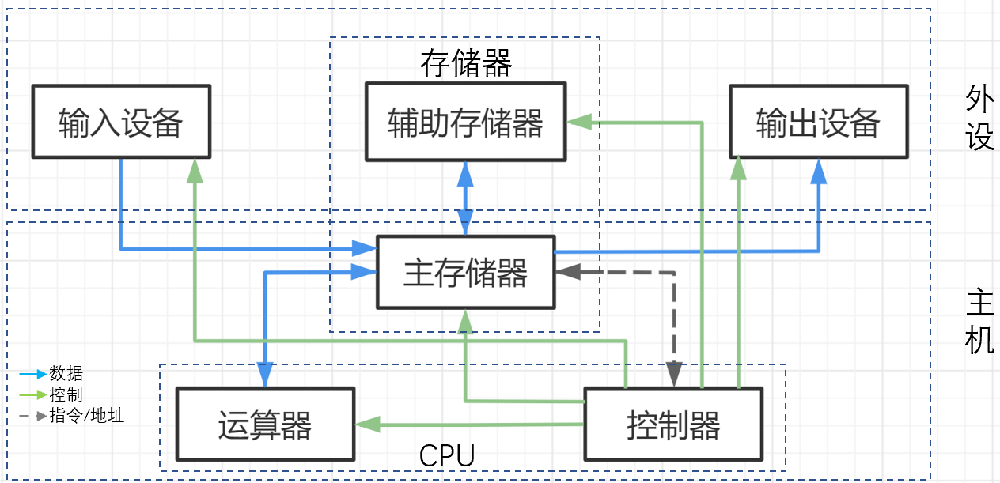
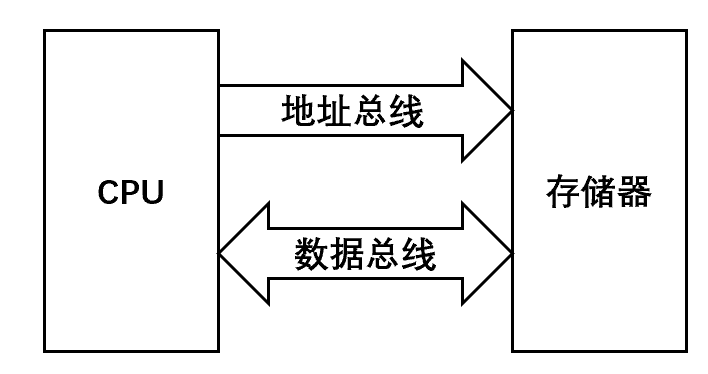
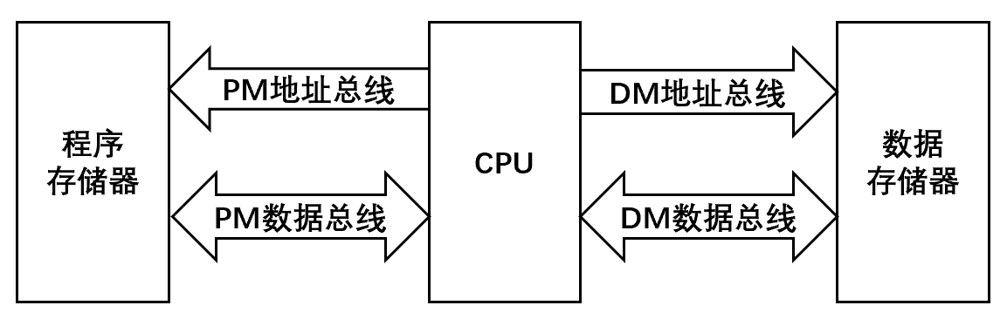
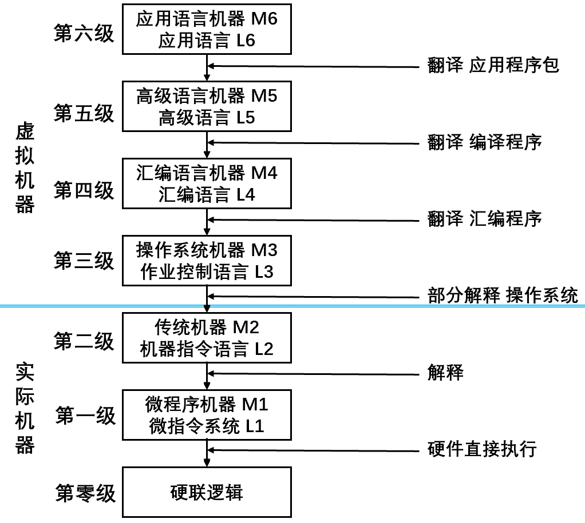
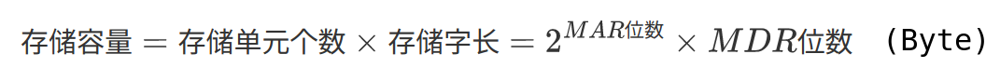
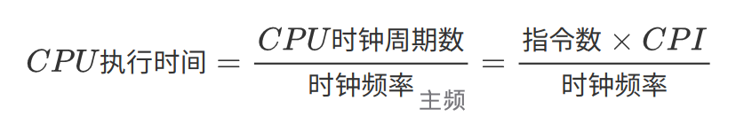

# 冯·诺依曼体系

## 存储程序概念

- 存储程序概念：指令驱动\+存储，指令和数据都在存储器中。将事先编制好的程序和原始数据送入主存后才能执行，一旦程序启动，就无须操作人员的干预，计算机自动逐条执行指令直到程序执行结束。
- 冯·诺依曼机的基本工作方式是控制流驱动方式，主要特点如下：
1. 计算机硬件系统由运算器、存储器、控制器、输入设备、输出设备5大部件组成。
2. 指令和数据以同等地位存于存储器，按地址寻访。
3. 指令和数据均用二进制代码表示。
4. 指令由操作码（操作的类型）和地址码（操作数的地址）组成，在存储器中按顺序存放。
5. 以运算器为中心，I/O设备与存储器之间的数据传送通过运算器完成。

## 冯·诺依曼机的硬件组成

## 冯·诺依曼模型机

 

- 一般将运算器和控制器集成到同一个芯片上，也就是中央处理器（CPU）。CPU和主存储器共同构成主机，而除了主机外的其他硬件设备（辅存、I/O设备等）统称为外设（外部设备）。 

 

 

- CPU包括ALU、GPRs、PSW、CU、IR、PC、MAR、MDR。控制器通过发出控制信号，可以控制如何修该PC以得到下一条指令的地址、控制ALU执行什么运算、控制主存储器的读/写操作（读/写控制信号）。
- CPU和主存储器之间通过一组[总线](./系统总线.md)相连，总线中有地址、控制和数据三组信号线。

1. MAR中的地址信息会直接送到地址线上，用于指向读/写操作的主存储器的存储单元。
2. 控制线中有读/写信号线，指出数据是从CPU写入主存储器或是从主存储器读入CPU，根据是读操作还是写操作来控制将MDR中的数据之间送到数据线上，或是将数据线上的数据接收到MDR中。

### [主存储器](./Memory.md)

 

<table>
    <caption>主存储器的逻辑结构</caption>
    <tr>
        <td width="25%" rowspan="2">M（存储体）</td>
        <td width="75%">存储体存放二进制信息，若干存储单元的集合构成存储体，地址码相同的多个存储元件构成一个存储单元，每个存储元件存放一个二进制位。</td>
    </tr>
    <tr>
        <td>存储字是存储单元可存放的一串二进制代码，<a href="#存储字长2">存储字长</a>是这串二进制代码的位数，1Byte或字节的偶数倍。</td>
    </tr>
    <tr>
        <td rowspan="3">MAR（存储器地址寄存器）</td>
        <td>MAR存放访存地址，用于寻址，经地址译码后找到所选的存储单元。</td>
</tr>
    <tr>
        <td>MAR的位数对应最多可寻址的存储单元的个数（2MAR位数），其对应的应该是主存地址空间的大小，而不仅仅是主存储器的大小。</td>
    </tr>
    <tr>
        <td>MAR长度和PC（程序计数器）的长度相等。</td>
    </tr>
    <tr>
        <td rowspan="2">MDR（存储器数据寄存器）</td>
        <td>MDR暂存要从存储器中读/写的信息。</td>
    </tr>
    <tr>
        <td>MDR的位数和存储字长相等，对应于数据总线的宽度。</td>
    </tr>
    <tr>
        <td>时序控制逻辑</td>
        <td>时序控制逻辑用于产生存储器操作所需的各种时序信号。</td>
    </tr>
</table>

- 在现代计算机中，MDR、MAR、Cache都存在于CPU，例如 集成到CPU中的Cache（CPU Cache）。

### 运算器

- 在计算机中，运算器由ALU（Arithmetic Logic Unit，算术逻辑单元）、移位器、PSW（状态寄存器）和GPRs（通用寄存器组）等组成。

1. 运算器的基本功能包括加、减、乘、除四则运算，与、或、非、异或等逻辑运算，以及移位、求补等操作。
2. ALU的核心部件是加法器。

<table>
    <tr>
        <td width="15%"><a href="./数据的表示.md">ALU</a></td>
        <td width="85%">ALU（算术逻辑单元，Arithmetic and Logical Unit）是运算器的核心，能进行多种算术运算和逻辑运算（包括移位操作）。</td>
    </tr>
    <tr>
        <td>GPRs</td>
        <td>GPRs（通用寄存器）运行器包含若干通用寄存器，用于暂存操作数和中间结果，必须具备ACC（累加器）、MQ（乘商寄存器）、X（操作数寄存器）。此外，还可以包含变址寄存器（IX）、基址寄存器（BR）等。</td>
    </tr>
    <tr>
        <td>PSW</td>
        <td>PSW（程序状态寄存器、标志寄存器）用于存放ALU运算得到的一些标志信息或处理机的状态信息，例如结果是否溢出、进位和借位等。</td>
    </tr>
</table>

### 控制器

- 控制器指挥计算机的各部件自动协调地进行工作。

<table>
    <tr>
        <td width="20%">PC（程序计数器）</td>
        <td width="80%">存放当前欲执行指令的地址，可以自动加1（即自动形成下一条指令的地址），与主存储器的MAR之间有一条直接通路。</td>
    </tr>
    <tr>
        <td rowspan="2">IR（指令寄存器）</td>
        <td>存放当前的指令，内容来自主存储器的MDR。</td>
    </tr>
    <tr>
        <td>指令中的操作码OP（IR）送至CU，用于分析指令并发出各种微操作命令序列；而地址码Ad（IWR）送至MAR，用于取操作数。</td>
    </tr>
    <tr>
        <td>CU（控制单元）</td>
        <td></td>
    </tr>
</table>

### 对程序员的可见性

1. 汇编程序员可以通过JMP指令来设置PC的值。且状态寄存器、通用寄存器只有为汇编程序员可见才能实现编程。
3. IR、MAR、MDR是CPU的内部工作寄存器，对程序员均不可见。

## 指令执行过程

### “存储程序”工作方式

- “存储程序”工作方式规定，程序执行前，需要将程序所含的指令和数据送入主存储器，一旦程序被启动执行，就无须人员的干预，自动逐条完成指令的取出和执行任务。
- 一个程序的执行就是周而复始地执行一条一条指令的过程。每条指令的执行过程包括，从主存储器中取指令、对指令进行译码、计算下条指令地址、取操作数并执行、将结果送回存储器。

1. 程序执行前，先将程序第一条指令的地址存放到PC中。
2. 取指令时，将PC的内容作为地址访问主存储器。
3. 在每条指令执行过程中，都需要计算下条指令的地址，并送到PC。
   1. 若当前指令为顺序型指令，则下条指令的地址为PC的内容加上当前指令的长度。
   2. 若当前指令为跳转型指令，则下条指令的地址为当前指令中指定的地址。
4. 当前指令执行完毕后，根据PC的内容到主存储器取出下条将要执行的指令。
5. 由此周而复始。

### [指令执行过程的描述](./指令系统.md)

- 可执行文件代码段是由一条一条机器指令（一串0/1序列）构成的，用来指示CPU完成一个特定的原子操作。

## 存储器设计思想

### 冯·诺依曼结构

     

1. 指令和数据混合存储在同一个存储器中，指令地址和数据地址指向同一个存储的不同物理位置，指令和数据的宽度相同。
2. CPU和共享存储器间的信息交换，不能同时取指令和取操作数，且存储器的存取速度远低于CPU运算速度。

### 哈弗结构

 

1. 指令存储在程序存储器（PM)，数据存储在数据存储器（DM）：指令和数据可以有不同的数据宽度。
2. 分离的程序总线和数据总线允许同时获取指令字和操作数而互不干扰：在一个机器周期内可以同时准备好指令和操作数，本条指令执行时可以预先读取下一条指令。

# 层次结构与软件

## 层次结构

 

1. 层次之间的关系密切，下层是上层的基础，上层是下层的扩展。
2. 虚拟机器只对该层的观察者可见，对于某一层的观察者而言，其不必关心下一层是如何工作的。
3. 软件和硬件之间的界面是ISA（指令集体系结构），即软件可见部分，定义了一台计算机可以执行的所有指令的集合。

## 软件

<table>
    <tr>
        <td width="10%" rowspan="2">系统软件</td>
        <td width="15%" rowspan="2">系统程序员</td>
        <td width="75%">系统软件是一组保证计算机系统高效、正确运行的基础软件，通常作为系统资源提供给用户使用。</td>
    </tr>
    <tr>
        <td>主要包括操作系统（OS）、数据库管理系统（DBMS）、语言处理程序、分布式软件系统、网络软件系统、标准库程序、服务性程序等。</td>
    </tr>
    <tr>
        <td>应用软件</td>
        <td>应用程序员</td>
        <td>应用软件是用户为解决某个应用领域中的各类问题而编制的程序。</td>
    </tr>
</table>

- 软、硬件逻辑功能的等价性，某一功能既可以使用软件实现，也可以使用硬件实现。
- 裸机是没有配备软件的纯硬件系统。

## 语言与翻译

<table>
    <caption>三种级别的计算机语言</caption>
    <tr>
        <td width="10%">机器语言</td>
        <td width="90%">机器语言（二进制代码语言）是计算机唯一可以直接识别和执行的语言</td>
    </tr>
    <tr>
        <td>汇编语言</td>
        <td>汇编语言必须经过汇编程序（系统软件）的翻译，转换为机器语言后，才能在计算机的硬件系统上执行</td>
    </tr>
    <tr>
        <td>高级语言</td>
        <td>高级语言（C、C++、Java等）需要经过编译程序翻译成汇编语言程序，再经过汇编操作得到机器语言程序，或直接由高级语言程序转换为机器语言程序</td>
    </tr>
</table>
<table>
    <caption>翻译程序</caption>
    <tr>
        <td width="20%">汇编程序（汇编器）</td>
        <td width="80%">将汇编语言转换为机器语言程序</td>
    </tr>
    <tr>
        <td>解释程序（解释器）</td>
        <td>将源程序中的语言按执行顺序逐条翻译为机器指令并直接执行，翻译一句执行一句，不会生成目标程序</td>
    </tr>
    <tr>
        <td>编译程序（编译器）</td>
        <td>将高级语言程序翻译成编译语言或机器语言程序，将高级语言程序一次全部编译成目标程序</td>
    </tr>
</table>
 

# 性能指标

- 基准程序（Benchmarks）是专门用于性能评价的一组程序，但程序员可以专门优化某段代码来影响基准程序的评测结果。

## 机器字长

<table>
    <tr>
        <td width="18%" rowspan="3">机器字长（字长）</td>
        <td width="82%">机器字长（字长）是计算机进行一次整数（定点整数）运算所能处理的二进制数据的位数（CPU内部用于整数运算的<a href="#数据通路">数据通路</a>的宽度），字长一般等于CPU内部用于整数运算的运算器位数和通用寄存器宽度。</td>
    </tr>
    <tr>
        <td>字长越长，数的表示范围越大，计算机精度越高。</td>
    </tr>
    <tr>
        <td>某16位机器、32位机器，其中的16位、32位指的是字长。</td>
    </tr>
    <tr>
        <td rowspan="2">指令字长</td>
        <td>指令字长是一个指令字中包含的二进制代码的位数，一般是存储字长的整数倍。若指令字长等于存储字长的2倍（也就是，一条指令需要两个存储字才能完全装载），则需要2个访存周期（从内存中读出指令的实际时间）来取出一条指令。 </td>
    </tr>
    <tr>
        <td>取指周期是处理器从内存中取出一条指令所需的时间，不仅包括访存周期，还包括解码、预处理等一系列其他操作所需要的时间。机器周期与取指周期的关系取决于处理器的具体实现。</td>
    </tr>
    <tr>
        <td><a href="#存储字长1">存储字长</a></td>
        <td>存储字长是一个存储单元存储的二进制代码的长度，必须是字节的整数倍。</td>
    </tr>
</table>

- 字表示被处理信息的单位，衡量数据类型的宽度。

- 字节（Byte）：1 PB = 1024 TB 、1 TB = 1024 GB 、1 GB = 1024 MB 、1 MB = 1024 KB 、1 KB = 1024 B 、1 B = 8 bit。

## 数据通路宽度

- 数据通路是各个子系统通过数据总线连接形成的数据传送路径，不同于CPU内部的数据总线宽度（内部寄存器的大小）。
- 数据通路，也就是说，数据在指令执行过程中所经过的路径以及路径上的部件，主要是CPU内部进行数据运算、存储和传送的部件，这些部件的宽度要一致才能相互匹配。因此，ALU位数和通用寄存器的位数要和数据通路宽度一致（机器字长一致）。
- 数据通路宽度是（外部）数据总线一次所能并行传送信息的位数。

## 存储容量

- 存储器容量分为主存容量和辅存容量。
- 主存容量是主存中存放二进制代码的总位数（最大容量），通常以字节衡量、或以字数\*字长（512K\*16位）表示。<a href="#MAR" >MAR位数反映存储单元的个数，MDR的位数反映存储单元的字长。</a>

 

- 字节编址：以字节数表示存储容量。

## 运算速度

### 吞吐量和响应时间

- 吞吐量是系统单位时间内处理请求的数量，主要取决于[主存的存取周期](./Memory.md)。
- 响应时间是系统对（用户发出的）请求做出响应的时间，响应时间=CPU时间\+等待时间。

### CPU执行时间

<table>
    <tr>
        <td width="20%" rowspan="2">主频 （CPU时钟频率）</td>
    <td width="80%">主频是在CPU内数字脉冲信号振荡的速度，机器内部主时钟的频率（Hz）（1Hz即每秒一次）</td>
    </tr>
<tr>
    <td>对于同一个型号的计算机，其主频越高，完成指令的一个执行步骤所用的时间越短，执行指令的速度越快</td>
</tr>
<tr>
    <td rowspan="3">CPU时钟周期</td>
    <td>CPU时钟周期是CPU主频的倒数，通常为节拍脉冲、T周期，是CPU工作的最小时间单位，执行指令的每个动作至少需要一个时钟周期</td>
</tr>
<tr>
<td>CPU时钟周期是机器内部主时钟脉冲信号的宽度。（1）时钟脉冲信号由机器脉冲源发出的脉冲信号经整形和分频后形成；（2）时钟周期以相邻状态单元间组合逻辑电路的最大延迟为基准确定；（3）时钟周期也以指令流水线的每个流水段的最大延迟时间确定。</td>
</tr>
<tr>
    <td>CPU时钟周期 = 1 / 主频</td>
</tr>
<tr>
    <td rowspan="3">CPI Cycle Per Instruction</td>
    <td>CPI是执行一条指令所用的时钟周期数。不同指令的时钟周期数可能不同，此时，CPI是该程序或机器指令集中的所有指令执行所需的<b>平均时钟周期数</b></td>
</tr>
<tr>
    <td>IPC是每个时钟周期执行的指令数，IPC = 1 / CPI</td>
</tr>
<tr>
    <td><a href="#MIPS">IPS</a>（Instructions Per Second）是每秒执行的指令数，IPS=主频/平均CPI</td>
</tr>
</table>

- CPU执行时间是运行一个程序所花费的时间，取决于主频、CPI、指令条数。CPU执行时间、主频、指令条数相互制约。

 

### MIPS

- MIPS（Million Instructions Per Second），每秒执行多少百万条指令。

MIPS = 指令条数 / (执行时间 \* 106) = 主频 / (CPI \* 106)

- FLOPS（Floating-point Operation Per Second），每秒执行多少次浮点运算。

1. MFLOPS（Million FLOPS），每秒执行多少百万（106）次浮点运算。
2. GFLOPS（Giga FLOPS），每秒执行多少十亿（109）次浮点运算。
3. TFLOPS（Tera FLOPS），每秒执行多少万亿（1012）次浮点运算。
4. PFLOPS（Peta FLOPS），每秒执行多少千万亿（1015）次浮点运算。
5. EFLOPS（Exa FLOPS），每秒执行多少百京（1018）次浮点运算。
6. ZFLOPS（Zetta FLOPS），每秒执行多少十万京（1021）次浮点运算。

## 基准程序

- 基准程序（Benchmarks）是专门用来进行性能评价的一组程序，能够很好地反映机器在运行实际负载时的性能。

1. 通过在不同的机器上运行相同的基准程序来比较在不同机器上的运行时间，从而评测其性能。机器的速度与基准程序在该机器来的运行时间呈相反关系。例如，机器B的速度/机器A的速度 = 基准程序在机器A上的运行时间/基准程序在机器B上的运行时间。
2. 对于不同的应用场合，应该选择不同的基准程序。
3. 基准程序的性能可能与某一段代码密切相关，硬件系统设计人员或编译器开发者可能会针对这些代码进行特殊的优化，以影响性能评测结果。

# 专业术语补充

- 系列机：具有基本相同的体系结构，使用基本指令系统（指令系统向后兼容）的多个不同型号的计算机组成的一个产品系列。
- 固件：将程序固化在ROM中组成的部件，是一种具有软件特性的硬件。