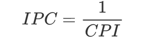
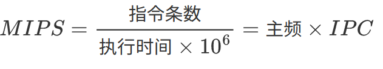
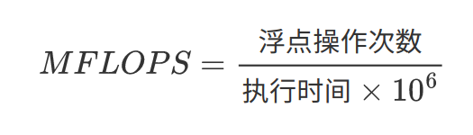

# 冯·诺依曼体系

## 存储程序概念

- 存储程序概念：指令驱动+存储。指令、数据都在存储器中。
1. 计算机硬件系统：运算器、存储器、控制器、输入设备、输出设备。
2. 指令、数据以同等地位存于存储器，按地址寻访。
3. 指令、数据均用二进制代码。
4. 指令由操作码、地址码组成。
5. 指令在存储器中按顺序存放。
6. 以运算器为中心，IO设备与存储器之间的数据传送通过运算器完成。

## 硬件组成

 

## 存储器设计思想

### 冯·诺依曼结构

     

- 指令和数据混合存储在同一个存储器中：指令地址和数据地址指向同一个存储的不同物理位置，指令和数据的宽度相同。
- CPU和共享存储器间的信息交换：不能同时取指令和取操作数，且存储器的存取速度远低于CPU运算速度。

### 哈弗结构

 

- 指令存储在程序存储器（PM)，数据存储在数据存储器（DM）：指令和数据可以有不同的数据宽度。
- 分离的程序总线和数据总线允许同时获取指令字和操作数而互不干扰：在一个机器周期内可以同时准备好指令和操作数，本条指令执行时可以预先读取下一条指令。

# 层次结构

 

# 性能指标

## 机器字长

- 字长：参与运算的数的基本位数：由加法器、寄存器的位数决定。
- 字长越长，精度越高。
- 字节（Byte）：
  - 1 PB = 1024 TB 
  - 1 TB = 1024 GB 
  - 1 GB = 1024 MB 
  - 1 MB = 1024 KB 
  - 1 KB = 1024 B 
  - 1 B = 8 bit

## 数据通路宽度

- 数据通路宽度：数据总线一次所能并行传送信息的位数。

## 存储容量

- 存储器容量：主存容量、辅存容量。
  - 主存容量：主存中存放二进制代码的总位数。

> 字节编址：以字节数表示存储容量。

- MAR（存储器地址寄存器）：存储单元个数。
- MDR（存储器数据寄存器）：存储字长。

 

## 运算速度

### 吞吐量和响应时间

- 吞吐量：系统单位时间内处理请求的数量。
- 响应时间：系统对请求做出响应的时间 = CPU时间 + 等待时间。

### 主频和CPU时钟周期

- CPU主频（时钟频率）：在CPU内数字脉冲信号振荡的速度。
- CPU时钟周期：CPU主频的倒数，CPU中最小的时间元素，每个动作至少需要一个时钟周期。

### CPI

- CPI：每条指令执行所用的时钟周期数。
- IPC：每个时钟周期执行的指令数。 

 

### CPU执行时间

 

### MIPS和MFLOPS

- MIPS：每秒执行多少百万条指令。

 

- MFLOPS：每秒执行多少百万次浮点运算。

 
