# 操作系统的基本概念

- 计算机系统自下而上分为4个部分：硬件、操作系统、应用程序、用户。
- 操作系统（Operating System，OS）是指控制和管理整个计算机系统的硬件与软件资源，合理地组织、调度计算机的工作与资源的分配，进而为用户和其他软件提供方便接口与环境的程序集合。操作系统是计算机系统中最基本的系统软件。
- 操作系统的基本特征包括：并发（Concurrence）、共享（Sharing）、虚拟（Virtual）、异步（Asychronism）。其中，并发和共享是操作系统的两个最基本的特征，二者互为存在的条件。

<table>
    <tr>
        <td width="20%" rowspan="2">并发（Concurrence）</td>
        <td width="80%" colspan="2">并发是指两个或多个事件在<b>同一时间间隔</b>内发生</td>
    </tr>
    <tr>
        <td colspan="2">并行性是指系统具有同时进行运算或操作的特性，在<b>同一时刻</b>能完成两种或两种以上的工作；需要硬件的支持</td>
    </tr>
    <tr>
        <td width="20%" rowspan="3">共享（Sharing）</td>
        <td width="20%" colspan="2">共享（资源共享）是指系统中的资源可供内存中多个并发执行的进程共同使用。共享分为：互斥共享方式、同时访问方式</td>
    </tr>
    <tr>
        <td>互斥共享方式</td>
        <td>临界资源是指在一段时间内只允许一个进程访问的资源</td>
    </tr>
    <tr>
        <td>同时访问方式</td>
        <td>此处的“同时”是宏观的；而在微观上，可能是通过“分时共享”等方式实现的</td>
    </tr>
    <tr>
        <td width="20%" rowspan="2">虚拟（Virtual）</td>
        <td rowspan="2">虚拟技术</td>
        <td>时分复用技术</td>
    </tr>
    <tr>
        <td>空分复用技术</td>
    </tr>
    <tr>
        <td width="20%">异步（Asychronism）</td>
        <td width="80%" colspan="2">进程的异步性使得操作系统运行在一种随机的环境下；但只要运行环境相同，操作系统就须保证多次运行的结果也相同</td>
    </tr>
</table>

- 操作系统的目标与功能：

1. 操作系统作为计算机资源的管理者，包括处理机管理、存储器管理、设备管理、文件管理。
2. 操作系统作为用户与计算机硬件系统之间的接口。

<table>
    <tr>
        <td width="20%" rowspan="3">命令接口</td>
        <td width="80%" colspan="2">命令接口的作用控制的主要方式分为联机控制方式和脱机控制方式。用户利用这些操作命令来组织和控制作业的执行</td>
    </tr>
    <tr>
        <td>联机命令接口（交互式命令接口）</td>
        <td>适用于分时或实时系统，由一组键盘操作命令组成</td>
    </tr>
    <tr>
        <td>脱机命令接口（批处理命令接口）</td>
        <td>适用于批处理系统，由一组作业控制命令组成</td>
    </tr>
    <tr>
        <td>程序接口</td>
        <td colspan="2">程序接口由一组系统调用（广义指令）组成，是为编程人员提供的接口。用户通过在程序中使用这些系统调用来请求操作系统（内核）服务</td>
    </tr>
</table>

3. 操作系统实现了对计算机资源的扩充。（扩充机器、虚拟机）

# 操作系统发展历程

<table>
    <tr>
        <td width="15%">手工操作阶段</td>
        <td colspan="2">无操作系统。（1）用户独占主机；（2）CPU等待手工操作</td>
    </tr>
    <tr>
        <td rowspan="3">批处理阶段</td>
        <td colspan="2">作业自动控制，不能人机交互</td>
    </tr>
    <tr>
        <td width="15%">单道批处理系统</td>
        <td width="70%">（1）自动性；（2）顺序性；（3）单道性</td>
    </tr>
    <tr>
        <td>多道批处理系统</td>
        <td>（1）多道；（2）宏观上并行，微观上串行（轮占CPU）</td>
    </tr>
    <tr>
        <td>分时操作系统</td>
        <td colspan="2">分时技术（时间片）；实现了人机交互；多个用户通过终端同时共享一台主机。（1）同时性、多路性；（2）交互性；（3）独立性；（4）及时性</td>
    </tr>
    <tr>
        <td>实时操作系统</td>
        <td colspan="2">适合处理紧急任务（1）及时性；（2）可靠性</td>
    </tr>
    <tr>
        <td>网络操作系统</td>
        <td colspan="2">网络中各种资源的共享及各台计算机之间的通信</td>
    </tr>
    <tr>
        <td>分布式操作系统</td>
        <td colspan="2">分布式操作系统中的若干计算机相互协同完成同一任务</td>
    </tr>
</table>

# 操作系统运行环境

## 处理器运行模式

- 在操作系统中，CPU执行两种不同性质的程序，（1）操作系统内核程序；（2）用户自编程序（应用程序）。内核程序是应用程序的管理者，只有作为管理者的内核程序可以执行特权指令，而应用程序作为被管理者出于安全问题而不可以执行

<table>
    <tr>
        <td width="15%">特权指令</td>
        <td width="85%">不允许用户直接使用的指令</td>
    </tr>
    <tr>
        <td>非特权指令</td>
        <td>允许用户直接使用的指令，不能直接访问系统中的软硬件资源，仅限于访问用户的地址空间</td>
    </tr>
</table>

- CPU的运行模式分为用户态和核心态。应用程序运行在用户态，内核程序运行在核心态。应用程序向操作系统请求服务时，通过使用访管指令，从而产生一个中断事件将操作系统切换至核心态。由用户态进入核心态，不仅状态切换，而且所用的堆栈可能需要由用户堆栈切换为系统堆栈，但这个系统堆栈仍然是属于该进程的。

- 分层次结构的现代操作系统，各项功能分别被设置在不同的层次。与硬件关联密切的模块（时钟管理、中断处理、设备驱动等），其次是运行频率较高的程序（进程管理、存储器管理、设备管理等），这两个部分共同组成了操作系统的内核。

### 时钟管理

- 在计算机的各种部件中，时钟是最关键的设备。

1. 时钟的第一功能是计时，操作系统需要通过时钟管理，向用户通过标准的系统时间
2. 通过时钟中断的管理，实现进程间的切换

### 中断机制

- 现代操作系统是靠[中断](#中断)驱动的软件。中断机制只有一小部分属于内核，负责保护和恢复中断现场的信息，转移控制权到相关的处理程序，以此减少中断的处理时间。

### 原语

- 原语（Atomic Operation），按层次结构设计的操作系统，底层必然是一些可被调用的公用小程序，它们各自完成一个规定的操作。原语是内核的组成部分，并具有以下特点：

1. 处于操作系统的最底层，最接近硬件的部分
2. 这些程序的运行具有原子性
3. 这些程序的运行时间较短，且调用频繁

- 定义原语的直接方法是关闭中断，让其所有动作不可分割地完成后再打开中断。

## 中断、异常

- 发生中断或异常时，运行用户态的CPU会立即进入核心态，该方式通过硬件实现。中断实现了在程序未使用某种资源的情况下，将程序对该种资源的占有权释放。通常情况下，对中断和异常的具体处理过程由操作系统（和驱动程序）完成。

 

<table>
    <tr>
        <td width="15%" rowspan="3">中断（外中断） Interruption</td>
        <td colspan="2">来自CPU执行指令外部的事件，通常用于信息输入/输出</td>
    </tr>
    <tr>
        <td width="15%">可屏蔽中断</td>
        <td width="70%">通过INTR线发出的中断请求，通过改变屏蔽字可实现多重中断</td>
    </tr>
    <tr>
        <td>不可屏蔽中断</td>
        <td>通过NMI线发出的中断请求，通常是紧急的硬件故障</td>
    </tr>
    <tr>
        <td rowspan="4">异常（内中断） Exception</td>
        <td colspan="2">来自CPU执行指令内部的事件。异常也不能被屏蔽，一旦发生就该立即处理</td>
    </tr>
    <tr>
        <td>故障 fault</td>
        <td>通常是由指令执行引起的异常</td>
    </tr>
    <tr>
        <td>自陷 trap</td>
        <td>“事先安排”的异常事件，用于在用户态下调用操作系统内核程序</td>
    </tr>
    <tr>
        <td>终止 abort</td>
        <td>出现了使得CPU无法继续执行的硬件故障</td>
    </tr>
</table>

## 系统调用

- 系统调用，是指用户在程序中调用操作系统提供的一些子功能。系统中的各种共享资源都由操作系统统一掌管，在用户程序中，凡是与资源有关的操作都必须通过系统调用方式向操作系统提出服务请求，并由操作系统代为完成。
- 系统调用按功能分为设备管理、文件管理、进程控制、进程通信、内存管理。
- 系统调用的处理需要由操作系统内核程序负责完成，运行在[核心态](#处理器运行模式)。用户程序可通过陷入指令（访管指令，trap指令）来发起系统调用命，请求操作系统提供服务。即通过访管指令来实现CPU状态从用户态切换到核心态；并在处理完成后，操作系统内核程序将CPU的使用权还给用户程序，即CPU状态从核心态切换到用户态。目的是，用户程序不能直接执行对系统影响非常大的操作，必须通过系统调用的方式请求操作系统代为执行，以保证系统的稳定性和安全性。

# 操作系统结构

## 分层法

- 分层法将操作系统分为若干层，最底层（层 0）为硬件，最高层（层 N）为用户接口，每层只能调用其底下一层的功能和服务（单向依赖）

 
